# HTTP request smuggling - Port Swigger


## 1. Lab: HTTP request smuggling, basic CL.TE vulnerability

**Description**
```
This lab involves a front-end and back-end server, and the front-end server doesn't support chunked encoding. The front-end server rejects requests that aren't using the GET or POST method.

To solve the lab, smuggle a request to the back-end server, so that the next request processed by the back-end server appears to use the method GPOST.
```

**Writeup**

Bài này là case cơ bản của `CL.TE`: front-end ưu tiên `Content-Length`, còn back-end ưu tiên `Transfer-Encoding: chunked`.

Ta gửi request POST với cả hai header như hình để tạo sự lệch cách parse giữa hai phía.

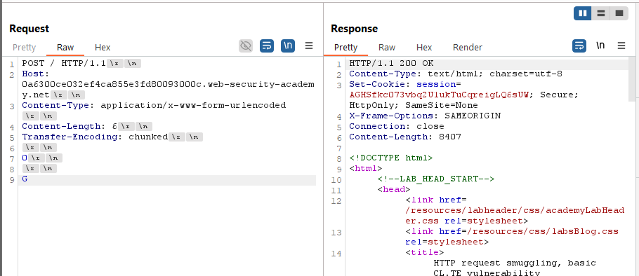

Front-end đọc theo `Content-Length: 6`, nên nó cho rằng body chỉ gồm đúng 6 byte:

```
0\r\n\r\nG
```

và chuyển nguyên phần đó sang back-end như một request hợp lệ.

Back-end lại parse theo chunked, gặp `0\r\n\r\n` thì kết luận request đã kết thúc.

Ký tự `G` còn thừa không thuộc request hiện tại, nên nó nằm chờ như byte đầu của request kế tiếp trên cùng kết nối.

Khi gửi request lần 2, tiền tố `G` ghép vào `POST` thành `GPOST`. Đây chính là dấu hiệu smuggling thành công mà lab yêu cầu.


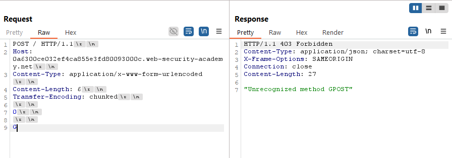


## 2. Lab: HTTP request smuggling, basic TE.CL vulnerability

**Description**

```
This lab involves a front-end and back-end server, and the back-end server doesn't support chunked encoding. The front-end server rejects requests that aren't using the GET or POST method.

To solve the lab, smuggle a request to the back-end server, so that the next request processed by the back-end server appears to use the method GPOST.
```

**Writeup**

Bài này là chiều ngược lại, `TE.CL`: front-end tin chunked, back-end tin `Content-Length`.

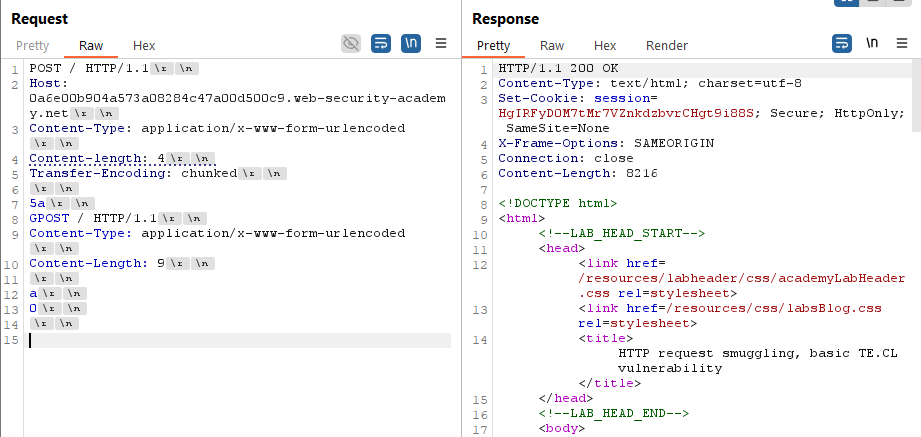

Front-end parse body theo chunked và coi đây là một request hợp lệ có chunk dữ liệu lớn, sau đó kết thúc bằng chunk `0`.

Trong chunk dữ liệu, ta chèn chuỗi request bắt đầu bằng `GPOST`:

```
GPOST / HTTP/1.1\r\n
Content-Type: application/x-www-form-urlencoded\r\n
Content-Length: 13\r\n
\r\n
a
```

Ngược lại, back-end không hỗ trợ chunked nên tin `Content-Length` và chỉ đọc vài byte đầu (`5a\r\n`). Phần còn lại bị đẩy sang request sau.

Điểm quan trọng là `Content-Length` phải lớn hơn 8, vì phần tối thiểu `A\r\n0\r\n\r\n` đã chiếm 8 byte. Nếu đặt đúng 8 thì request sau vẫn tách sạch; phải lớn hơn 8 thì BE mới hút thêm byte từ request kế tiếp và tạo lệch biên.

Gửi thêm request kế tiếp sẽ thấy `GPOST` được kích hoạt, chứng minh khai thác thành công.

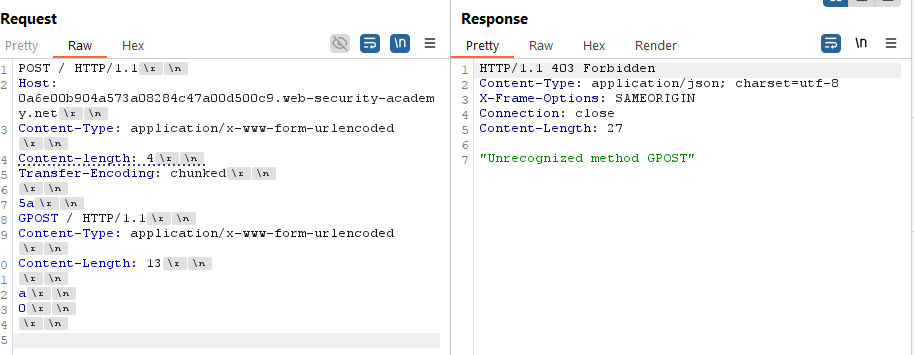

## 3. Lab: HTTP request smuggling, obfuscating the TE header


**Description**

```
This lab involves a front-end and back-end server, and the two servers handle duplicate HTTP request headers in different ways. The front-end server rejects requests that aren't using the GET or POST method.

To solve the lab, smuggle a request to the back-end server, so that the next request processed by the back-end server appears to use the method GPOST.
```

**Writeup**

Khi gửi request có cả `Content-Length` và `Transfer-Encoding` ở dạng bình thường, hệ thống không lệch parse. Điều này cho thấy ở trạng thái mặc định hai phía đang xử lý khá giống nhau.

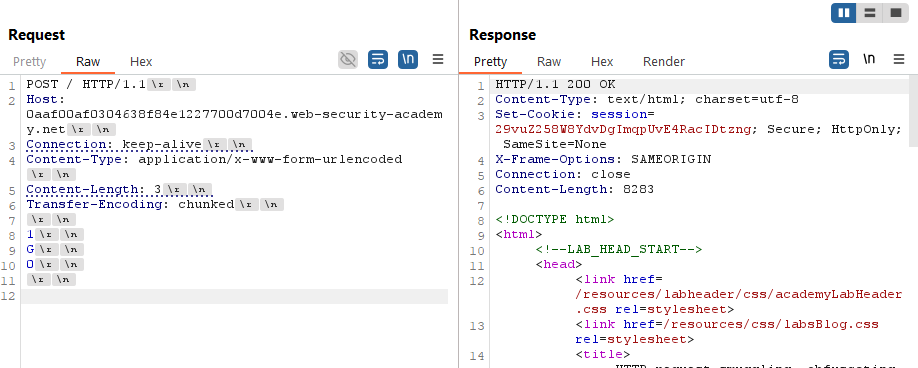

Sau đó ta thêm header gây nhiễu `Transfer-Encoding: x`. Mục đích là làm FE và BE chọn khác nhau khi gặp header trùng/không chuẩn.

Trong lab này, front-end vẫn chấp nhận giá trị `chunked` hợp lệ, còn back-end bị ảnh hưởng bởi header gây nhiễu và quay sang xử lý theo `Content-Length`.

Khi gửi request lần thứ hai, hiện tượng `GPOST` xuất hiện, chứng tỏ sự lệch parse đã xảy ra.

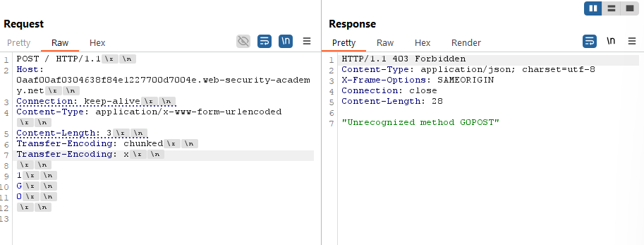

Về bản chất, từ thời điểm này bài toán trở thành `TE.CL`, nên cách khai thác và xác nhận kết quả giống lab trước.

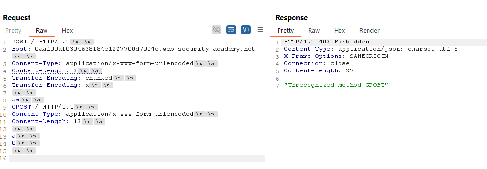

## 4. HTTP request smuggling, confirming a CL.TE vulnerability via differential responses

**Description**

```
This lab involves a front-end and back-end server, and the front-end server doesn't support chunked encoding.

To solve the lab, smuggle a request to the back-end server, so that a subsequent request for / (the web root) triggers a 404 Not Found response.
```

**Writeup**

Để xác định ứng dụng có phải `CL.TE` hay không, ta gửi payload kiểm tra như sau:

```
POST / HTTP/1.1
Host: 0ac40011049a46fbc120900a007300f0.web-security-academy.net
Content-Type: application/x-www-form-urlencoded
Content-Length: 36
Transfer-Encoding: chunked

1\r\n
A\r\n
0\r\n
\r\n
GET /404 HTTP/1.1\r\n
Foo: x
```

FE đọc theo `Content-Length`, nên coi toàn bộ body dài 36 ký tự vẫn thuộc request hiện tại.

```
1\r\n
A\r\n
0\r\n
\r\n
GET /404 HTTP/1.1\r\n
Foo: x
```

BE parse theo chunked nên kết thúc sớm ở `0\r\n\r\n`, còn chuỗi `GET /404 ...` bị giữ lại để ghép vào request kế tiếp.

Gửi payload attack:

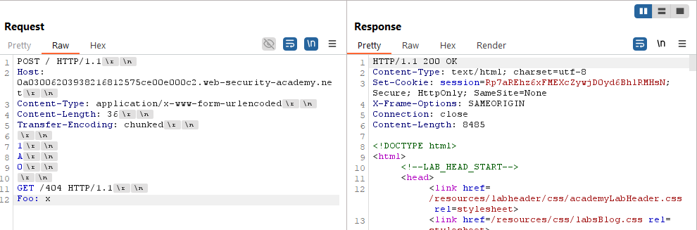

Sau đó gửi một request bình thường tới `/`. Nếu nhận `404 Not Found` thay vì response gốc của `/`, nghĩa là request `/404` đã được smuggle và thực thi trước đó.

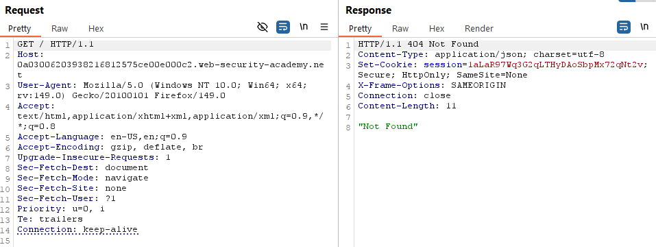

Kết luận: ứng dụng tồn tại HTTP request smuggling dạng `CL.TE`.

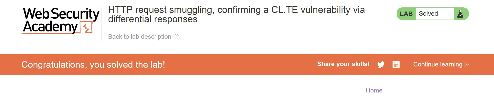

## 5. Lab: HTTP request smuggling, confirming a TE.CL vulnerability via differential responses

**Description**
```
This lab involves a front-end and back-end server, and the back-end server doesn't support chunked encoding.

To solve the lab, smuggle a request to the back-end server, so that a subsequent request for / (the web root) triggers a 404 Not Found response.
```
**Writeup**

Để xác nhận kiểu `TE.CL`, ta gửi payload kiểm tra sau:

```
POST / HTTP/1.1
Host: 0aa800dd0329d39fc1ce537b007800f1.web-security-academy.net
Content-Type: application/x-www-form-urlencoded
Content-Length: 4
Transfer-Encoding: chunked

9b\r\n
GET /404 HTTP/1.1\r\n
Host: 0aa800dd0329d39fc1ce537b007800f1.web-security-academy.net\r\n
Content-Type: application/x-www-form-urlencoded\r\n
Content-Length: 9\r\n
\r\n
A\r\n
0\r\n
\r\n
```

FE parse chunked, nên coi body có 2 chunk và chunk `9b` chứa nội dung request `/404`:

```
GET /404 HTTP/1.1\r\n
Host: 0aa800dd0329d39fc1ce537b007800f1.web-security-academy.net\r\n
Content-Type: application/x-www-form-urlencoded\r\n
Content-Length: 9\r\n
```

BE không hỗ trợ chunked nên chỉ dựa vào `Content-Length: 4`, đọc đúng `9b\r\n`; phần còn lại bị dồn sang request kế tiếp.

`Content-Length` vẫn phải lớn hơn 8 vì cụm `A\r\n0\r\n\r\n` đã là 8 byte tối thiểu. Chỉ khi lớn hơn 8 thì BE mới nuốt thêm dữ liệu từ request kế tiếp và tạo lệch ranh giới request.

Gửi attack request:

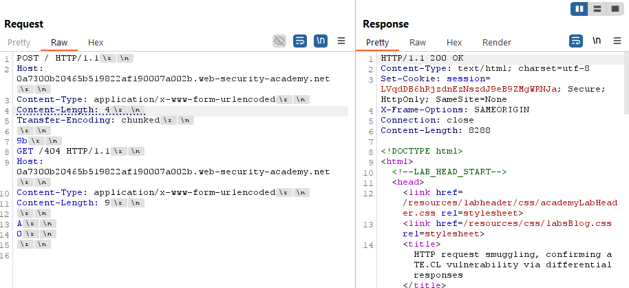

Gửi request bình thường sau đó thì nhận 404.

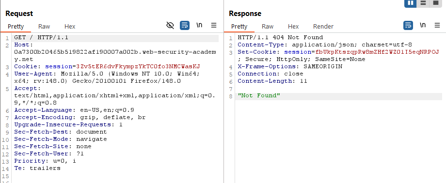

Kết luận: ứng dụng dính HTTP request smuggling dạng `TE.CL`.


## 6. Lab: Exploiting HTTP request smuggling to bypass front-end security controls, CL.TE vulnerability

**Description**

```
This lab involves a front-end and back-end server, and the front-end server doesn't support chunked encoding. There's an admin panel at /admin, but the front-end server blocks access to it.

To solve the lab, smuggle a request to the back-end server that accesses the admin panel and deletes the user carlos.
```

**Writeup**

Đầu tiên truy cập `/admin` trực tiếp thì bị FE chặn.

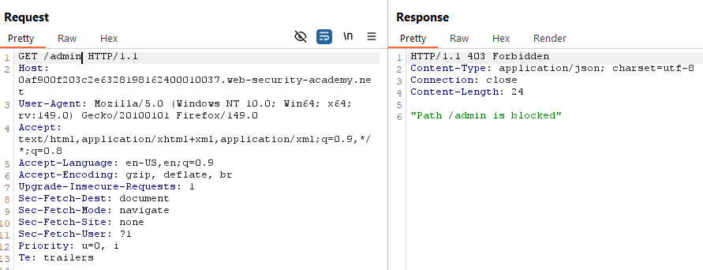

Dùng kỹ thuật confirm như lab 4, xác định bài này là `CL.TE`.

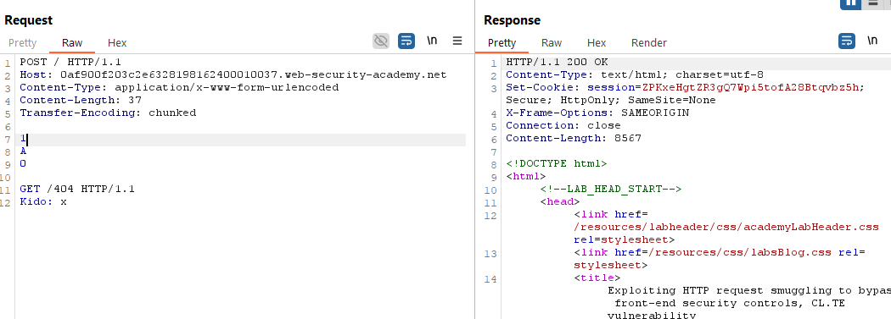

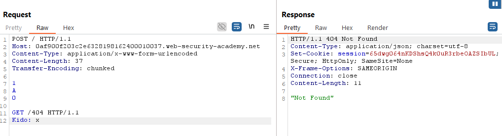

Bước khai thác là smuggle một `GET /admin` để request này đi thẳng tới back-end, bỏ qua lớp chặn theo path ở front-end.

Kết quả cho thấy response kế tiếp trả nội dung `/admin`, tức là bypass front-end đã thành công. Tuy nhiên vẫn chưa thao tác được vì back-end kiểm tra quyền local user.

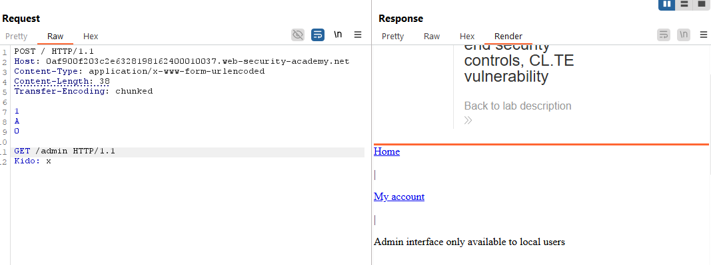

Thử thêm `Host: localhost` để giả lập request nội bộ.

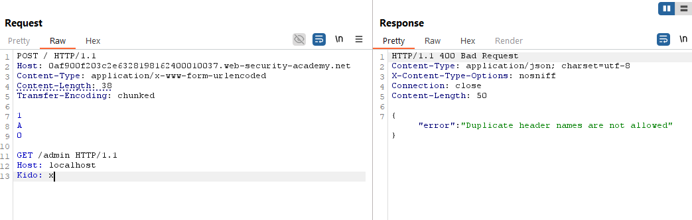

Lúc này phát sinh lỗi duplicate `Host`. Nguyên nhân là request smuggled chưa tách ranh giới gọn, nên một phần request tiếp theo bị nuốt vào request hiện tại.

Khi request thứ hai tới:
- dòng đầu `POST / HTTP/1.1` sẽ bị nuốt vào giá trị của Kido
- nhưng header tiếp theo của request thứ hai là:
```
Host: 0af900f203c2e6328198162400010037.web-security-academy.net
```

Hậu quả là request smuggled có hai header `Host`:

```
GET /admin HTTP/1.1
Host: localhost
Kido: xPOST / HTTP/1.1
Host: 0af900f203c2e6328198162400010037.web-security-academy.net
...
```

nên server từ chối do duplicate `Host`.

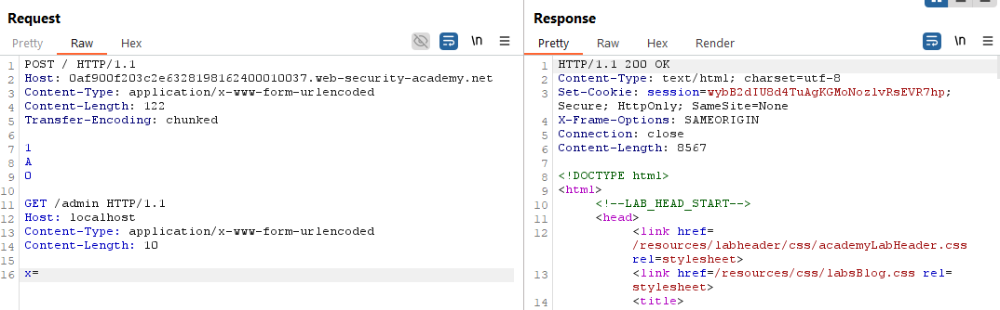

Ta chỉnh lại payload để BE hiểu request smuggled như sau:

```
GET /admin HTTP/1.1
Host: localhost
Content-Type: application/x-www-form-urlencoded
Content-Length: 10

x=
```

Ở đây `Content-Length` là 10 nhưng body thực có `x=` (2 byte), BE sẽ chờ thêm 8 byte để đủ body.

8 byte thiếu này sẽ bị hút từ đầu request kế tiếp, ví dụ:

```
POST / H
```

Khi đủ 10 byte, request `GET /admin` với `Host: localhost` hoàn chỉnh và được xử lý như request nội bộ.

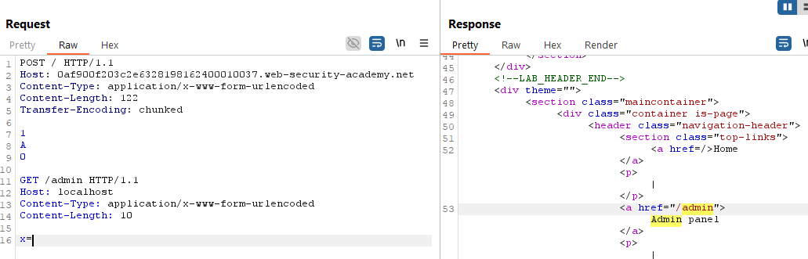

Sau khi vào được `/admin`, chỉ cần gọi chức năng delete user `carlos` để hoàn thành lab.

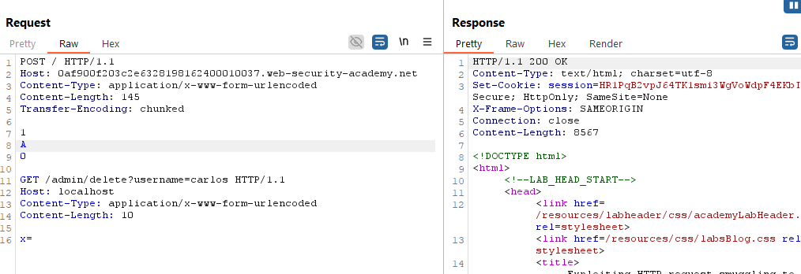

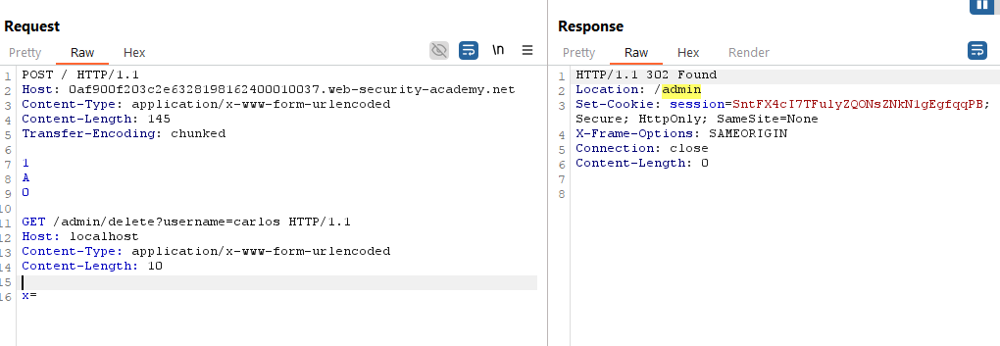

Lab được solve.

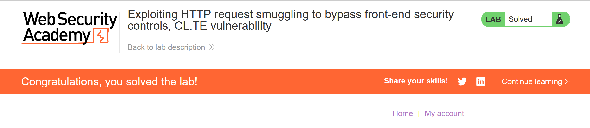


## 7. Lab: Exploiting HTTP request smuggling to bypass front-end security controls, TE.CL vulnerability

**Description**

```
This lab involves a front-end and back-end server, and the back-end server doesn't support chunked encoding. There's an admin panel at /admin, but the front-end server blocks access to it.

To solve the lab, smuggle a request to the back-end server that accesses the admin panel and deletes the user carlos.
```

**Writeup**

Bài này cùng mục tiêu với lab 6 nhưng parse lệch theo hướng `TE.CL`.

Kết hợp kỹ thuật tạo lệch ranh giới request của lab 5 với kỹ thuật bypass `/admin` ở lab 6, ta dựng payload như hình.

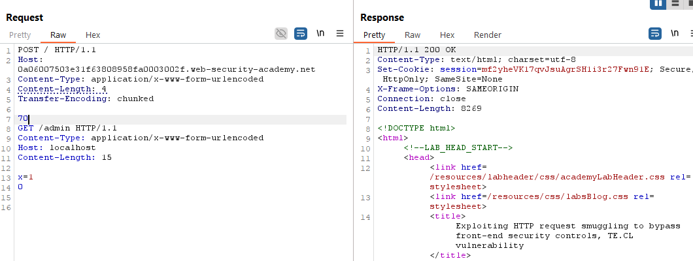

Sau khi gửi request kế tiếp, trang `/admin` trả về thành công.

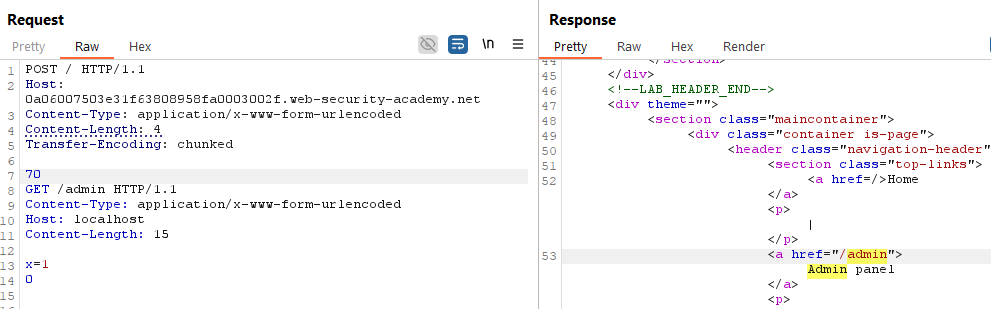

Tiếp theo xóa user `carlos` trong admin panel.

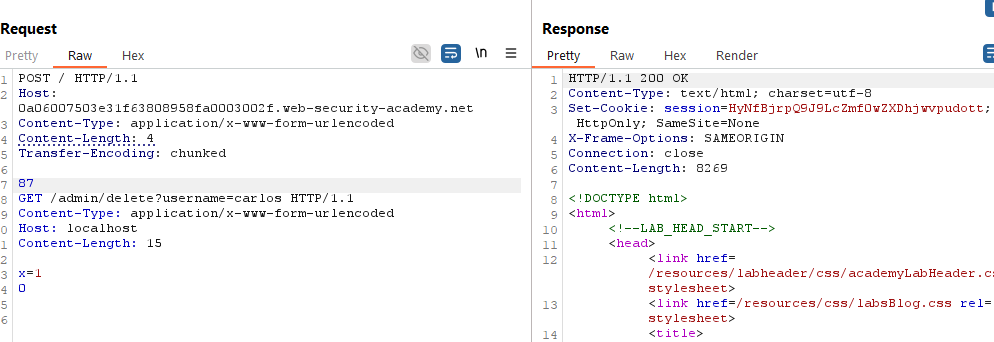

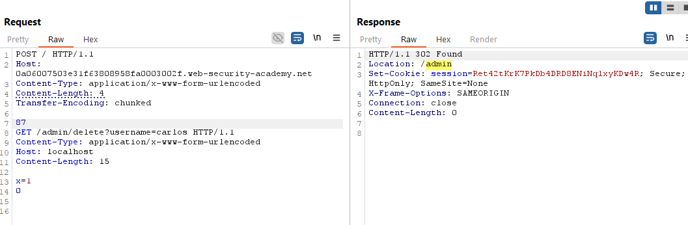

Lab được solve.

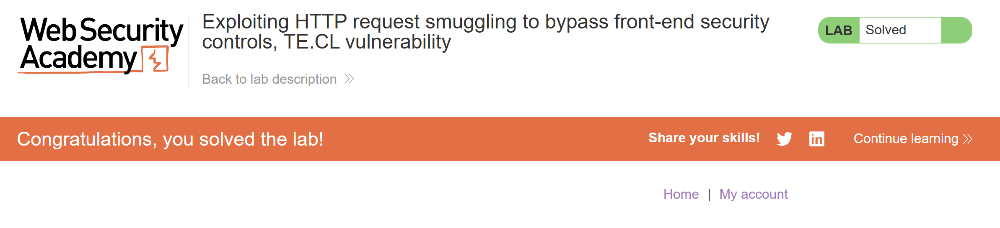

## 8. Lab: Exploiting HTTP request smuggling to reveal front-end request rewriting

**Description**

```
This lab involves a front-end and back-end server, and the front-end server doesn't support chunked encoding.

There's an admin panel at /admin, but it's only accessible to people with the IP address 127.0.0.1. The front-end server adds an HTTP header to incoming requests containing their IP address. It's similar to the X-Forwarded-For header but has a different name.

To solve the lab, smuggle a request to the back-end server that reveals the header that is added by the front-end server. Then smuggle a request to the back-end server that includes the added header, accesses the admin panel, and deletes the user carlos.
```

**Writeup**

Điều kiện truy cập `/admin` là IP phải là `127.0.0.1`.

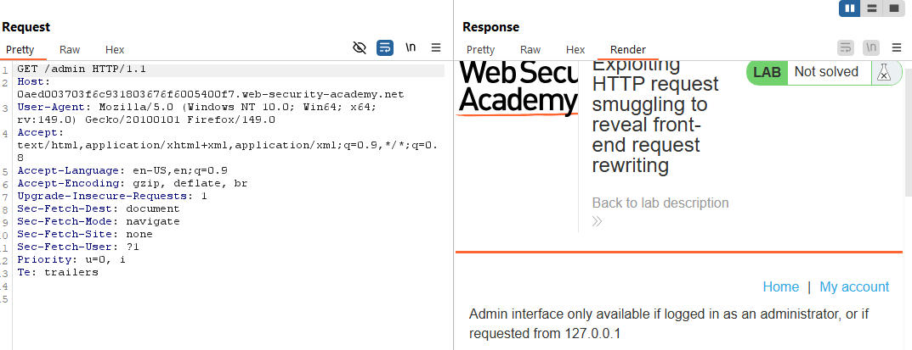

Ứng dụng có endpoint search và giá trị search được phản chiếu trong response, đây là điểm rất hữu ích để quan sát dữ liệu bị smuggle.

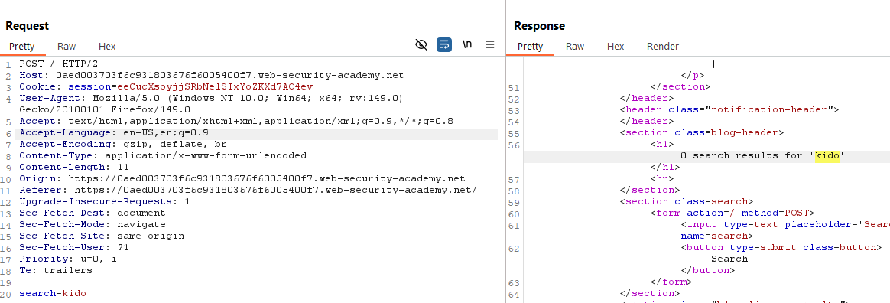

Detect như lab 4 và xác nhận kiểu lỗ hổng là `CL.TE`.

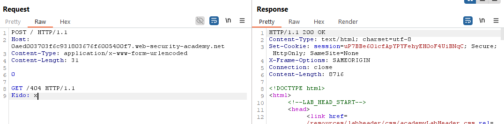

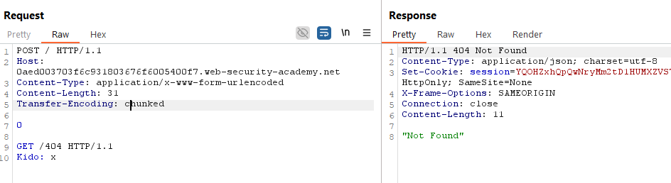

Ta gửi request search với body cố tình thiếu và đặt `search=` ở đầu, để BE buộc phải đọc tiếp dữ liệu từ request sau trên cùng kết nối. Vì dữ liệu search được reflect lại, phần request sau bị nuốt vào body cũng sẽ lộ ra trên response.

Nhờ đó có thể quan sát được header nào do front-end tự thêm trước khi forward sang back-end.

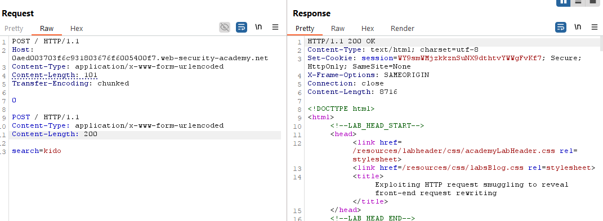

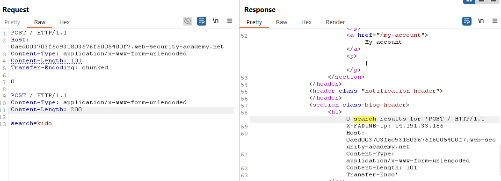

Bạn gửi một request làm backend hiểu thế này:
```
POST / HTTP/1.1
Content-Type: application/x-www-form-urlencoded
Content-Length: 200

search=test
```
Nhưng thực tế body mới chỉ có `search=test`, chưa đủ 200 byte.

Backend nghĩ: “Body chưa xong, tôi phải đọc thêm.” Sau đó request tiếp theo đi đến trên cùng kết nối, ví dụ bắt đầu bằng:

```
POST / HTTP/1.1
Host: victim
X-abc-IP: 1.2.3.4
User-Agent: ...
```

BE không coi phần này là request độc lập ngay, mà ghép vào body đang đọc dở. Body sẽ có dạng:

```
search=testPOST / HTTP/1.1
Host: victim
X-abc-IP: 1.2.3.4
User-Agent: ...
```

Từ phần bị phản chiếu này suy ra header FE thêm vào là `X-FADtNB-Ip`.

Sau đó chỉ cần smuggle request tới `/admin` kèm header `X-FADtNB-Ip: 127.0.0.1` để giả mạo nguồn local.

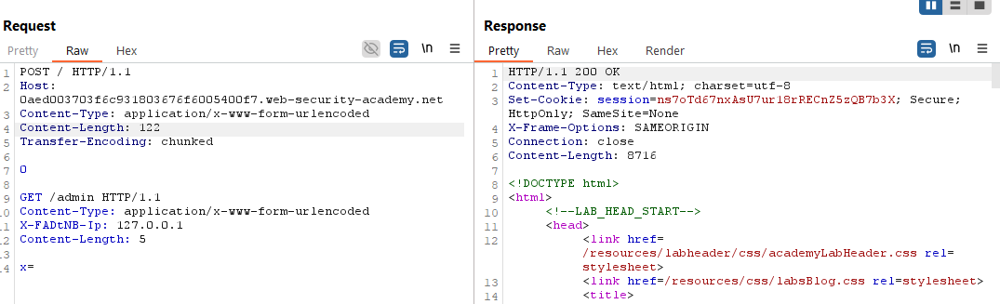

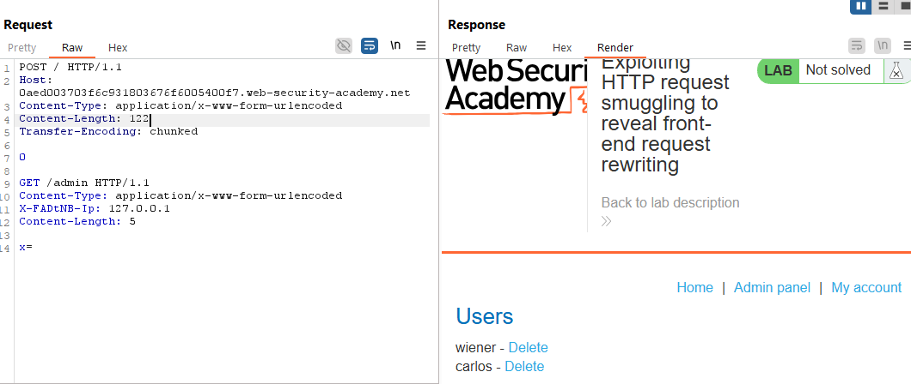

Vào được admin panel và xóa `carlos`.

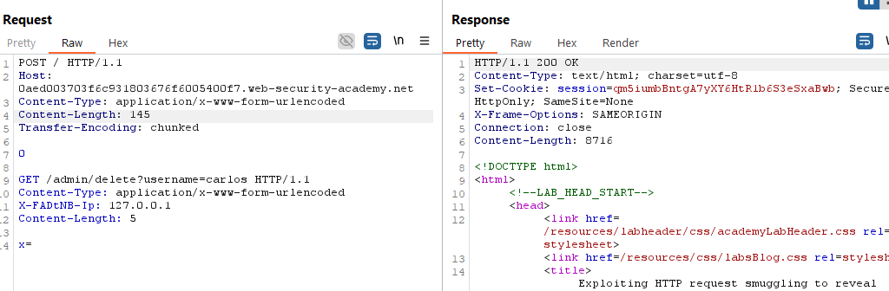

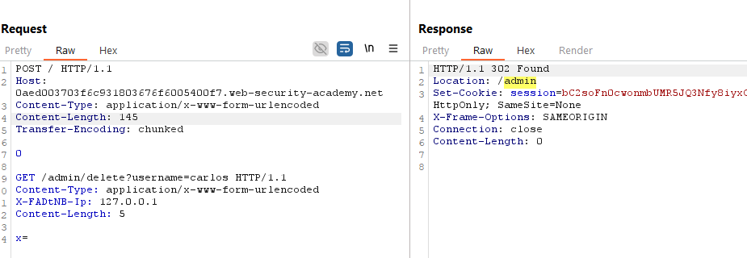

Lab được solve.

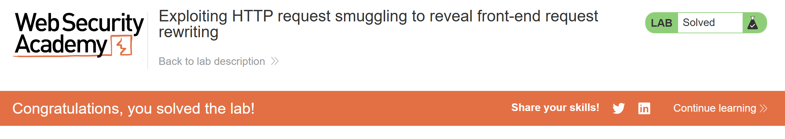

## 9. Lab: Exploiting HTTP request smuggling to capture other users' requests

**Description**

```
This lab involves a front-end and back-end server, and the front-end server doesn't support chunked encoding.

To solve the lab, smuggle a request to the back-end server that causes the next user's request to be stored in the application. Then retrieve the next user's request and use the victim user's cookies to access their account.
```

**Writeup**

Bài này là `CL.TE` và mục tiêu là lấy request của user khác.

Ứng dụng cho phép đăng comment và mọi người đều xem được comment đã lưu.

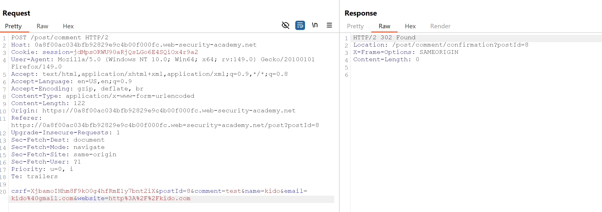

Ta tạo một request post comment mà BE hiểu là chưa đọc đủ body. Khi nạn nhân gửi request kế tiếp trên cùng kết nối, một phần request của họ sẽ bị BE lấy bù vào body còn thiếu và lưu như nội dung comment.

Điều chỉnh `Content-Length` để đoạn bị nuốt vào comment chứa được phần cookie/session của nạn nhân.

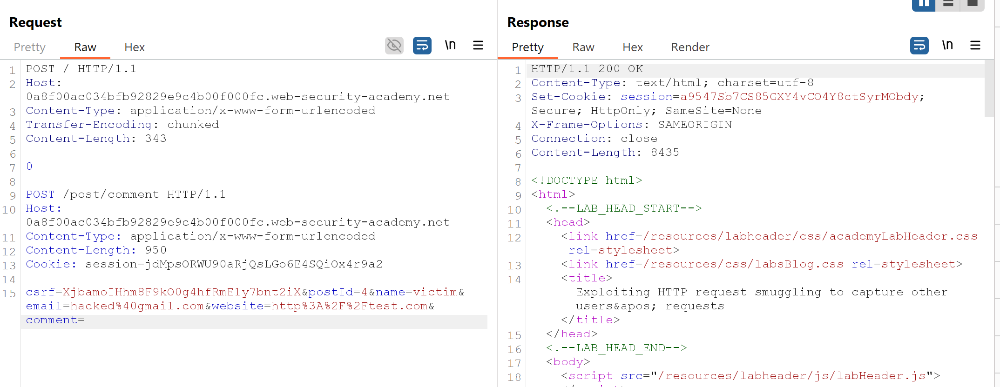

Sau khi gửi payload, đợi nạn nhân tương tác rồi mở lại phần comment sẽ thấy dữ liệu request bị lộ, bao gồm cookie.

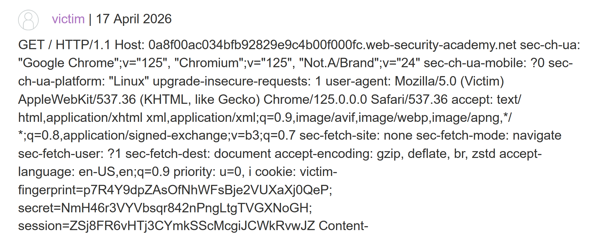

Dùng cookie này gắn vào request của mình để chiếm phiên và truy cập account nạn nhân.

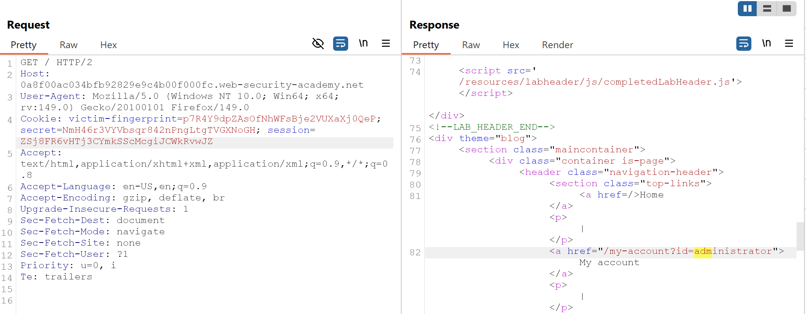

Lab được solve.

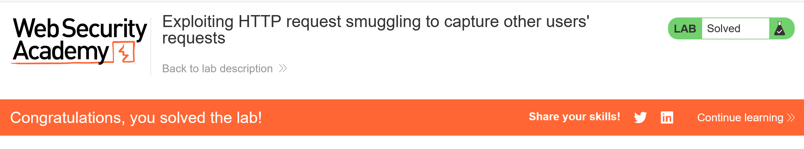

## 10. Lab: Exploiting HTTP request smuggling to deliver reflected XSS

**Description**

```
This lab involves a front-end and back-end server, and the front-end server doesn't support chunked encoding.

The application is also vulnerable to reflected XSS via the User-Agent header.

To solve the lab, smuggle a request to the back-end server that causes the next user's request to receive a response containing an XSS exploit that executes alert(1).
```

**Writeup**

Mục tiêu của lab là làm cho **người dùng tiếp theo** nhận response có chứa payload XSS reflected và tự thực thi `alert(1)`.

Ở trang comment, giá trị header `User-Agent` được đưa vào một trường `input` hidden trong HTML trả về. Đây chính là điểm reflected XSS.

Vì dữ liệu nằm trong thuộc tính HTML, chỉ cần đóng dấu `"` rồi chèn event handler phù hợp là có thể bật JavaScript.

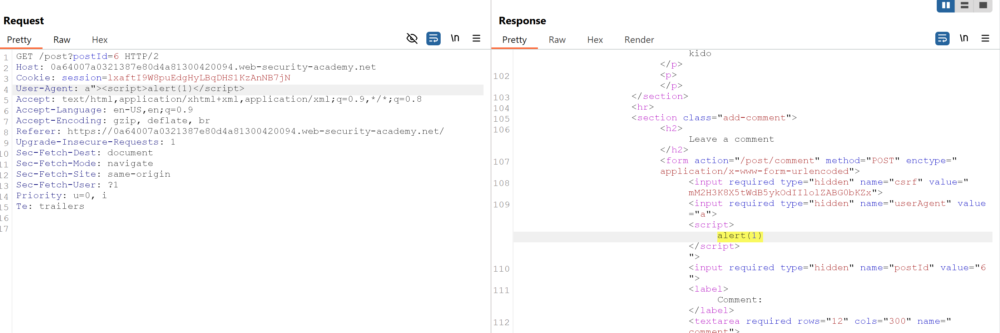

Ứng dụng thuộc kiểu `CL.TE`: front-end tin `Content-Length`, còn back-end parse theo `Transfer-Encoding: chunked`.

Ta gửi một request smuggle để làm lệch ranh giới request trên back-end, mục tiêu là khiến **request của nạn nhân kế tiếp** bị xử lý trong ngữ cảnh mà response sẽ phản chiếu `User-Agent` do ta kiểm soát.

Đặt `User-Agent` thành payload XSS (dạng thoát thuộc tính và chèn JS), sau đó gửi request smuggling như hình.

Khi hàng đợi request/response bị lệch thành công, nạn nhân tiếp theo sẽ nhận response chứa payload phản chiếu này.

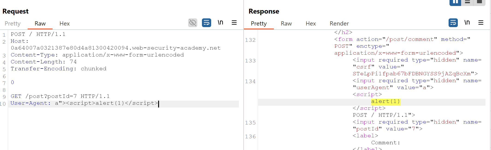

Khi admin/user nạn nhân nhận đúng response đã bị đầu độc, script sẽ thực thi và popup `alert(1)` xuất hiện, bài lab được solve.

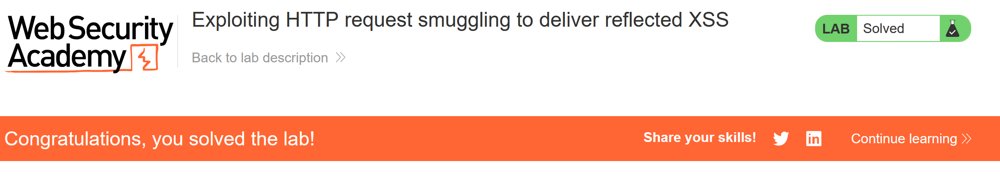


## 11. Lab: Response queue poisoning via H2.TE request smuggling

**Description**

```
This lab is vulnerable to request smuggling because the front-end server downgrades HTTP/2 requests even if they have an ambiguous length.

To solve the lab, delete the user carlos by using response queue poisoning to break into the admin panel at /admin. An admin user will log in approximately every 15 seconds.

The connection to the back-end is reset every 10 requests, so don't worry if you get it into a bad state - just send a few normal requests to get a fresh connection.
```

**Writeup**

Mục tiêu của bài này là dùng **response queue poisoning** để "cướp" response dành cho admin, từ đó lấy được phiên đăng nhập admin và vào `/admin` xóa user `carlos`.

Vì đề bài nói front-end nhận HTTP/2 rồi downgrade xuống HTTP/1.1 ở back-end, ta thử gửi request HTTP/2 có body mơ hồ độ dài (vừa có dấu hiệu chunked ở phần bị downgrade).

Khi chèn được một request hoàn chỉnh vào luồng back-end (ví dụ request tới đường dẫn không tồn tại) và quan sát phản hồi lệch hàng đợi, có thể kết luận đây là kiểu smuggling `H2.TE`.

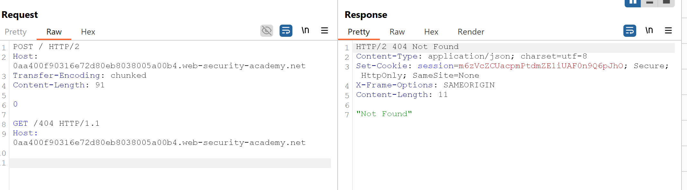

Với `H2.TE`, ta có thể làm back-end hiểu rằng có thêm một request "ẩn" đi trước request của nạn nhân. Khi đó:

- response của request ẩn sẽ nằm trong queue trước,
- response của nạn nhân (admin) sẽ bị đẩy lệch sang client của mình.

Admin trong lab tự động đăng nhập khoảng mỗi 15 giây, nên chỉ cần giữ kết nối ổn định và lặp payload đúng thời điểm thì sẽ bắt được response chứa thông tin phiên admin (thường là `Set-Cookie` hoặc dữ liệu định danh phiên).

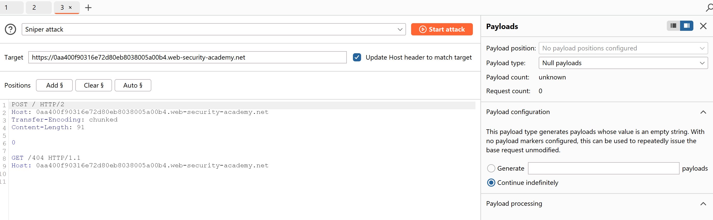

Thực hiện gửi payload smuggling để tạo request ẩn, sau đó gửi request bình thường để đồng bộ queue. Lặp vài lần (nếu queue bị hỏng thì gửi vài request thường để reset kết nối như đề bài gợi ý).

Khi thành công sẽ thấy response trả về không còn khớp với request của mình nữa, mà chứa dữ liệu phiên của người dùng khác (admin).

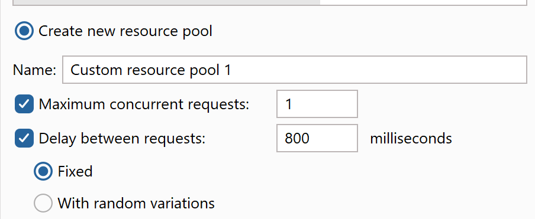

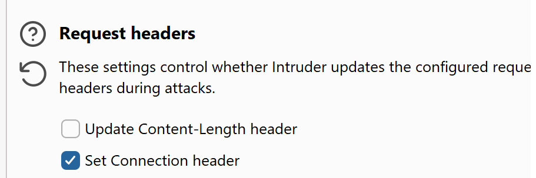

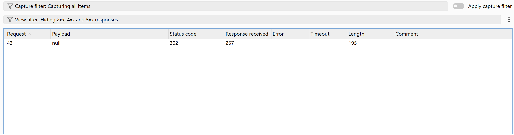

Lấy giá trị session/cookie vừa bắt được, gán vào request của mình rồi truy cập lại ứng dụng. Lúc này đã vào được quyền admin panel.

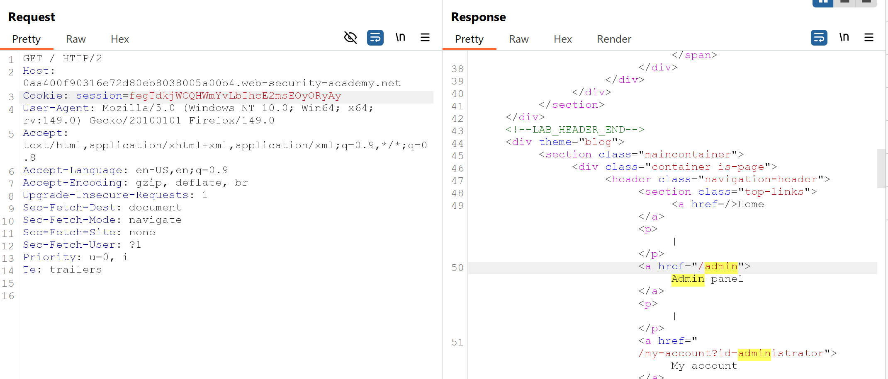

Từ trang admin, gọi chức năng xóa user `carlos` để hoàn thành lab.

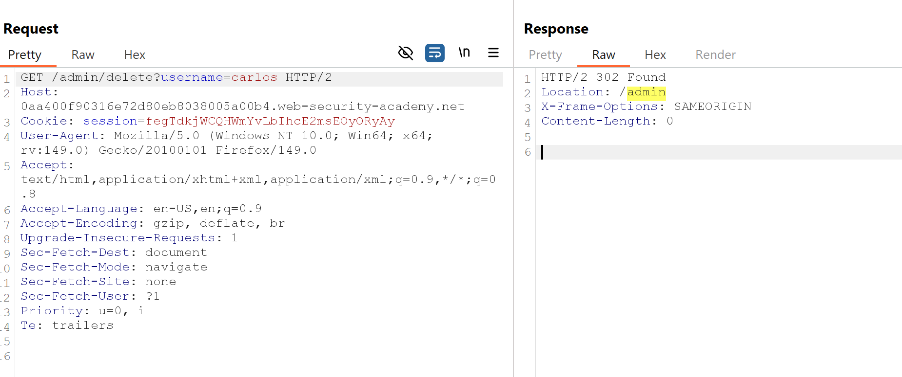

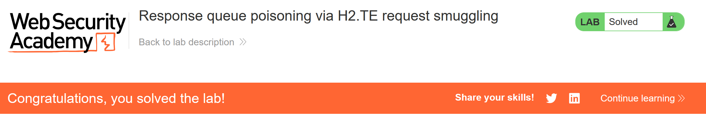

## 12. Lab: H2.CL request smuggling

**Description**

```
This lab is vulnerable to request smuggling because the front-end server downgrades HTTP/2 requests even if they have an ambiguous length.

To solve the lab, perform a request smuggling attack that causes the victim's browser to load and execute a malicious JavaScript file from the exploit server, calling alert(document.cookie). The victim user accesses the home page every 10 seconds.
```

**Writeup**

Lab này là `H2.CL`: client nói chuyện với front-end bằng `HTTP/2`, nhưng front-end lại downgrade xuống `HTTP/1.1` khi chuyển cho back-end. Lỗ hổng xuất hiện khi front-end vẫn forward request dù độ dài mơ hồ, khiến ranh giới request giữa hai phía bị lệch.

Ý tưởng khai thác là smuggle một prefix request để request của nạn nhân kế tiếp bị ghép sai ngữ cảnh, từ đó ép trình duyệt nạn nhân tải JavaScript từ exploit server.

Gửi payload kiểm tra và quan sát phản hồi cho thấy có hiện tượng desync đúng kiểu `H2.CL`.

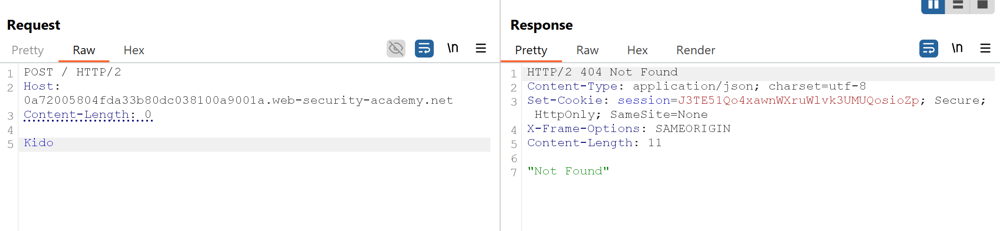

Quan sát trang chủ thấy có các tài nguyên được load từ nhánh `/resources/...`. Khi thử truy cập `/resources` thì server trả redirect sang `/resources/`.

Chi tiết này rất quan trọng: nếu ta điều khiển được request đích `/host` trong ngữ cảnh bị smuggle, ta có thể khiến nạn nhân bị kéo sang đường dẫn `/resources/` trên domain exploit server.

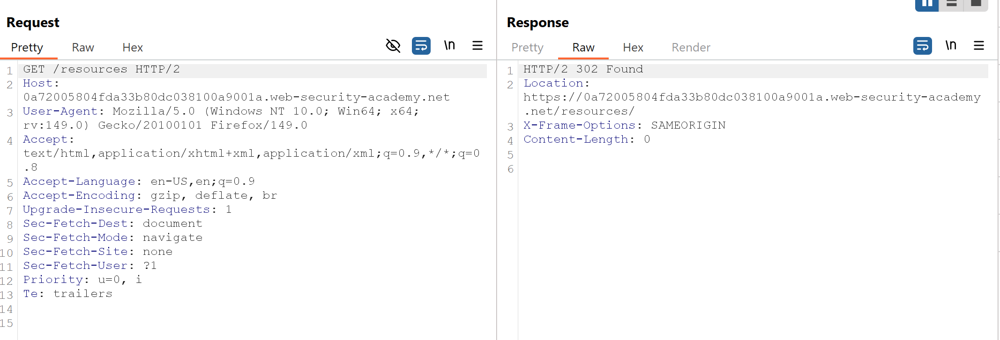

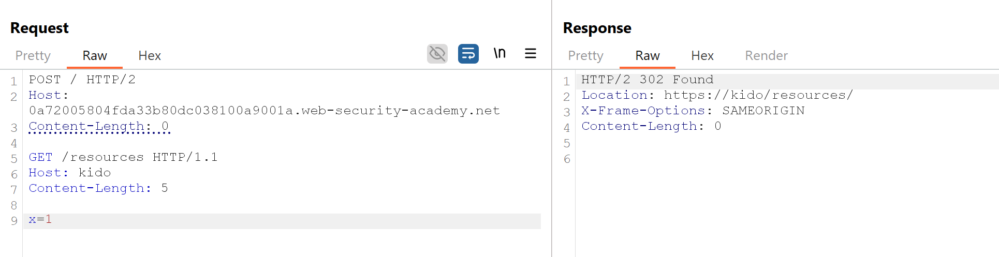

Vì vậy trên exploit server, tạo nội dung tại đường dẫn `/resources/` chứa JavaScript độc hại `alert(document.cookie)`.

Sau khi smuggling thành công và nạn nhân (tự động vào home page mỗi 10 giây) nhận request/response đã bị lệch, trình duyệt nạn nhân sẽ tải file JS từ exploit server và thực thi payload.

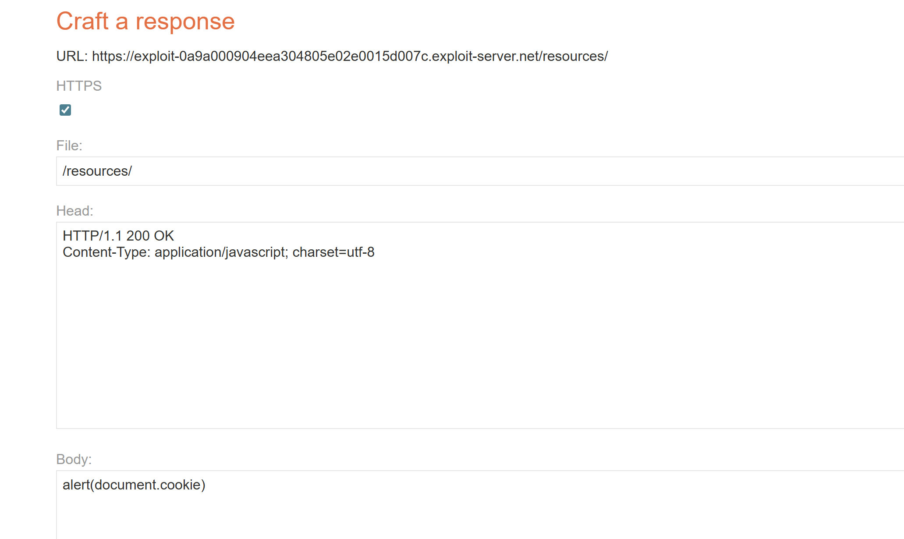

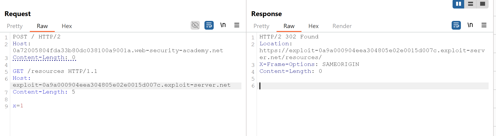

Khi popup `alert(document.cookie)` xuất hiện trên phiên nạn nhân, lab được solve.

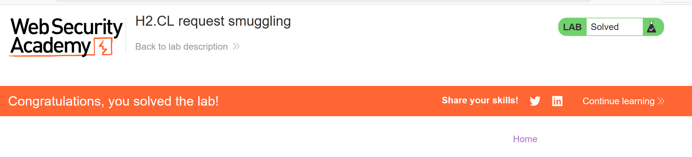

## 13. Lab: HTTP/2 request smuggling via CRLF injection

**Description**

```
This lab is vulnerable to request smuggling because the front-end server downgrades HTTP/2 requests and fails to adequately sanitize incoming headers.

To solve the lab, use an HTTP/2-exclusive request smuggling vector to gain access to another user's account. The victim accesses the home page every 15 seconds.

If you're not familiar with Burp's exclusive features for HTTP/2 testing, please refer to the documentation for details on how to use them.
```

**Writeup**

Ứng dụng có chức năng search và phần history search gắn theo session cookie. Nghĩa là nếu lấy được cookie phiên của victim thì có thể vào đúng account của họ.

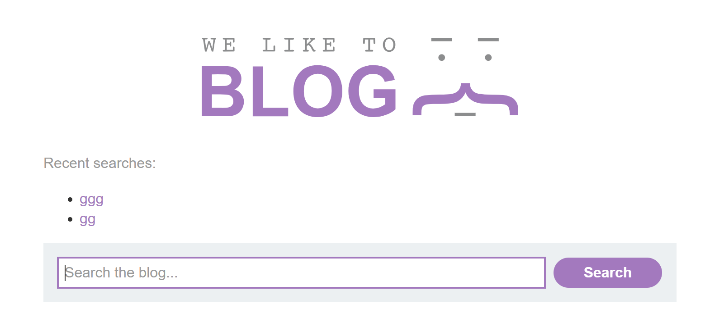

Khi gửi search, request dùng `HTTP/2` và giá trị search được phản chiếu lại ở history. Đây là điểm phù hợp để quan sát dữ liệu nếu request bị desync.

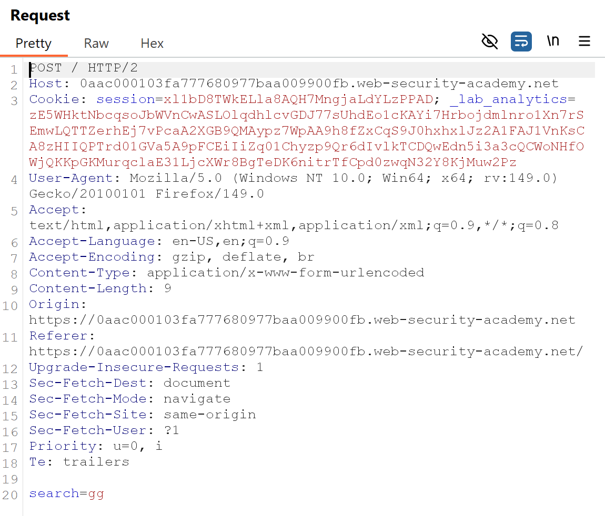

Thử các payload H2.CL/H2.TE thông thường không ổn định, nên chuyển sang CRLF injection. Trong Burp Repeater, mở phần Inspector và chèn CRLF bằng `SHIFT+ENTER` vào giá trị một header để tạo thêm header mới sau khi request bị downgrade sang `HTTP/1.1`.

Trong lab này, `Transfer-Encoding: chunked` không được chèn trực tiếp như một header `HTTP/2` hợp lệ. Thay vào đó, CRLF injection được dùng để làm hỏng quá trình downgrade từ `HTTP/2` sang `HTTP/1.1`, khiến Back-end diễn giải phần sau `\r\n` như một header mới và từ đó sinh ra `Transfer-Encoding: chunked`.

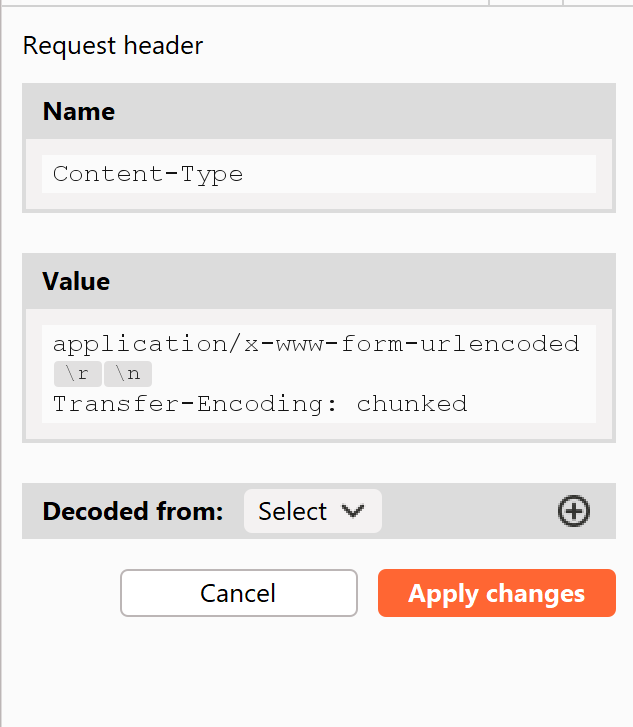

Sau khi gửi payload, response bắt đầu có dấu hiệu lệch hàng đợi request/response, xác nhận vector HTTP/2 CRLF injection hoạt động.

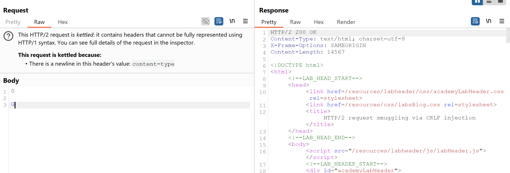

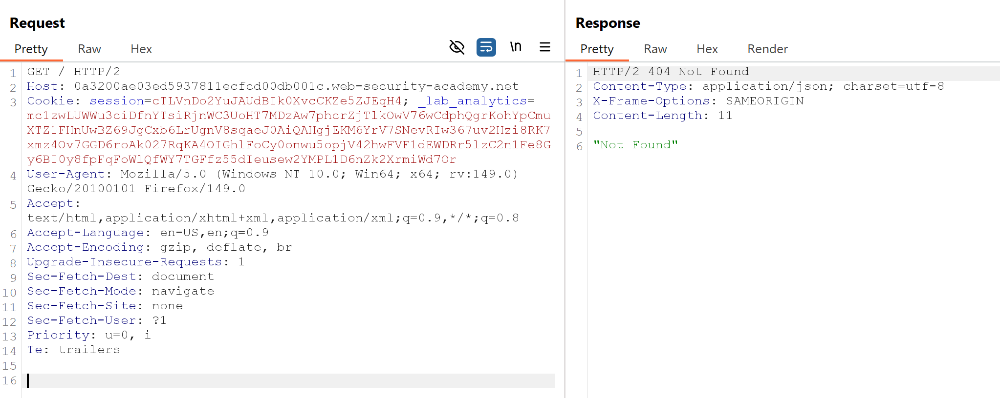

Gửi request smuggling với giá trị search để rỗng để capture request của user victim. Ngoài ra cần set session cookie hiện tại vì mình cần xem history search theo session.

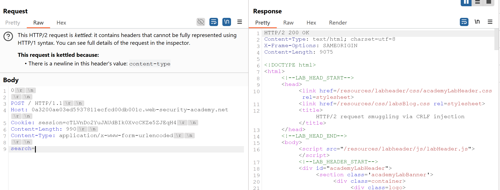

Đợi 1 chút, truy cập web với session cookie trên, ta thấy history chứa request của user nạn nhân. Trích xuất được cookie của nạn nhân.

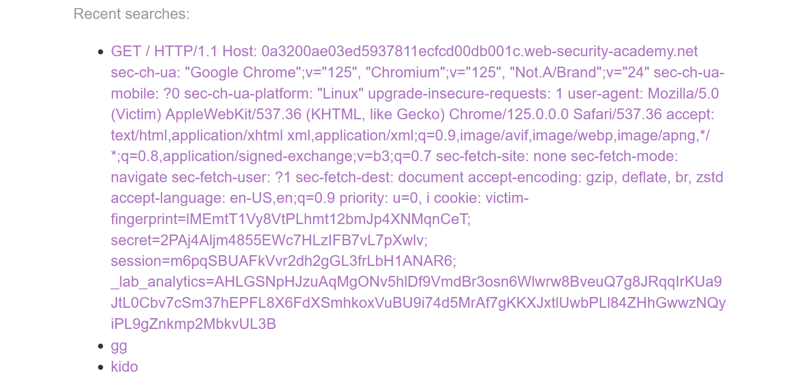

Lấy cookie đó gắn vào request hiện tại trong Burp, rồi gửi lại để truy cập bằng phiên victim.

Kết quả vào được account/history của victim, xác nhận chiếm phiên thành công.

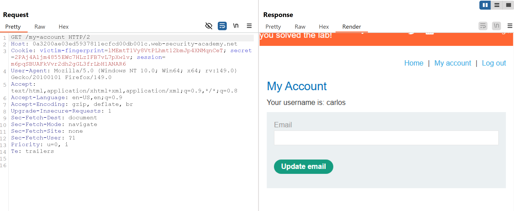

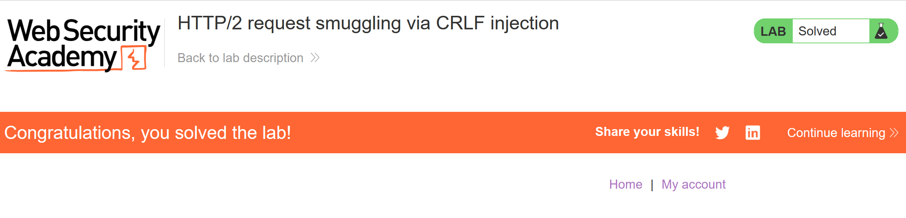

## 14. Lab: HTTP/2 request splitting via CRLF injection

**Description**

```
This lab is vulnerable to request smuggling because the front-end server downgrades HTTP/2 requests and fails to adequately sanitize incoming headers.

To solve the lab, delete the user carlos by using response queue poisoning to break into the admin panel at /admin. An admin user will log in approximately every 10 seconds.

The connection to the back-end is reset every 10 requests, so don't worry if you get it into a bad state - just send a few normal requests to get a fresh connection.
```

**Writeup**

Ở bài này, ta thực hiện CLRF injection tại header để splitting 1 request → poison response queue.

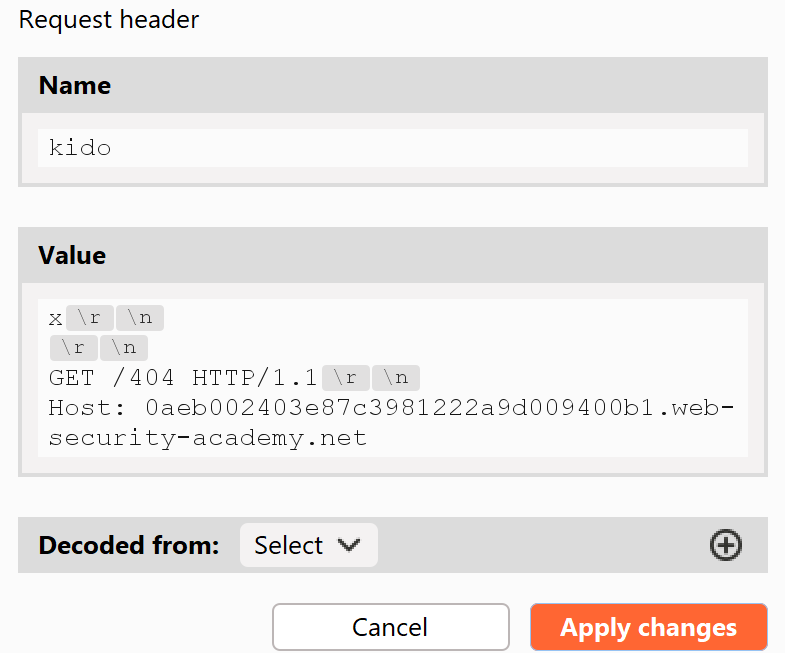

Sau khi request splitting hoạt động, gửi thêm request đồng bộ để quan sát dấu hiệu queue bị lệch: response trả về không còn tương ứng hoàn toàn với request vừa gửi. Đây là tín hiệu cho thấy có thể chuyển sang pha poisoning.

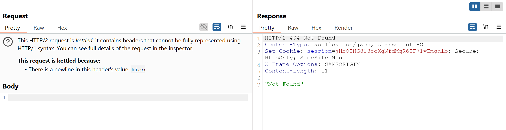

Do đề bài cho biết admin tự đăng nhập khoảng mỗi 10 giây, ta lặp chuỗi thao tác: gửi payload splitting để cài request mồi vào trước, rồi gửi request bình thường để lấy response tiếp theo trong queue. Lặp vài lần sẽ có thời điểm response của admin bị đẩy sang kết nối của mình.

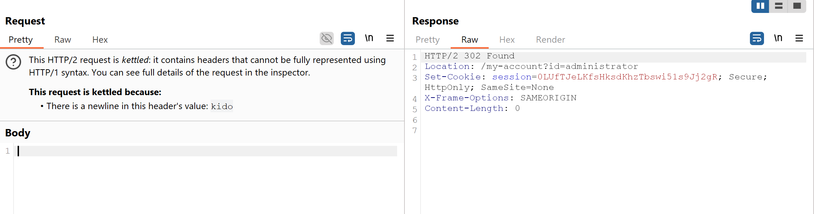

Khi bắt được response chứa thông tin phiên đăng nhập admin (session/cookie), gắn giá trị đó vào request hiện tại rồi truy cập `/admin` để leo quyền.

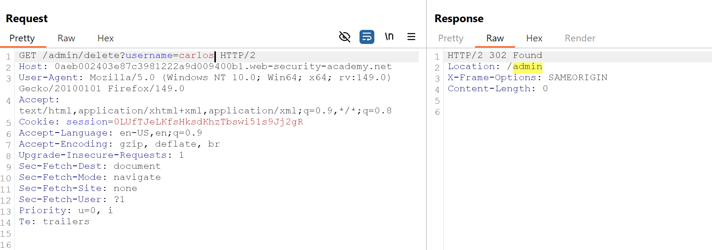

Vào admin panel, gọi chức năng xóa user `carlos` là hoàn thành lab.

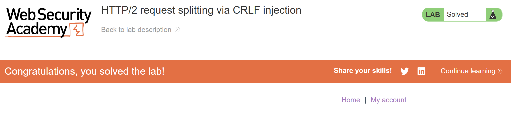

## 15. CL.0 request smuggling

**Description**

```
This lab is vulnerable to CL.0 request smuggling attacks. The back-end server ignores the Content-Length header on requests to some endpoints.

To solve the lab, identify a vulnerable endpoint, smuggle a request to the back-end to access to the admin panel at /admin, then delete the user carlos.
```

**Writeup**

Lab này là kiểu `CL.0`: ở một số endpoint, back-end bỏ qua `Content-Length` và coi request kết thúc ngay sau phần header. Vì vậy phần body mà front-end vẫn forward xuống sẽ trở thành dữ liệu "thừa" và có thể được diễn giải thành request kế tiếp trên cùng kết nối.

Ý tưởng khai thác gồm 2 bước:

- Tìm endpoint mà back-end xử lý theo kiểu `CL.0` (bỏ qua body theo `Content-Length`).
- Dùng body của request đó để nhúng một request mới tới `/admin`.

Khi đã trúng endpoint dễ lỗi, ta gửi một request với body chứa request smuggled, ví dụ bắt đầu bằng:

```http
GET /admin HTTP/1.1
Host: localhost

```

Do back-end coi request gốc đã kết thúc từ trước, chuỗi trong body không bị tiêu thụ như body thật mà bị giữ lại trong buffer để ghép với request tiếp theo.

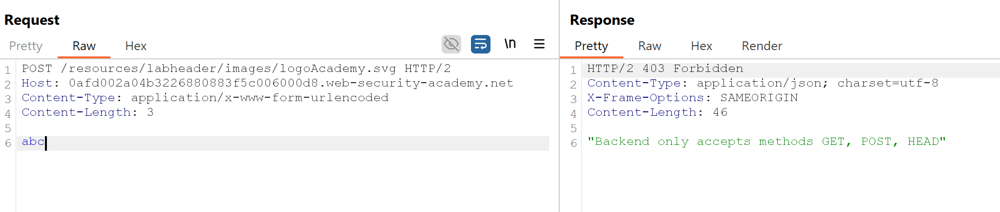

Tiếp theo gửi thêm một request bình thường để kích hoạt phần dữ liệu đang chờ. Lúc này back-end sẽ lấy phần request smuggled trước đó ra xử lý trước, nên ta có thể nhận được response của `/admin` dù front-end vốn chặn đường dẫn này.

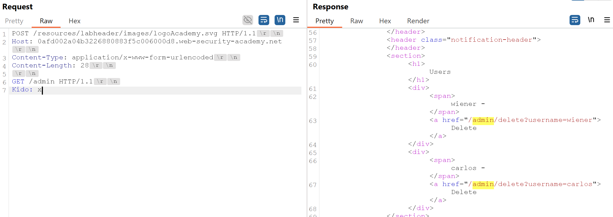

Sau khi xác nhận đã vào được admin panel, thực hiện action xóa user bằng endpoint quản trị.

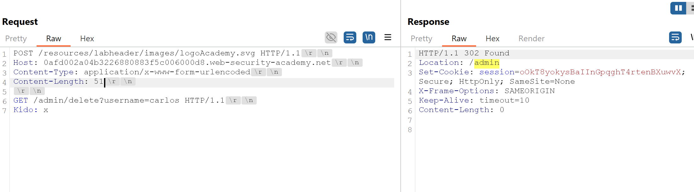

User `carlos` đã bị xóa và lab được solve.

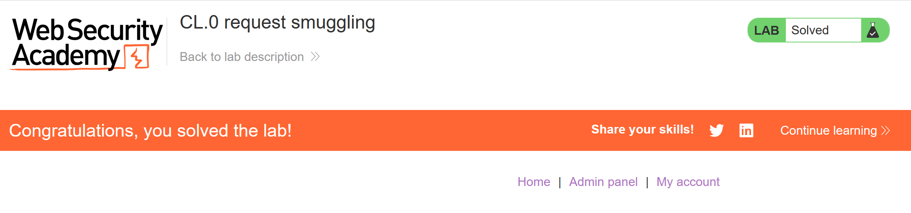


## 16. Lab: Exploiting HTTP request smuggling to perform web cache poisoning


**Description**

```
This lab involves a front-end and back-end server, and the front-end server doesn't support chunked encoding. The front-end server is configured to cache certain responses.

To solve the lab, perform a request smuggling attack that causes the cache to be poisoned, such that a subsequent request for a JavaScript file receives a redirection to the exploit server. The poisoned cache should alert document.cookie.
```

**Writeup**

Mục tiêu của lab là đầu độc cache để request tới file JS tĩnh (`/resources/js/tracking.js`) không còn trả JavaScript bình thường, mà trả về một response redirect sang exploit server.

Bước đầu tiên là xác định đối tượng bị cache. Quan sát phản hồi cho thấy request tải `tracking.js` có thể đi qua lớp cache của front-end.

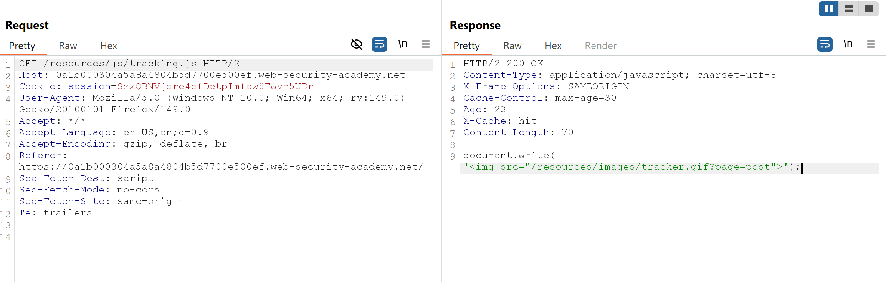

Tiếp theo xác nhận kiểu desync. Lab này khai thác được theo hướng `CL.TE`: front-end tin `Content-Length`, còn back-end parse theo `Transfer-Encoding: chunked`.

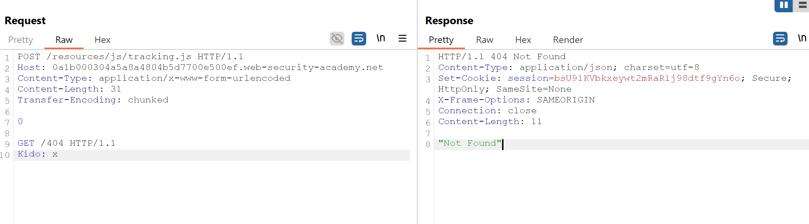

Khi smuggle thành công rồi gửi lại request import `tracking.js`. Đây là tín hiệu rằng cache key của `tracking.js` đã bị map sang response bị đầu độc.

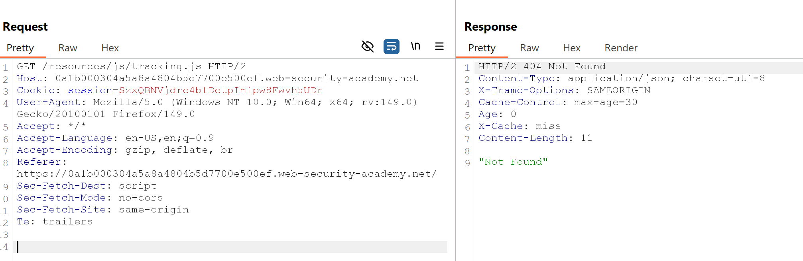

Bây giờ cần một endpoint tạo được response redirect có thể kiểm soát đích. Quan sát ứng dụng thấy chức năng Next post gọi `/post/next?postId=<ID>` và server phản hồi redirect.

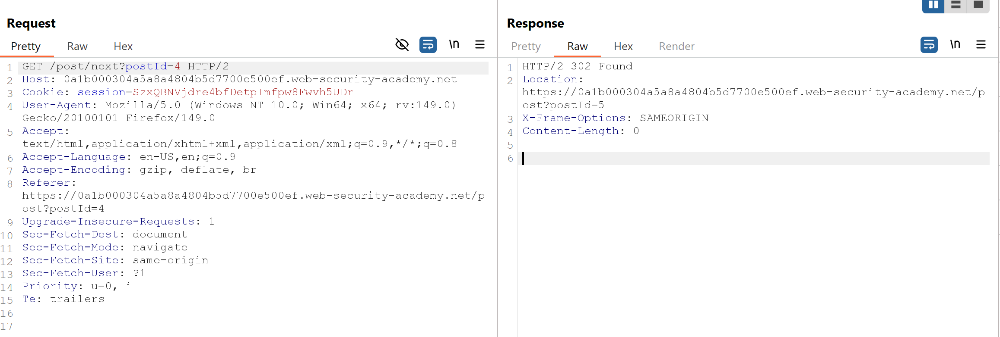

Thử với `Host` tùy ý cho endpoint này cho thấy `Location` bị dựng theo host nhận vào và trỏ tới đường dẫn `/post`. Điều này cho phép biến redirect thành một open redirect có kiểm soát trong ngữ cảnh poisoned response.

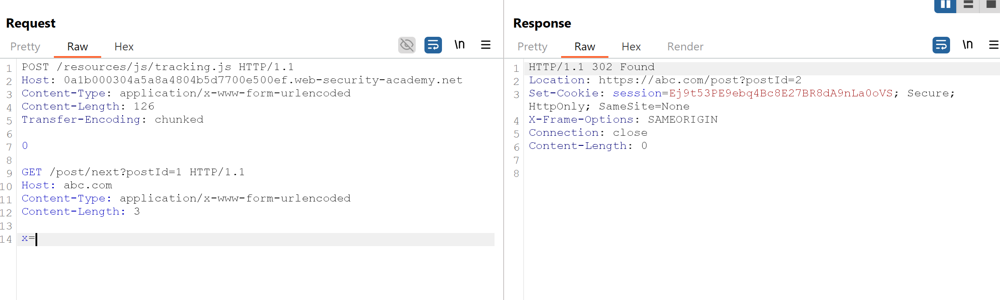

Trên exploit server, dựng payload JavaScript tại đường dẫn `/post` với nội dung `alert(document.cookie)` để khi nạn nhân bị redirect sang đó thì script chạy ngay.

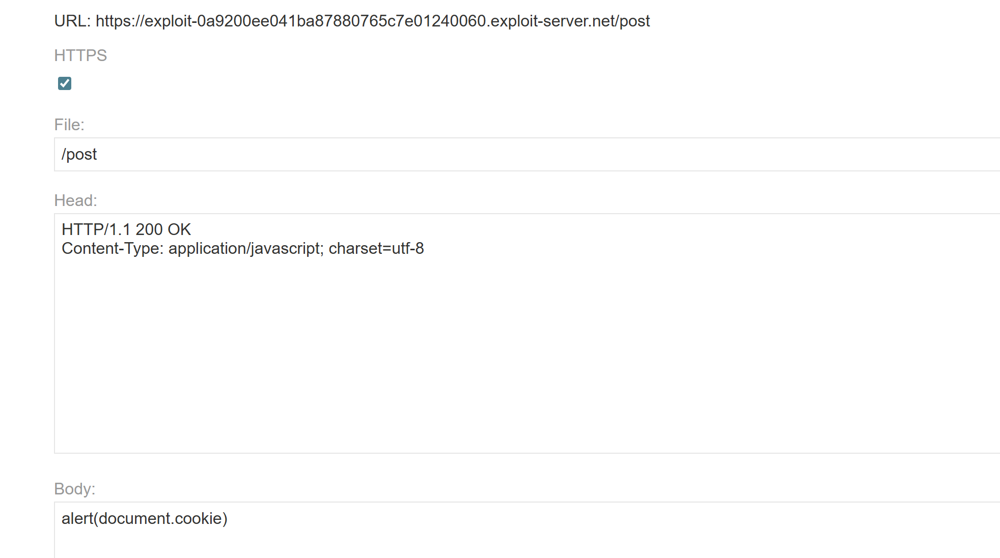

Cuối cùng thực hiện smuggling sao cho response redirect từ `/post/next?...` (với host là exploit server) bị ghi đè vào cache entry của `tracking.js`. Khi đó các request nạn nhân tải `tracking.js` sẽ nhận redirect tới `//<exploit-server>/post` thay vì file JS gốc.

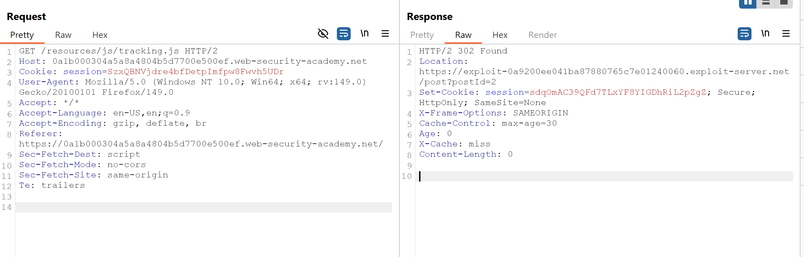

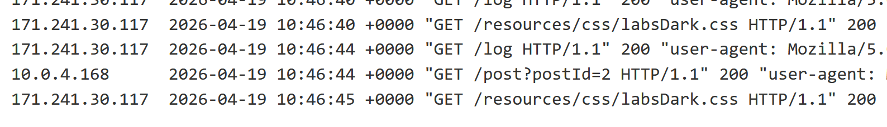

Khi nạn nhân truy cập trang và trình duyệt tự import `tracking.js`, họ bị chuyển hướng sang exploit server, thực thi payload `alert(document.cookie)` và lab được solve.

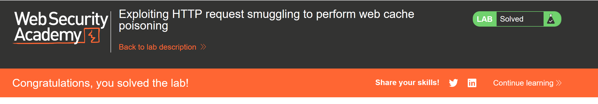

## 17. Exploiting HTTP request smuggling to perform web cache deception

**Description**

```
This lab involves a front-end and back-end server, and the front-end server doesn't support chunked encoding. The front-end server is caching static resources.

To solve the lab, perform a request smuggling attack such that the next user's request causes their API key to be saved in the cache. Then retrieve the victim user's API key from the cache and submit it as the lab solution. You will need to wait for 30 seconds from accessing the lab before attempting to trick the victim into caching their API key.

You can log in to your own account using the following credentials: wiener:peter
```

**Writeup**

Mục tiêu của lab là khiến cache lưu nhầm response nhạy cảm (`/my-account`) dưới key của một static resource (`/resources/js/tracking.js`), rồi đọc lại API key của victim từ cache.

Đầu tiên xác nhận tài nguyên tĩnh được cache ở front-end.

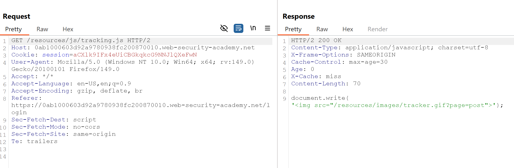

Đăng nhập tài khoản được cấp `wiener:peter` để quan sát cấu trúc trang `/my-account` và vị trí API key trong response.

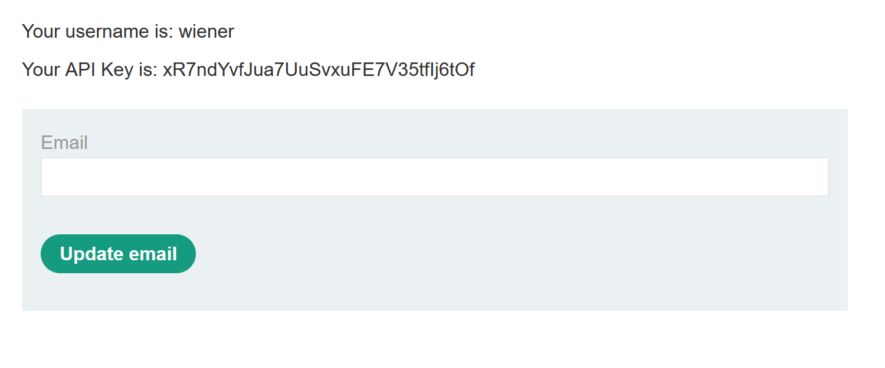

Sau đó gửi payload smuggling để gài một request tới `/my-account` vào luồng back-end, nhưng gắn ngữ cảnh sao cho phản hồi này có thể bị front-end cache dưới đường dẫn tài nguyên tĩnh.

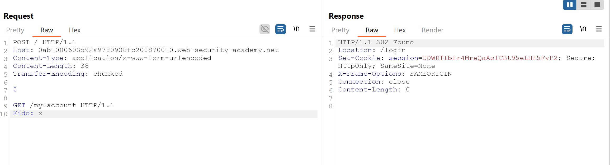

Lưu ý điều kiện đề bài: cần đợi khoảng 30 giây sau khi mở lab trước khi dụ victim đi qua luồng poisoned cache. Khi victim truy cập trang, trình duyệt của họ sẽ request `tracking.js`; do desync, response thực tế trả về lại là nội dung `/my-account` của victim, và response này bị cache lại với key của `tracking.js`.

Tiếp theo chỉ cần tự request lại `/resources/js/tracking.js` để đọc response đã bị cache sai. Lúc này sẽ thấy dữ liệu tài khoản victim, bao gồm API key.

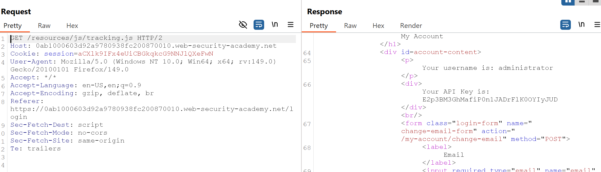

Copy API key vừa lấy được và submit vào ô lời giải của lab để hoàn tất challenge.

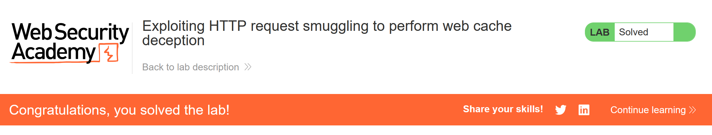