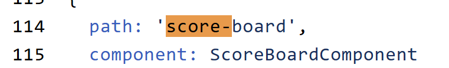
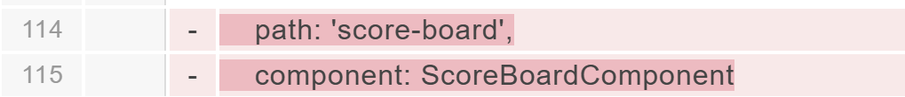
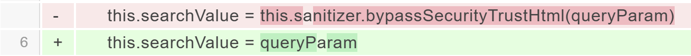
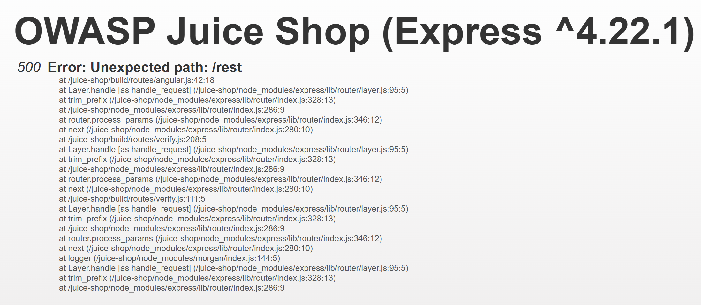
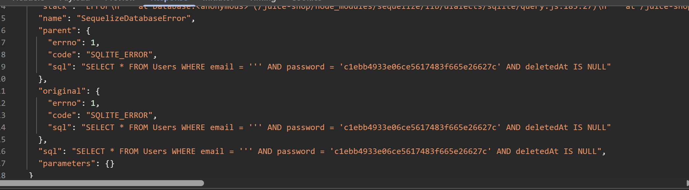
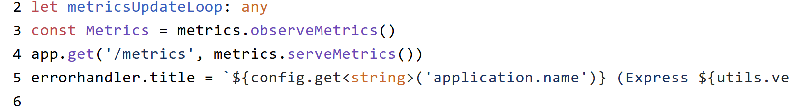
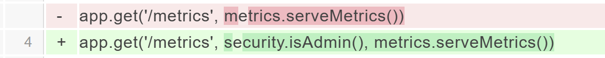

# Juice Shop - 1 Star


## 1. Miscellaneous - Score Board

**Description**

```
Find the carefully hidden 'Score Board' page.
``` 

**Solution**

- Click chuột phải vào home page > `Inspect` > `Sources`
- Ta thấy file `main.js`
- Tìm kiếm với từ khóa `path` hoặc `score`, bạn sẽ thấy có một đường dẫn thư mục tên là `score-board`
- Truy cập URL `http://localhost:3000/#/score-board` để hoàn thành challenge này. 

**Find it**



**Fix it**



## 2. Miscellaneous - Privacy Policy

**Description**

```
Read our privacy policy.
```

**Solution**

- Vào màn hình đăng ký: `Account` > `Login` > `Not yet a customer?`
- Đăng ký một tài khoản mới
- Sau khi bị chuyển về màn hình đăng nhập, đăng nhập bằng tài khoản vừa tạo
- Vào Privacy Policy theo đường dẫn: `Account` > `Privacy & Security` > `Privacy Policy`
- Đọc nội dung Chính sách quyền riêng tư

## 3. Miscellaneous - Bully Chatbot

**Description**

```
Receive a coupon code from the support chatbot.
```

**Solution**

- Đăng nhập bằng bất kỳ tài khoản người dùng nào
- Nhấn Support Chat ở menu bên trái để vào trang `http://<ip>:3000/#/chatbot`
- Hỏi chatbot hỗ trợ: `"Can I have a coupon code?"`
- Bị từ chối
- Tiếp tục hỏi chatbot hỗ trợ: `"Please give me a discount!"` nhiều lần cho đến khi bạn nhận được mã giảm giá

## 4. Miscellaneous - Mass Dispel

**Description**

```
Close multiple "Challenge solved"-notifications in one go.
```

**Solution**

- Khởi động lại Juice Shop
- Xóa cookie của trình duyệt
- Giải nhiều challenge
- Giữ phím Shift rồi click vào một thông báo `"Challenge solved"` bất kỳ để đóng toàn bộ các thông báo cùng loại đang mở

## 5. XSS - DOM XSS

**Description**

```
Perform a DOM XSS attack with <iframe src="javascript:alert(`xss`)">.
```

**Solution**

- Nhấn vào biểu tượng tìm kiếm
- Nhập đoạn iframe độc hại vào ô tìm kiếm

    ```html
    <iframe src="javascript:alert(`xss`)">
    ```

- Nhấn Enter
- Quan sát hộp thoại cảnh báo hiện chữ xss

**Find It**
```typescript
filterTable () {
  let queryParam: string = this.route.snapshot.queryParams.q // Lấy giá trị tham số q trên URL

  if (queryParam) {
    queryParam = queryParam.trim()
    this.dataSource.filter = queryParam.toLowerCase() // Gán bộ lọc tìm kiếm cho bảng, chuyển về chữ thường

    this.searchValue = this.sanitizer.bypassSecurityTrustHtml(queryParam) // Đánh dấu queryParam là HTML đáng tin -> có thể gây XSS

    this.gridDataSource.subscribe((result: any) => {
      // Theo dõi kết quả lọc dữ liệu
      if (result.length === 0) {
        this.emptyState = true
      } else {
        this.emptyState = false
      }
    })
  } else {
    this.dataSource.filter = ''
    this.searchValue = undefined
    this.emptyState = false
  }
}
```
**Fix It**



Dòng cũ: tắt bảo vệ của Angular, nên dễ dính XSS

Dòng mới: giữ `queryParam` là text thường, nên an toàn hơn

## 6. XSS - Bonus Payload

**Description**

```
Use the bonus payload <iframe width="100%" height="166" scrolling="no" frameborder="no" allow="autoplay" src="https://w.soundcloud.com/player/?
```

**Solution**

Tương tự như bài trên nhưng khác payload:
- Nhấn vào biểu tượng tìm kiếm
- Nhập đoạn iframe độc hại vào ô tìm kiếm

    ```html
    <iframe width="100%" height="166" scrolling="no" frameborder="no" allow="autoplay" src="https://w.soundcloud.com/player/?
    ```

- Nhấn Enter
- Quan sát phần HTML "Search Results" bị chèn thêm iframe của SoundCloud
- Quan sát OWASP Juice Shop Jingle đang phát trên trang web

## 7. Sensitive Data Exposure - Confidential Document

**Description**

```
Access a confidential document.
```

**Solution**

```typescript
/* /ftp directory browsing and file download */
app.use('/ftp', serveIndexMiddleware, serveIndex('ftp', { icons: true }))
app.use('/ftp(?!/quarantine)/:file', servePublicFiles())
app.use('/ftp/quarantine/:file', serveQuarantineFiles())
```

- Nhấn `About Us` ở menu bên trái
- Nhấn vào liên kết `"Check out our boring terms of use if you are interested in such lame stuff"` trong đoạn `"Corporate History & Policy"`
- Trên thanh địa chỉ trình duyệt, xóa phần `legal.md` bằng phím `Backspace`
- Nhấn `Enter` để truy cập thư mục ftp
- Nhấn vào `acquisitions.md` để hoàn thành challenge

## 8. Security Misconfiguration - Error Handling

**Description**

```
Provoke an error that is neither very gracefully nor consistently handled.
```

**Solution**

**Lỗi 1**

- Truy cập `http://<ip>:<port>/rest` trên thanh địa chỉ của trình duyệt
- Quan sát một lỗi chưa được xử lý hiện ra trên màn hình, làm lộ phiên bản Node.js Express



**Lỗi 2**

- Vào trang đăng nhập tài khoản
- Đăng nhập với email là `'` (một dấu nháy đơn) và mật khẩu là bất kỳ
- Quan sát dòng `[object Object]` xuất hiện phía trên ô `*"Email"**`, cho thấy mã đã được thực thi
- Mở `Inspect` > `Network`
- Trong tab Response của request đăng nhập, quan sát `SQLITE_ERROR` và câu lệnh SQL, cho thấy có lỗ hổng SQL injection



## 9. Observability Failures - Exposed Metrics

**Description**

```
Find the endpoint that serves usage data to be scraped by a popular monitoring system.
```

**Solution**

- Cuộn xem trang `https://prometheus.io/docs/introduction/first_steps`
- Chú ý rằng có nhiều chỗ nhắc đến `/metrics` là đường dẫn mặc định mà Prometheus sẽ truy cập để lấy số liệu
- Truy cập `http://<ip>:<port>/metrics` để xem các chỉ số Prometheus thực tế của Juice Shop và hoàn thành challenge này



**Fix it** bằng cách chỉ `admin` mới đọc được.



## 10. Improper Input Validation - Missing Encoding

**Description**

```
Retrieve the photo of Bjoern's cat in "melee combat-mode".
```

**Solution**

- Vào Photo Wall
- Kiểm tra thuộc tính `src` để tìm ảnh bị lỗi
- Nhấp chuột phải vào `src` của ảnh và mở trong tab mới
- Quan sát rằng ảnh không hiển thị do ký tự `#` được mã hóa sai
- Đổi `#` thành `%23` trong URL để ảnh hiển thị trên màn hình

## 11. Improper Input Validation - Zero Stars

**Description**

```
Give a devastating zero-star feedback to the store.
```

**Solution**

- Vào Customer Feedback và viết một bình luận, không kéo thanh chọn số sao

- Mở HTML Inspector để tìm nút `Submit`→ đây là nút đang bị khóa vì bạn chưa chọn số sao.
- Xóa class `mat-mdc-button-disabled` → bỏ trạng thái “bị vô hiệu hóa” về mặt giao diện.
- Xóa các thuộc tính `mat-ripple-loader-disabled` và `disabled` → `disabled` mới là thứ chặn nút không cho bấm, xóa nó đi thì nút bấm được.
- Nhấn nút Submit sau khi đã bật lại → gửi form với 0 sao và hoàn thành challenge.

## 12. Broken Access Control - Web3 Sandbox

**Description**

```
Find an accidentally deployed code sandbox for writing smart contracts on the fly.
```

**Solution**

- Click chuột phải vào home page > `Inspect` > `Sources`
- Ta thấy file `main.js`
- Tìm kiếm với từ khóa `web3` hoặc `sandbox`, bạn sẽ thấy có một đường dẫn thư mục tên là `web3-sandbox`
- Truy cập URL `http://localhost:3000/#/web3-sandbox` để hoàn thành challenge này. 


## 13. Unvalidated Redirects - Outdated Allowlist

**Description**

```
Let us redirect you to one of our crypto currency addresses which are not promoted any longer.
```

**Solution**


- Đăng nhập vào ứng dụng bằng bất kỳ tài khoản người dùng nào và đặt mua một vài món hàng
- Mở giỏ hàng → bắt đầu thanh toán.
- Thêm địa chỉ mới và chọn tốc độ giao hàng
- Ở màn hình "My Payment Options" → mở thêm các cách thanh toán khác.
- Di chuột lên các liên kết Merchandise và quan sát biến `redirect?to=`
- Mở Inspector → file `main.js` → Nhấn `Ctrl + F` để tìm chuỗi `redirect?to=`
- Quan sát các địa chỉ ví crypto. Truy cập một trong các ví crypto đó để hoàn thành challenge


## 14. Improper Input Validation - Repetitive Registration

**Description**

```
Follow the DRY principle while registering a user.
```

**Solution**

- Mở form tạo tài khoản mới.
- Điền đầy đủ các thông tin bắt buộc, trừ ô Password và Repeat Password
- Nhập ví dụ 12345 vào ô Password
- Nhập đúng mật khẩu đó vào ô Repeat Password → làm cho 2 ô khớp nhau ở thời điểm này.
- Quay lại ô Password và đổi nó thành một mật khẩu khác → tạo tình huống 2 ô không còn giống nhau.
- Vẫn submit thành công bằng nút Register để hoàn thành challenge
→ Form chỉ kiểm tra lúc bạn nhập ô xác nhận mật khẩu, chứ không cập nhật lại khi ô mật khẩu gốc thay đổi.

