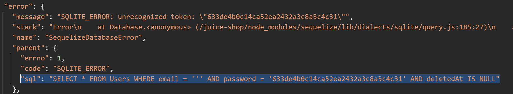
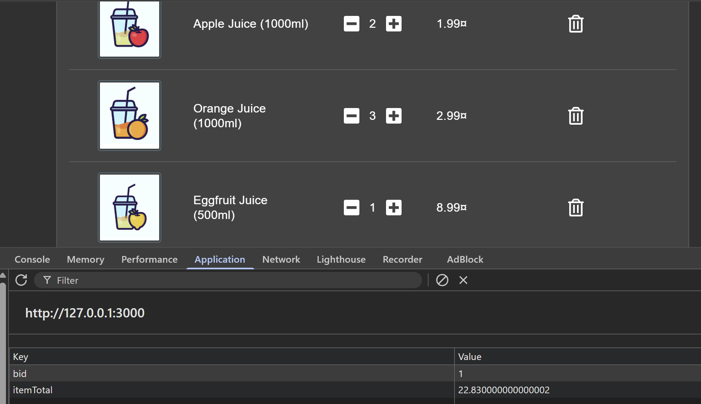
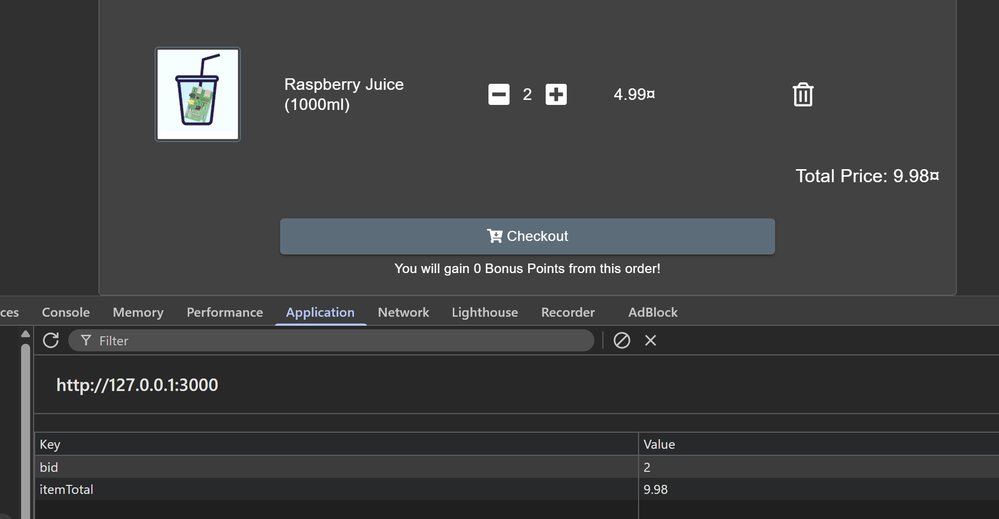
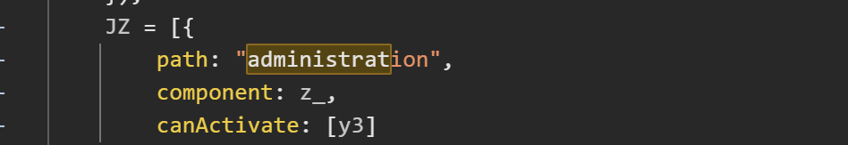

# Juice Shop - 2 Star


## 1. Injection - Login Admin

**Description**

```
Log in with the administrator's user account.
``` 

**Solution**

```typescript
models.sequelize.query(`SELECT * FROM Users WHERE email = '${req.body.email || ''}' AND password = '${security.hash(req.body.password || '')}' AND deletedAt IS NULL`, { model: UserModel, plain: true })
```

Nhập dấu `'` vào ô email và nhập mật khẩu bất kỳ để quan sát log lỗi cùng câu truy vấn SQL:



Nhập payload `' OR 1=1 --` vào ô email và nhập mật khẩu bất kỳ.
Trong đó:

- `'` dùng để đóng chuỗi email
- `OR 1=1` luôn trả về đúng
- `--` dùng để comment phần còn lại của câu SQL

Câu truy vấn sẽ trở thành:
```sql
SELECT * FROM Users WHERE email = '' OR 1=1 -- AND password = 'c06db68e819be6ec3d26c6038d8e8d1f' AND deletedAt IS NULL
```

Quan sát việc đăng nhập thành công vào tài khoản người dùng đầu tiên (trong trường hợp này tình cờ là tài khoản `admin`).

**Fix It**

Dùng `Prepared Statement`

```typescript
models.sequelize.query(
  `SELECT * FROM Users WHERE email = $1 AND password = $2 AND deletedAt IS NULL`,
  { bind: [ req.body.email, security.hash(req.body.password) ], model: models.User, plain: true }
)
```

- `$1` và `$2` là các placeholder cho tham số trong câu SQL.
`bind` truyền dữ liệu người dùng vào query theo cách an toàn, tách riêng dữ liệu khỏi cú pháp SQL.
- Vì vậy input của người dùng sẽ chỉ được xử lý như giá trị thông thường, không thể phá vỡ cấu trúc câu lệnh SQL.
- `security.hash(req.body.password)` đảm bảo mật khẩu nhập vào được băm trước khi so sánh với giá trị hash lưu trong database.

Ý nghĩa các thành phần
- `bind: [ req.body.email, security.hash(req.body.password) ]`
-> Gắn email vào $1 và mật khẩu đã hash vào $2.
- `model: models.User`
-> Ánh xạ kết quả truy vấn sang model User.
- `plain: true`
-> Chỉ lấy một bản ghi đầu tiên phù hợp, phù hợp với luồng đăng nhập.


## 2. Broken Access Control - View Basket

**Description**

```
View another user's shopping basket.
``` 

**Solution**

Đặt mua một vài sản phẩm.



Ở `Session Storage`, tìm giá trị bid dạng số (đây là Basket ID – ID của giỏ hàng). Thay đổi giá trị `bid`.



Nếu ứng dụng không kiểm tra quyền sở hữu giỏ hàng đúng cách, bạn sẽ mở được giỏ hàng của người khác và hoàn thành challenge.

## 3. Broken Access Control - View Basket

**Description**

```
View another user's shopping basket.
``` 

**Solution**

Mở file `main.js`. Tìm route administrator.



Đăng nhập với tài khoản `administrator` bằng SQL injection và truy cập route `/administration` để hoàn thành challenge.

**Fix it**
```typescript
/* TODO: Externalize admin functions into separate application
   that is only accessible inside corporate network.
*/
// {
//   path: 'administration',
//   component: AdministrationComponent,
//   canActivate: [AdminGuard]
// },
```

Tắt route đó đi và dự định chuyển phần admin sang ứng dụng riêng trong mạng nội bộ


## 4. Broken Access Control - Five-Star Feedback

**Description**

```
Get rid of all 5-star customer feedback.
``` 

**Solution**

Đăng nhập vào tài khoản `admin` bằng SQLi và truy cập vào route `/administration` như bài trên và xóa các đánh giá 5 sao


## 3. Broken Authentication - Password Strength

**Description**

```
Log in with the administrator's user credentials without previously changing them or applying SQL Injection.
``` 

**Solution**

Burteforce mật khẩu của admin ta được `admin123`, tiến hành đăng nhập để solve được challenge
