# Portswigger - Access Control


## APPRENTICE

## 1. Lab: Unprotected admin functionality

### Mô tả bài

```
This lab has an unprotected admin panel.
Solve the lab by deleting the user carlos.
```

### Writeup

Xem `/robots.txt`

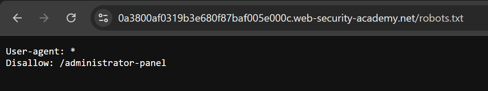

Disallow tiết lộ đường dẫn đến trang quản trị là `administrator-panel`.

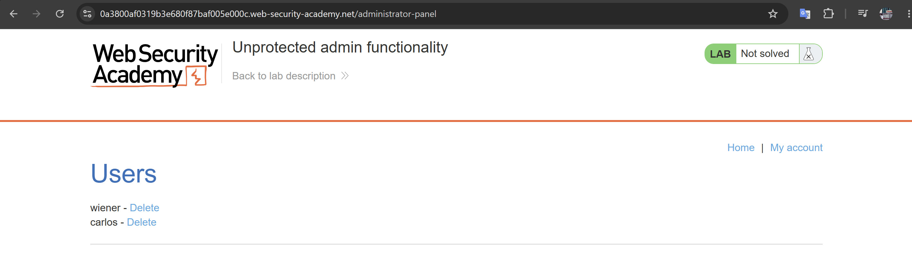

Truy cập `/administrator-panel`

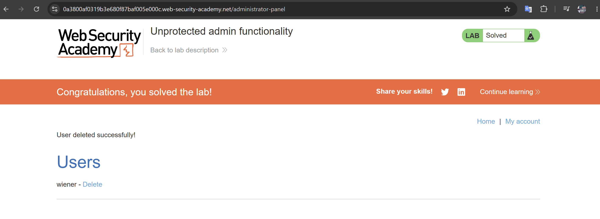

Solve bài lab

### Root cause

```
Chức năng admin không kiểm tra quyền phía server.
```


## 2. Lab: Unprotected admin functionality

### Mô tả bài

```
This lab has an unprotected admin panel. It's located at an unpredictable location, but the location is disclosed somewhere in the application.

Solve the lab by accessing the admin panel, and using it to delete the user carlos.
```

### Writeup

Ta thử xem `/robots.txt` nhưng trả về kết quả `Not found`.

Thử kiểm tra source code, phát hiện một đoạn quan trọng:

```js
var isAdmin = false;
if (isAdmin) {
   var topLinksTag = document.getElementsByClassName("top-links")[0];
   var adminPanelTag = document.createElement('a');
   adminPanelTag.setAttribute('href', '/admin-cpd0te');
   adminPanelTag.innerText = 'Admin panel';
   topLinksTag.append(adminPanelTag);
   var pTag = document.createElement('p');
   pTag.innerText = '|';
   topLinksTag.appendChild(pTag);
}
```

Dù link bị ẩn vì `isAdmin = false,` đường dẫn admin vẫn bị lộ trong source JS:

```
/admin-cpd0te
```

Truy cập `/admin-cpd0te` và xóa user `Carlos`.

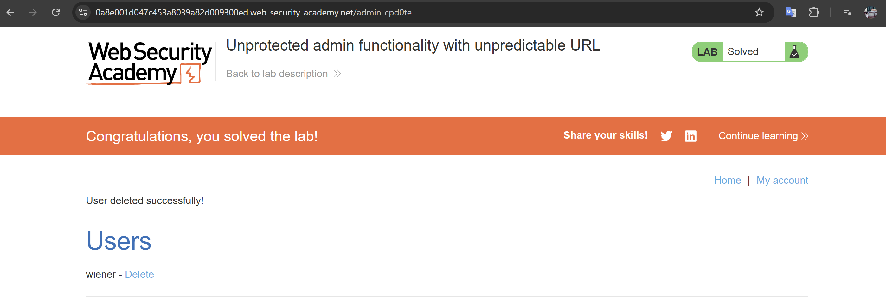

Solve được bài lab.

### Root cause

```
Chỉ ẩn URL admin, không có kiểm soát quyền thật sự.
```


## 3. Lab: User role controlled by request parameter

### Mô tả bài

```
This lab has an admin panel at /admin, which identifies administrators using a forgeable cookie.

Solve the lab by accessing the admin panel and using it to delete the user carlos.

You can log in to your own account using the following credentials: wiener:peter
```

### Writeup

Để bài gợi ý là có cookie có thể giả mạo được. Đầu tiên hãy đăng nhập với username, password cho sẵn.

Kiểm tra cookie:

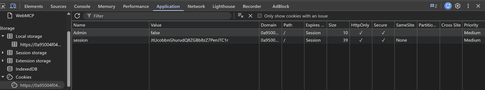

Sửa thành giá trị của `Admin` thành `true` và tải lại trang web.

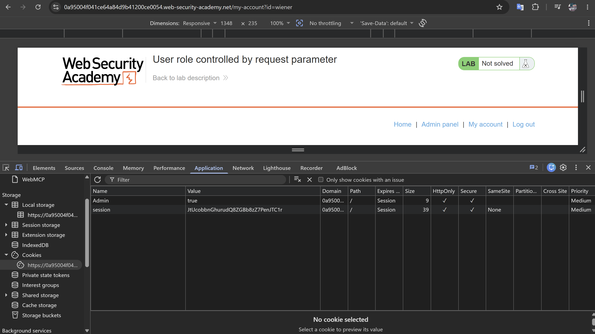

Thành công vào được tài khoản admin và truy cập `Admin panel` xóa user `Calors`.

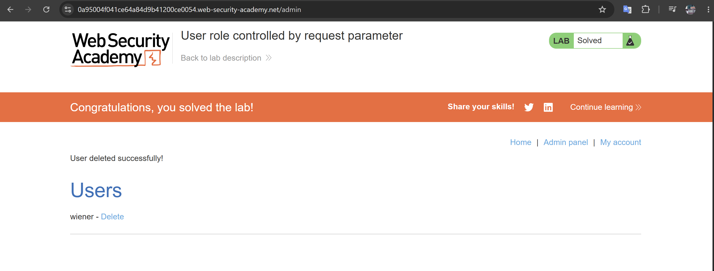

Solve được bài lab. 

### Root cause

```
Server tin cookie vai trò do người dùng sửa được.
```


## 4. Lab: User role can be modified in user profile

### Mô tả bài

```
This lab has an admin panel at /admin. It's only accessible to logged-in users with a roleid of 2.

Solve the lab by accessing the admin panel and using it to delete the user carlos.

You can log in to your own account using the following credentials: wiener:peter
```

### Writeup

Đầu tiên hãy đăng nhập với tài khoản mặc định.

Truy cập `/my-account` ta quan sát có chức năng update email.

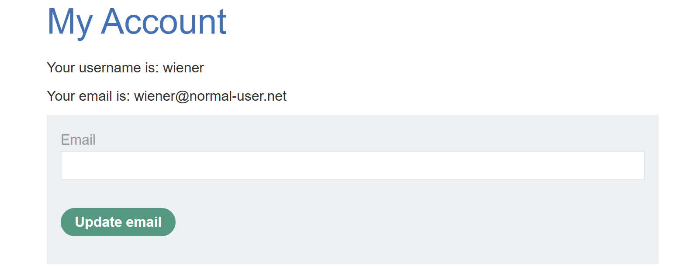

Tiến hành update email và bắt request này.

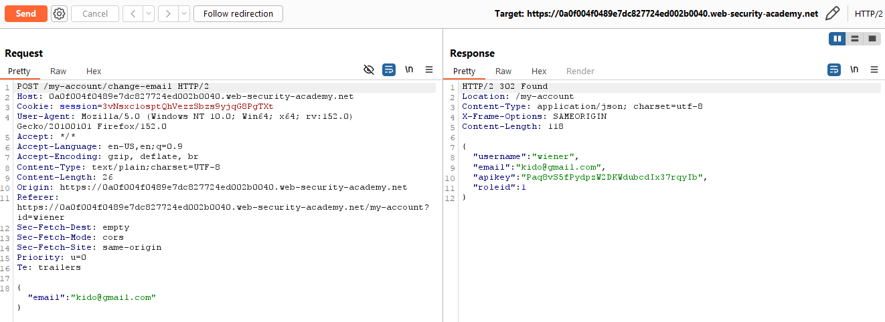

Do đề bài nêu rằng chỉ có roleid 2 mới truy cập được `/admin`, do đó ta thử thêm `"roleid":2` vào json ở body của request.

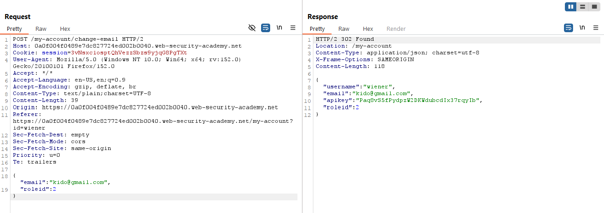

Thành công truy cập được vào `/admin` và xóa user calors.

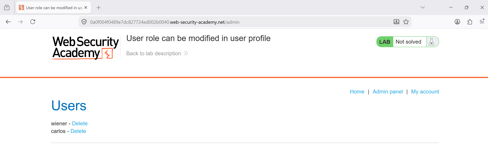

Solve được bài lab.

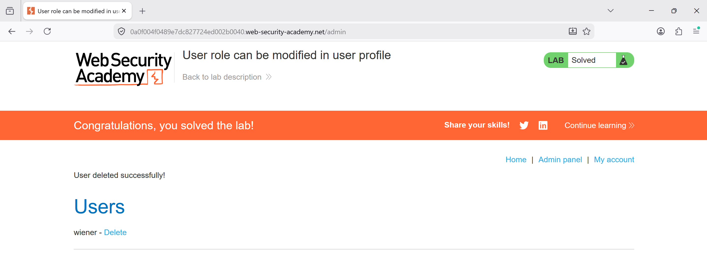

### Root cause

```
API cập nhật profile cho phép sửa cả trường khác như role.
```


## 5. Lab: User ID controlled by request parameter

### Mô tả bài

```
This lab has a horizontal privilege escalation vulnerability on the user account page.

To solve the lab, obtain the API key for the user carlos and submit it as the solution.

You can log in to your own account using the following credentials: wiener:peter
```

### Writeup

Đăng nhập vào tài khoản mặc định. Ta quan sát được mỗi tài khoản có mỗi API Key.

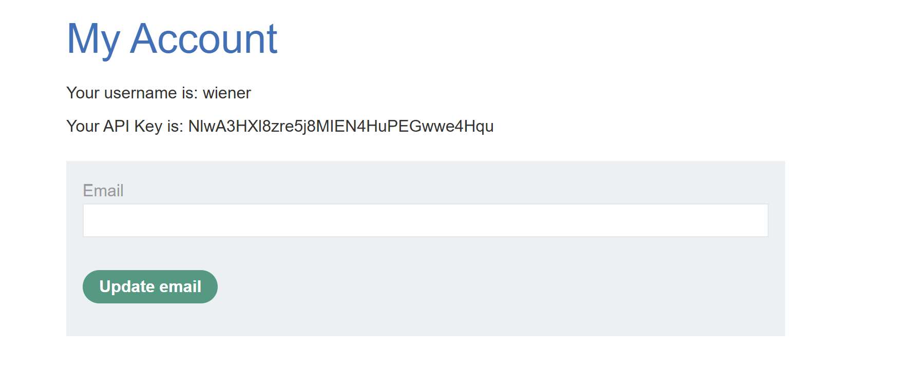

Mục tiêu là cần lấy được API Key của calors.

Để ý parameter của url đang là `?id=` và do đề bài gợi ý là leo thang đặc quyền ngang nên ta thử thay đổi thành `?id=carlos`. Bài này cũng có thể vào được tài khoản admin nếu ta đổi `?id=administrator`.

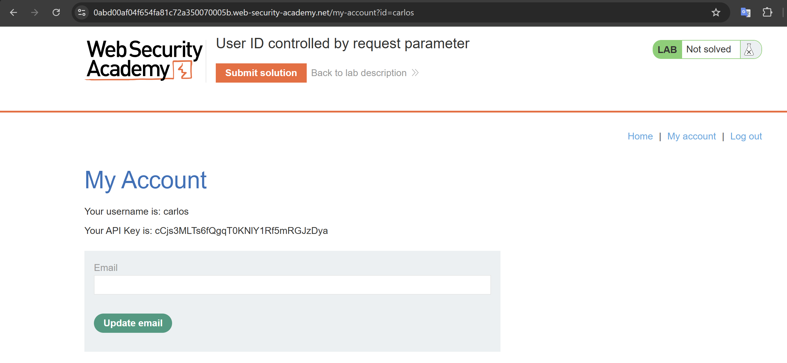

Ta thành công vào được tài khoản carlos, lấy API Key và submit.

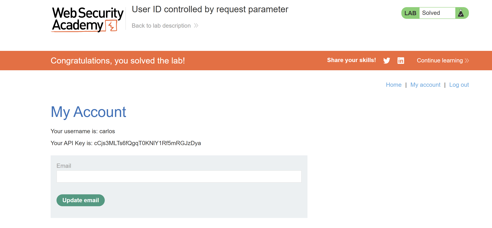

Solve được bài lab.

### Root cause

```
Không kiểm tra người dùng có thực sự sở hữu tài nguyên của id đó hay không.
```


## 6. Lab: User ID controlled by request parameter, with unpredictable user IDs

### Mô tả bài

```
This lab has a horizontal privilege escalation vulnerability on the user account page, but identifies users with GUIDs.

To solve the lab, find the GUID for carlos, then submit his API key as the solution.

You can log in to your own account using the following credentials: wiener:peter
```

### Writeup

Đăng nhập với tài khoản đề bài cho. Quan sát thấy url có param `?id` ta thử tìm id của carlos.

Quay lại trang home để tìm bài viết của carlos.

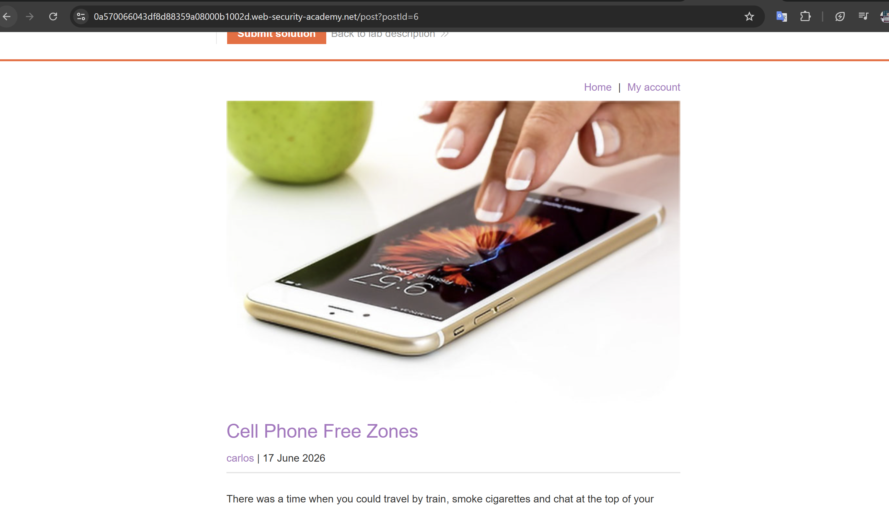

Click vào carlos ta sẽ thấy url trả về param `?userid=1d28e637-9eba-4a1f-8ffe-e0026ec8644c`.

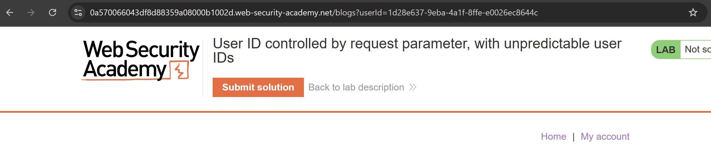

Quay lại trang `My account` thay `?id` bằng user id của carlos.

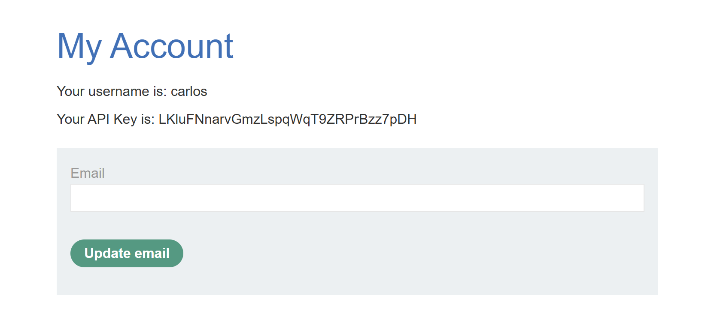

Thành công vào được tài khoản carlos, lấy API key và submit.

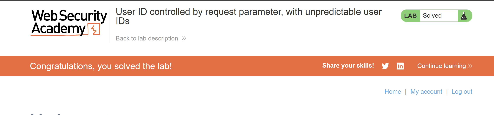

Solve được bài lab.

### Root cause

```
Dùng UUID khó đoán nhưng vẫn bị lộ qua chức năng khác và vẫn không kiểm tra quyền.
```


## 7. Lab: User ID controlled by request parameter with data leakage in redirect

### Mô tả bài

```
This lab contains an access control vulnerability where sensitive information is leaked in the body of a redirect response.

To solve the lab, obtain the API key for the user carlos and submit it as the solution.

You can log in to your own account using the following credentials: wiener:peter
```

### Writeup

Đăng nhập bằng tài khoản wiener. Ta quan sát url có param `?id=wiener`, thử thay đổi thành carlos. Trang trả về trang `/login`

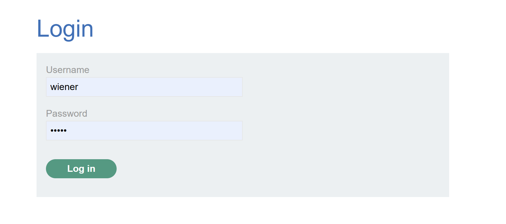

Nhưng nếu ta bắt request này trong burpsuite.

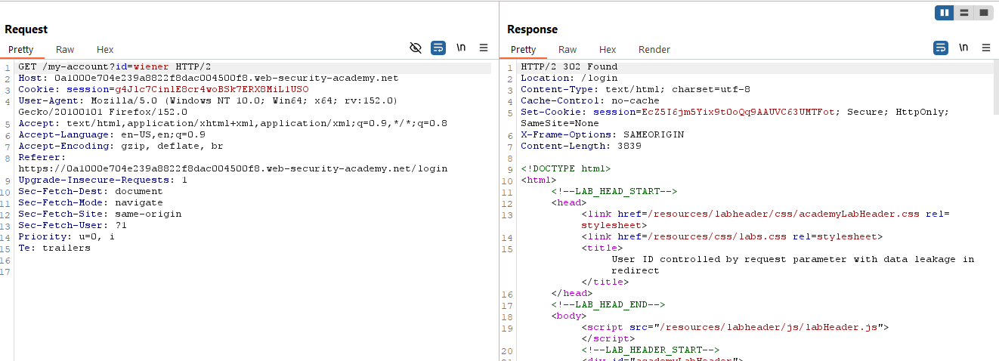

Đổi thành `id=carlos`.

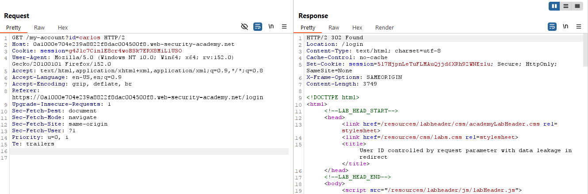

Trang web vẫn trả về tải khoản carlos và API key trước khi redirect sang `/login`. Lấy API key và submit.

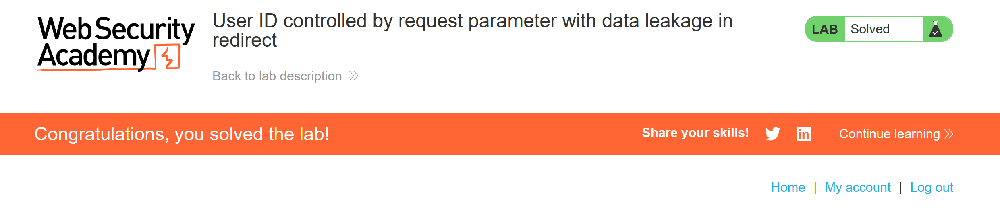

Solve được bài lab.

### Root cause

```
Server redirect nhưng đã đưa dữ liệu nhạy cảm vào response trước đó.
```


## 8. Lab: User ID controlled by request parameter with password disclosure

### Mô tả bài

```
This lab has user account page that contains the current user's existing password, prefilled in a masked input.

To solve the lab, retrieve the administrator's password, then use it to delete the user carlos.

You can log in to your own account using the following credentials: wiener:peter
```

### Writeup

Đăng nhập vào tài khoản winner. Ta quát sát được có chức năng update password.

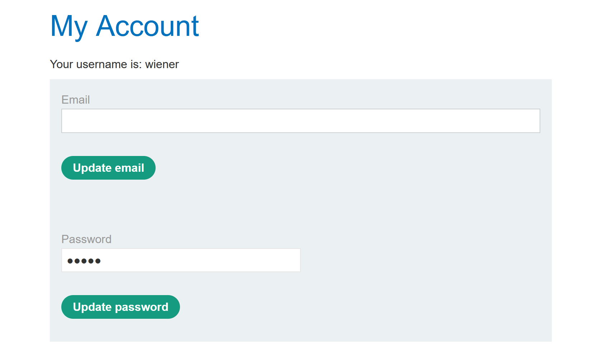

Chuyển qua burp hoặc view src để xem được ô password bị ẩn này.

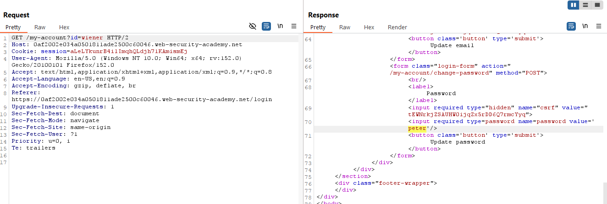

Tiếp tục quan sát url có param `?id=` ta thử thay bằng `administrator`

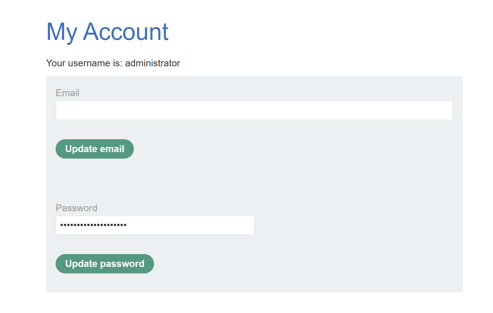

Nhưng không thấy admin panel. Vì vậy ta xem giá trị password `administrator` bị ẩn.

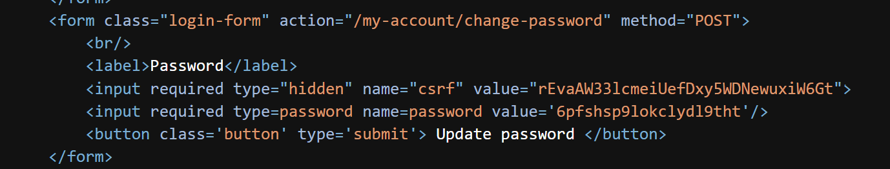

Lấy password và đăng nhập vào tài khoản `administrator` và xóa user `carlos`.

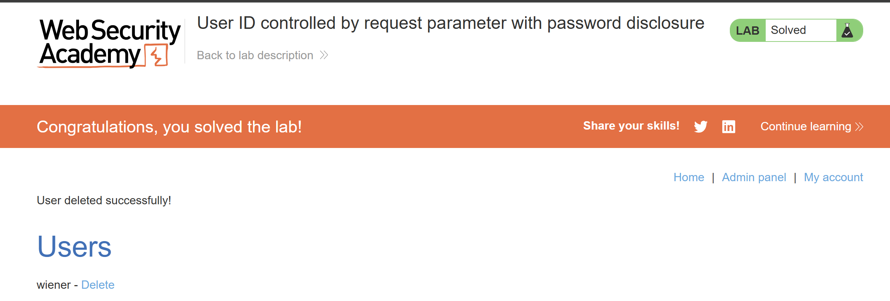

Solve được bài lab.

### Root cause

```
Trang tài khoản làm lộ mật khẩu người khác do thiếu kiểm tra quyền.
```


## 9. Lab: Insecure direct object references

### Mô tả bài

```
This lab stores user chat logs directly on the server's file system, and retrieves them using static URLs.

Solve the lab by finding the password for the user carlos, and logging into their account.
```

### Writeup

Sau khi truy cập trang web ta phát hiện có chức năng live chat. 

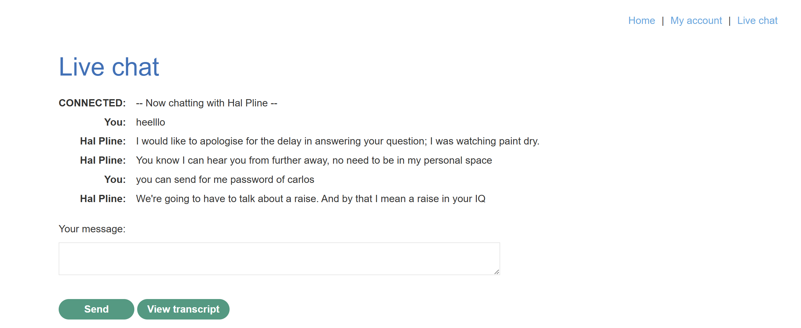

Thử xem view transcript thì hệ thống sẽ lưu cho mình một file `2.txt`. Tiếp tục thử nhiều lần ta sẽ thấy được filename là một số tăng dần.

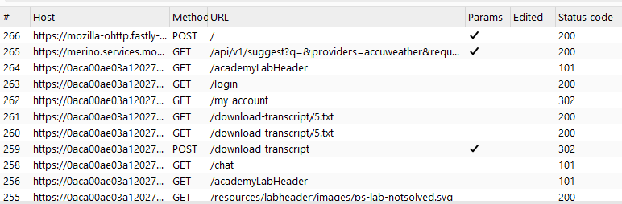

Khi đó ta thử thay đổi thành `1.txt`.

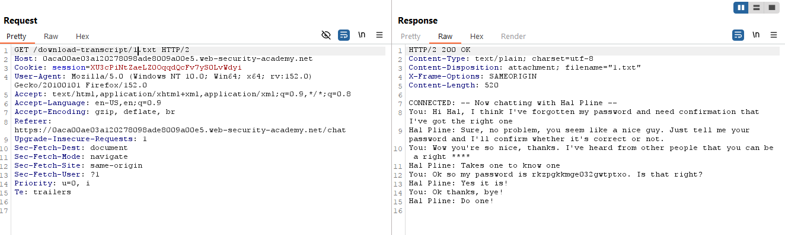

Ta phát hiện trong cuộc hội thoại này đã lộ mật khẩu. Tiến hành đăng nhập với user carlos.

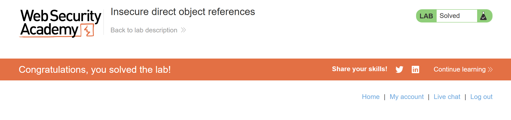

Thành công solve được bài lab.

### Root cause

```
Truy cập trức tiếp file bằng tên file mà không xác minh quyền.
```


## PRACTITIONER

## 10. Lab: URL-based access control can be circumvented

### Mô tả bài

```
This website has an unauthenticated admin panel at /admin, but a front-end system has been configured to block external access to that path. However, the back-end application is built on a framework that supports the X-Original-URL header.

To solve the lab, access the admin panel and delete the user carlos.
```

### Writeup

Thử truy cập admin panel thì trả về `Access denied`.

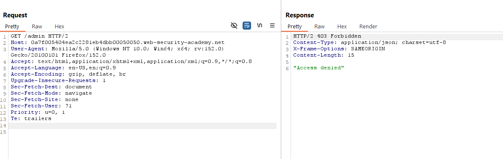

Phần đề bài gợi ý rằng backend sẽ tin vào `X-Original-URL`. `X-Original-URL` là một HTTP request header không chuẩn dùng để chỉ định hoặc lưu lại đường dẫn URL gốc của request trước khi URL bị proxy, web server hoặc framework rewrite. Vì vậy ta test thử:

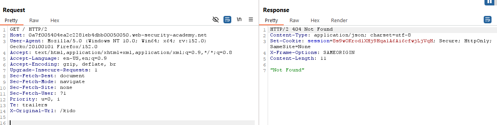

Kết quả trả về `not found` do đó chắc chắn backend tin vào `X-Original-URL`, sửa thành `/admin`.

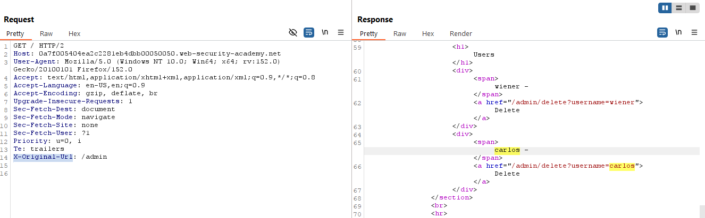

Thành công vào đươc `admin`, tiến hành xóa user `carlos`.

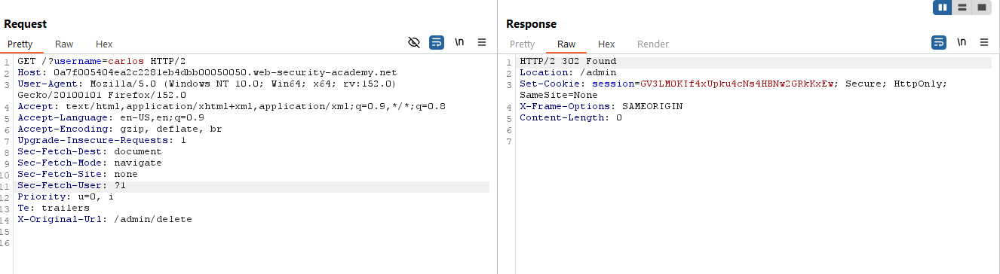

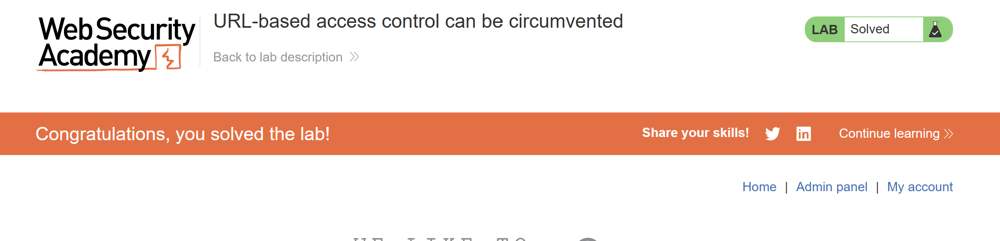

Solve được bài lab.

### Root cause

```
Frontend và Backend xử lý URL khác nhau, cho phép bypass bằng header như X-Original-URL.
```


## 11. Lab: Method-based access control can be circumvented

### Mô tả bài

```
This lab implements access controls based partly on the HTTP method of requests. You can familiarize yourself with the admin panel by logging in using the credentials administrator:admin.

To solve the lab, log in using the credentials wiener:peter and exploit the flawed access controls to promote yourself to become an administrator.
```

### Writeup

Đăng nhập vào tài khoản `administrator` và khám phá admin panel. Ta thấy có một chức năng để upgrade hay downgrade một uesr nào đó.

Thử upgrade `carlos` lên admin.

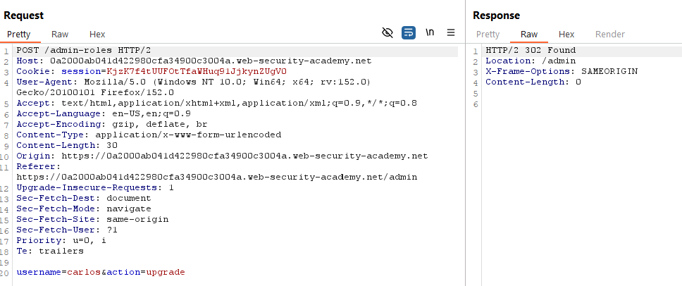

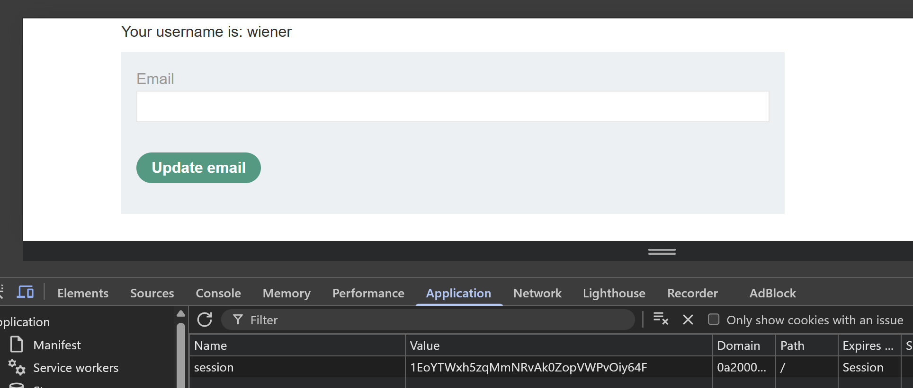

Lúc này đăng nhập vào winner để lấy session rồi thay vào kết quả trả về `Unauthorized`. Lúc này ta chuyển `POST` thành `POSTX` xem để kiểm tra xem access control có chỉ chặn đúng phương thức POST hay không.

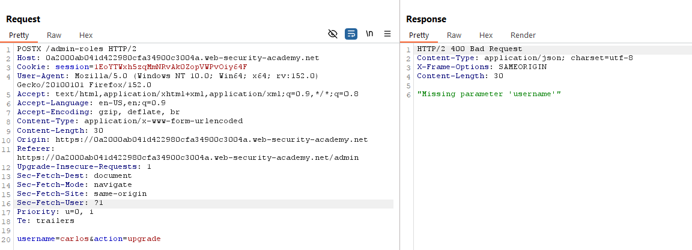

Điều này cho thấy quy tắc có thể được cấu hình chặn non-admin khi `method = POST`. Sau đó đổi sang `GET` và đổi username là wiener:

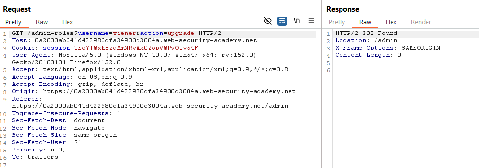

Thành công upgrade wiener lên admin và solve được bài lab.

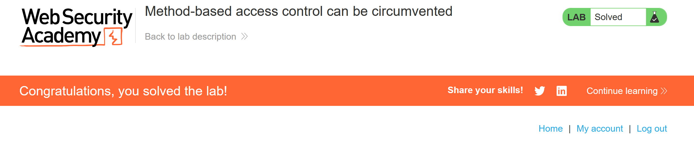

### Root cause

```
Chỉ kiểm qua quyền với một HTTP method cụ thể là POST, trong khi các method khác vẫn thực hiện được hành động.
```


## 12. Lab: Multi-step process with no access control on one step

### Mô tả bài

```
This lab has an admin panel with a flawed multi-step process for changing a user's role. You can familiarize yourself with the admin panel by logging in using the credentials administrator:admin.

To solve the lab, log in using the credentials wiener:peter and exploit the flawed access controls to promote yourself to become an administrator.
```

### Writeup

Đăng nhập vào administrator nâng quyền cho Carlos, bấm Yes để gửi request cuối:

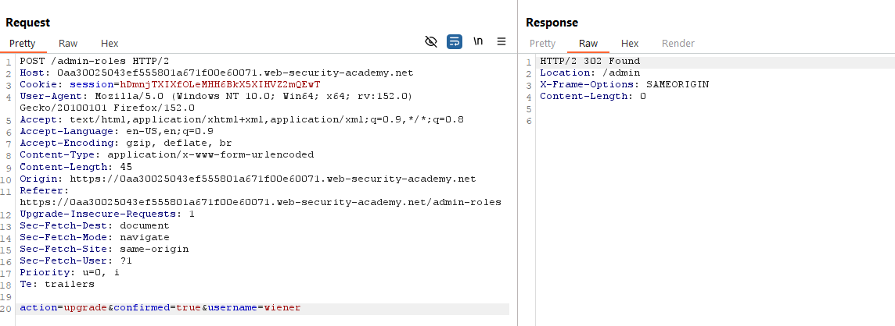

Sửa `session` và `username` thành của `wiener` và gửi request.

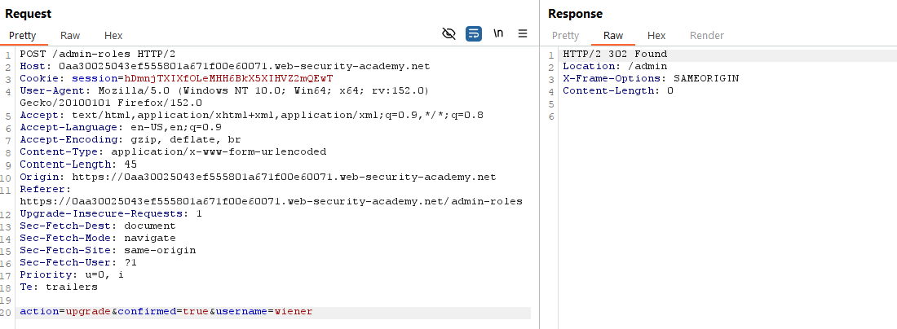

Thành công nâng wiener lên admin do trang web không kiểm qua quyền admin ở bước cuối.

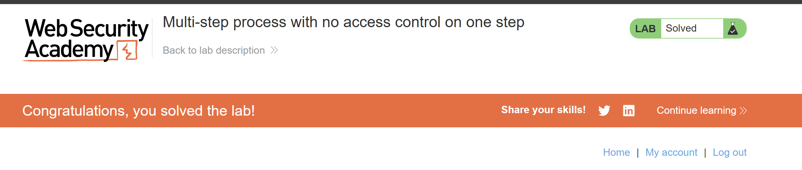

Solve bài lab.

### Root cause

```
Một bước trong quy trình nhiều bước bị thiếu kiểm tra quyền, thường là bước cuối xác nhận.
```


## 13. Lab: Referer-based access control

### Mô tả bài

```
This lab controls access to certain admin functionality based on the Referer header. You can familiarize yourself with the admin panel by logging in using the credentials administrator:admin.

To solve the lab, log in using the credentials wiener:peter and exploit the flawed access controls to promote yourself to become an administrator.
```

### Writeup

Đăng nhập vào tài khoản administrator để nâng quyền tài khoản carlos. 

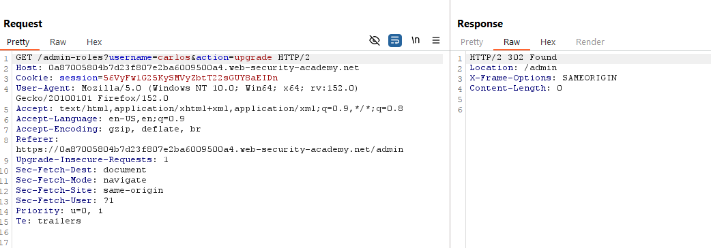

Sửa `session` và `username` thành của `wiener` và gửi request.

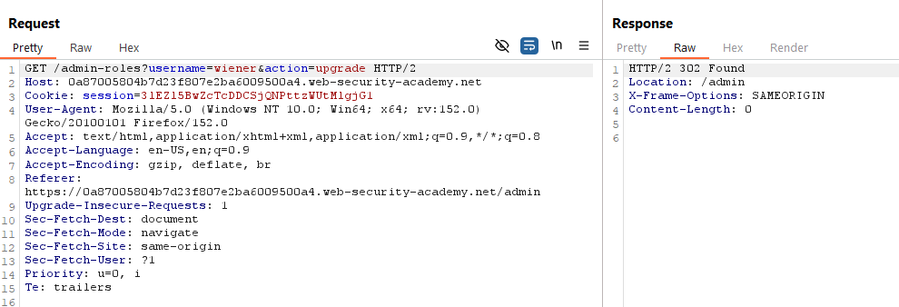

Thành công nâng wiener lên admin.

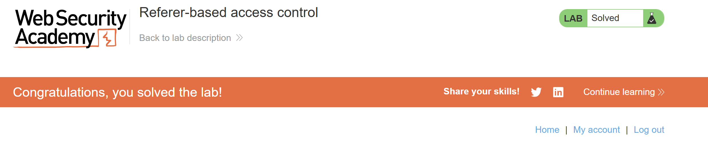


### Root cause

```
Server in header Referer do người dùng gửi có thể giả mạo để quyết định quyền truy cập.
```

## Tổng kết

**Access Control** là cơ chế quyết định người dùng được phép truy cập tài nguyên hoặc thực hiện chức năng nào sau khi đã đăng nhập.

### **Các loại chính**
   - **Vertical access control**: Phân quyền theo vai trò, ví dụ user không được truy cập chức năng admin.
   - **Horizontal access control**: Người dùng chỉ được truy cập dữ liệu của chính mình, không được xem dữ liệu của người khác.
   - **Context-dependent access control**: Quyền phụ thuộc vào trạng thái hoặc trình tự thao tác, ví dụ không được sửa giỏ hàng sau khi thanh toán.
   - **IDOR**: Ứng dụng dùng ID, tên file hoặc tham số do người dùng cung cấp nhưng không kiểm tra quyền sở hữu.


### **Cách khai thác**

**Kẻ tấn công thường:**

- Truy cập trực tiếp URL nhạy cảm như `/admin`.
- Tìm endpoint bị lộ trong `robots.txt`, JavaScript hoặc dùng wordlist.
- Sửa tham số như `admin=true`, `role=1`, `id=123`.
- Đổi `ID`, `UUID` hoặc tên file để xem dữ liệu người khác.
- Thay đổi HTTP method như `POST` thành `GET`.
- Dùng header như `X-Original-URL`, `X-Rewrite-URL` hoặc giả mạo `Referer`.
- Thử biến thể URL như viết hoa, thêm dấu `/` hoặc phần mở rộng.
- Bỏ qua các bước trung gian và gửi trực tiếp request xác nhận cuối cùng.


### **Cách phòng tránh**
- Áp dụng nguyên tắc `deny by default`.
- Kiểm tra quyền ở phía server với mọi request.
- Không dựa vào việc ẩn URL hoặc kiểm tra phía client.
- Kiểm tra cả vai trò người dùng và quyền sở hữu tài nguyên.
- Dùng cơ chế phân quyền thống nhất trong toàn bộ ứng dụng.
- Kiểm tra quyền ở mọi bước của quy trình nhiều bước.
- Không tin tưởng `ID`, `cookie`, `header` hoặc tham số do người dùng gửi lên.
- Thường xuyên kiểm thử và rà soát cấu hình access control.