# Portswigger - Path Traversal


## APPRENTICE

## 1. Lab: File path traversal, simple case

### Mô tả bài

This lab contains a path traversal vulnerability in the display of product images.

To solve the lab, retrieve the contents of the `/etc/passwd` file.

### Writeup

Lab này chứa một lỗ hổng path traversal trong chức năng hiển thị hình ảnh sản phẩm. Khi load trang web ta thấy hàng loại các image được load.

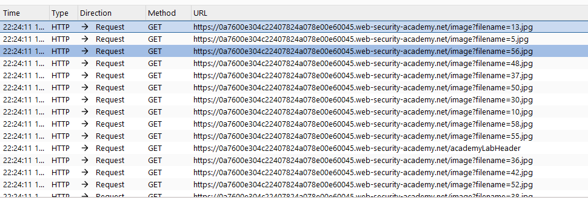

Những request này sẽ có tham số là đường dẫn tới ảnh đó. Theo như yêu cầu đề bài thì em sẽ cần phải vào đọc file `/etc/passwd` nên thử nhập `etc/passwd` xem có thể truy cập được không.

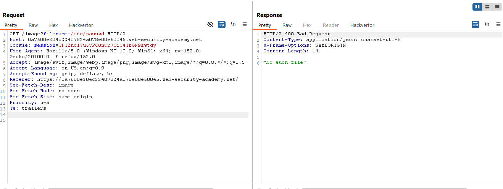

Kết quả là không tìm thấy file vì vậy ta thêm từng đoạn `../` trước `etc/passwd`.

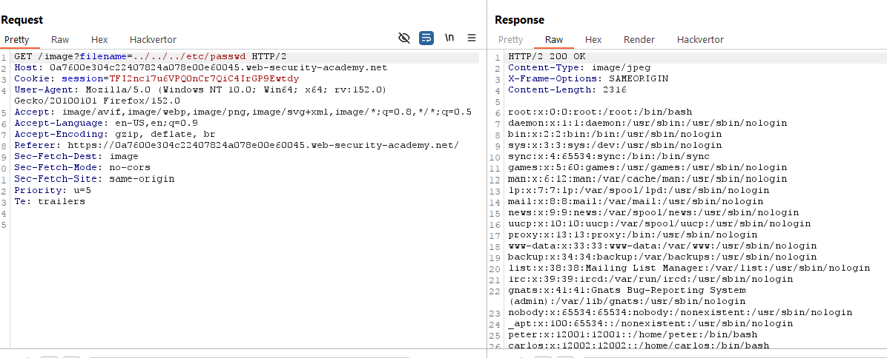

Thành công đọc được file `etc/passwd` và solve bài lab.


### Root cause

```
Ứng dụng nối trực tiếp input vào đường dẫn file mà không kiểm tra hoặc giới hạn thư mục truy cập.
```


## PRACTITIONER

## 2. Lab: File path traversal, traversal sequences blocked with absolute path bypass

### Mô tả bài

This lab contains a path traversal vulnerability in the display of product images.

The application blocks traversal sequences but treats the supplied filename as being relative to a default working directory.

To solve the lab, retrieve the contents of the `/etc/passwd` file.

### Writeup

Lab này chứa một lỗ hổng path traversal trong chức năng hiển thị hình ảnh sản phẩm. Khi load trang web ta thấy hàng loại các image được load.

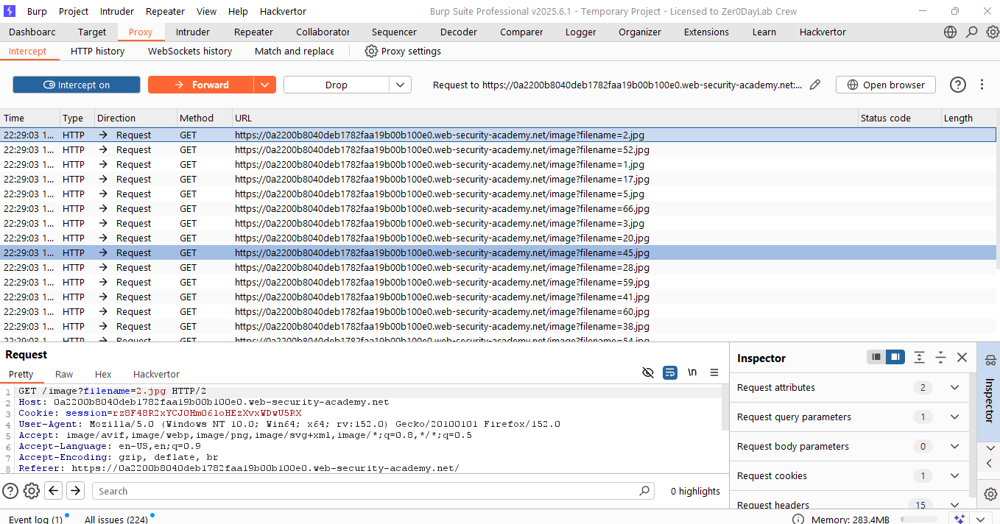

Ứng dụng thực hiện chặn chuỗi `../` nhưng vẫn cho phép sử dụng đường dẫn tuyệt đối.

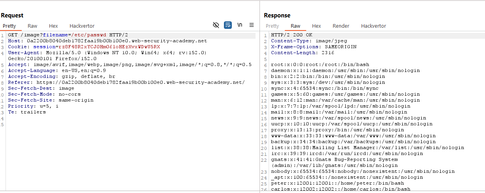

Thành công đọc được file `etc/passwd` và solve bài lab.


### Root cause

```
Chỉ blacklist ../ nhưng không kiểm tra đường dẫn tuyệt đối.
```


## 3. Lab: File path traversal, traversal sequences stripped non-recursively

### Mô tả bài

This lab contains a path traversal vulnerability in the display of product images.

The application strips path traversal sequences from the user-supplied filename before using it.

To solve the lab, retrieve the contents of the `/etc/passwd` file.


### Writeup

Lab này chứa một lỗ hổng path traversal trong chức năng hiển thị hình ảnh sản phẩm. Khi load trang web ta thấy hàng loại các image được load.

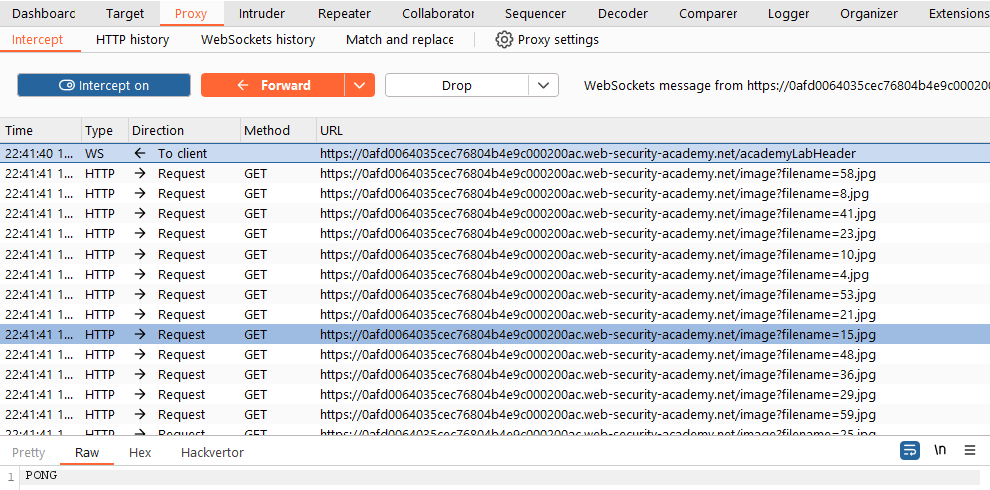

Thử sử dụng đường dẫn tuyệt đối.

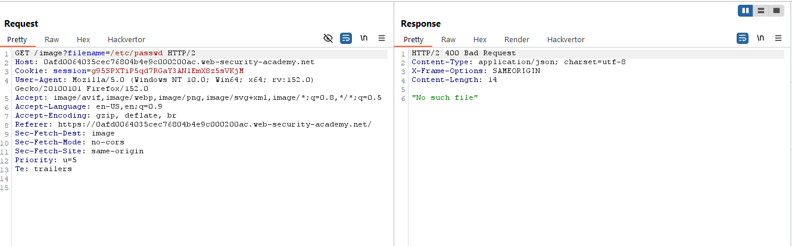

Ta thử thêm các đoạn `../`

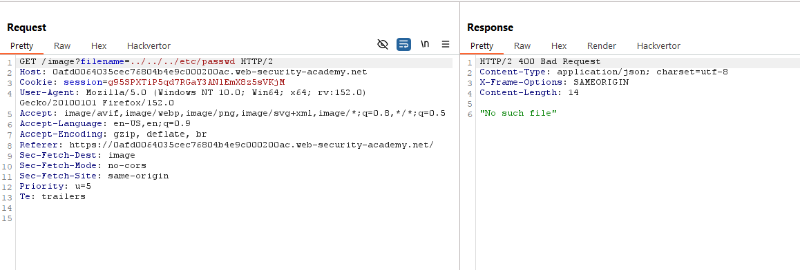

Do đề bài có nói về việc server sẽ loại bỏ các kí tự như `../` khỏi tên file nhưng nó không được đệ quy nên ta có thể bypass dễ dàng bằng cách lồng các ký tự vào nhau như `....//`

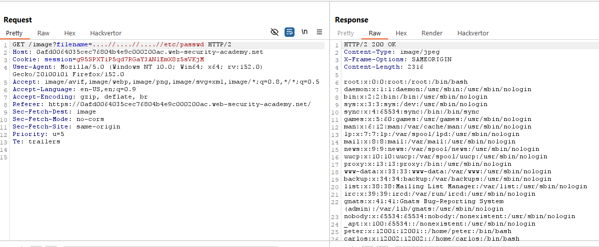

Thành công đọc được file `etc/passwd` và solve bài lab.


### Root cause

Ứng dụng lọc `../` không đệ quy (non-recursive), nên payload vẫn tạo lại được `../`


## 4. Lab: File path traversal, traversal sequences stripped with superfluous URL-decode

### Mô tả bài

This lab contains a path traversal vulnerability in the display of product images.

The application blocks input containing path traversal sequences. It then performs a URL-decode of the input before using it.

To solve the lab, retrieve the contents of the `/etc/passwd` file.

### Writeup

Lab này chứa một lỗ hổng path traversal trong chức năng hiển thị hình ảnh sản phẩm. Khi load trang web ta thấy hàng loại các image được load.

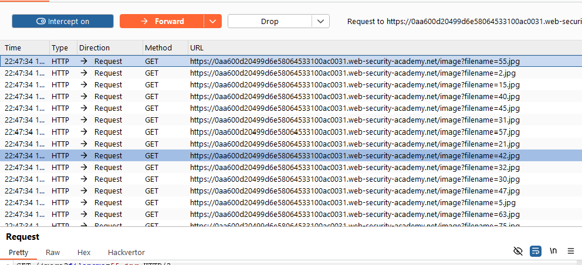

Thử sử dụng đường dẫn tuyệt đối.

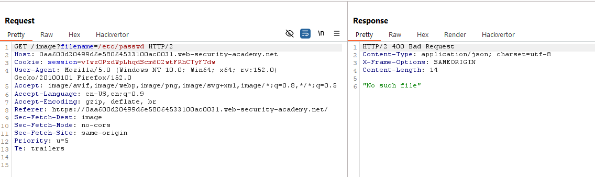

Ta tiếp tục thử thêm các đoạn `../`

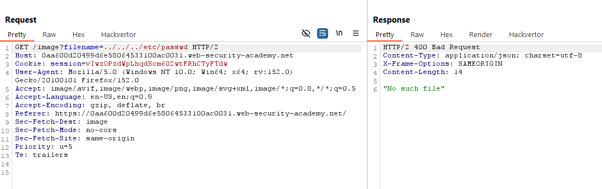

Do đề bài chặn các chuỗi có chứa path traversal. Tuy nhiên, sau đó nó lại thực hiện giải mã URL đối với đầu vào đó trước khi đưa vào sử dụng. Do đó ta decode đoạn `../../../`

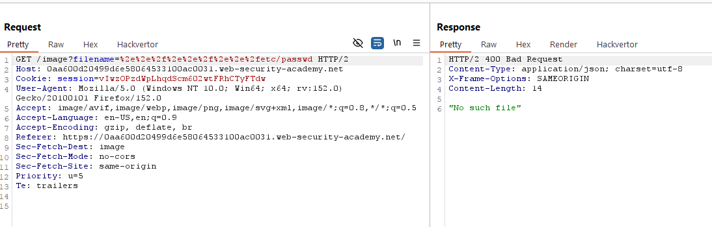

Cũng có thể ứng dụng decode nhiều hơn một lần nên ta tiếp tục thử decode 2 lần đoạn `../../../`.

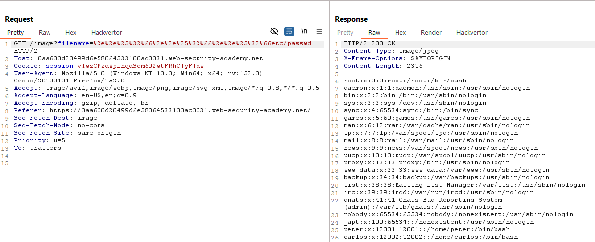

Thành công đọc được file `etc/passwd` và solve bài lab.


### Root cause
```
Ứng dụng decode URL nhiều lần khiến payload vượt qua bộ lọc.
```


## 5. Lab: File path traversal, validation of start of path

### Mô tả bài

This lab contains a path traversal vulnerability in the display of product images.

The application transmits the full file path via a request parameter, and validates that the supplied path starts with the expected folder.

To solve the lab, retrieve the contents of the `/etc/passwd` file.

### Writeup

Lab này chứa một lỗ hổng path traversal trong chức năng hiển thị hình ảnh sản phẩm. Khi load trang web ta thấy hàng loại các image được load.

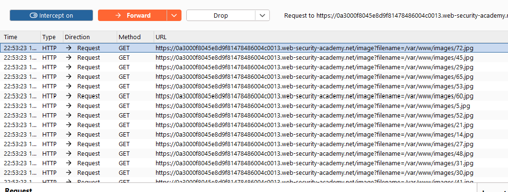

Do ứng dụng chỉ kiểm tra đường dẫn bắt đầu bằng thư mục hợp lệ và không có cơ chế kiểm tra nâng cao nào nên vẫn hoàn toàn có thể sử dụng `../` để duyệt ngược lại và truy cập vào `/etc/passwd`.

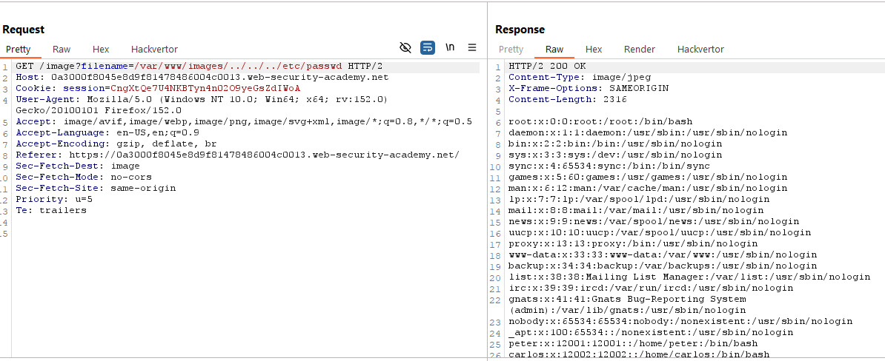

Thành công đọc được file `etc/passwd` và solve bài lab.


### Root cause

```
Chỉ kiểm tra tiền tố của đường dẫn mà không chuẩn hóa (canonicalize) trước khi xác thực.
```


## 6. Lab: File path traversal, validation of file extension with null byte bypass

### Mô tả bài

This lab contains a path traversal vulnerability in the display of product images.

The application validates that the supplied filename ends with the expected file extension.

To solve the lab, retrieve the contents of the `/etc/passwd` file.

### Writeup

Lab này chứa một lỗ hổng path traversal trong chức năng hiển thị hình ảnh sản phẩm. Khi load trang web ta thấy hàng loại các image được load. 

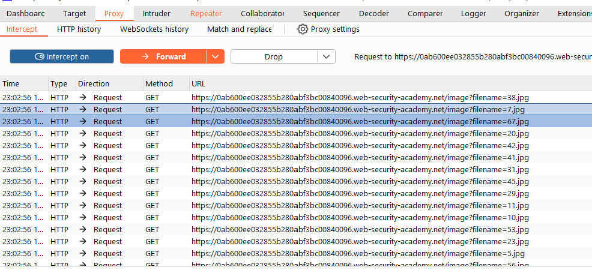

Theo như mô tả của bài lab này thì phía backend sẽ dựa vào đuôi file để quyết định xem có thể truy cập được không.

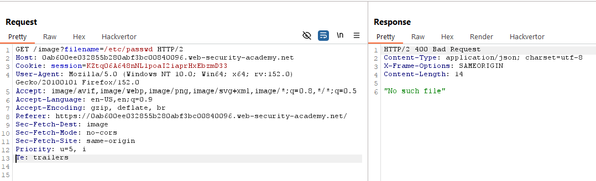

Ta thử truy cập trực tiếp bằng đường dẫn tuyệt đối.

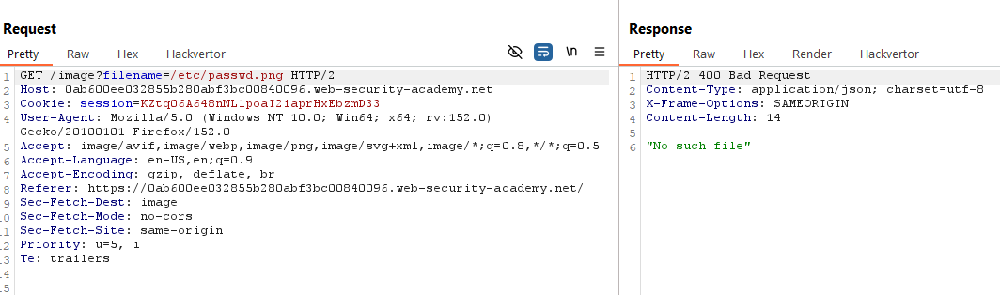

Do backend chỉ kiểm tra đuôi file nên ta suy nghĩ thêm byte `null` vào trước đuôi `.png`.

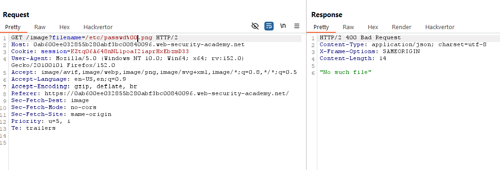

Kết quả vẫn thất bại, do đó ta tiếp tục thêm đoạn `../../../`. Do ứng dụng kiểm tra thấy đuôi file là `.png` nên bypass, sau đó khi truyền chuỗi này xuống hàm hệ điều hành, hàm này sẽ coi `\0` là kết thúc chuỗi, nghĩa là hệ điều hành chỉ nhìn thấy được `../../../etc/passwd` và bỏ qua `.png`


Thành công đọc được file `etc/passwd` và solve bài lab.


### Root cause

```
Ứng dụng kiểm tra phần mở rộng trước khi xử lý ký tự NULL, dẫn đến null byte injection bypass kiểm tra đuôi file.
```


## Tổng kết

**Path Traversal (Directory Traversal)** là lỗ hổng cho phép kẻ tấn công thao túng đường dẫn tệp để truy cập các file hoặc thư mục ngoài phạm vi mà ứng dụng cho phép, từ đó đọc hoặc ghi các tệp nhạy cảm.

### Các loại - Kỹ thuật

* **Basic Traversal:** Sử dụng `../` hoặc `..\`.
* **Absolute Path:** Dùng đường dẫn tuyệt đối như `/etc/passwd` hoặc `C:\Windows\win.ini`.
* **Non-recursive Bypass:** Dùng `....//`, `....\/` để vượt qua bộ lọc.
* **URL Encoding:** Mã hóa `../` thành `%2e%2e%2f` hoặc double encoding `%252e%252e%252f`.
* **Prefix Bypass:** Thêm thư mục hợp lệ rồi thoát ra bằng `../`.
* **Null Byte Injection:** Dùng `%00` để bỏ qua phần mở rộng (chỉ hiệu quả trên hệ thống cũ).

### Phòng chống

* Không sử dụng trực tiếp input của người dùng làm đường dẫn.
* Chỉ cho phép các tên tệp hợp lệ (whitelist).
* Chuẩn hóa (canonicalize) và kiểm tra đường dẫn sau chuẩn hóa vẫn nằm trong thư mục cho phép.
* Áp dụng quyền truy cập tối thiểu cho ứng dụng.
