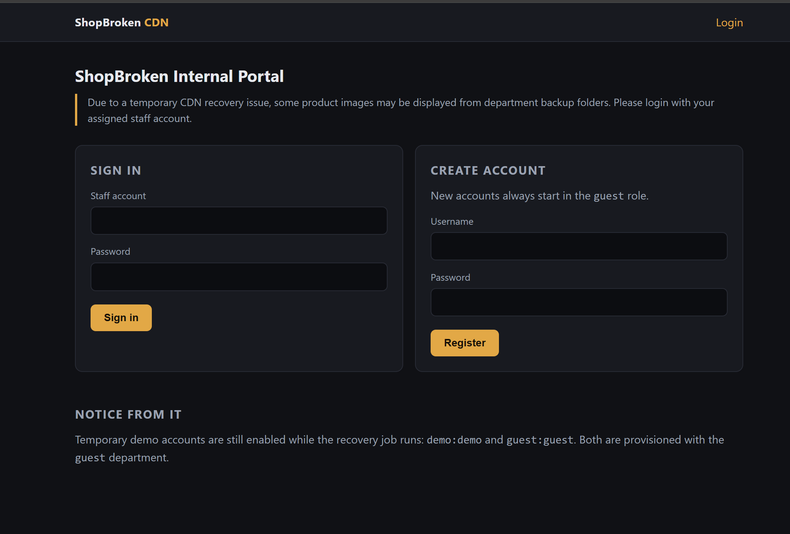
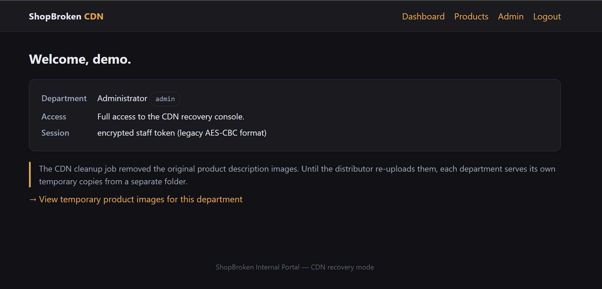
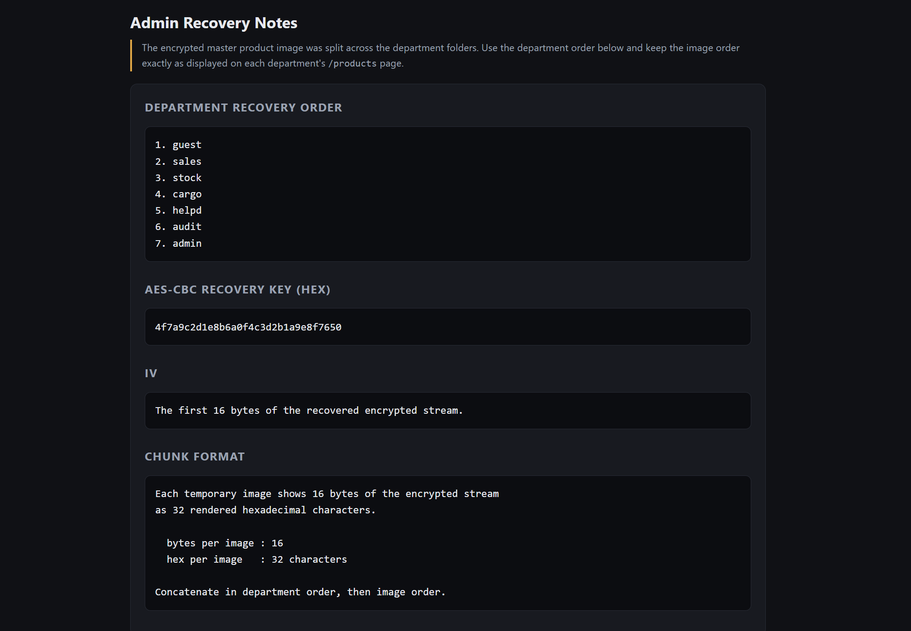
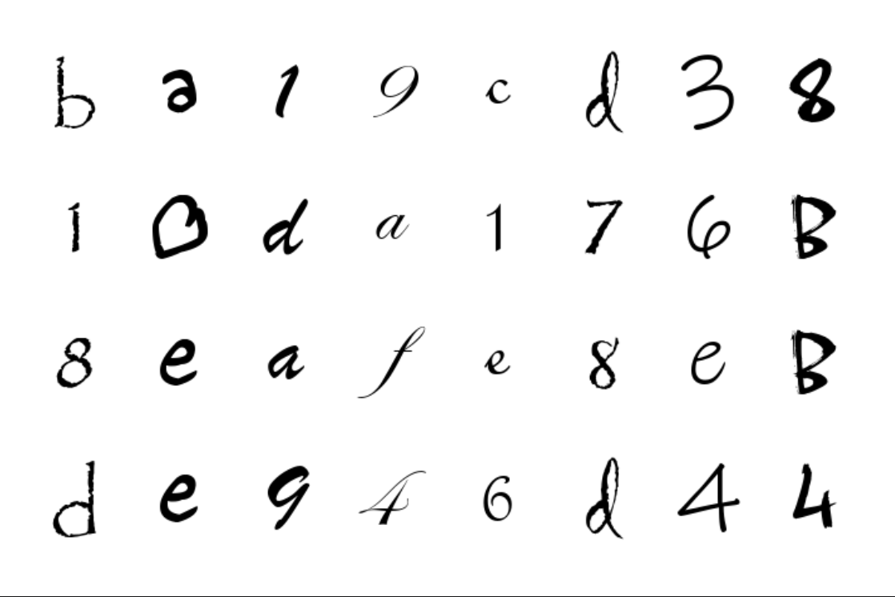
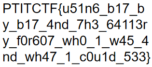

# PTITCTF 2026

## 3. Crypto - ShopBroken CDN

### Mô tả bài

Đề bài cung cấp một file `public.zip` và một instance web tên **ShopBroken CDN**. Theo mô tả, CDN của shop bị lỗi làm mất các ảnh mô tả sản phẩm gốc. Trong lúc chờ khôi phục, admin cho từng bộ phận upload tạm các ảnh còn sót lại vào thư mục riêng.

Hướng giải chính:

1. Lợi dụng AES-CBC bit flipping để sửa session cookie từ `role=guest` thành `role=admin`.
2. Vào `/admin` để lấy AES key và thứ tự ghép ảnh.
3. Dùng cookie đã forge cho từng department, tải toàn bộ ảnh hex.
4. OCR các chữ số hex trong ảnh, nối thành encrypted stream rồi AES-CBC decrypt ra ảnh chứa flag.

### Phân tích và khai thác

Khi truy cập instance nó trả về 1 trang web có trang đăng kí và đăng nhập



Ở đây có mô tả là có demo account là `demo:demo and guest:guest` 

Trong `app.py`, server tạo session cookie bằng AES-CBC:

```python
def build_plaintext(user, role):
    return (
        "brand=ShopBroken"
        ";role=" + role +
        ";uid=1001;exp=" + TOKEN_EXP +
        ";u=" + user
    ).encode()


def seal(user, role):
    iv = os.urandom(16)
    ct = AES.new(SESSION_KEY, AES.MODE_CBC, iv).encrypt(
        pad(build_plaintext(user, role), 16)
    )
    return b64encode(iv + ct).decode()
```

Cookie có dạng:

```text
base64(IV || ciphertext)
```

Khi nhận cookie, server chỉ decrypt, unpad rồi parse các trường phân tách bằng dấu `;`:

```python
def parse_fields(data):
    fields = {}
    for seg in data.split(b";"):
        if b"=" not in seg:
            continue
        k, v = seg.split(b"=", 1)
        fields[k.decode("latin-1")] = v.decode("latin-1")
    return fields
```

Điểm yếu nằm ở chỗ ciphertext không có MAC hoặc tag xác thực. Server tin hoàn toàn vào plaintext sau khi decrypt, nên AES-CBC bị malleable: ta không cần biết key vẫn có thể sửa một phần plaintext bằng cách sửa block ciphertext đứng trước nó.

Với tài khoản `demo`, plaintext trước khi mã hóa là:

```text
brand=ShopBroken;role=guest;uid=1001;exp=1798675200;u=demo
```

Chuỗi `brand=ShopBroken` dài đúng 16 byte, nên block thứ hai bắt đầu bằng:

```text
;role=guest;uid=
```

Trong AES-CBC:

$$
P_i = D(C_i) \oplus C_{i-1}
$$

Do đó muốn sửa plaintext block `P_i`, ta XOR vào ciphertext block `C_{i-1}`. Chuỗi `guest` bắt đầu tại offset 22 tính từ đầu `IV || ciphertext`, nên chỉ cần XOR:

```text
guest ^ admin
```

vào `blob[22:27]`.

Script forge cookie:

```python
import base64

def forge(token, role):
    b = bytearray(token)
    for i, (old, new) in enumerate(zip(b"guest", role.encode())):
        b[22 + i] ^= old ^ new
    return base64.b64encode(b).decode()

guest_token = input("Guest token: ").strip()
new_token = forge( base64.b64decode(guest_token), "<department>",)
print(new_token)
```

Việc sửa ciphertext block trước đó làm block plaintext đầu tiên bị hỏng. Tuy nhiên `parse_fields()` bỏ qua mọi đoạn không có dấu `=`, còn `role=admin` ở block sau vẫn được đọc bình thường. Đây là lý do cookie forge vẫn hợp lệ.

Các role hợp lệ đều dài 5 ký tự:

```text
guest, sales, stock, cargo, helpd, audit, admin
```

Vì vậy cùng một hàm `forge()` có thể dùng để truy cập từng folder ảnh của từng bộ phận.



Sau khi đăng nhập `demo:demo`, forge cookie thành `role=admin` rồi request `/admin`. Trang admin trả về:



Từ đây ta biết cách dựng lại encrypted stream:

1. Duyệt department theo thứ tự `guest -> sales -> stock -> cargo -> helpd -> audit -> admin`.
2. Với mỗi department, vào `/products` bằng cookie role tương ứng.
3. Tải ảnh theo đúng thứ tự hiển thị trên trang.
4. Mỗi ảnh đọc 32 ký tự hex, tương ứng 16 byte.
5. Nối tất cả lại thành `IV || ciphertext`.

Vì vậy tổng cộng có:

```text
7 department * 156 ảnh = 1092 ảnh
1092 ảnh * 16 byte = 17472 byte stream
```



Mỗi ảnh là một bảng `4 x 8`, chứa 32 chữ số hex được render bằng font viết tay. Các font và kích thước khác nhau khiến OCR thông thường không ổn định.

mình quan sát là cùng một cặp `(ký tự, font, size)` sẽ render ra bitmap giống nhau. Vì vậy không cần nhận dạng từng ảnh bằng OCR engine, ta có thể gom cụm các glyph:

1. Chuyển ảnh sang grayscale rồi threshold để lấy vùng mực.
2. Dùng projection theo trục ngang để tách 4 hàng.
3. Trong mỗi hàng, dùng projection theo trục dọc để tách 8 glyph.
4. Chuẩn hóa mỗi glyph về ảnh `28 x 28`.
5. Chạy k-means với `K = 320` trên toàn bộ glyph.
6. Gán nhãn mỗi cluster thành một ký tự hex.

Tổng số glyph là:

```text
1092 * 32 = 34944 glyph
```

**Script giải**

```python
import base64
import collections
import glob
import hashlib
import http.cookiejar
import os
import re
import struct
import sys
import urllib.parse
import urllib.request
import zlib

import numpy as np
from Crypto.Cipher import AES
from PIL import Image

HOST = sys.argv[1] if len(sys.argv) > 1 else "144.79.188.39:41787"
BASE = "http://%s" % HOST
IMGDIR = "imgs"
DEPTS = ["guest", "sales", "stock", "cargo", "helpd", "audit", "admin"]

LABELS = (
    "5d6b4deb2b0c749c0fa45946c4e705a6d152b4d13200158ca63a33daee873ceae71cf88a975c6e24"
    "10a86ce0c25b5e91f92f810e7319495bf2b7f8db6782c9beaa9ce63ab24d9e962efd65d1ac06e314"
    "edc4e6faa08236ec6c3827611c768c23ce987bb0ad8a7054b1cde1e29cdccaee635b333c81bd62e1"
    "a94be69dc44f059dbacda522ce4aea0f2d6a3fcf9a31a02f96cb6482853e325ee2f7d74b5c5ec259"
)


def login():
    jar = http.cookiejar.CookieJar()
    op = urllib.request.build_opener(urllib.request.HTTPCookieProcessor(jar))
    body = urllib.parse.urlencode({"username": "demo", "password": "demo"}).encode()
    op.open(BASE + "/login", data=body, timeout=20).read()
    for c in jar:
        if c.name == "session":
            return base64.b64decode(c.value)
    raise SystemExit("no session cookie")


def forge(token, role):
    b = bytearray(token)
    for i, (old, new) in enumerate(zip(b"guest", role.encode())):
        b[22 + i] ^= old ^ new
    return base64.b64encode(b).decode()


def get(path, token, role):
    req = urllib.request.Request(BASE + path)
    req.add_header("Cookie", "session=" + forge(token, role))
    return urllib.request.urlopen(req, timeout=30).read()


def runs(mask):
    d = np.diff(np.r_[0, mask.astype(int), 0])
    return list(zip(np.flatnonzero(d == 1), np.flatnonzero(d == -1)))


def glyphs(path):
    ink = np.array(Image.open(path).convert("L")) < 160
    rows = runs(ink.any(axis=1))
    assert len(rows) == 4, path

    out = []
    for r0, r1 in rows:
        band = ink[r0:r1]
        slots = {}
        for c0, c1 in runs(band.any(axis=0)):
            slot = min(7, int(((c0 + c1) / 2) // 90))
            slots.setdefault(slot, []).append((c0, c1))
        assert len(slots) == 8, path

        for s in range(8):
            c0 = min(x[0] for x in slots[s])
            c1 = max(x[1] for x in slots[s])
            g = band[:, c0:c1]
            ys = np.flatnonzero(g.any(axis=1))
            out.append(g[ys.min():ys.max() + 1])
    return out


def norm(g, n=28):
    im = Image.fromarray((g * 255).astype(np.uint8))
    h, w = g.shape
    scale = (n - 4) / max(h, w)
    im = im.resize((max(1, round(w * scale)), max(1, round(h * scale))), Image.BILINEAR)

    out = Image.new("L", (n, n), 0)
    out.paste(im, ((n - im.width) // 2, (n - im.height) // 2))
    return np.asarray(out, dtype=np.float32) / 255.0


def kmeans(X, K=320, seed=1, iters=80):
    rng = np.random.default_rng(seed)
    Xn = (X * X).sum(1)

    idx = [int(rng.integers(len(X)))]
    d2 = np.maximum(Xn - 2 * X @ X[idx[0]] + Xn[idx[0]], 0)
    for _ in range(K - 1):
        i = int(rng.choice(len(X), p=d2 / d2.sum()))
        idx.append(i)
        d2 = np.minimum(d2, np.maximum(Xn - 2 * X @ X[i] + Xn[i], 0))

    C = X[idx].copy()
    for _ in range(iters):
        lab = (Xn[:, None] - 2 * X @ C.T + (C * C).sum(1)).argmin(1)
        nC = C.copy()
        for k in range(K):
            m = lab == k
            if m.any():
                nC[k] = X[m].mean(0)
        if np.abs(nC - C).max() < 1e-5:
            C = nC
            break
        C = nC

    return (Xn[:, None] - 2 * X @ C.T + (C * C).sum(1)).argmin(1)


def collect_images():
    os.makedirs(IMGDIR, exist_ok=True)

    token = login()
    notes = get("/admin", token, "admin").decode()
    key = bytes.fromhex(re.search(r"\b([0-9a-f]{32})\b", notes).group(1))
    print("[+] recovery key from /admin:", key.hex())

    seq = []
    for dept in DEPTS:
        html = get("/products", token, dept).decode()
        paths = re.findall(r' %d clusters" % (len(X), lab.max() + 1))

    per = collections.defaultdict(dict)
    for (p, i), k in zip(meta, lab):
        per[p][i] = LABELS[k]

    stream_hex = "".join("".join(per[p][i] for i in range(32)) for p in seq)
    stream = bytes.fromhex(stream_hex)

    all_hex = "".join("%02x" % b for b in stream)
    cnt = collections.Counter(all_hex)
    exp = len(all_hex) / 16
    sigma = (len(all_hex) * (1 / 16) * (15 / 16)) ** 0.5
    worst = max(abs(cnt[c] - exp) for c in "0123456789abcdef")
    print("[+] hex frequency: worst deviation %.0f (1 sigma = %.0f)" % (worst, sigma))

    pt = AES.new(key, AES.MODE_CBC, stream[:16]).decrypt(stream[16:])

    assert pt[:8] == b"\x89PNG\r\n\x1a\n"
    assert pt[87:91] == b"IDAT"
    ln = struct.unpack(">I", pt[83:87])[0]
    crc = struct.unpack(">I", pt[91 + ln:95 + ln])[0]
    assert crc == zlib.crc32(pt[87:91 + ln]), "IDAT CRC32 mismatch"

    raw = zlib.decompress(pt[91:91 + ln])
    w, h = struct.unpack(">II", pt[16:24])
    assert len(raw) == h * (1 + w * 4)
    print("[+] IDAT CRC32 ok, zlib -> %d bytes, image %dx%d RGBA" % (len(raw), w, h))

    png = pt[:pt.find(b"IEND") + 8]
    open("master.png", "wb").write(png)
    print("[+] flag rendered in master.png (sha256 %s)" % hashlib.sha256(png).hexdigest()[:16])


if __name__ == "__main__":
    main()
```

Output:

```text
[+] recovery key from /admin: 4f7a9c2d1e8b6a0f4c3d2b1a9e8f7650
[+] 1092 images = 17472 bytes of stream
[+] 34944 glyphs -> 320 clusters
[+] hex frequency: worst deviation 52 (1 sigma = 45)
[+] IDAT CRC32 ok, zlib -> 175279 bytes, image 315x139 RGBA
[+] flag rendered in master.png (sha256 9b8bfe60af20dfdf)
```

File `master.png` sau khi decrypt hiển thị flag.



**Flag:**

```text
PTITCTF{u51n6_b17_by_b17_4nd_7h3_64113ry_f0r607_wh0_1_w45_4nd_wh47_1_c0u1d_533}
```
