# PTITCTF 2026

## Mission Impossible 9

### Mô tả bài

Challenge cung cấp một file thực thi Windows:

```text
Emberbound.recovered.exe
```

Khi chạy chương trình, đây là một trò chơi nhỏ. Người chơi di chuyển bằng các phím mũi tên và dùng phím `X` để tấn công quái/boss.

Trong quá trình chơi, game có 3 màn. Màn thứ 3 là màn boss:

```text
03 / THE HOLLOW REGENT
```

Theo hướng đi của bài, một mảnh flag sẽ được sinh ra sau khi đạt tới trạng thái liên quan đến màn boss. Mục tiêu của phần này là tìm mảnh flag đó.

---

### Phân tích ban đầu

Trước tiên, kiểm tra file bằng **Detect It Easy (DIE)**.

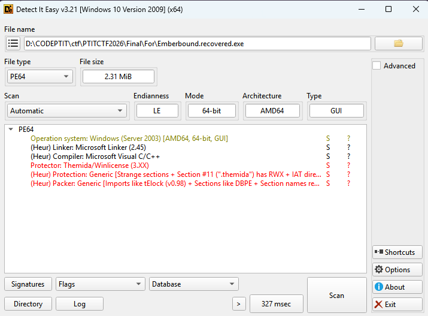


Kết quả cho thấy đây là file PE Windows 64-bit và có dấu hiệu bị protect/pack bằng Themida hoặc WinLicense. Các dấu hiệu đáng chú ý là các section và chuỗi liên quan đến Themida/WinLicense, ví dụ:

```text
.themida
.boot
WinLicense
Themida
```


Từ đây có thể rút ra nhận xét quan trọng:

> File gốc bị pack, chương trình được bảo vệ, logic chính chỉ xuất hiện sau khi được giải mã trong quá trình thực thi.

---

### Dump module đã unpack bằng PE-sieve
Mình sẽ khởi động file exe, sau đó vào cmd dùng câu lệnh

`tasklist | findstr /i "Emberbound"`

Để tìm PID của `Emberbound.recovered.exe`

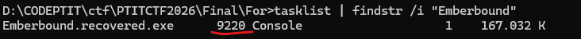

Sau khi có PID, chạy PE-sieve:

`"C:\Users\84978\Downloads\pe-sieve64.exe" /pid 9220 /dir dump`

Để lấy file exe đã được unpack :


---
### Tìm cross-reference đến chuỗi màn thắng

Mình sẽ đưa file exe sau khi unpack vào IDA để phân tích:

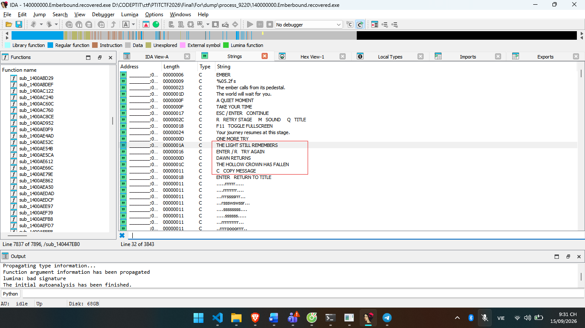

Ta thấy có một số chuỗi đáng chú ý như :
```
THE HOLLOW CROWN HAS FALLEN 
COPY MESSAGE 
THE LIGHT STILL REMEMBERS
```
Thử Xrefs vào chuỗi `THE HOLLOW CROWN HAS FALLEN` bởi vì chuỗi này có vẻ liên quan tới cách để thắng trò chơi này. Kết quả là hàm `sub_1400EDCC0` chứa chuỗi trên.

Ban đầu chưa thể kết luận chức năng của hàm này, ta sẽ phân tích từ trên xuống dưới :

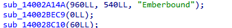

Đọc sơ qua hàm `sub_14002A14A` nhận ba tham số gồm chiều rộng, chiều cao và tiêu đề cửa sổ. Mình xác định đây là hàm khởi tạo cửa sổ game.

Hàm `sub_140028C10` nhận tham số FPS mục tiêu. Bên trong hàm, chương trình tính `1.0 / FPS` rồi lưu vào biến `global qword_140156388`. Sau đó hàm log ra `“TIMER: Target time per frame”`. Với lời gọi `sub_140028C10(60)`, chương trình đặt thời gian mỗi frame là khoảng 16.667 ms, tương ứng 60 FPS.

Quan sát vòng lặp trong Label9 ta thấy :
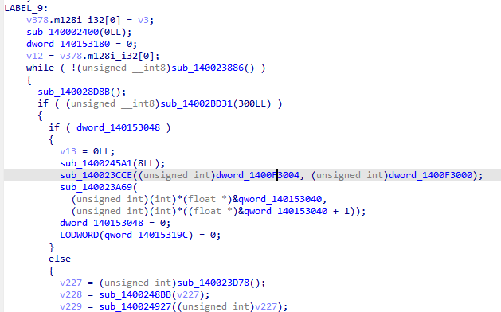

Đoạn này rất giống game loop, kiểu :
```
while (!WindowShouldClose()) 
{
    Update(); 
    Draw(); 
}
```

dword_140153180 được dùng trong switch, nên có thể xem đây là biến trạng thái chính của game.

Phân tích sơ qua có thể coi `sub_1400EDCC0` là `main` của bài này.

---
### Phân tích nhánh state 4

Trong switch (dword_140153180), mình chú ý đến case 4 vì đây có thể là trạng thái màn thắng. Đoạn code quan trọng:

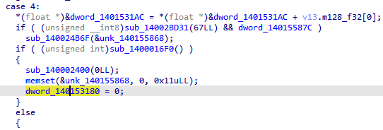

Ở đây có hai điểm rất quan trọng.

Thứ nhất:

`67 decimal = 0x43 = 'C'`

Tức là khi người chơi nhấn phím C, chương trình gọi:

`sub_140024B6F(&unk_140155868);`

Kết hợp với chuỗi hiển thị vừa tìm được ở trên:

`C   COPY MESSAGE`

có thể suy ra `sub_140024B6F` là hàm copy message vào clipboard, còn `unk_140155868` là buffer chứa message.

Thứ hai, khi thoát về title hoặc reset trạng thái, chương trình gọi:

`memset(&unk_140155868, 0, 0x11uLL);`

Kích thước 0x11 tương ứng với:

`16 byte message + 1 byte null terminator`

Điều này cho thấy message ẩn có khả năng dài 16 ký tự.

Từ đây, mình xác định mục tiêu phân tích tiếp theo là tìm nơi ghi dữ liệu vào `unk_140155868.`

---

### Xác nhận buffer message được hiển thị trên màn thắng

Tiếp tục xem đoạn code hiển thị màn thắng, mình chú ý:

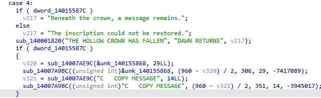

Đoạn này xác nhận unk_140155868 không phải biến phụ ngẫu nhiên. Nó được dùng để:

- Tính độ dài message
- Vẽ message lên màn hình
- Copy message khi nhấn C

Do đó unk_140155868 chính là buffer chứa mảnh flag cần tìm.

---

### Tìm nơi ghi vào unk_140155868

xref đến `unk_140155868`, ta được đoạn assembly :


Ở đoạn này, chương trình gọi `sub_1400049B0` trước, kết quả trả về nằm trong `RAX`. Sau đó `RAX` được chuyển vào `RCX`, tức làm tham số thứ nhất cho `sub_140004A90`. Đồng thời địa chỉ `unk_140155868` được truyền vào `RDX`, tức tham số thứ hai. Ngay sau khi gọi `sub_140004A90`, chương trình set `dword_140153180 = 4`.

Ở phần trước, `dword_140153180 == 4` đã được xác định là state màn thắng. Vì vậy có thể kết luận `sub_140004A90` là hàm sinh message vào buffer `unk_140155868` trước khi game chuyển sang màn thắng.

---

### Phân tích hàm sinh message

Phân tích hàm `sub_140004A90`:

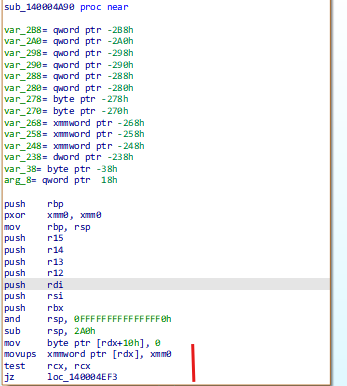

Nhảy sang nhánh fail :

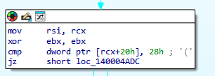

Hàm `sub_140004A90` nhận context và output buffer. Đầu hàm, chương trình xóa buffer output, đặt byte kết thúc chuỗi ở vị trí `a2 + 0x10`, rồi kiểm tra context. Hàm chỉ tiếp tục sinh message nếu context tồn tại và counter tại `[context + 0x20]` bằng `0x28`, tức 40. Nếu không thỏa điều kiện này, hàm thoát và không tạo message.

---

### Tìm dữ liệu dùng để tạo context

Từ luồng sử dụng context, mình tiếp tục lần theo các hàm khởi tạo/cập nhật context và tìm được một đoạn khởi tạo quanh địa chỉ `0x140006440`.

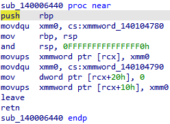

Từ đây xác định:

- 16 byte đầu của context lấy từ 0x140104780.
- 16 byte tiếp theo lấy từ 0x140104790.
- Counter tại [context + 0x20] được đặt bằng 0.

---

### Tìm cách update context

Tiếp tục phân tích hàm update context, mình thấy đoạn:

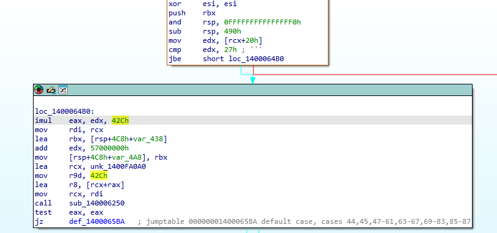

Đoạn code quanh `0x140006470` cho thấy mỗi lần update, chương trình dùng counter hiện tại để chọn một packet dài `0x42c` byte từ bảng bắt đầu tại `0x1400FA0A0`, sau đó gọi `sub_140006250` để cập nhật context. Counter chạy từ `0` đến `0x27`, nên solver phải mô phỏng đúng 40 lần update trước khi gọi logic sinh message.

---

### Giải blob cuối để lấy bytecode

Giải blob cuối để lấy bytecode :

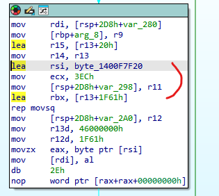

Đoạn này cho thấy `sub_140004A90` lấy blob mã hóa tại `0x1400F7F20` rồi giải liên tiếp 8 lớp. Số lớp được suy ra từ việc kích thước giảm từ `0x1F61` xuống `0x1D01`, mỗi vòng giảm `0x4c` byte.

---

### VM sinh output cuối

Sau khi checksum hợp lệ, chương trình chạy một VM nhỏ để sinh message.


Ta nhận ra đây là  một VM vì chương trình dùng một biến làm PC bắt đầu từ 0x325, mỗi vòng đọc 5 byte gồm 1 byte opcode và 4 byte immediate đã mã hóa, sau đó dùng opcode để nhảy tới handler tương ứng qua jump table. 

---

### Kết luận

Sau khi phân tích và hiểu được thuật toán sinh message của chương trình, mình tiến hành viết script Python để mô phỏng lại toàn bộ quá trình xử lý thay vì chạy game thủ công. 
Cụ thể, script sẽ khởi tạo context ban đầu, cập nhật context đủ 40 lần, giải blob mã hóa qua 8 lớp, kiểm tra checksum và cuối cùng mô phỏng VM để lấy ra message được ghi vào buffer hiển thị.

[Click để mở file script.py](./solve_emberbound.py)

Kết quả sau khi chạy :


Vậy mảnh reverse là `_th3_r13l_h4ck3r`
