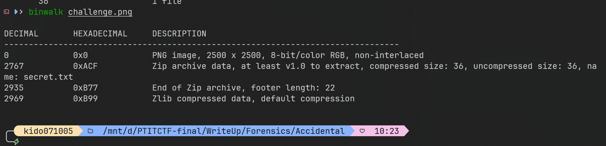
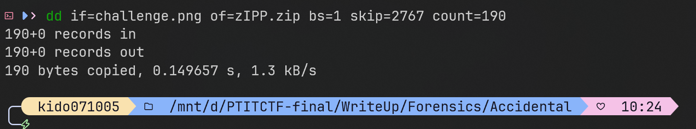
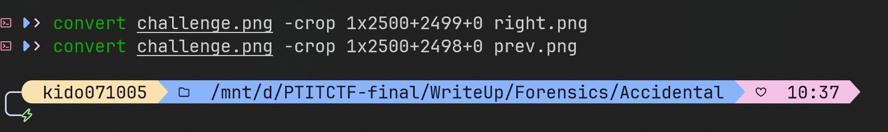
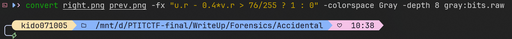
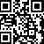
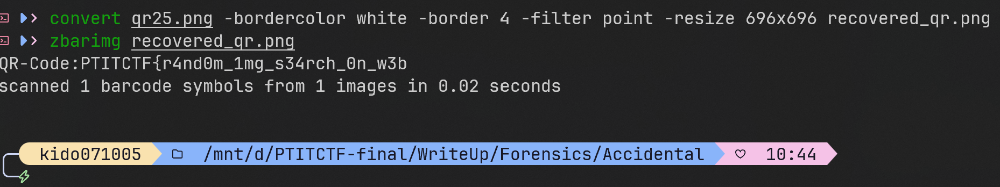
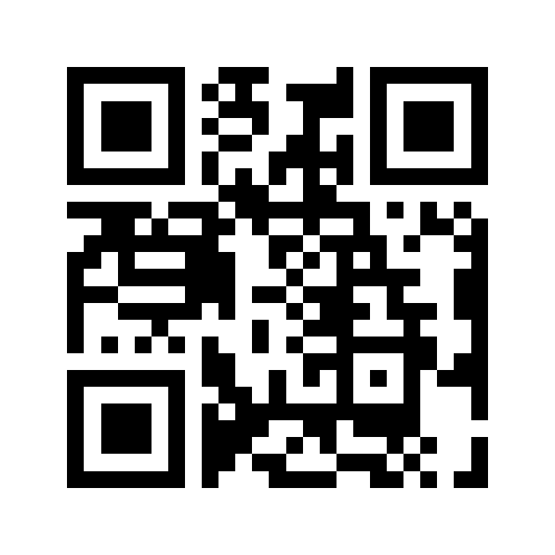

# PTITCTF 2026

## Forensics - Accidental

### Mô tả

Đề cho một file `challenge.png`. Mở lên thì ảnh trông khá bình thường, nhưng đúng kiểu bài forensics: dữ liệu không nằm ở thứ mình nhìn thấy đầu tiên, mà bị nhét vào cả cấu trúc PNG lẫn pixel ở mép ảnh.

Sau khi tách ra, flag gồm hai mảnh. Mảnh đầu nằm trong một QR code bị giấu ở cột pixel ngoài cùng bên phải. Mảnh sau nằm trong một file ZIP được nhúng vào custom chunk `zIPP` của PNG.

### Phân tích

Mình bắt đầu bằng `binwalk` để xem trong ảnh có dữ liệu nào bị nhúng thêm không:



Như vậy trong PNG có một file ZIP bắt đầu tại offset `2767`. Phần end record nằm ở `2935` và footer dài `22` byte, nên kích thước ZIP cần cắt ra là:

```text
2935 + 22 - 2767 = 190 bytes
```

Vì đã biết chính xác offset và kích thước, mình carve thẳng đoạn ZIP ra ngoài:



File `secret.txt` trong file ZIP đó sẽ trả về:

```text
_15_th3_fl4g_y0u_n337_eb8c93af538f9}
```

Nhưng đây chỉ là phần sau của flag. Sau đó mình chuyển sang soi phần pixel ở mép ảnh. Mình để ý cột ngoài cùng bên phải có thể không phải dữ liệu ảnh bình thường, nên mình dùng ImageMagick 6 cắt nó ra cùng với cột ngay trước đó để so sánh.

Mình cắt riêng cột cuối và cột ngay trước nó ra để so sánh. Ảnh rộng `2500` pixel nên cột cuối có tọa độ x là `2499`, cột trước đó là `2498`:



Nếu gọi kênh đỏ của cột cuối là `E`, cột ngay trước nó là `P`, thì phép trừ sau tách tín hiệu ra rất rõ:

```text
S = E - 0.4 * P
```

Để kiểm tra giả thuyết này, mình thử threshold trực tiếp và xem histogram:



Kết quả chỉ còn hai màu đen và trắng, tức là dữ liệu sau khi trừ nền tách thành bit rất sạch:

```text
1360: (0,0,0)
1140: (255,255,255)
```

Vì vậy mình lấy ngưỡng `76`, giá trị lớn hơn ngưỡng là bit `1`, còn lại là bit `0`. Trong ImageMagick, giá trị màu được chuẩn hóa về khoảng `0..1`, nên ngưỡng `76` được viết thành `76/255`:

```bash
convert right.png prev.png -fx "u.r - 0.4*v.r > 76/255 ? 1 : 0" -colorspace Gray -depth 8 gray:bits.raw
```

Ảnh cao `2500` pixel, vừa khít để đưa về ma trận `50 x 50`:

```bash
convert -size 50x50 -depth 8 gray:bits.raw bits50.png
```



Tới đây thật ra phóng ảnh `bits50.png` lên rồi quét cũng đã ra được mảnh đầu của flag:

```text
PTITCTF{r4nd0m_1mg_s34rch_0n_w3b
```

Nhưng mình vẫn xử lý tiếp để QR nhìn sạch hơn và có thể decode lại bằng tool. Lấy mẫu cách 2 dòng và 2 cột sẽ thu được ma trận `25 x 25`, đúng kích thước của QR:

```bash
convert -size 25x25 xc:black bits50.png -fx "v.p{2*i,2*j}" qr25.png
```

Cuối cùng thêm viền trắng cho QR và phóng to bằng nearest-neighbor:



QR thu được:



Nội dung QR là:

```text
PTITCTF{r4nd0m_1mg_s34rch_0n_w3b
```

**Flag**

```text
PTITCTF{r4nd0m_1mg_s34rch_0n_w3b_15_th3_fl4g_y0u_n337_eb8c93af538f9}
```
