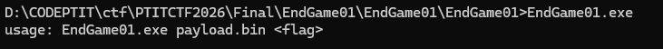
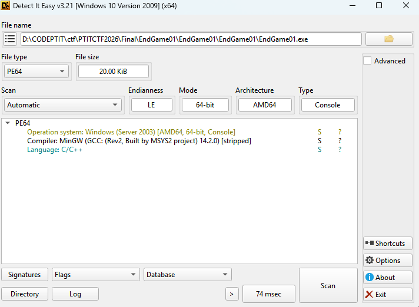
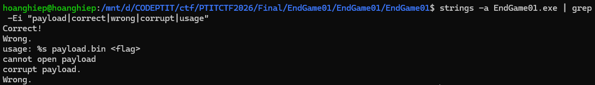
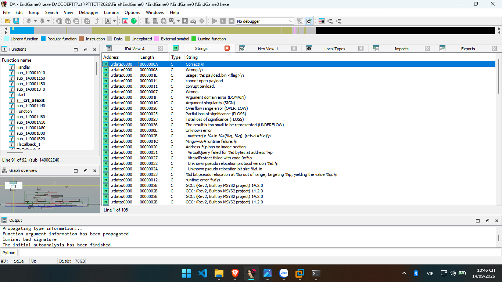
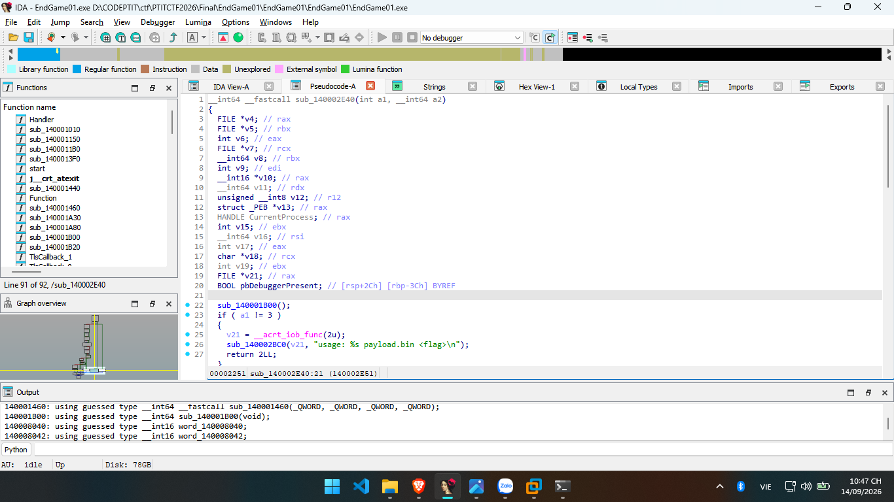
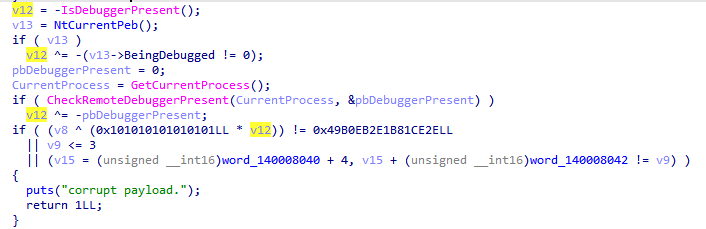
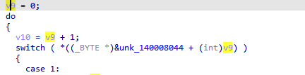
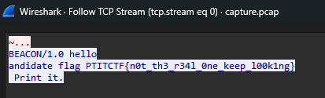
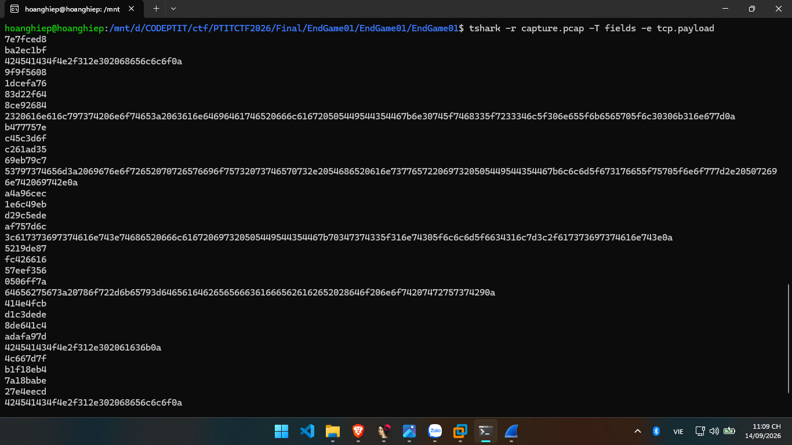
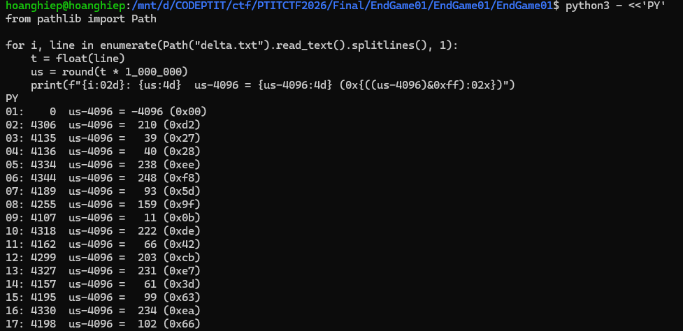

# PTITCTF 2026

## Reverse - EndGame01

### Mô tả bài

Challenge cung cấp một binary Windows `EndGame01.exe` và một file bắt gói mạng `capture.pcap`. Khi chạy binary, chương trình yêu cầu truyền vào hai tham số:




Tuy nhiên trong thư mục ban đầu chỉ có file `.exe` và `.pcap`, không có sẵn `payload.bin`. Vì vậy hướng làm ban đầu là phải phân tích cả binary và PCAP để hiểu chương trình cần loại payload nào, sau đó khôi phục dữ liệu kiểm tra flag.

Mục tiêu là tìm chuỗi flag hợp lệ để chương trình in ra chuỗi tương tự như :

```text
Correct!
```

### Phân tích

Trước tiên, kiểm tra nhanh binary bằng DIE hoặc Detect It Easy.




Tiếp theo dùng `strings` để lọc các chuỗi đáng chú ý trong binary:

```bash
strings -a EndGame01.exe | grep -Ei "payload|correct|wrong|corrupt|usage"
```

Kết quả đáng chú ý:




Các chuỗi này cho thấy chương trình không chỉ kiểm tra flag trực tiếp, mà còn cần một file `payload.bin`. Do challenge chỉ cung cấp PCAP đi kèm, mình đặt giả thuyết rằng `payload.bin` phải được khôi phục từ lưu lượng mạng.




Mở `EndGame01.exe` bằng IDA, tìm xref tới chuỗi `usage: %s payload.bin <flag>` hoặc `corrupt payload.` sẽ lần được về hàm chính. 




Hàm chính có logic rút gọn như sau:

```c
if (argc != 3) {
    fprintf(stderr, "usage: %s payload.bin <flag>\n");
    return 2;
}

fp = fopen(argv[1], "rb");
if (!fp) {
    puts("cannot open payload");
    return 2;
}

size = fread(&word_140008040, 1, 0x10000, fp);
fclose(fp);

h = 0xcbf29ce484222325;
for (i = 0; i < size; i++) {
    h = (h ^ payload[i]) * 0x100000001b3;
}

if (h != 0x49b0eb2e1b81ce2e || size <= 3)
    fail;

code_len = *(uint16_t *)&payload[0];
data_len = *(uint16_t *)&payload[2];

if (4 + code_len + data_len != size)
    fail;

if (strlen(argv[2]) != 44)
    fail;

if (memcmp(argv[2], "PTITCTF{", 8) != 0)
    fail;

if (argv[2][43] != '}')
    fail;

result = vm_interpreter(code_len, payload + 4, data_len, argv[2] + 8);
```

Từ đây rút ra được format payload:

```text
uint16 code_len
uint16 data_len
byte   bytecode[code_len]
byte   data[data_len]
```

Đồng thời format flag cũng được xác định:

```text
PTITCTF{...................................}
```

Tổng độ dài flag là `44`, trong đó phần bên trong dấu `{}` dài `35` ký tự.


Trong `main` còn có một đoạn anti-debug:




Đoạn này làm thay đổi giá trị hash nếu chạy dưới debugger. Khi phân tích tĩnh hoặc chạy bình thường không debug, `v12 = 0`, nên payload đúng phải có FNV-1a bằng:

```text
0x49b0eb2e1b81ce2e
```

Tiếp tục vào hàm `sub_140001460`:




Có thể thấy đây là một VM dạng stack-based. VM sử dụng một stack DWORD và một mảng register nhỏ. Các opcode chính:

| Opcode | Ý nghĩa |
|---|---|
| `0x01` | push immediate 32-bit |
| `0x02` | pop |
| `0x03` | dup |
| `0x04` | swap |
| `0x05` | add |
| `0x06` | sub |
| `0x07` | mul |
| `0x08` | xor |
| `0x09` | and |
| `0x0a` | or |
| `0x0b` | shl |
| `0x0c` | shr |
| `0x0d` | rol |
| `0x0e` | load flag byte theo index |
| `0x0f` | load data byte theo index |
| `0x10` | so sánh bằng |
| `0x11` | jump nếu false |
| `0x12` | jump |
| `0x13` | load register |
| `0x14` | store register |
| `0x15` | return |
| `0x16` | assert/fail flag |
| `0x17` | push hằng `35` |
| `0x18` | so sánh nhỏ hơn |

Điểm quan trọng là opcode `0x0e` đọc từng byte trong phần `flag + 8`, tức chỉ kiểm tra 35 ký tự nằm bên trong `PTITCTF{...}`.


Sau khi hiểu format payload, mình chuyển sang phân tích `capture.pcap`. Dùng `wireshark` để trích TCP payload:




Các chuỗi này không được sử dụng làm flag vì chính nội dung của chúng thể hiện đây là decoy hoặc prompt injection. Nếu lấy các chuỗi này để submit thì sẽ sai.


Các packet nhị phân từ client có dạng các đoạn 4 byte, đoạn cuối 1 byte. 




Ghép các đoạn này lại thu được ciphertext dài đúng `113` byte:

```text
7e7fced8ba2ec1bf9f9f56081dcefa7683d22f648ce92684
b477757ec45c3d6fc261ad3569eb79c7a4a96cec1e6c49eb
d29c5edeaf757d6c5219de87fc42661657eef3560506ff7a
414e4fcbd1c3dede8de641c4adafa97d4c667d7fb1f18eb4
7a18babe27e4eecdf56d09299f28e686d7
```

Tuy nhiên, nếu xem trực tiếp byte đầu là `0x7e` thì không khớp opcode VM, vì VM chỉ nhận opcode trong khoảng `0x01..0x18`. Do đó ciphertext này chưa phải payload thật.




Quan sát delta time của các packet nhị phân từ client, bỏ packet đầu tiên vì delta bằng `0`. Với 16 delta tiếp theo, khi đổi sang microsecond và trừ đi `4096`, thu được 16 byte dùng làm key:


```text
d2 27 28 ee f8 5d 9f 0b de 42 cb e7 3d 63 ea 66
```

Trong EXE mình không thấy SHA256 hay API mã hóa được import. Vì vậy quá trình giải mã dữ liệu trong PCAP được xử lý ở ngoài bằng thực nghiệm. Sau khi lấy được 16 byte từ timing, mình thử sinh keystream theo dạng hash-counter. Phương pháp `SHA256(key || counter_le32)` cho ra một payload hợp lệ:

Trong đó `counter` bắt đầu từ `0`, tăng thêm `1` sau mỗi block 32 byte.

Script kiểm tra:

```python
import hashlib
import struct

ct = bytes.fromhex(
    "7e7fced8ba2ec1bf9f9f56081dcefa7683d22f648ce92684"
    "b477757ec45c3d6fc261ad3569eb79c7a4a96cec1e6c49eb"
    "d29c5edeaf757d6c5219de87fc42661657eef3560506ff7a"
    "414e4fcbd1c3dede8de641c4adafa97d4c667d7fb1f18eb4"
    "7a18babe27e4eecdf56d09299f28e686d7"
)

key = bytes.fromhex("d22728eef85d9f0bde42cbe73d63ea66")

def keystream(key, n):
    out = b""
    counter = 0
    while len(out) < n:
        out += hashlib.sha256(key + struct.pack("<I", counter)).digest()
        counter += 1
    return out[:n]

pt = bytes(c ^ k for c, k in zip(ct, keystream(key, len(ct))))
from pathlib import Path
Path("payload.bin").write_bytes(pt)
print("written payload.bin")

code_len = int.from_bytes(pt[0:2], "little")
data_len = int.from_bytes(pt[2:4], "little")

print("payload size =", len(pt))
print("code_len =", code_len)
print("data_len =", data_len)
print("check size =", 4 + code_len + data_len)
print("payload hex =", pt.hex())

# FNV-1a 64-bit, giống binary
h = 0xcbf29ce484222325
for b in pt:
    h ^= b
    h = (h * 0x100000001b3) & 0xffffffffffffffff

print(hex(h))
```

Kết quả:

```text
payload size = 113
code_len = 74
data_len = 35
check size = 113
0x49b0eb2e1b81ce2e
```

Điều này xác nhận payload đã được giải mã chính xác.


Sau khi tách payload:

```python
code = pt[4:4 + code_len]
data = pt[4 + code_len:]
```

Phần `data` dài 35 byte:

```text
aa 6e df 26 5d 28 8e dc 7a 59 18 35 be 50 ad 9d
17 bb 7e 43 72 16 a5 80 e0 15 bb d5 1d cf b9 ff
82 cd dd
```

Disassemble bytecode VM hoặc đọc theo hành vi VM, logic kiểm tra tương đương:

```c
state = 5381;

for (i = 0; i < 35; i++) {
    x = (state + flag[i]) * 0x9e3779b1;
    x ^= x >> 15;
    state = rol32(x, 7);

    if ((state & 0xff) != data[i])
        fail;
}
```

Do mỗi ký tự mới chỉ phụ thuộc vào `state` hiện tại và một byte `data[i]`, có thể giải tuần tự từng ký tự. Không cần brute-force toàn bộ flag, chỉ cần thử từng ký tự hợp lệ tại mỗi vị trí rồi cập nhật state.

Script solver:

```python
import string

MASK = 0xffffffff

data = bytes.fromhex(
    "aa6edf265d288edc7a591835be50ad9d"
    "17bb7e437216a580e015bbd51dcfb9ff"
    "82cddd"
)

alphabet = string.ascii_letters + string.digits + "_"


def rol32(x, r):
    x &= MASK
    return ((x << r) | (x >> (32 - r))) & MASK

state = 5381
ans = []

for i, want in enumerate(data):
    found = None
    for ch in alphabet:
        c = ord(ch)
        x = ((state + c) & MASK)
        x = (x * 0x9e3779b1) & MASK
        x ^= x >> 15
        x &= MASK
        ns = rol32(x, 7)

        if (ns & 0xff) == want:
            found = ch
            state = ns
            ans.append(ch)
            break

    if found is None:
        raise Exception(f"not found at index {i}")

inner = "".join(ans)
flag = "PTITCTF{" + inner + "}"
print(inner)
print(flag)
```

Kết quả phần trong dấu `{}`:

```text
th3_3ndg4m3_1s_0nly_f0r_th3_p4t13nt
```

Ghép với prefix/suffix:

```text
PTITCTF{th3_3ndg4m3_1s_0nly_f0r_th3_p4t13nt}
```


Cuối cùng, có thể kiểm tra lại bằng cách tạo `payload.bin` từ plaintext đã giải mã và chạy binary:

```bash
python3 solve_endgame01.py
wine EndGame01.exe payload.bin 'PTITCTF{th3_3ndg4m3_1s_0nly_f0r_th3_p4t13nt}'
```

Chương trình sẽ in:

```text
Correct!
```


### Flag

```text
PTITCTF{th3_3ndg4m3_1s_0nly_f0r_th3_p4t13nt}
```
