# PTITCTF 2026

## Reverse - Escape Maze

### Mô tả bài

Challenge cung cấp một file thực thi Windows `escape_maze.exe` cùng mô tả:

> Tên quản ngục nhốt bạn vào một mê cung và cười nhạo: “Ngươi chỉ được nhìn thấy những gì ở ngay trước mắt.” Hắn tin rằng bóng tối sẽ khiến mọi nỗ lực thoát ra trở nên vô vọng. Dường như Fải tính toán thật kỹ mới tìm thấy được ánh Sáng phía cuối con đường.
>
> Hãy di chuyển bằng các phím ASDW và rút gọn nó lại, đó chính là đáp án cần tìm.  
> Ví dụ: `AAAADDD -> A4D3`

Khi chạy chương trình, người chơi được đặt trong một mê cung tối và có thể di chuyển bằng bốn phím `W`, `A`, `S`, `D`.

Mục tiêu ban đầu là tìm được đường đi khiến chương trình báo:

```text
You win!
```

Sau đó chuỗi phím di chuyển phải được rút gọn để tạo thành flag.

---

### Phân tích

Trước tiên, kiểm tra nhanh binary bằng **Detect It Easy (DIE)**.

Mở:

```text
escape_maze.exe
```

Ta xác định đây là một file PE Windows. Binary không có phần nhập trực tiếp flag, vì vậy khả năng cao flag phải được tạo ra từ chính quá trình giải mê cung.

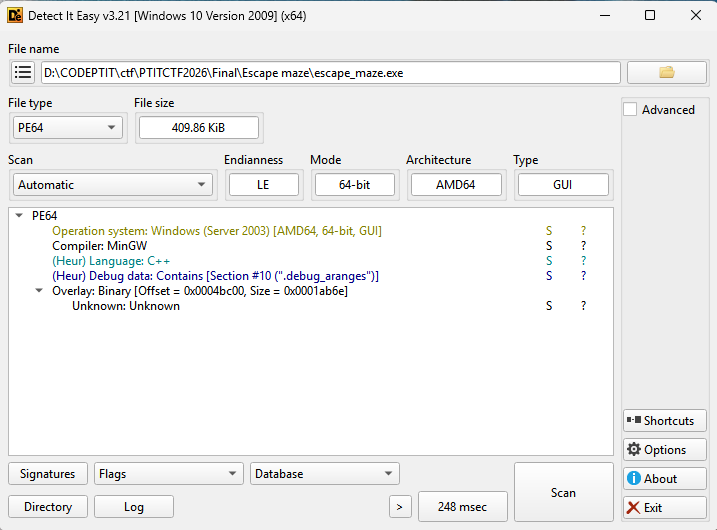


Tiếp theo mở binary trong IDA để kiểm tra các String đáng chú ý:

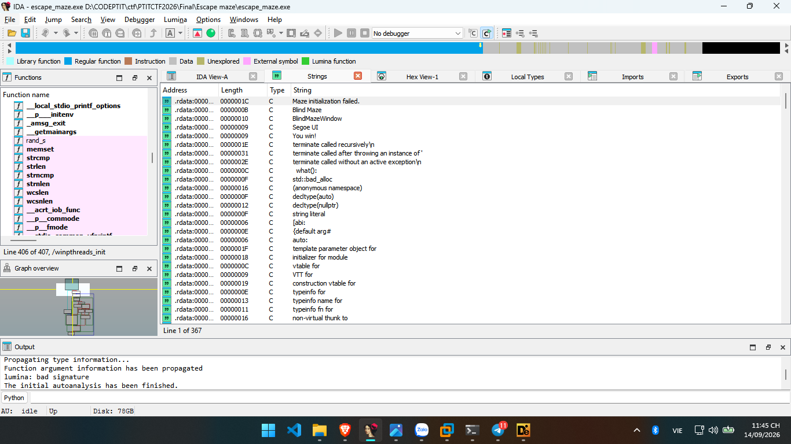

Phần lớn các chuỗi tìm thấy liên quan đến giao diện và hoạt động của game.

---
### Xác định cách di chuyển

Hàm quan trọng đầu tiên là:

```text
Game::try_move
```

Tham số a2 biểu diễn hướng di chuyển của người chơi. Với các giá trị hướng hợp lệ từ 0 đến 3, chương trình tra ba bảng `CSWTCH_31, CSWTCH_32 và CSWTCH_33` để lấy độ lệch tọa độ theo hai trục và bitmask tương ứng với cạnh cần đi qua.

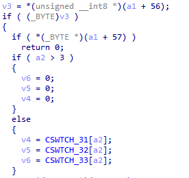

Sau khi xác định hướng, chương trình kiểm tra bước di chuyển có hợp lệ hay không.
Trước tiên, bitmask của ô hiện tại được kiểm tra để xác nhận có đường nối theo hướng muốn đi. Tọa độ mới được tính từ vị trí hiện tại cộng với độ lệch của hướng, sau đó tiếp tục kiểm tra giới hạn của mê cung và `kMazeWalkable` để đảm bảo ô đích là ô có thể đi vào.

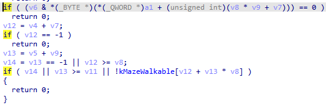

Nếu bước đi hợp lệ, chương trình cập nhật tọa độ hiện tại của người chơi bằng tọa độ mới v12, v13. Ngay sau đó, tọa độ này được so sánh với tọa độ của ô đích. Khi cả hai tọa độ trùng nhau, trạng thái chiến thắng được thiết lập và sau đó render_game() sẽ hiển thị thông báo You win!.

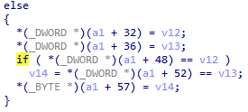


Từ logic trong hàm có thể xác định bốn phím được sử dụng như các hướng tuyệt đối:

```text
W -> lên
A -> trái
S -> xuống
D -> phải
```

Chương trình tính tọa độ mới, kiểm tra xem giữa hai ô có cạnh nối hợp lệ hay không, sau đó mới cập nhật vị trí của người chơi.

Như vậy đây không phải cơ chế kiểu first-person như:

```text
W = đi thẳng
A = quay trái
D = quay phải
```

mà mỗi phím tương ứng trực tiếp với một hướng trong mê cung.

---

### Xác định điểm bắt đầu và điểm kết thúc

Tiếp tục xem hàm Game::initialize().

Trong hàm `Game::initialize()`, sau khi `build_maze()` dựng mê cung thành công, chương trình nạp các thông số khởi tạo từ hai vùng dữ liệu `xmmword_14001C240` và `xmmword_14001C250` vào cấu trúc Game.

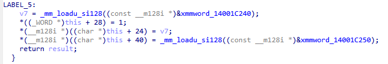

Sau khi tách thành các `DWORD 32-bit` thu được lần lượt `{21,21,9,0}` và `{9,0,11,20}`. Đối chiếu với cấu trúc Game, ta xác định mê cung có kích thước `21×21`, người chơi bắt đầu tại `(9,0)` và ô đích nằm tại `(11,20)`.

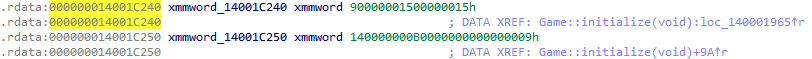


Điểm bắt đầu nằm ở cửa phía trên của mê cung, trong khi exit nằm ở cửa phía dưới.


---

### Dữ liệu mê cung trong binary

Hai vùng dữ liệu quan trọng là:

```text
kMazeWalkable
kMazeEdgeRecipe
```

`kMazeWalkable` cho biết ô nào trong lưới có thể đi được.

Kích thước mê cung được xác định từ các giá trị khởi tạo trong Game::initialize(), với width = 21 và height = 21. Đồng thời chương trình cấp phát 0x1B9 = 441 byte cho vùng dữ liệu mê cung, đúng bằng 21 × 21, xác nhận mỗi byte tương ứng với một ô trong lưới.


Trong khi đó `kMazeEdgeRecipe` chứa danh sách các cạnh nối giữa những ô của maze.

Trong binary đang phân tích, dữ liệu tương ứng nằm trong `.rdata`, với các địa chỉ đã xác định được:

```text
kMazeWalkable   = 0x14001c080
kMazeEdgeRecipe = 0x14001c2c0
```
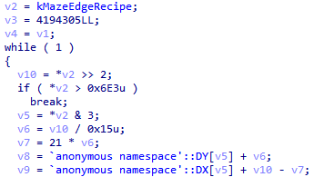

Mỗi phần tử của `kMazeEdgeRecipe` được mã hóa thành:

```text
index = value >> 2
dir   = value & 3
```

Trong đó hướng được giải mã theo:

```text
0 -> up
1 -> right
2 -> down
3 -> left
```

Từ `index` có thể tính tọa độ:

```text
x = index % 21
y = index // 21
```

Sau đó nối ô hiện tại với ô lân cận theo `dir`.


---

### Dựng lại mê cung

Phân tích `build_maze()` cho thấy chương trình duyệt lần lượt 206 phần tử của `kMazeEdgeRecipe`. Với mỗi phần tử, hai bit thấp được dùng làm hướng, phần còn lại xác định index của ô. Index sau đó được chuyển thành tọa độ trên lưới 21×21, rồi các bảng `DX, DY, BIT` và `OPPOSITE` được sử dụng để tạo cạnh hai chiều giữa hai ô.

Sau khi hiểu format dữ liệu, ta có thể viết script Python để đọc trực tiếp `escape_maze.exe` và dựng lại graph của maze.

```python
import struct
import sys

EXE = sys.argv[1] if len(sys.argv) > 1 else "escape_maze.exe"

IMAGE_BASE = 0x140000000
RECIPE_VA = 0x14001C2C0

WIDTH = 21
HEIGHT = 21
RECIPE_COUNT = 206

START = (9, 0)
EXIT = (11, 20)

# build_maze tables
DX = [0, 1, 0, -1]
DY = [-1, 0, 1, 0]

BIT = [1, 2, 4, 8]
OPPOSITE = [4, 8, 1, 2]


# ------------------------------------------------------------
# Read PE
# ------------------------------------------------------------

with open(EXE, "rb") as f:
    data = f.read()

if data[:2] != b"MZ":
    raise RuntimeError("Not a PE file")

pe_offset = struct.unpack_from("<I", data, 0x3C)[0]

if data[pe_offset:pe_offset + 4] != b"PE\x00\x00":
    raise RuntimeError("Invalid PE signature")

coff = pe_offset + 4

number_of_sections = struct.unpack_from("<H", data, coff + 2)[0]
size_of_optional_header = struct.unpack_from("<H", data, coff + 16)[0]

optional_header = coff + 20
section_table = optional_header + size_of_optional_header


# ------------------------------------------------------------
# Convert VA -> file offset
# ------------------------------------------------------------

def va_to_offset(va):
    rva = va - IMAGE_BASE

    for i in range(number_of_sections):
        off = section_table + i * 40

        name = data[off:off + 8].rstrip(b"\x00").decode(
            errors="ignore"
        )

        virtual_size = struct.unpack_from("<I", data, off + 8)[0]
        virtual_address = struct.unpack_from("<I", data, off + 12)[0]
        raw_size = struct.unpack_from("<I", data, off + 16)[0]
        raw_pointer = struct.unpack_from("<I", data, off + 20)[0]

        section_size = max(virtual_size, raw_size)

        if virtual_address <= rva < virtual_address + section_size:
            return raw_pointer + (rva - virtual_address)

    raise RuntimeError(f"VA {va:#x} not found in PE sections")


# ------------------------------------------------------------
# Read kMazeEdgeRecipe
# ------------------------------------------------------------

recipe_offset = va_to_offset(RECIPE_VA)

recipe = struct.unpack_from(
    f"<{RECIPE_COUNT}H",
    data,
    recipe_offset
)

print(f"[+] File: {EXE}")
print(f"[+] kMazeEdgeRecipe VA: {RECIPE_VA:#x}")
print(f"[+] File offset: {recipe_offset:#x}")
print(f"[+] Recipe entries: {len(recipe)}")


# ------------------------------------------------------------
# Reimplement build_maze()
# ------------------------------------------------------------

mask = [0] * (WIDTH * HEIGHT)

for code in recipe:

    # IDA:
    # v10 = *v2 >> 2;
    # v5  = *v2 & 3;

    idx = code >> 2
    d = code & 3

    # IDA:
    # v6 = v10 / 0x15;
    # v7 = 21 * v6;

    x = idx % WIDTH
    y = idx // WIDTH

    # IDA:
    # v8 = DY[v5] + v6;
    # v9 = DX[v5] + v10 - v7;

    nx = x + DX[d]
    ny = y + DY[d]

    if not (0 <= idx < WIDTH * HEIGHT):
        raise RuntimeError(f"Invalid index: {idx}")

    if not (0 <= nx < WIDTH and 0 <= ny < HEIGHT):
        raise RuntimeError(
            f"Invalid edge: ({x},{y}) -> ({nx},{ny})"
        )

    # IDA:
    # v4[v10] |= BIT[v5];
    # v4[21*v8 + v9] |= OPPOSITE[v5];

    mask[idx] |= BIT[d]
    mask[ny * WIDTH + nx] |= OPPOSITE[d]


# ------------------------------------------------------------
# Print maze as ASCII
# ------------------------------------------------------------

print()
print("[+] Reconstructed maze 21x21")
print(f"[+] Start = {START}")
print(f"[+] Exit  = {EXIT}")
print()


# Top border
print("+" + "---+" * WIDTH)

for y in range(HEIGHT):

    # Cell contents + vertical walls
    line = "|"

    for x in range(WIDTH):
        idx = y * WIDTH + x

        if (x, y) == START:
            cell = " S "
        elif (x, y) == EXIT:
            cell = " E "
        else:
            cell = "   "

        line += cell

        # BIT[1] = RIGHT
        if mask[idx] & 2:
            line += " "
        else:
            line += "|"

    print(line)

    # Horizontal walls
    line = "+"

    for x in range(WIDTH):
        idx = y * WIDTH + x

        # BIT[2] = DOWN
        if mask[idx] & 4:
            line += "   +"
        else:
            line += "---+"

    print(line)
```

Từ graph thu được, ta có thể in maze dưới dạng ASCII:

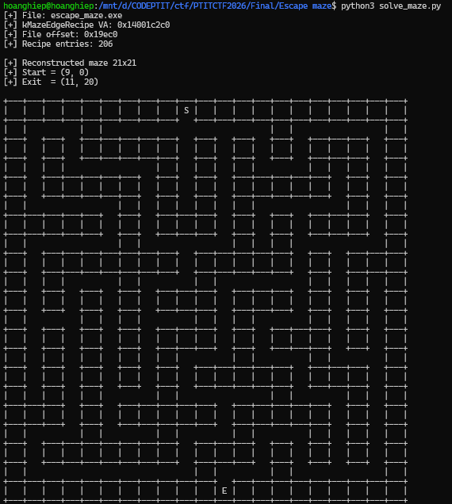


---

### Nhận ra hint DFS
Do chỉ tìm một đường có thể làm chương trình hiện `You win!` là chưa đủ, nếu thế thì sẽ có rất nhiều đường đi hợp lệ.

Cần quay lại đề bài.

Câu:

```text
Dường như Fải tính toán thật kỹ mới tìm thấy được ánh Sáng...
```

có ba ký tự được tác giả cố tình làm nổi bật:

```text
D
F
S
```

Trong đó từ `Fải` còn được cố tình viết bằng chữ `F` thay cho cách viết thông thường.

Ghép lại, ta được manh mối quan trọng:

```text
DFS
```


---


### Tìm đường DFS

Tiếp tục kiểm tra hàm `window_proc`, nơi xử lý sự kiện bàn phím. Các phím `W, A, S, D` lần lượt được ánh xạ thành các giá trị `0, 1, 2, 3` trước khi truyền vào `Game::try_move()`.

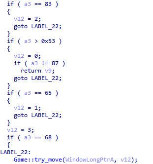

Từ `window_proc`, ta xác định các giá trị `direction` là `W=0, A=1, S=2, D=3`   . Khi triển khai DFS, ta duyệt các giá trị direction theo thứ tự tăng dần 0 → 1 → 2 → 3, tương ứng với W → A → S → D.

Theo yêu cầu của đề bài, chuỗi được rút gọn bằng cách gom các ký tự giống nhau liên tiếp thành một nhóm, sau đó ghi dưới dạng:
```
<phím><số lần lặp>
```

Ta có thể tự động hóa toàn bộ quá trình bằng script sau.

```python
from pathlib import Path
from itertools import groupby
from collections import defaultdict
import struct

EXE = "escape_maze.exe"

data = Path(EXE).read_bytes()

RDATA_VA  = 0x14001c000
RDATA_OFF = 0x19c00

def get(va, n):
    off = RDATA_OFF + (va - RDATA_VA)
    return data[off:off+n]

W = H = 21

START = (9, 0)
EXIT  = (11, 20)

walk = list(get(0x14001c080, W * H))

recipe = struct.unpack(
    "<206H",
    get(0x14001c2c0, 206 * 2)
)

dx = [0, 1, 0, -1]
dy = [-1, 0, 1, 0]

bit = [1, 2, 4, 8]
opp = [4, 8, 1, 2]

mask = [0] * (W * H)

for code in recipe:
    idx = code >> 2
    d = code & 3

    x = idx % W
    y = idx // W

    nx = x + dx[d]
    ny = y + dy[d]

    mask[idx] |= bit[d]
    mask[ny * W + nx] |= opp[d]

moves = {
    "W": (0, -1, 1),
    "A": (-1, 0, 8),
    "S": (0, 1, 4),
    "D": (1, 0, 2),
}

adj = defaultdict(dict)

for y in range(H):
    for x in range(W):
        if not walk[y * W + x]:
            continue

        for ch, (mx, my, bm) in moves.items():
            nx = x + mx
            ny = y + my

            if not (0 <= nx < W and 0 <= ny < H):
                continue

            if (
                walk[ny * W + nx]
                and (mask[y * W + x] & bm)
            ):
                adj[(x, y)][ch] = (nx, ny)

ORDER = "WASD"

path = []
seen = {START}

def dfs(pos):
    if pos == EXIT:
        return True

    for ch in ORDER:
        nxt = adj[pos].get(ch)

        if nxt is None or nxt in seen:
            continue

        seen.add(nxt)
        path.append(ch)

        if dfs(nxt):
            return True

        path.pop()
        seen.remove(nxt)

    return False

assert dfs(START)

raw = "".join(path)

print("raw_len =", len(raw))
print(raw)

def rle(s):
    result = []

    for ch, g in groupby(s):
        n = len(list(g))
        result.append(ch + str(n))

    return "".join(result)

encoded = rle(raw)

print("encoded =", encoded)
print("flag =", f"PTITCTF{{{encoded}}}")
```

Chạy:

```bash
python3 solve.py
```

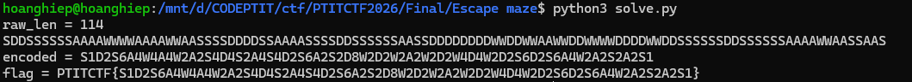


---

### Flag

```text
PTITCTF{S1D2S6A4W4A4W2A2S4D4S2A4S4D2S6A2S2D8W2D2W2A2W2D2W4D4W2D2S6D2S6A4W2A2S2A2S1}
```