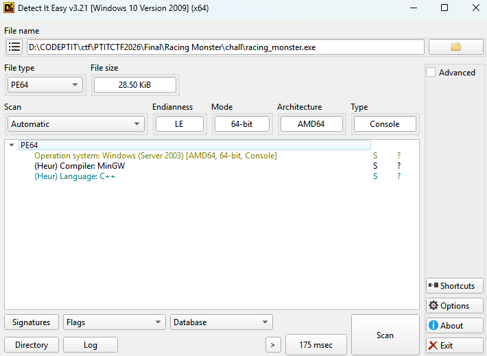
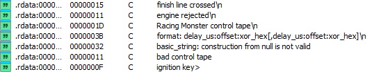
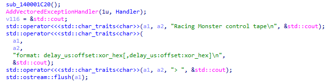
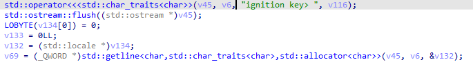
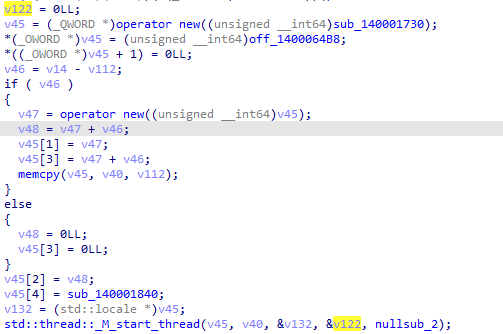
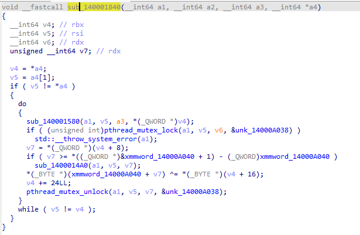
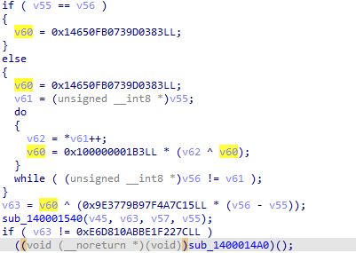
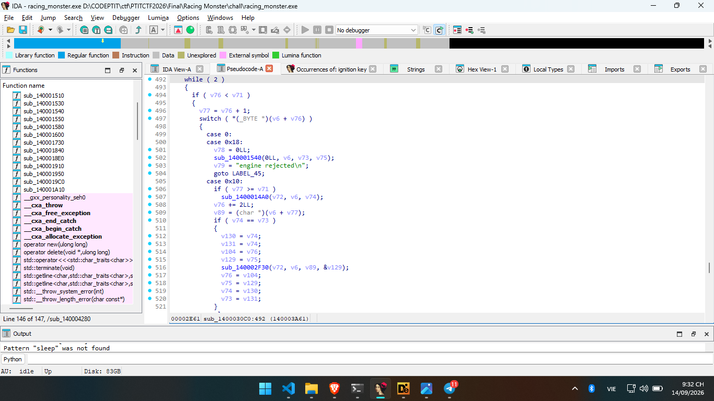

# PTITCTF 2026

## Reverse - Racing Monster

### Mô tả bài

Challenge cung cấp binary Windows `racing_monster.exe`. Khi chạy, chương trình yêu cầu nhập một **control tape** theo format:

```text
delay_us:offset:xor_hex[,delay_us:offset:xor_hex]
```

Sau đó chương trình hỏi tiếp:

```text
ignition key>
```

Mục tiêu là tìm control tape và ignition key hợp lệ để chương trình đi tới nhánh thành công.

### Phân tích

Trước tiên, kiểm tra nhanh bằng DIE :



Binary là file PE Windows, nên bước phân tích chính sẽ thực hiện bằng IDA. Mình sẽ dùng `strings` để lọc nhanh các chuỗi quan trọng:


Xref của `Racing Monster control tape` dẫn tới hàm chính :




Trong hàm chính `sub_1400030C0`, chương trình in ra chuỗi `Racing Monster control tape` và `format:delay_us:offset:xor_hex[,delay_us:offset:xor_hex]`, sau đó gọi `std::getline()` để đọc input đầu tiên. Điều này cho thấy chương trình yêu cầu người dùng nhập một control tape theo định dạng trên.

Sau khi buffer được xử lý bởi các thread và vượt qua bước kiểm tra hash, chương trình mới yêu cầu người dùng nhập `Ignition Key`.



Sau khi hoàn tất quá trình khởi tạo dữ liệu, chương trình tạo hai thread mới để xử lý Control Tape và biến đổi buffer. Quan sát lời gọi `std::thread::_M_start_thread` cho thấy thread này sử dụng hàm sub_140001840 làm hàm thực thi. Vì vậy, tiếp theo tiến hành phân tích sub_140001840 để xác định cách các record delay:offset:xor được áp dụng lên buffer.



Hàm sub_140001840 là thread xử lý Control Tape. Hàm lần lượt duyệt từng record đã được parse, chờ đến đúng thời điểm delay_us, khóa mutex để đồng bộ truy cập vùng nhớ, sau đó thực hiện phép XOR lên buffer[offset] với giá trị xor_hex rồi mở khóa mutex. Nhờ đó, người dùng có thể thay đổi nội dung buffer tại một vị trí và thời điểm xác định.



Ngoài thread control, binary còn có một thread khác là `sub_140001730` biến đổi toàn bộ buffer 80 vòng. Buffer gốc nằm trong `.rdata`, bắt đầu tại `0x140006160`, dài `0x2b9` byte. Sau 80 vòng, chương trình tính hash buffer bằng một biến thể FNV-like:

```text
 do
  {
  .....
    }
  while ( v6 != 80 );
```

Giá trị cần khớp là:

```text
0xe6d810abbe1f227c
```

Chương trình tính hash của buffer sau khi xử lý và so sánh với giá trị mong đợi `0xE6D810ABBE1F227C`. Chỉ khi hash hợp lệ, chương trình mới tiếp tục thực hiện bước kiểm tra `Ignition Key`.



Nếu giá trị hash không khớp, chương trình gọi sub_1400014A0() để kết thúc chương trình.

Đoạn mã sử dụng `switch (*(_BYTE *)(v6 + v76))` để đọc và thực thi từng opcode từ vùng nhớ. Cách hoạt động này là đặc trưng của một Virtual Machine (VM), trong đó v76 đóng vai trò bộ đếm lệnh (Program Counter) và mỗi case tương ứng với một lệnh của VM.



Sau khi nhận Ignition Key, chương trình đưa dữ liệu vào một Virtual Machine (VM). VM đọc từng opcode thông qua câu lệnh switch và thực hiện các phép toán như nạp dữ liệu, XOR, cộng, so sánh và rẽ nhánh để kiểm tra tính hợp lệ của khóa.


Khi mô phỏng 80 vòng biến đổi mà chưa nhập control tape nào, hash đã khớp giá trị trên. Tuy nhiên buffer lúc này chưa chạy VM được, vì byte đầu tiên là:

```text
0xcc
```

Trong khi đó, nhìn từ offset 2 trở đi lại thấy bytecode VM có cấu trúc rất đều:

```text
PUSH_IMM
XOR
PUSH_IMM
ADD
PUSH_IMM
NE
JNZ reject
```

Byte thứ hai của buffer là `0x00`. Nếu đổi byte đầu tiên từ `0xcc` thành `0x11`, hai byte đầu sẽ là:

```text
0x11 0x00
```

Trong VM, `0x11` là opcode `PUSH_KEY`, còn `0x00` là index ký tự đầu tiên của ignition key. Do đó ta cần vá byte đầu sau khi hash đã được kiểm tra, nhưng trước khi VM copy buffer để chạy.

Chương trình có một khoảng delay ngắn giữa bước kiểm tra hash và bước chạy VM. Vì vậy có thể dùng control tape:

```text
80000:0:dd
```

Ý nghĩa:

```text
0xcc ^ 0xdd = 0x11
```

Có thể kiểm tra nhanh phép XOR này trên WSL:

```bash
python3 - << 'PY'
print(hex(0xcc ^ 0xdd))
PY
```

Kết quả:

```text
0x11
```

Delay `80000` microseconds đủ muộn để không làm sai hash, nhưng vẫn kịp vá buffer trước khi VM chạy.

Sau khi byte đầu được vá, VM chạy từ offset 0. Mỗi block kiểm tra một ký tự của ignition key theo mẫu:

```text
PUSH_KEY i
PUSH_IMM x
XOR
PUSH_IMM add
ADD
PUSH_IMM want
NE
JNZ reject
```

Tương ứng với điều kiện:

```text
((key[i] ^ x) + add) & 0xff == want
```

Đảo công thức trên:

```text
key[i] = ((want - add) & 0xff) ^ x
```

Lặp lại cho toàn bộ 49 block, sau đó VM còn kiểm tra độ dài ignition key bằng `49`. Kết quả thu được:

```text
PTITCTF{0nly_th3_f4st_surv1v3_th3_m0nst3rs_ch4s3}
```


### Flag

```text
PTITCTF{0nly_th3_f4st_surv1v3_th3_m0nst3rs_ch4s3}
```
