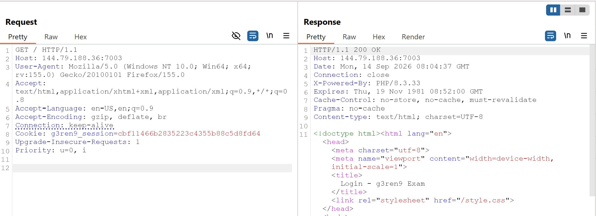
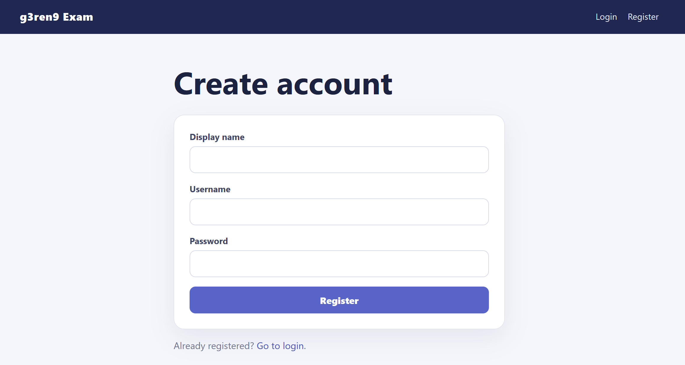
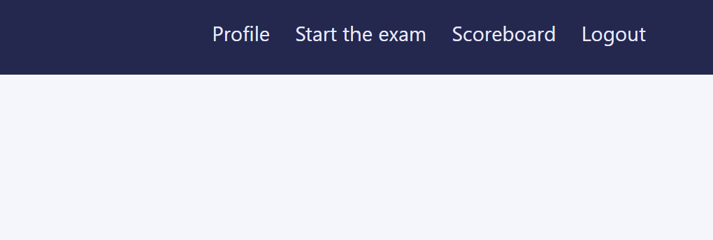
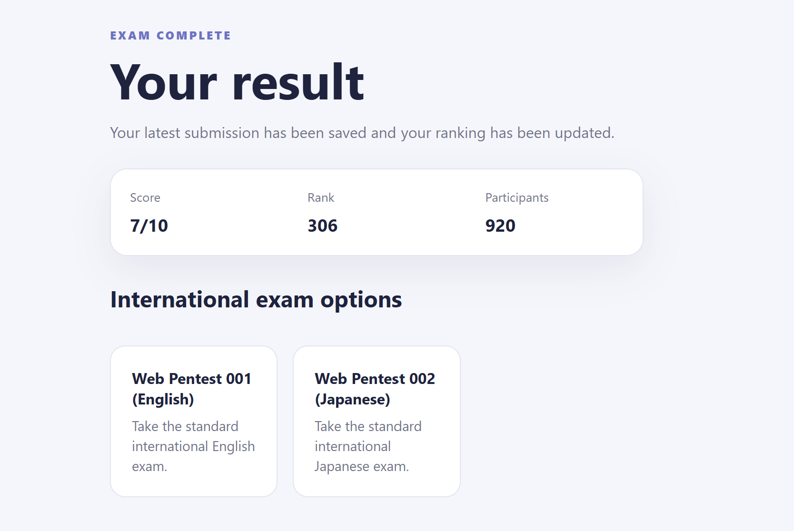
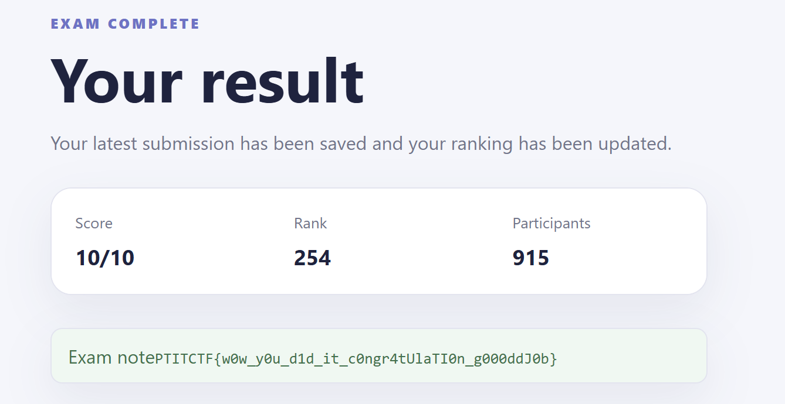
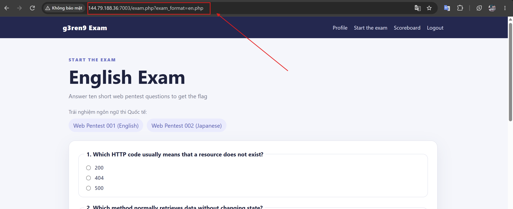
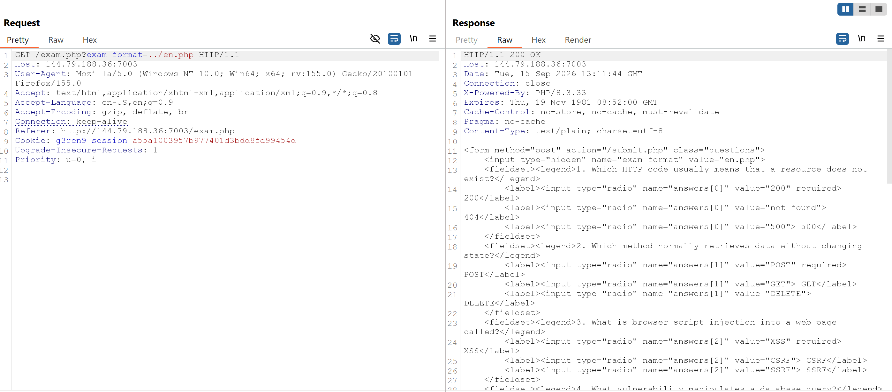
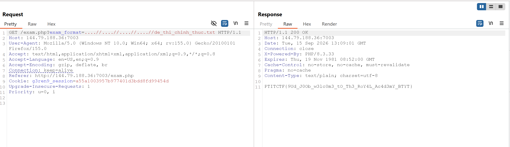

# PTITCTF 2026

## 3. Web - g3ren9 Exam

### Mô tả bài

Challenge cung cấp một web app có chức năng đăng ký, đăng nhập và làm các bài kiểm tra kiến thức web pentest.

Theo đề bài, bộ đề thi chính thức được lưu trong file `de_thi_chinh_thuc.txt` và đang bị ẩn trên máy chủ. Mục tiêu cuối cùng là lợi dụng chức năng chọn bộ đề để đọc file này và lấy flag thật.

### Phân tích và khai thác

Trang chủ hiển thị form đăng nhập và link đăng ký tài khoản, có thể thấy ứng dụng sử dụng PHP và session cookie:



Form login gửi dữ liệu tới `/login.php`, đồng thời có link đăng ký tại `/register.php`.

Form `/register.php` yêu cầu ba trường:

```text
display_name
username
password
```



Username phải khớp pattern:

```text
[A-Za-z0-9_]{3,32}
```

Trên giao diện web, vào `/register.php`, điền `display_name`, `username`, `password` hợp lệ rồi submit form đăng ký. Sau đó quay lại trang login, nhập username/password vừa tạo để đăng nhập.

Khi đăng nhập thành công, trình duyệt tự lưu và gửi kèm cookie `g3ren9_session` cho các request tiếp theo, nên không cần xử lý session thủ công.

Sau khi đăng nhập, menu hiển thị các route:

```text
/profile.php
/exam.php
/scoreboard.php
/logout.php
```



Session này được dùng để truy cập trang làm bài và xem kết quả.

- `/profile.php` chỉ hiển thị thông tin tài khoản, số lần làm bài, điểm hiện tại và form cập nhật profile/avatar, ô `Display Name` không có dấu hiệu của các lổ hổng như XSS/HTML injection, SSTI, đồng thời chức năng upload avatar với các loại file và payload bất thường cũng không thu được kết quả.

- `/scoreboard.php` hiển thị bảng xếp hạng và có tham số tìm kiếm `q`, không có dấu hiệu XSS trực tiếp hay SQLi.

- `/logout.php` chỉ kết thúc session.

Vì vậy route đáng chú ý còn lại là `/exam.php`.

Sau khi đăng nhập, chọn mục `/exam.php` trên menu để vào trang làm bài.

Trang hiển thị 10 câu hỏi kiến thức web pentest dưới dạng radio button. Tiếp theo mình thử submit đáp án của các câu hỏi này để xem chức năng của trang này có hoạt động hay không.



Lúc này mình nghĩ sẽ như nào nếu chọn đủ đúng 10/10, đáp án các câu lần lượt là: `404`, `GET`, `XSS`, `SQLi`, `CSRF`, `IDOR`, `SSRF`, `LFI`, `HttpOnly`, `Repeater`.


Sau khi chọn đủ 10 đáp án trên giao diện, nhấn nút submit của form. Trình duyệt gửi request `POST /submit.php` kèm session hiện tại và các đáp án đã chọn.

Trình duyệt tự chuyển tới `/result.php`. Khi đạt 10/10, trang kết quả hiển thị flag:



Nhưng mà rất tiếc flag ở trên chỉ là fake flag. Nội dung đề bài gợi ý rằng file đề thi chính thức vẫn đang được giấu trên server:

```text
de_thi_chinh_thuc.txt
```

Lúc này mình chọn thử đề bài khác để làm thì thấy tham số `exam_format` trong `/exam.php` được dùng để chọn file đề



Loay hoay với path traversal thông thường thì không có tác dụng, lúc này mình có thử thêm `../` vào request gốc và một request thêm `/` thì thấy web trả về cùng một nội dung, có vẻ như chuỗi `..` đã bị filter. 




do đó có khả năg chuỗi `....//` có thể bị biến đổi thành `../` sau bước lọc, mình thử thêm dần độ sâu và thành công đọc được flag



**Flag**

```text
PTITCTF{9Ud_J0Ob_w3lc0m3_tO_Th3_RoY4L_Ac4d3mY_BTYT}
```

