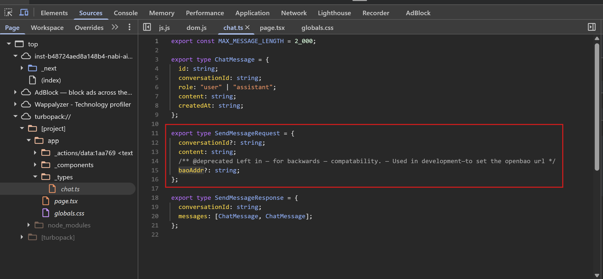
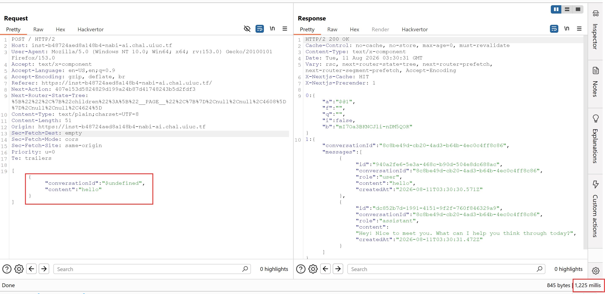
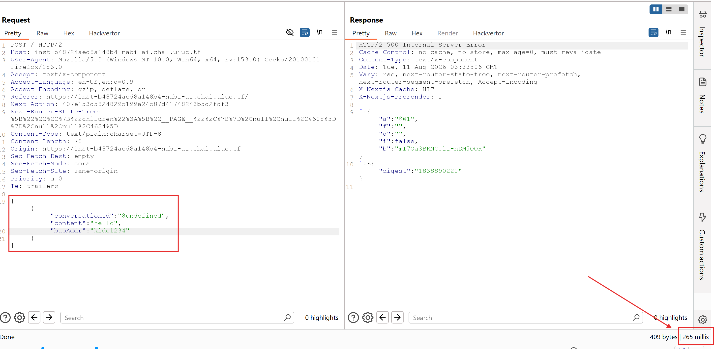
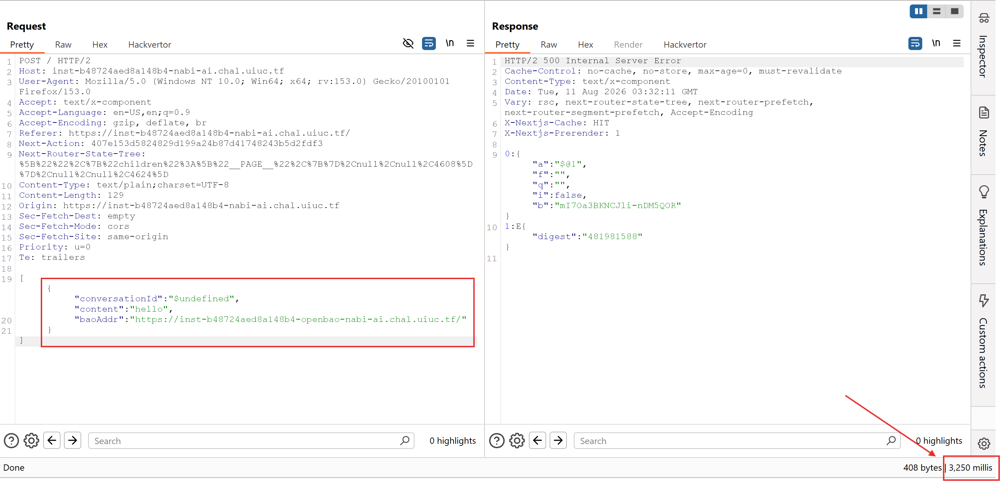
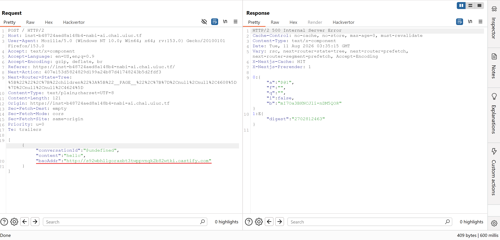
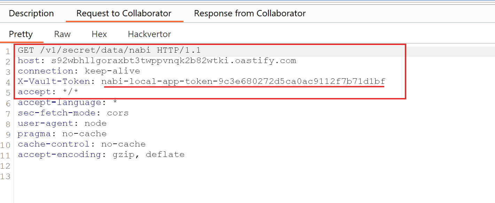
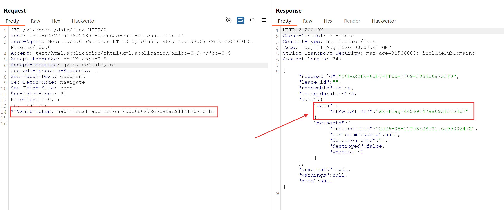
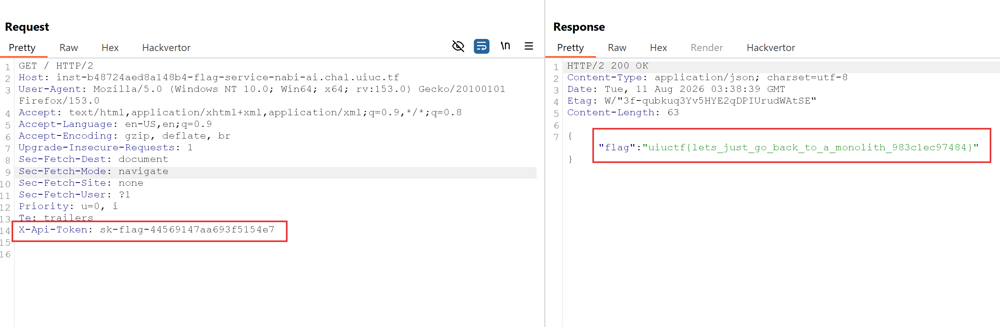

# UIUCTF 2026


## 1. Web - Nabi AI

### Mô tả bài

`Nabi AI` là một challenge web/AI. Ứng dụng cung cấp giao diện chat với AI, người chơi có thể tạo instance riêng rồi gửi tin nhắn để quan sát cách backend xử lý request.

Mục tiêu của bài là đọc được flag nằm sau một `flag service`. Hướng khai thác không nằm trực tiếp ở prompt injection, mà nằm ở một tham số debug bị lộ trong frontend. Khi điều khiển được tham số này, ta có thể khiến backend kết nối tới một địa chỉ OpenBao do mình chỉ định, từ đó làm lộ credential nội bộ và dùng credential này để lấy token truy cập flag service.

### Phân tích

Sau khi mở challenge và chat thử, mình kiểm tra DevTools. Source frontend có source map/deobfuscated code nên có thể đọc được logic request rõ ràng hơn. Trong đó xuất hiện một trường không thấy trên UI bình thường: `baoAddr`.



Khi xem một request chat bình thường, body request chứa các thông tin phục vụ việc hỏi đáp. Nếu thêm `baoAddr` vào request, thời gian phản hồi tăng mạnh. Điều này cho thấy backend đang dùng giá trị này để thực hiện một kết nối network thật sự.



Thử tiếp với một URL sai format hoặc không reachable, request fail gần như ngay lập tức. Ngược lại, khi dùng một endpoint hợp lệ và có TLS tốt, backend mất nhiều thời gian hơn, chứng tỏ backend đang có bước gọi ra 
ngoài tới URL trong `baoAddr`.





Từ đây có thể đặt giả thuyết `baoAddr` là địa chỉ OpenBao/Vault-compatible server mà backend sẽ gọi tới để lấy secret. Nếu ứng dụng gửi token/API key nội bộ khi truy cập OpenBao, ta có thể trỏ `baoAddr` về một Collabroator của Burp của mình để bắt request.

File `config.hcl` đề bài cung cấp cũng xác nhận hướng này. OpenBao được cấu hình chạy ở `http://127.0.0.1:8200`, bật KV secret engine tại mount `secret` với version 2, sau đó lưu hai secret quan trọng:

```js
path = "secret/data/nabi"
data = {
  data = {
    NABI_API_KEY = {
      eval_source = "env"
      env_var     = "NABI_API_KEY"
    }
  }
}
```

```js
path = "secret/data/flag"
data = {
  data = {
    FLAG_API_KEY = {
      eval_source = "env"
      env_var     = "FLAG_API_KEY"
    }
  }
}
```

Policy `nabi-app` cho token của app lại cho phép đọc mọi path dạng `secret/data/+`:

```js
path "secret/data/+" {
  capabilities = ["read"]
}
```

Nghĩa là nếu lấy được OpenBao app token, ta không chỉ đọc được `secret/data/nabi` mà còn đọc được luôn `secret/data/flag`.

Khi gán `baoAddr` thành URL của Collabroator, backend thật sự gọi tới server của mình. Trong request bắt được có credential dùng cho OpenBao service. Credential này là mảnh ghép quan trọng để đi tiếp.





Vì OpenBao dùng KV v2, secret thật nằm trong `data.data`. Với token OpenBao bắt được, có thể đọc `FLAG_API_KEY` ở path `secret/data/flag`:



Sau đó dùng token của flag service để gọi endpoint flag:



**Flag:**

```text
uiuctf{lets_just_go_back_to_a_monolith_983c1ec97484}
```

### Root cause

Root cause của challenge là backend tin vào tham số `baoAddr` do client gửi lên. Đây là một giá trị đáng lẽ chỉ nên được cấu hình nội bộ phía server, nhưng lại bị lộ qua source map/dev code và vẫn được backend chấp nhận trong môi trường production.

Vì `baoAddr` điều khiển endpoint OpenBao, người dùng có thể biến backend thành một client kết nối tới server tùy ý. Backend còn gắn credential nội bộ khi thực hiện kết nối này, nên khi endpoint bị đổi sang HTTPS sink của attacker, credential bị gửi ra ngoài.

Tóm lại, lỗi là sự kết hợp của:

- Debug/dev parameter bị expose ra client.
- Backend cho phép client override địa chỉ service nội bộ.
- Thiếu allowlist/validation cho destination.
- Secret/API key nội bộ được gửi tới endpoint do client kiểm soát.
- Policy OpenBao quá rộng: app token được quyền đọc `secret/data/+`, nên có thể đọc cả secret của Nabi lẫn secret của flag service.
