# Securinets CTF 2025

## Danh sách bài:
- [Web - Puzzle](#web---puzzle)
- [Misc - md7](#misc---md7)

---

## Web - Puzzle

Trang web cung cấp một file `old.db` bằng cách truy cập vào endpoint `/db`, trong đó có thông tin về admin và bẻ được một hash admin cũ - nhưng vô dụng. Hướng giải như sau:

```python
@app.route('/confirm-register', methods=['POST'])
    ...
    role = request.form.get('role', '2')
    role_map = {
        '1': 'editor',
        '2': 'user',
    }
```

`POST /confirm-register` chấp nhận một trường `role`. Vì vậy tôi tạo một account và thay đổi `role=2` -> `role=1` (editor).

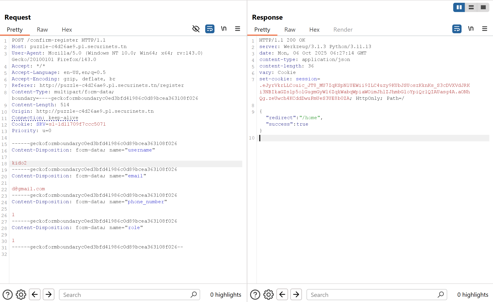

Thành công → tài khoản mới có quyền `editor`, lấy session của account editor vừa tạo để đăng nhập: 

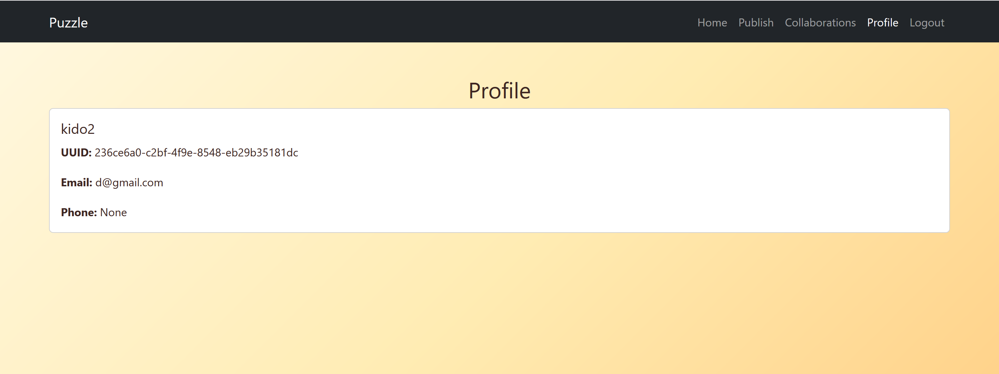

Ta tiếp tục xem trong src:

```python
current_user = get_user_by_uuid(current_uuid)
if not current_user or current_user['role'] not in ('0', '1'):
    return jsonify({'error': 'Invalid user role'}), 403
...
c.execute("SELECT uuid, username, email, phone_number, role, password FROM users WHERE uuid = ?", (target_uuid,))
# trả về luôn cả 'password'
```

Endpoint `/users/<uuid>` trả về dữ liệu nhạy cảm (kể cả mật khẩu dạng plaintext) nếu account có quyển `admin` hoặc `editor`. Với quyền `editor`, chỉ cần biết `uuid` của ai đó là xem được `profile` và `password` của họ. Vấn đề là làm sao có `uuid` của `admin`.

Hàm accept collab không kiểm tra quyền (missing authorization), cho phép bất kỳ tài khoản nào gọi API để chấp nhận request và gây ra hành vi mà server thực hiện như admin đã accept.
```python
@app.route('/collab/accept/<string:request_uuid>', methods=['POST'])
def accept_collaboration(request_uuid):
    # Missing authorization check - any user can accept any request
    c.execute("SELECT * FROM collab_requests WHERE uuid = ?", (request_uuid,))
```

Vì vậy tôi sẽ tạo một collab request gửi tới admin: 

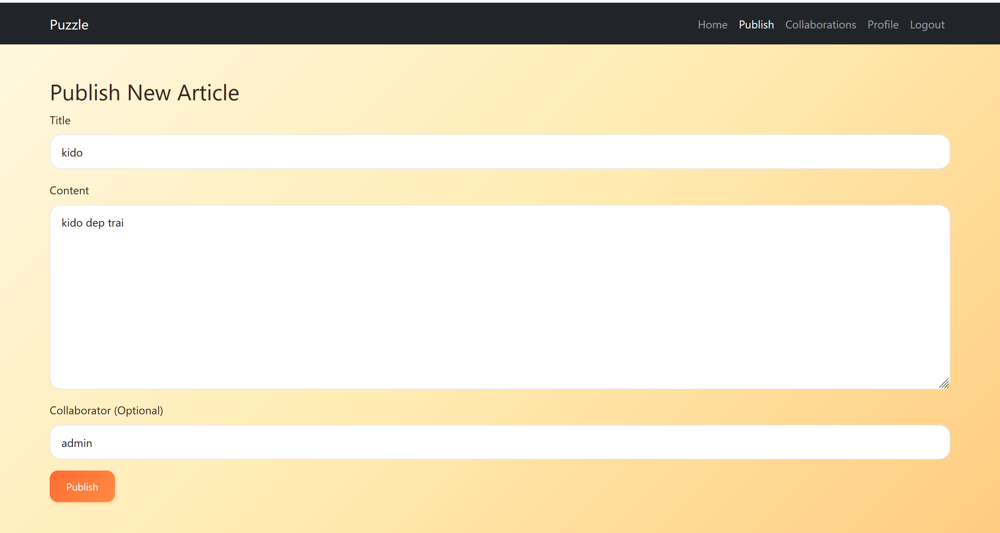

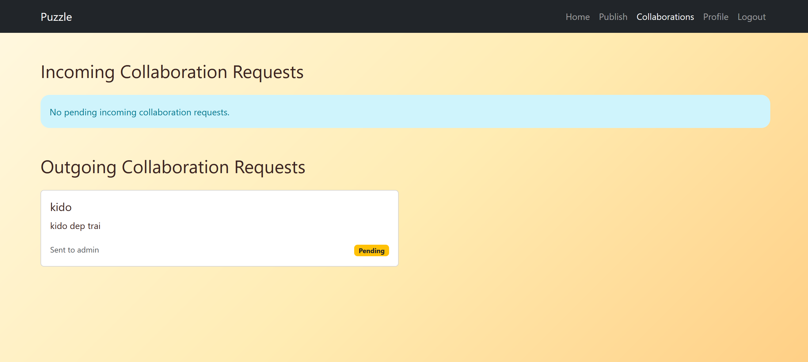

Gọi thẳng `POST /collab/accept/<request_uuid>` để tự chấp nhận lời mời đó

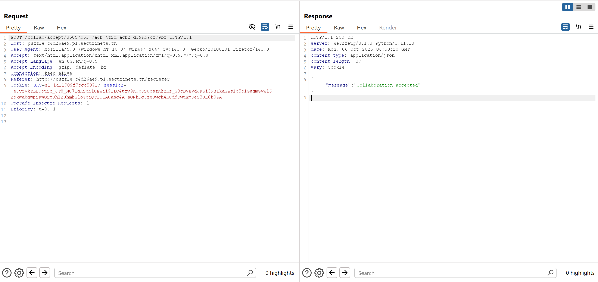

Sau khi `accept`, xem bài viết → lấy được `admin_uuid`.

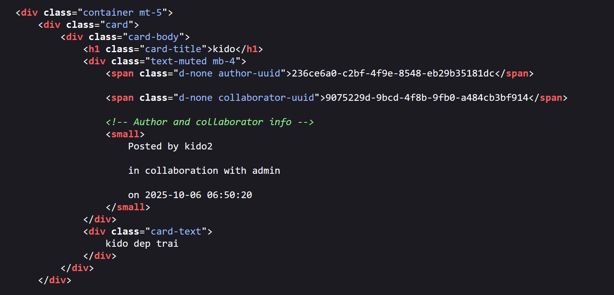

Tiếp theo trích xuất credential admin qua `/users/<admin_uuid>`

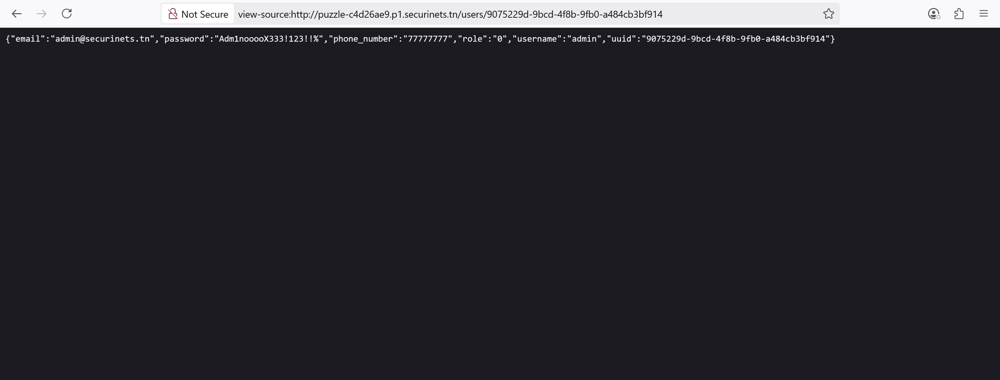

Với session `editor` (đã có). Endpoint trả về cả password (plaintext). Lấy mật khẩu `admin` từ JSON trả về và tiến hành đăng nhập.

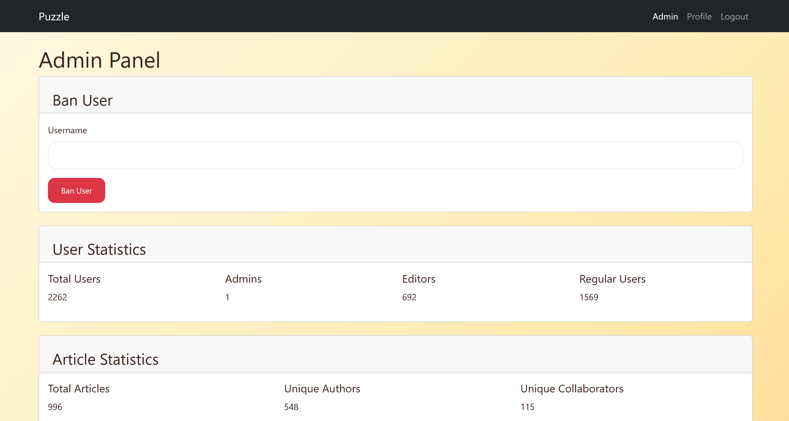

Thành công vào được tài khoản admin và truy cập endpoint `/data` ta có được hai file:
- `dbconnect.exe` – chương trình có mật khẩu hardcode trong mã nguồn
- `secrets.zip` – file zip mã hóa, chứa flag

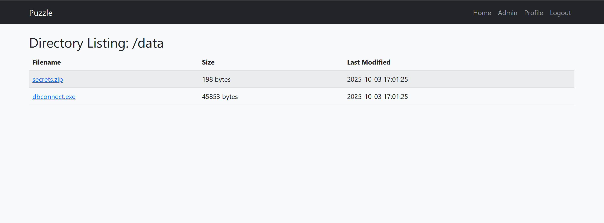

Phân tích `dbconnect.exe` để lấy mật khẩu và dùng mật khẩu đó để mở file `data.txt` trong `secreet.zip` và lấy `flag`

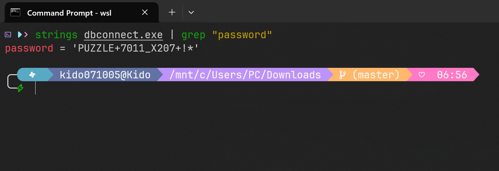

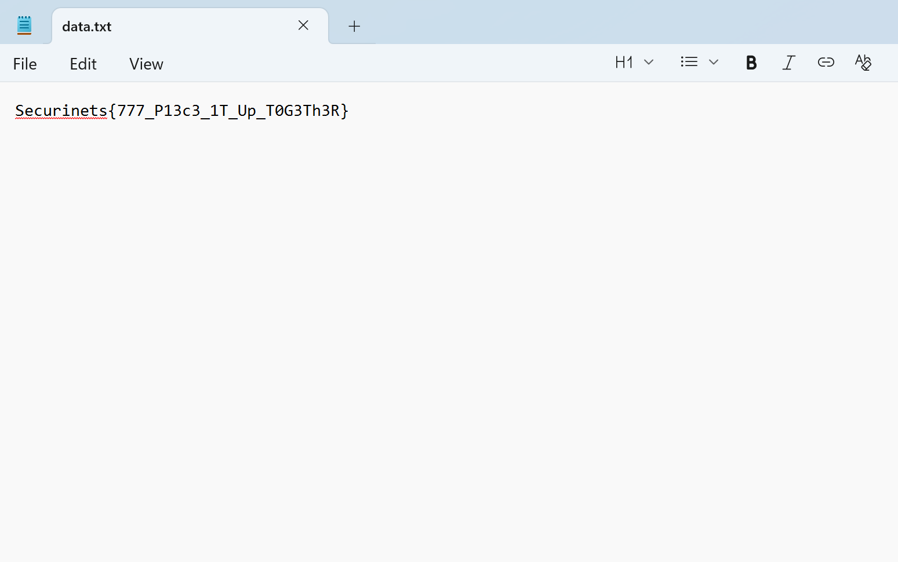

## Misc - md7

Script:
```python
from pwn import *

# Sinh 100 cặp (s, s+'9') tránh số kết thúc bằng 9
def generate_pairs():
    pairs=[('1','19'), ('2','29'), ('3','39'), ('4','49'), ('5','59'), ('6','69'),
('7','79'), ('8','89'), ('10','109'), ('11','119'), ('12','129'), ('13','139'),
('14','149'), ('15','159'), ('16','169'), ('17','179'), ('18','189'), ('20','209'),
('21','219'), ('22','229'), ('23','239'), ('24','249'), ('25','259'), ('26','269'),
('27','279'), ('28','289'), ('30','309'), ('31','319'), ('32','329'), ('33','339'),
('34','349'), ('35','359'), ('36','369'), ('37','379'), ('38','389'), ('40','409'),
('41','419'), ('42','429'), ('43','439'), ('44','449'), ('45','459'), ('46','469'),
('47','479'), ('48','489'), ('50','509'), ('51','519'), ('52','529'), ('53','539'),
('54','549'), ('55','559'), ('56','569'), ('57','579'), ('58','589'), ('60','609'),
('61','619'), ('62','629'), ('63','639'), ('64','649'), ('65','659'), ('66','669'),
('67','679'), ('68','689'), ('70','709'), ('71','719'), ('72','729'), ('73','739'),
('74','749'), ('75','759'), ('76','769'), ('77','779'), ('78','789'), ('80','809'),
('81','819'), ('82','829'), ('83','839'), ('84','849'), ('85','859'), ('86','869'),
('87','879'), ('88','889'), ('90','909'), ('91','919'), ('92','929'), ('93','939'),
('94','949'), ('95','959'), ('96','969'), ('97','979'), ('98','989'), ('100','1009'),
('101','1019'), ('102','1029'), ('103','1039'), ('104','1049'), ('105','1059'),
('106','1069'), ('107','1079'), ('108','1089'), ('110','1109'), ('111','1119')]
    num=1
    while len(pairs)<100:
        s=str(num)
        if not s.endswith('9'):
            pairs.append((s, s+'9'))
        num+=1
    return pairs

pairs = generate_pairs()

io = remote('numbers.p2.securinets.tn', 7011)
for i, (a,b) in enumerate(pairs):
    io.sendlineafter(f'({i+1}/100) Enter first number:', a)
    io.sendlineafter(f'({i+1}/100) Enter second number:', b)
    io.recvline()  # đọc "Correct!"
print(io.recvall().decode())
```